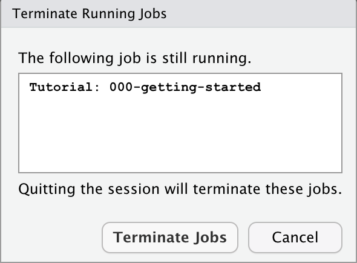

```{r setup, include = FALSE}
library(learnr)
library(tutorial.helpers)
library(tidyverse)
library(knitr)
knitr::opts_chunk$set(echo = FALSE)
options(tutorial.exercise.timelimit = 60, 
        tutorial.storage = "local") 
```

```{r copy-code-chunk, child = system.file("child_documents/copy_button.Rmd", package = "tutorial.helpers")}
```

<!-- Make much shorter. -->

<!-- Show how to create two RStudio instances. -->

<!-- DK: Make this tutorial like the others. There is too much text in a row. Students don't like to read more than a sentence or two. Cut some of this text. Split up the questions into smaller bites. -->

<!-- Plan is that students are told to read the Getting Started chapter before the first class. We want them to, at least, install R/RStudio before the first class. Then, in class, we do this tutorial together. Given that structure, we should make this a bit longer and ensure that all the important things in Getting Started have, in fact, been done. Maybe this should really be 10 to 15 questions, but I am unsure which are most important. -->

## Introduction
### 

Welcome to your first tutorial! Our goal is to learn how to complete a tutorial and download the answers. This tutorial assumes that you have read and completed the instructions in the [Getting Started](https://ppbds.github.io/primer/00-getting-started.html) chapter in the *[Primer](https://ppbds.github.io/primer)*. 

### 

You have, haven't you?

### 

You may complete the tutorials either on your laptop or on a cloud computing platform, if one is provided. Either way, you will download a copy of your work to the Downloads folder on your computer and then submit your answers to the instructor.

### 

You always begin a tutorial by filling out your name/email and then clicking the "Submit Answer" button. If you make a mistake, you can click **"Edit Answer"** and try again. 


```{r info-section, child = system.file("child_documents/info_section.Rmd", package = "tutorial.helpers")}
```

## Tutorial exercises 
### 

In each tutorial, there will be a set of exercises for you to complete. You write your answer within the exercise code area and hit the "Submit Code" button when you are done.

### 

Clicking **"Start Over"** --- look for small letters at the bottom of the left-hand side menu --- deletes all your work for this tutorial and allows you to begin the entire tutorial again.

### Exercise 1

Let's practice some simple math. Type `4 + 5` into the box below. Hit **"Run Code"** to see your results. Clicking **"Hint"** gives you a hint about what to type. 

```{r tutorial-exercises-1, exercise = TRUE}

```

```{r tutorial-exercises-1-hint-1, eval = FALSE}
4 + 5
```

### 

Once you click **"Run Code"**, the answer `[1] 9` should appear below the code you entered. This is the same behavior you would see if you ran this code in the Console tab.

### Exercise 2

Let's use variables to perform the same calculation. Below, we have already assigned 5 to `x` and 4 to `y`. On the line below those two given lines of code, add the two variables by typing `x + y`. Hit **"Run Code"** to see your results. Clicking **"Hint"** gives you a hint about what to type. 

```{r tutorial-exercises-2, exercise = TRUE}
x <- 5
y <- 4

```

```{r tutorial-exercises-2-hint-1, eval = FALSE}
x <- 5
y <- 4
x + y
```

### 

Once you click **"Run Code"**, the answer `[1] 9` should appear below the code you entered. We will often have lots of code in these boxes.

### Exercise 3

We will often need to copy code from our previous exercises to continue working. To make this easier, we have a `Copy previous code` button. Below the following box, click on the `Copy previous code` button. 

```{r tutorial-exercises-3, exercise = TRUE}

```

<button onclick = "transfer_code(this)">Copy previous code</button>

### 

This should paste all work from the previous exercise into the following box. Note that this will only copy code which has already been run in the previous exercise.

###

Change the values to `x <- 6` and `y <- 10`. Hit "Run Code". You should get the answer 16.

###

Note that the assignment symbol --- `<-` --- is a less-than-sign followed by a dash. We often pronounce the symbol as "gets." So, we might say, when reading this code, "x gets 6."

### Exercise 4

Let's examine our first dataset. We provide the code to load the `primer.data` library -- this is the package our dataset will come from. Type `trains` below  `library(primer.data)` and then hit **"Run Code"**. This will display some observations from the `trains` dataset. 

```{r tutorial-exercises-4, exercise = TRUE}
library(primer.data)

```

```{r tutorial-exercises-4-hint-1, eval = FALSE}
library(primer.data)
trains
```

### 

You should see a table containing data from the `trains` dataset. 

### Exercise 5

Let's check the version of R running on your computer. You can do this by copy-pasting `version[['version.string']]` into the exercise box below and hitting the "Run Code" button. 

```{r tutorial-exercises-5, exercise = TRUE}

```

```{r tutorial-exercises-5-hint-1, eval = FALSE}
version[['version.string']]
```

### 

You should be running R version 4.2.2 or later. If not, re-install R, following the instructions in [Getting Started](https://ppbds.github.io/primer/00-getting-started.html).

### Exercise 6

Read all of the following instructions before continuing, as this tutorial will close once you take the first step. 

Restart your **R session** by clicking Session -\> Restart R. (Note that restarting R within this **RStudio instance** is a different thing than restarting the overall RStudio instance itself.)

You should receive the warning message shown below. (Note that this box might be "hidden" behind your tutorial.) Whenever you see this warning message, keep in mind that clicking "Terminate Jobs" will close any running tutorials. 

```{r}

```

Click "Terminate Jobs". Re-open this tutorial. Tutorial progress will always be saved automatically.

### Exercise 7

Tutorials can include written responses. You have already seen one example of that when you provided your name and e-mail address at the start.

Copy and paste everything from `Exercise 7` through the end of this sentence into the answer box below.

```{r tutorial-exercises-7}
question_text(NULL,
    message = "We will sometimes provide an answer to written questions. Other times, like here, we won't. In the former case, we will not allow you to resubmit your answer. Don't stress! Tutorials are pass/fail, so, as long as you make an honest effort, you will do fine.",          
    answer(NULL, 
           correct = TRUE),
    allow_retry = FALSE,
    incorrect = NULL,
    rows = 6)
```

### Exercise 8

Be careful about cutting and pasting code from elsewhere into tutorials. In general, *this will not work!* As an example of it not working, copy/paste the `x + y` operation you just did in `Exercise 2`. Hit "Run Code".

```{r tutorial-exercises-8, exercise = TRUE}

```

```{r tutorial-exercises-8-hint-1, eval = FALSE}
x + y
```

###

This should report an error like "object 'x' not found" since we did not define `x` or `y` in this specific exercise box. This code would work if you copied the entire exercise box from `Exercise 2`, like we did with the `copy previous code` button. 

No need to fix it now. We just wanted to highlight how each exercise box is its own "world," unless we do something behind the scenes.

### Exercise 9

Since you have already read and followed the instructions in the [Getting Started](https://ppbds.github.io/primer/00-getting-started.html) chapter from the *[Primer](https://ppbds.github.io/primer/)*, you should have already run this command at the Console: `all.primer.tutorials::prep_rstudio_settings()`.

### 

If you have not run this command before, run it now.

### 

You can generally call functions by just giving their name, like `prep_rstudio_settings()`. However, it can be safer to preface the function names with the name of the package in which the function is found, separated by two colons. Since `prep_rstudio_settings()` is in the **all.primer.tutorials**, we can also call it using the double colon notation: `all.primer.tutorials::prep_rstudio_settings()`.

### 

To confirm that you have run this command, run `rstudioapi::readRStudioPreference(name = "load_workspace", default = "Code failed.")` from the R Console. Copy/paste the command and the answer it returns below.

```{r tutorial-exercises-9}
question_text(NULL,
    answer(NULL, correct = TRUE),
    allow_retry = TRUE,
    try_again_button = "Edit Answer",
    incorrect = NULL,
    rows = 3)
```

###

The response should be FALSE. If it is not, try re-running `all.primer.tutorials::prep_rstudio_settings()`.

### 

The tutorial workflow will often look like this. We tell you to run a command. You run it. We then ask you to copy/paste, from the Console, both the command itself and the response returned. Because we ask you to **c**opy/**p**aste the **c**ommand/**r**esponse so often, we often shorten this instruction to CP/CR.

### Exercise 10

<!-- DK: Need to teach about .Rprofile and what we have done here at some later point in the tutorials. -->

Type `options("pkgType")` in your RStudio Console and hit return. CP/CR

```{r tutorial-exercises-10}
question_text(NULL,
    answer(NULL, correct = TRUE),
    allow_retry = TRUE,
    try_again_button = "Edit Answer",
    incorrect = NULL,
    rows = 3)
```

### 

The return value should be "binary". If it isn't, try re-starting your R session again. The text you posted in should look something like:

```{r, echo = TRUE, eval = FALSE}
> options("pkgType")
$pkgType
[1] "binary"
```

### 

It is OK if your answer is not formatted exactly like ours. Approximate is good enough for these tutorials.


## Your answers
### 

At the end of every tutorial, you will save your work and submit it. We will do this in the next panel, labeled "Submit." Follow the instructions there. After hitting the "Download" button, you will be prompted to save a file named `getting-started_answers.rds` or `getting-started_answers.html`, depending on which button you picked. This file will be saved in the default Downloads folder on your computer, even if you completed the tutorial on a cloud computing platform.

### 

Future tutorials will prompt you with a file name which matches the tutorial you have just completed. The suffix will always be `rds` or `html`, indicating the type of file. Your instructor will tell you to submit work as either `rds` or `html`. The `html` file can be useful to see all answers from a tutorial listed out, should you want such a reference for your personal use. 


```{r download-answers, child = system.file("child_documents/download_answers.Rmd", package = "tutorial.helpers")}
```
