```{r setup, include = FALSE}
library(learnr)
library(all.primer.tutorials)
library(primer.data)
library(tidyverse)
library(knitr)
library(gistr)
knitr::opts_chunk$set(echo = FALSE)
options(tutorial.exercise.timelimit = 60, 
        tutorial.storage = "local")
```

```{r copy-code-chunk, child = system.file("child_documents/copy_button.Rmd", package = "tutorial.helpers")}
```

```{r info-section, child = system.file("child_documents/info_section.Rmd", package = "tutorial.helpers")}
```

<!-- Will we ever move from Rpubs to Quarto Pub? -->

<!-- Standardize how we refer to short cut keys. Is "Cmd/Cntrl + s" good? Probably not. We should use the same terminology as the RStudio docs. -->

<!-- Lots of the gifs don't match the written descriptions. -->

<!-- Explain throughout, starting in the R script section, that there is a difference between the current workspace and the Quarto document itself. Maybe restart the R session more often? -->

<!-- Note how Iris graph is used in two different parts of this tutorial. If we need to remove/change it, we need to make both parts consistent. -->

<!-- There are often two or more ways to do the same thing: like create a new project or a new script. We should mention and explain this throughout. We should also standardize the approach we use, at least first time through. -->

<!-- maybe discuss dot files and directories, and why they appear and don't appear? -->

<!-- Hardest part is creating an R Project the first time. We can break it into separate steps? Can we show them the two different Project drop down methods? Actually, this should be taught from the File menu. Fix the gif to do that!  -->

<!-- MAYBE NOT! Restart R session several times. Restart RStudio session at least twice. Once for R Projects and once before starting R scripts.  -->

<!-- Do everything in visual with first Quarto document and then use source with the second.  Note how I misunderstood this! I thought "source" meant sourcing the code. This is about "Source" versus "Visual" buttons. -->

<!-- Make at least 3 Quarto documents. The first starts with all the junk. So does the second, so we can see how source connects to visual. Start the 3rd empty. -->

<!-- Code chunk names are important. Always use them, at least in second Quarto document creation.-->

<!-- Make a second script. And maybe a third. -->

<!-- Should include a better code chunk options example. Not sure warning message example discussion works. Worth improving. Or maybe replacing with something simpler like echo or eval. Just want students to be comfortable with code chunk options. (Is this still the terminology in Quarto?) -->

<!-- Discuss options for whole document and how it goes in header. Example:  -->

<!-- execute: -->

<!--   echo: false -->

## Introduction

### 

Until now, you have been typing your code into the neat boxes in our tutorials. What if you want to start working on your own? In this tutorial you will learn how to use R scripts and Quarto documents, and how to publish your work with Rpubs!

## Checking your setup

### 

This tutorial assumes that you have read and completed all the steps in the [Getting Started](https://ppbds.github.io/primer/00-getting-started.html) chapter of the *Primer*. We will ask you to **c**opy/**p**aste the **c**ommand/**r**esponse so often, we will be shortening this instruction to CP/CR.

### Exercise 1

In the [Getting Started](https://ppbds.github.io/primer/00-getting-started.html) chapter of the *Primer*, you should have installed the **tidyverse** package, among others.

### 

Load the `tidyverse` package into your R Console using the `library()` function.

### 

Run `search()` in the Console to see the libraries that you've currently loaded, then copy and paste the result into the space below.

```{r checking-your-setup-1}
question_text(NULL,
    answer(NULL, correct = TRUE),
    allow_retry = TRUE,
    try_again_button = "Edit Answer",
    incorrect = NULL,
    rows = 3)
```

### 

There should be strings such as "package:tidyverse" in the output. These are the packages that you are currently loaded in your work space.

### Exercise 2

In the Console, run:

```{r eval = FALSE, echo = TRUE}
rstudioapi::readRStudioPreference(name = "load_workspace", 
                                  default = "Code failed.")
```

CP/CR.

```{r checking-your-setup-2}
question_text(NULL,
    answer(NULL, correct = TRUE),
    allow_retry = TRUE,
    try_again_button = "Edit Answer",
    incorrect = NULL,
    rows = 3)
```

### 

The result should be FALSE. If the result was not FALSE, you should redo the steps in the *Getting Started* tutorial. In particular, run this command in the Console:

`all.primer.tutorials::prep_rstudio_settings()`

### Exercise 3

Look at the top left of your R Console. Here you should see the version of R you are running. It should look something like the image below.

```{r}
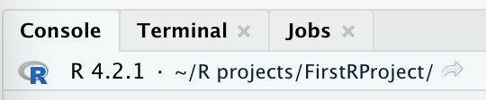
```

Type `R.version` into the Console and hit return. CP/CR.

```{r checking-your-setup-3}
question_text(NULL,
    answer(NULL, correct = TRUE),
    allow_retry = TRUE,
    try_again_button = "Edit Answer",
    incorrect = NULL,
    rows = 3)
```

This should return a list of variables, including "major" and "minor", which tell you your R Version. This should be the same as the version you saw at the top left of the Console. `R.version` does not include parentheses at the end. It is a built-in R constant, not a function.

### Exercise 4

Shortly, we will create a new project for you to start working in. Before we do this, it might be useful to understand where you are right now.

In the R Console, run `getwd()`. CP/CR.

```{r checking-your-setup-4}
question_text(NULL,
    answer(NULL, correct = TRUE),
    allow_retry = TRUE,
    try_again_button = "Edit Answer",
    incorrect = NULL,
    rows = 3)
```

### 

This function returns the path to your R working directory. A path is simply the path you would use to reach a location on your computer. In this case, if you wanted to find the folder from which R is running, you would follow the path returned by `getwd()`.

More info on paths can be found on the [UC Berkeley website](https://people.ischool.berkeley.edu/~kevin/unix-tutorial/section3.html).

### Exercise 5

Whenever you start a new R Project, you will want to store it in a location which you can easily find. Right now, you are likely in a secluded location on your computer. It would be much more useful to have a location dedicated to your R Projects to make them easier to find.

Let's make a folder, and call it `projects`

If you need help making a folder, helpful resources can be found [here](https://support.microsoft.com/en-us/office/create-a-new-folder-cbbfb6f5-59dd-4e5d-95f6-a12577952e17) for Windows, and [here](https://support.apple.com/guide/mac-help/organize-files-using-folders-mh26885/mac) for macOS.

It would also be a good idea to to store this folder on your desktop, so that it can be found easily. **NOTE: Do not store this folder inside of a cloud storage directory such as OneDrive.** This can cause heaps of unforeseen problems for you in the future.

## R Projects

### 

Good data scientists keep their work organized. You should place your work in different R Projects, which are simply folders (or directories) on your computer with some helper files.

### Exercise 1

<!-- Background: https://support.rstudio.com/hc/en-us/articles/200526207-Using-RStudio-Projects#:~:text=RStudio%20projects%20are%20associated%20with,have%20R%20code%20and%20data -->

Please read all of the instructions before moving on, as you will be locked out of this tutorial while making your project.

Click `File -> New Project` from the main menu:

```{r}
include_graphics("images/new_project.png")
```

Select `New Directory`:

```{r}
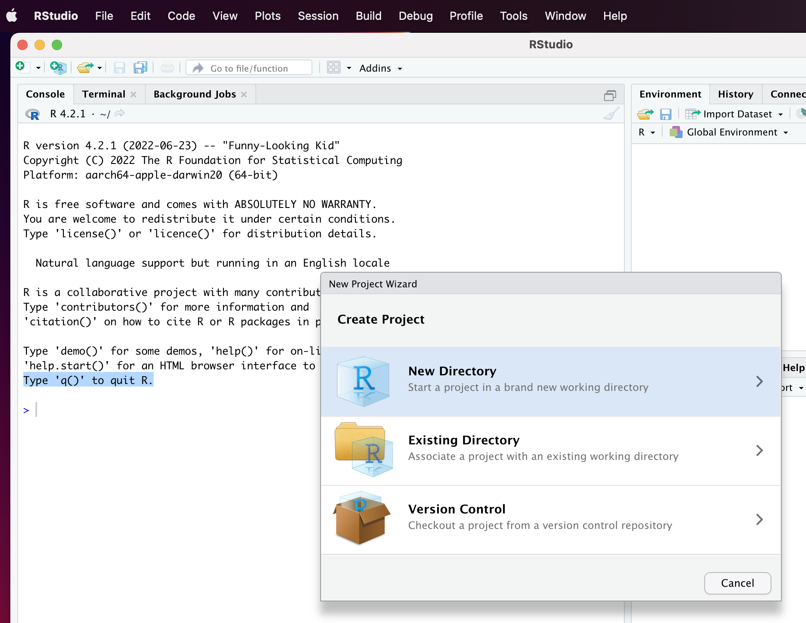
```

Select `New Project`:

```{r}
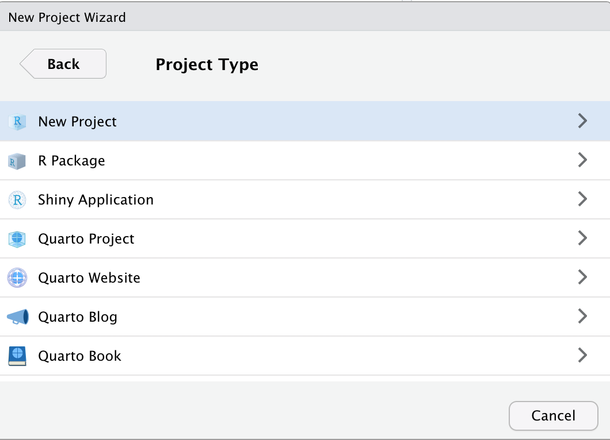
```

Yes, it is confusing that this is the second time you have selected `New Project`. Name the Project `analysis-1` and change the project subdirectory to your new `projects` folder.

```{r}
include_graphics("images/new_project_4.png")
```

Click `Create Project`. Recall the "Getting Started" tutorial, where we saw the "Terminate Jobs" warning. **Do not click on the Terminate Jobs** button yet. Doing so will close this tutorial. Check out our gif first.

<!-- DK: Need a new gif which uses the File menu to start things. -->

```{r}
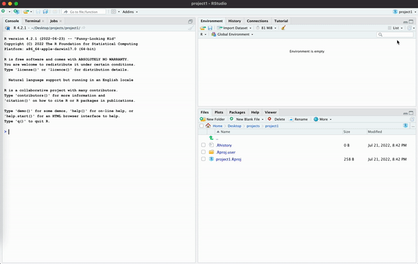
```

Go ahead and click "Terminate Jobs". You will need to restart the tutorial but, once you do, you will be in this new project. For the rest of this tutorial, we will be working in `analysis-1`.

### 

Run `getwd()`. CP/CR.

```{r r-projects-1}
question_text(NULL,
    answer(NULL, correct = TRUE),
    allow_retry = TRUE,
    try_again_button = "Edit Answer",
    incorrect = NULL,
    rows = 3)
```

### 

This path should now be different than our previous path, similar to the path below. Creating/opening an R Project moves the R session to that directory.

```{r}
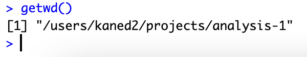
```

### 

If your path does not include your `projects` folder, you likely did not select the `projects` directory when making `analysis-1`.

### Exercise 2

Run `list.files()`. CP/CR.

```{r r-projects-2}
question_text(NULL,
    answer(NULL, correct = TRUE),
    allow_retry = TRUE,
    try_again_button = "Edit Answer",
    incorrect = NULL,
    rows = 3)
```

### 

`list.files()` returns files contained in your current R Project. This should return only the file `analysis-1.Rproj`.

### Exercise 3

Type `readLines("analysis-1.Rproj")` in the R Console and hit enter. CP/CR.

```{r r-projects-3}
question_text(NULL,
    answer(NULL, correct = TRUE),
    allow_retry = TRUE,
    try_again_button = "Edit Answer",
    incorrect = NULL,
    rows = 3)
```

### 

This should return lines containing some basic settings for your R Project. For example, `RestoreWorkspace` is set to `default`.

## R Scripts

### 

So far, we have only worked in the R Console, but it's quite difficult to type more than a few lines of code into the Console at once.

One solution is **R scripts**. These are files which contain a permanent copy of our code.

### Exercise 1

Create an R script by clicking the `File -> New File` drop down menu at the top left of your RStudio Session, and selecting "R Script".

```{r}
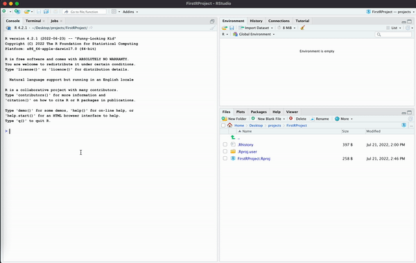
```

### 

An untitled, empty file should pop up above the R Console. This is your R script file.

### 

Type `5 * 5` into your R script file and run the file by clicking the "Source" button in the top right corner. This will run all your code in the Console. CP/CR.

```{r r-scripts-1}
question_text(NULL,
    answer(NULL, correct = TRUE),
    allow_retry = TRUE,
    try_again_button = "Edit Answer",
    incorrect = NULL,
    rows = 2)
```

### 

The `5 * 5` should have run in your R Console. The return value is `25`. Whenever you run an R script file by hitting the "Source" button, Rstudio will send all the code in the file to the R Console, as if you had retyped it all there and hit return.

### Exercise 2

There are often "short-cut key" combinations which perform the same task as clicking a button. Placing your cursor inside the R script window and hit Cmd-shift-enter (or Cntrl-shift-enter for Windows).

### 

This does the same thing as hitting the "Source" button. CP/CR.

```{r r-scripts-2}
question_text(NULL,
    answer(NULL, correct = TRUE),
    allow_retry = TRUE,
    try_again_button = "Edit Answer",
    incorrect = NULL,
    rows = 2)
```

### 

Using short-cut keys is quicker and more professional than clicking buttons.

### Exercise 3

In your R script, type `6 + 3` in the line after `5 * 5`. If you source this file, all the lines will execute. Try it. CP/CR.

```{r r-scripts-3}
question_text(NULL,
    answer(NULL, correct = TRUE),
    allow_retry = TRUE,
    try_again_button = "Edit Answer",
    incorrect = NULL,
    rows = 2)
```

### 

The output you see is the same as what would happen if you copied each line to the Console and hit return after each one.

### Exercise 4

Instead of sourcing the entire file, we can just execute (or "run") a single line. In your R script, place your cursor on the same line as `6 + 3` and click the "Run" button to the left of the "Source" button. CP/CR.

```{r r-scripts-4}
question_text(NULL,
    answer(NULL, correct = TRUE),
    allow_retry = TRUE,
    try_again_button = "Edit Answer",
    incorrect = NULL,
    rows = 2)
```

### 

Instead of both lines in the script executing, only the second line does.

### Exercise 5

The short-cut key for running a single line of code is Cmd-Enter (or Cntrl-Enter for Windows). In your R script, place your cursor on the same line as `5 * 5` and hit Cmd/Cntrl-Enter. CP/CR.

```{r r-scripts-5}
question_text(NULL,
    answer(NULL, correct = TRUE),
    allow_retry = TRUE,
    try_again_button = "Edit Answer",
    incorrect = NULL,
    rows = 2)
```

### 

Cmd/Cntrl-Enter is probably the single most commonly used short-cut key because it is very handy to execute your code line-by-line.

### Exercise 6

Go back to the first line in your R script. Change `5 * 5` to `x <- 5 * 5`, thereby creating an object named `x` with a value of 25. Click the "Source" button.

### 

In the Console tab, run `ls()`. CP/CR.

```{r r-scripts-6}
question_text(NULL,
    answer(NULL, correct = TRUE),
    allow_retry = TRUE,
    try_again_button = "Edit Answer",
    incorrect = NULL,
    rows = 2)
```

### 

`ls()` returns a list of objects present in your environment. These are the same objects displayed in your Environment tab in the top right corner of RStudio. You should see that it returned `x`, as you defined `x` using our R script file.

### Exercise 7

So far, we have been working in an unsaved file. At the top of the Code pane, the file should currently be called `Untitled1`. You will see that the text is in red, with an asterisk. This indicates that there are unsaved changes in the file.

```{r}
include_graphics("images/untitled_script.png")
```

### 

Delete all code currently in your R script file. Then click the save icon below the script title, or use the shortcut cmd + s to save the script file. The first time you save a file you will also name it. Let's call this file `script-1`. The `.R` suffix will be added automatically.

In the Console, run `list.files()`. CP/CR.

```{r r-scripts-7}
question_text(NULL,
    answer(NULL, correct = TRUE),
    allow_retry = TRUE,
    try_again_button = "Edit Answer",
    incorrect = NULL,
    rows = 2)
```

### 

Recall that when we ran this earlier in the tutorial, it returned only the `analysis-1.Rproj` file. It should now also return the `script-1.R` file.

### Exercise 8

Now that we're settled in and have started working with R scripts, let's get to plotting. We will be making the following plot, step by step.

```{r}
hist_p <- ggplot(data = qscores, 
                 mapping = aes(x = rating)) +
  geom_histogram(bins = 5,
                 color = "white") + 
  labs(title = "Histogram of Student Ratings of Harvard Classes", 
       subtitle = "Ratings of 1 and 2 are very rare", 
       x = "Rating", 
       y = "Count", 
       caption = "Source: Harvard Q-Guide (2018-2019)")

hist_p
```

### 

At the top of your R script file, type

```{r eval = FALSE, echo = TRUE}
library(primer.data)
library(tidyverse)
```

Run the entire file using the shortcut Cmd-shift-enter. Then use the `search()` function in your R Console. CP/CR.

```{r r-scripts-8}
question_text(NULL,
    answer(NULL, correct = TRUE),
    allow_retry = TRUE,
    try_again_button = "Edit Answer",
    incorrect = NULL,
    rows = 2)
```

### 

This function returns a list of loaded packages. This should include strings such as `package:tidyverse` and `package:primer.data`.

### Exercise 9

On the next line, start a `ggplot()`, setting `data` to `qscores` and mapping `x` to `rating` with the following code.

```{r eval = FALSE, echo = TRUE}
ggplot(data = qscores,
       mapping = aes(x = rating))
```

Run the entire file again. This should generate a blank plot in the "Plots" tab at the bottom right of your RStudio session.

### 

In the Console tab, run `readLines("script-1.R")`. CP/CR.

```{r r-scripts-9}
question_text(NULL,
    answer(NULL, correct = TRUE),
    allow_retry = TRUE,
    try_again_button = "Edit Answer",
    incorrect = NULL,
    rows = 2)
```

### 

`ggplot()` will generate only a blank plot until a `geom` layer is added. Note that you might get a warning when using `readLines()` if `script-1.R` does not end with a blank line. This warning does not matter to us but it is always good practice to end a text file with a blank line.

### Exercise 10

Add a layer with `geom_histogram()`. Change the border color in our graph by setting `color` to `"white"` within `geom_histogram`, and change the number of columns in our plot by setting the `bins` argument to `5`.

```{r eval = FALSE, echo = TRUE}
geom_histogram(bins = 5,
               color = "white")
```

Run the file. (Note the sloppiness of this instruction.) To "run" a script generally means to "execute" it, meaning sending it to the R process. We have learned two ways to (easily) execute an entire file: pressing the "Source" button or hitting Cmd+Shift+Enter.

### 

This should generate columns on your plot. Did you remember to place a `+` after the `ggplot()` call and before the `geom_histogram()` layer?

### 

In the Console tab, run `readLines("script-1.R")`. CP/CR.

```{r r-scripts-10}
question_text(NULL,
    answer(NULL, correct = TRUE),
    allow_retry = TRUE,
    try_again_button = "Edit Answer",
    incorrect = NULL,
    rows = 2)
```

### 

Keep in mind that the `color` argument used here modifies the border color of our columns. To change the fill color, use the `fill` argument.

### Exercise 11

Now let's make our graph look a little nicer by adding a `labs()` layer with an appropriate title, subtitle, and axis labels.

Reminder, this is what our graph should look like

```{r}
hist_p
```

Run your R script file to see your completed plot. Again, note the language here! Above, we made a distinction between the "Source" and "Run" buttons above --- and that distinction is real. However, in casual language, we use the word "run" to generically mean "Tell the computer to execute the commands in this file." We don't necessarily care how that is achieved.

### 

In the Console tab, run `readLines("script-1.R")`. CP/CR.

```{r r-scripts-11}
question_text(NULL,
    answer(NULL, correct = TRUE),
    allow_retry = TRUE,
    try_again_button = "Edit Answer",
    incorrect = NULL,
    rows = 8)
```

### Exercise 12

Now we have the code which creates a plot in `script-1`. How do we use this plot for other things? Right now we have to run `script-1` every time we want to see the plot, which is a little inconvenient.

### 

We can use the `ggsave()` function. Type `?ggsave` in the R Console. This will open the help page for `ggsave()`. Copy and paste the Description from the help page into the space below.

```{r r-scripts-12}
question_text(NULL,
    answer(NULL, correct = TRUE),
    allow_retry = TRUE,
    try_again_button = "Edit Answer",
    incorrect = NULL,
    rows = 2)
```

`ggsave()` is used to save plots as individual files, separate from the code which created the plot. In this case we will be using the "png" format.

### Exercise 13

<!-- DK: This is week and awkward. -->

First, we need to save our entire graph to an object, which can be done by setting our plot equal to a variable. Call this variable `hist_p`.

Now using the `ggsave()` function we can create a png of our plot from our code. In `ggsave()`, set `plot` to `hist_p`, `file` to `"hist-harvard.png"`.

Your entire file should look like:

```{r eval = FALSE, echo = TRUE}
library(primer.data)
library(tidyverse)

hist_p <- ggplot(data = qscores, 
                 mapping = aes(x = rating)) +
  geom_histogram(bins = 5,
                 color = "white") + 
  labs(title = "Histogram of Student Ratings of Harvard Classes", 
       subtitle = "Ratings of 1 and 2 are very rare", 
       x = "Rating", 
       y = "Count", 
       caption = "Source: Harvard Q-Guide (2018-2019)")

ggsave(plot = hist_p, file = "hist-harvard.png")
```

### 

Run your code.

### 

In the Console, run `list.files()`. CP/CR.

```{r r-scripts-13}
question_text(NULL,
    answer(NULL, correct = TRUE),
    allow_retry = TRUE,
    try_again_button = "Edit Answer",
    incorrect = NULL,
    rows = 2)
```

### 

You should see the `hist-harvard.png` file which contains your plot. In the bottom right corner of your workspace in the `Files` tab, click on the `hist-harvard.png` file to view your plot.

If the title text flows out of the image, you might want to modify the `scale` argument in `ggsave()` to find a better image size. `scale` is set to 1 by default.

## Quarto 1

### 

<!-- Shorten descriptions in this section by splitting them into separate questions. -->

<!-- DK: Make this more cohesive. If you are using Iris, calculate something like "The number of observations in the Iris data set is `r nrow(iris)`". -->

Quarto documents are the primary way that we are going to be coding in R. Quarto is a file format for making dynamic documents with R and other languages, like Python. To learn more about Quarto and how to use it, check out the [official webpage](https://quarto.org/)!

### Exercise 1

<!-- DK: Should direct them to the File menu for everything. Be consistent. -->

Click `File -> New File` at the top left of your RStudio window, and select "Quarto Document...". You will be offered the option of providing a "Title" and "Author" for the document. **Note that the title of a document has no necessary connection to the name of the file itself.** Add "My First Quarto Document" as the title and your name as the author.

```{r}
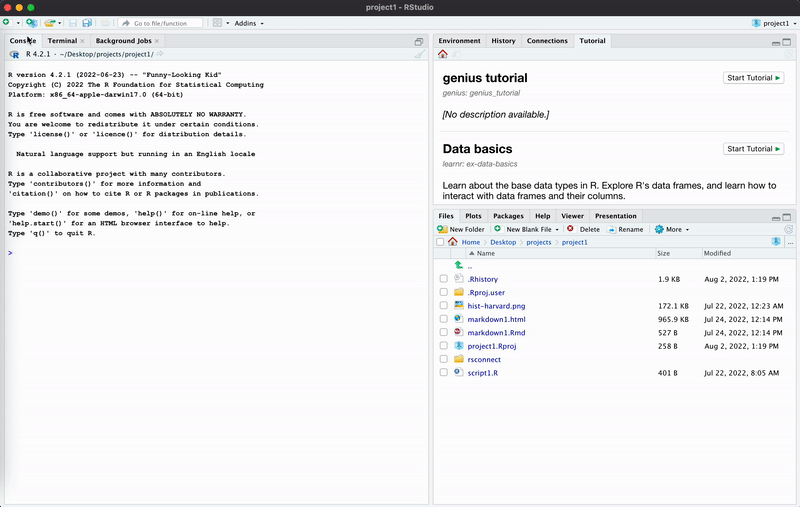
```

### 

Save the Quarto document by clicking the disk icon at the top of the file, or by using the shortcut Cmd/Cntrl + s. Name the file `quarto-1`. The `.qmd` file extension will be added automatically.

### 

In the top left corner above your Quarto document, you should see the buttons "Source", and "Visual". Click on "Source". This will revert how we see our Quarto document to be more similar to our R script. We will explore the "Visual" option shortly.

### 

Now that the document is saved, run `list.files()`. CP/CR.

```{r quarto-1-1}
question_text(NULL,
    answer(NULL, correct = TRUE),
    allow_retry = TRUE,
    try_again_button = "Edit Answer",
    incorrect = NULL,
    rows = 2)
```

### 

This should return `quarto-1.qmd`, as well as `analysis-1.Rproj`, `script-1.R`, and `hist-harvard.png`. Note how different suffixes are used for different types of files.

### Exercise 2

The default Quarto file should look like this:

```{r out.width = "875px"}
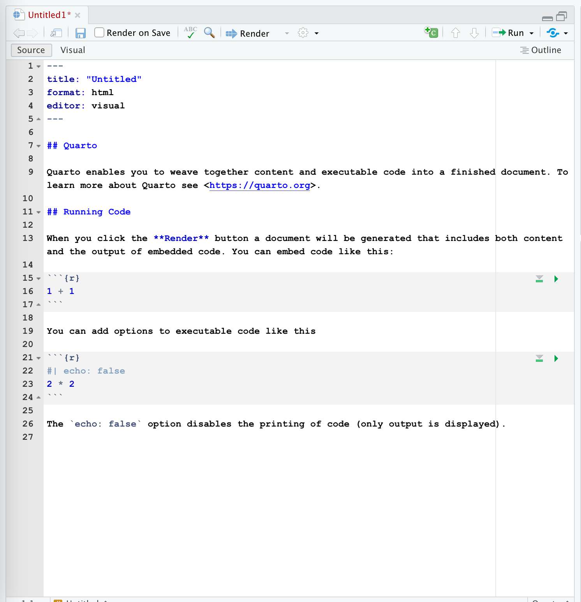
```

### 

As you can see, a lot of the text is regular plain text, not code. However, there are code chunks which allow us to execute code when the document is rendered. Here's an example of an R code chunk:

```{r}
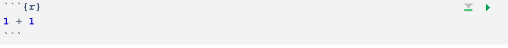
```

Quarto documents utilize Markdown (an easy-to-write plain text format), which can contain chunks of embedded code. These code chunks can be written in many languages, including R and Python. Code chunks allow you to use R to create plots and other graphics, and then to display them in a rendered Quarto document.

### 

<!-- DK: First render as it. Discuss. Highlight the different parts. Explain echo = FALSE. Then edit it as below. Add some photos. -->

<!-- FC: students may be confused about what a YAML header is, even with the description. Might be good to include a screenshot of what the YAML looks like. -->

Delete everything except the YAML header -- the text in the box at the top of the file, as well as the dashes. Add "This is my first Markdown text." at the bottom of the document.

### 

Save the file and run `readLines("quarto-1.qmd") |> tail()`. CP/CR.

```{r quarto-1-2}
question_text(NULL,
    answer(NULL, correct = TRUE),
    allow_retry = TRUE,
    try_again_button = "Edit Answer",
    incorrect = NULL,
    rows = 2)
```

### 

<!-- DK: Drop some knowledge. Split up some of the paragraphs. -->

This should return the last 6 lines of your Quarto document.

### Exercise 3

The main advantage of a Quarto document, relative to a simple R script, is to create something which is a mixture of words and code. To "render" our Quarto document, click the "Render" arrow at the top of the Code pane, or use the shortcut Cmd/Cntrl + shift + k.

### 

To render is to transform a document from Markdown to some other format, e.g., html, PDF, Microsoft Word and so on.

### 

In the following box, copy all of the text from your rendered Quarto document (which appears in the Viewer tab).

```{r quarto-1-3}
question_text(NULL,
    answer(NULL, correct = TRUE),
    allow_retry = TRUE,
    try_again_button = "Edit Answer",
    incorrect = NULL,
    rows = 2)
```

### 

<!-- DK: Explain about the setting we changed to achieve this. maybe change the setting and then change it back? -->

Notice how the rendered document --- which is an html file in this case --- appears in the Viewer tab in the Files pane in the lower right of the workspace.

### Exercise 4

In Quarto documents, you can use Markdown syntax. You can use this to create **bold** or *italic* text, and headers.

### 

Make the text created in the previous section a header by adding `##` at the beginning of the line (followed by a space), then adding this text under that as a description: `You can do a lot of cool things in Quarto like **bold** and *italic* text.` Render the file again. Does everything look good in the Viewer?

### 

Run `readLines("quarto-1.qmd") |> tail()` in the Console. CP/CR.

```{r quarto-1-4}
question_text(NULL,
    answer(NULL, correct = TRUE),
    allow_retry = TRUE,
    try_again_button = "Edit Answer",
    incorrect = NULL,
    rows = 2)
```

### 

You can find a full list of Markdown formatting styles and commands [here](https://www.markdownguide.org/basic-syntax/).

### Exercise 5

In the top left corner of the Code pane, you should be able to see two buttons: "Source" and "Visual". "Source" shows you all the code while "Visual" shows you (mostly) how the document will look after being rendered. You can edit a Quarto document while in either "Source" or "Visual" mode.

### 

We are going to switch to "Visual" and explore how we can edit while still in "Visual". Switch to "Visual" by clicking on it.

### 

Type "I made this through Quarto" below "This is my first Markdown text" while still in "Visual". Copy and paste everything in your document (while still in "Visual") into the box below.

```{r quarto-1-5}
question_text(NULL,
    answer(NULL, correct = TRUE),
    allow_retry = TRUE,
    try_again_button = "Edit Answer",
    incorrect = NULL,
    rows = 2)
```

### 

Save the file. Render the document, just to make sure it worked.

### Exercise 6

Now let's try to add code chunks into our Quarto document. Under the text that we added earlier, add a code chunk either by pressing the Add Chunk command at the top of the editor (the green C button with a plus sign next to it) or with the shortcut `option + cmd + i`. The newly created code chunk will be empty, like the example from earlier.

### 

Save the file, and run `readLines("quarto-1.qmd") |> tail()` in the Console. CP/CR.

```{r quarto-1-6}
question_text(NULL,
    answer(NULL, correct = TRUE),
    allow_retry = TRUE,
    try_again_button = "Edit Answer",
    incorrect = NULL,
    rows = 2)
```

### 

This should show the code chunk you created.

### Exercise 7

<!-- DK: Use palmer penguins? -->

Let's try graphing the **iris** data within our code chunk. First of all, we need to load the libraries that we need.

### 

We will often make a "setup" code chunk when we begin working in a file, where we can load libraries and prepare data for use. At the top of the file, directly below the YAML header, create another code chunk, as seen below.

In the setup code chunk, use the `library()` function with the argument **tidyverse**. Always label your code chunks. Adding a label makes code chunks easier to sort and understand. Your setup chunk should look like this:

```{r}
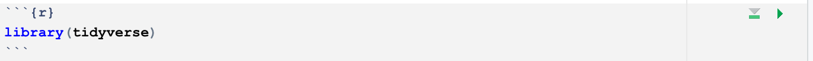
```

### 

**Important Point**: There are two different "worlds" with which we are dealing. First is the world of the Quarto document, the qmd file. Second is the world of the Console in our current RStudio session. **These worlds only connect when we connect them**. Something written in a Quarto document --- or an R script --- is not part of our current R session.

### 

Right now, your libraries haven't been loaded into the current R session. To load them, you must run the code chunk. This can be done using the Run button in the top right of your qmd file, or with the shortcut cmd + shift + enter.

Run the code chunk.

### 

Run `readLines("quarto-1.qmd") |> head(15)` in the Console. CP/CR.

```{r quarto-1-7}
question_text(NULL,
    answer(NULL, correct = TRUE),
    allow_retry = TRUE,
    try_again_button = "Edit Answer",
    incorrect = NULL,
    rows = 2)
```

### 

Whenever we use `library()` in our Quarto documents, we will use a setup code chunk. Do not load libraries in the same chunk as your plots.

### Exercise 8

Go back to the code chunk that you first created. Let's create the following scatterplot in our Quarto document:

```{r}
scat_p <- ggplot(data = iris, 
                 mapping = aes(x = Sepal.Width, 
                               y = Sepal.Length, 
                              color = Species)) +
  geom_point() +
  labs(title = "Measurements for Different Species of Iris",
       subtitle = "Virginica has the longest sepals",
        x = "Sepal.Width",
        y = "Sepal.Length", 
       caption = "Fisher (1936)")
scat_p
```

This graph should be similar to ones you have created in previous visualization tutorials.

### 

Copy the code below into your R Code Chunk.

```{r eval = FALSE, echo = TRUE}
ggplot(data = iris, 
       mapping = aes(x = Sepal.Width, 
                     y = Sepal.Length, 
                     color = Species))
```

### 

Render the file. You should now see your R code chunk, as well as a blank plot, since we have not added a geom layer.

Run `readLines("quarto-1.qmd") |> tail(10)` in the Console. CP/CR.

```{r quarto-1-8}
question_text(NULL,
    answer(NULL, correct = TRUE),
    allow_retry = TRUE,
    try_again_button = "Edit Answer",
    incorrect = NULL,
    rows = 2)
```

### Exercise 9

To add a geom layer, add `geom_point()` to your plot. You will need to render the file again. Now our plot isn't empty! It shows a scatterplot!

### 

Run `readLines("quarto-1.qmd") |> tail(10)` in the Console. CP/CR.

```{r quarto-1-9}
question_text(NULL,
    answer(NULL, correct = TRUE),
    allow_retry = TRUE,
    try_again_button = "Edit Answer",
    incorrect = NULL,
    rows = 2)
```

### 

<!-- DK: Drop some knowledge! -->

The output should include the last 10 lines of code in your Quarto document.

### Exercise 10

We just built the basic graph, but it still looks a little ugly. Labels are important for adding context to the graph and making it easier to understand.

Use the `labs()` function to add appropriate title and axis labels to the graph.

Reminder, this is what our plot should look like

```{r echo = FALSE}
scat_p
```

### 

Render the file again to see your completed graph.

### 

Run `readLines("quarto-1.qmd") |> tail(10)` in the Console. CP/CR.

```{r quarto-1-10}
question_text(NULL,
    answer(NULL, correct = TRUE),
    allow_retry = TRUE,
    try_again_button = "Edit Answer",
    incorrect = NULL,
    rows = 2)
```

### Exercise 11

Now, we just used a code chunk because we wanted to do a full graph. An R code chunk limits you from using R code in the same line as text. This is when we use **inline** R code.

Inline R code is essentially a way for you to put simple R calculations in the same line as your text. Add the following code to your setup code chunk.

```{r echo = FALSE}
x <- 1234567890
```

The setup chunk should now look like this.

```{r}
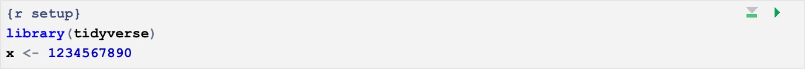
```

### 

Run the code chunk, then in the Console, type `x` to verify that x has been defined. CP/CR.

```{r quarto-1-11}
question_text(NULL,
    answer(NULL, correct = TRUE),
    allow_retry = TRUE,
    try_again_button = "Edit Answer",
    incorrect = NULL,
    rows = 2)
```

### Exercise 12

Lets make some inline R code.

Into your Quarto document, directly after the code chunk we just made, type the following text and inline R code. **NOTE**: Type this manually, do not copy. Pasted code can be finicky, and might not register as inline R code.

The variable x has a value of: `` `r knitr::inline_expr("scales::comma(x)")` ``.

### 

<!-- DK: Fix this image. -->

<!-- Render the file. You should see that the line now looks like, -->

<!-- ```{r} -->

<!--  -->

<!-- ``` -->

<!-- ###  -->

As you can see, it's just a condensed version of a full code chunk. We declare the language (R) and then state our function (`scales::comma(x)`). By doing this, we can put R code in the same line as actual text. Remember that we use backticks to signify code here.

### 

Run `readLines("quarto-1.qmd") |> tail(10)` in the Console. CP/CR.

```{r quarto-1-12}
question_text(NULL,
    answer(NULL, correct = TRUE),
    allow_retry = TRUE,
    try_again_button = "Edit Answer",
    incorrect = NULL,
    rows = 2)
```

### 

Instead of hardcoding values into text in your Markdown file, you should always try to calculate values on the fly using inline R code. This ensures that values will always be accurate, regardless of changes to given data sets. For more info on inline R code, look at the [Quarto Execution Options Guide](https://quarto.org/docs/computations/execution-options.html).

### Exercise 13

<!-- DK: Add an image. -->

<!-- DK: Awkward! Show an example. -->

Right now, our Quarto document looks a little ugly. We don't want our code to be displayed in the rendered report. We can get rid of it using code chunk arguments.

Code chunk arguments are a way to tell a chunk what it should do when rendered. Code chunk options are written below the `{r}` in our code chunk. Let's change `echo` to `false` to stop the code from showing in our report. `echo` like `label` is a code chunk option. Code chunk options are prefaced with a `#|`, called a "hash-pipe." After the name of the option, you place a colon, followed by the value for the option.

Run `readLines("quarto-1.qmd")` in the Console, then copy-paste the command and the output below.

```{r quarto-1-13}
question_text(NULL,
    answer(NULL, correct = TRUE),
    allow_retry = TRUE,
    try_again_button = "Edit Answer",
    incorrect = NULL,
    rows = 2)
```

### 

Some more useful code chunk options to look into include `warning` and `message`. A full list of code chunk options can be found on the [Quarto Execution Options Guide](https://quarto.org/docs/computations/execution-options.html). We will almost always use `echo: false` to hide code in our projects.

### 

Congratulations on creating a full Quarto document. You have learned how to create plots, add text, and use inline R code.

## Quarto 2

<!-- DK: Drop some knowledge. Tell us about the options now, and at the end, after you have taught them to us. -->

Now let's make another Quarto document, and explore some more options!

### Exercise 1

Make a new Quarto document. Name the document `quarto-2`, and instead of creating the document as normal, hit "Create Empty Document", in the bottom left corner of the creation screen.

```{r}
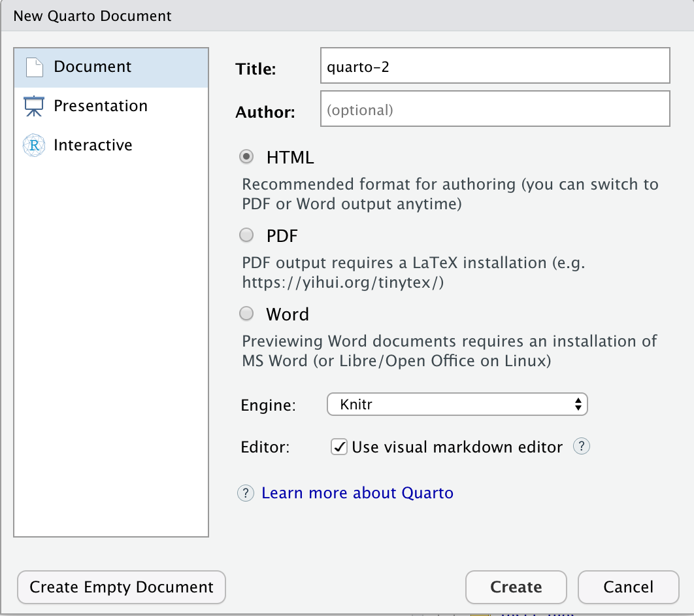
```

Save the document as `quarto-2`. Run `readLines("quarto-2.qmd")`. CP/CR.

```{r quarto-2-1}
question_text(NULL,
    answer(NULL, correct = TRUE),
    allow_retry = TRUE,
    try_again_button = "Edit Answer",
    incorrect = NULL,
    rows = 2)
```

### 

<!-- DK: Drop knowledge! -->

The document should be completely empty, apart from the YAML header

### Exercise 2

We are going to make another setup code chunk, where you can load all the libraries you need. Add a new code chunk with the green C at the top of the page.

### 

You may notice that there are curly braces `{}` at the top of the chunk, with an `r` inside. The `r` says that the language is R. In the next line, write `#| label: setup` in order to give the code chunk the label/name "setup."

### 

We don't need very many libraries for this, as we are just including images, but we do need the package **knitr**. Load **knitr** with `library(knitr)` in your setup chunk. (Recall that the terms "library" and "package" are used interchangeably.)

### 

**Notice the sloppy language!** There are two ways in which we can "load" **knitr**, corresponding to the two worlds we are working in simultaneous: QMD World and Console World.

### 

Putting the character string `library(knitr)` inside the `setup` code chunk is enough to "load" **knitr** in QMD World because, whenever we render a file, every line of code in the file is set to R for processing. Those characters, however, have no connection to Console World until we explicitly execute them by hand, generally with Cmd/Cntrl-return.

Do that now. Place the cursor next to the `library()` function calls and hit Cmd/Cntrl-return.

### 

Once all that is done, run `search()` in the Console. CP/CR

```{r quarto-2-2}
question_text(NULL,
    answer(NULL, correct = TRUE),
    allow_retry = TRUE,
    try_again_button = "Edit Answer",
    incorrect = NULL,
    rows = 2)
```

### 

<!-- DK: Explain this better! Not actually loaded unless you execute the code! -->

This should include the string `package:knitr`, indicating that **knitr** is loaded.

### Exercise 3

Make a new header with the title "Harvard Histogram". Remember we do this using `##`, followed by a space. Under this header, create a new code chunk. Use the code chunk argument `echo: false` to stop your code from showing up upon rendering the file.

### 

In your new code chunk, use the function `include_graphics()`. Set the argument to the name of your .png. Remember to use quotes. The command should look like `include_graphics("hist-harvard.png")`.

### Exercise 4

Remember the **iris** graph that we made? We are going to include that in the Quarto document along with the Harvard graph that we made. Make a header with the title "Iris scatter plot". Now, we need to save the graph to an object.

### 

Go back to the `quarto-1` document and copy and paste the code for the iris plot into the `quarto-2` document in a new code chunk labeled `iris`. Add the `echo: false` code chunk option as well. Save the file.

### 

Run `readLines("quarto-2.qmd")` in the Console. CP/CR.

```{r quarto-2-4}
question_text(text = NULL,
    answer(NULL, correct = TRUE),
    allow_retry = TRUE,
    try_again_button = "Edit Answer",
    incorrect = NULL,
    rows = 2)
```

### Exercise 5

Now that you have the code for the iris plot in your document, we are going to save it to an object. Call the object `iris_plot`.

### 

Run `readLines("quarto-2.qmd")` in the Console again. CP/CR.

```{r quarto-2-5}
question_text(NULL,
    answer(NULL, correct = TRUE),
    allow_retry = TRUE,
    try_again_button = "Edit Answer",
    incorrect = NULL,
    rows = 2)
```

### Exercise 6

Now, let's make the `iris_plot` into a .png using `ggsave()`.

### 

We are going to do it the same way as the Harvard plot. In a new code chunk labeled `iris_save`, type `ggsave()`. Set `plot` equal to `iris_plot`, and `file` equal to `"iris_plot.png"`. Now you have another .png to include in your `quarto-2` document.

### 

Now, we need to include the plot!

### 

In another code chunk called `iris_include`, type `include_graphics("iris_plot.png")`.

### 

Run `readLines("quarto-2.qmd")` in the Console. CP/CR.

```{r quarto-2-6}
question_text(NULL,
    answer(NULL, correct = TRUE),
    allow_retry = TRUE,
    try_again_button = "Edit Answer",
    incorrect = NULL,
    rows = 2)
```

### Exercise 7

Now, we are going to include more inline R code.

### 

In a new code chunk set `x` to `1234567890` with `<-`. Make sure to add the code chunk option `echo: false`.

### 

Now, we want the inline code to show in the document. Type x in the Console to make sure it is `1234567890`. (For this to work, you must also run the `x <- 1234567890` code in the Console, presumably using Cmd/Cntrl-return.)

### 

Now, you need to **TYPE** this into your document. Type it underneath the `iris_plot` code chunk. This does **not** go in a code chunk though.

The variable x has a value of: `` `r knitr::inline_expr("scales::comma(x)")` ``.

### 

Render the document. When you do, you should see your inline code at the bottom. It should look like this:

The variable x has a value of: `r scales::comma(x)`.

### 

Run `readLines("quarto-2.qmd")` in the Console. CP/CR.

### Exercise 8

Render the file, and take a look at your completed Quarto document. It should now include your `iris` graph, the `x` text, and your Harvard graphic.

Run `readLines("quarto-2.qmd") |> tail(10)` in the Console. CP/CR.

```{r quarto-2-8}
question_text(NULL,
    answer(NULL, correct = TRUE),
    allow_retry = TRUE,
    try_again_button = "Edit Answer",
    incorrect = NULL,
    rows = 2)
```

## Publishing

### 

<!-- DK: Many images need updating because of the move to Quarto Pub (or maybe not?) and RStudio -> Posit. -->

We'll be publishing our Quarto documents on the Internet by using Rpubs](https://rpubs.com/, a free web publishing service. Rpubs is managed by Posit (formerly RStudio) a leading company in the data science world. You will need to create an Rpubs account.

###

Sometime in the future, Rpubs will go away and be replaced by [Quarto Pub](https://quartopub.com/). But that has not (?) happened yet. Some of the images in this Section may be out of date.

### Exercise 1

Render the `quarto-2` file. By rendering, you are generating a report in HTML, which is what Rpubs publishes on the web.

### 

Run `list.files()` in the Console, then copy-paste the command and the result below.

```{r publishing-1}
question_text(NULL,
    answer(NULL, correct = TRUE),
    allow_retry = TRUE,
    try_again_button = "Edit Answer",
    incorrect = NULL,
    rows = 2)
```

### 

You should see a `quarto-2.html` file, which generates upon rendering your qmd. (Note that the "qmd" file extension stands for **Q**uarto **M**arkdown **D**document.)

### 

We sometimes edit the YAML header to get rid of information like the date and title, as it sometimes looks bad in the final render. However, make sure not to mess with the rest of the YAML formatting because it is a very structurally sensitive language. You can learn more about YAML editing at [bookdown.org](https://bookdown.org/yihui/bookdown/r-markdown.html).

### Exercise 2

Notice a blue icon in the upper right-hand corner of your Quarto document. It should look like the image below.

```{r out.width = "875px"}
include_graphics("images/publish_button.png")
```

Press that button.

<!-- DK: Poor organization. What are students submitting? -->

### Exercise 3

You will be asked whether you want to publish to Rpubs or to Posit Connect. Use Rpubs. (Posit Connect costs money.) You will get a reminder that all documents you publish on RPubs are publicly visible. Click "Publish".

```{r}
include_graphics("images/rpubs-6.png")
```

### Exercise 4

This will take you to the RPubs website. You will need to create an account. Follow the steps as prompted.

```{r}
include_graphics("images/rpubs-7.png")
```

### Exercise 5

Add document details. Name your document. Add a meaningful slug (a unique website name that's often just the name of your project), otherwise you will end up with an ugly, long address you didn't choose and can't remember. You can leave the description blank if you don't want to add one.

Now, you should be able to publish. In the *Terminal* (the tab right next to the Console, this is the way cool people publish to Quarto Pub) type `quarto publish quarto-pub` and hit enter 2 times. The first time is validating the location of publishing, and the second time is to publish.

###

It may take a while, but you should see a new object in your Quarto Pub profile.

### Exercise 2

Put the link to your RPubs page in the space below.

```{r publishing-6}
question_text(NULL,
    answer(NULL, correct = TRUE),
    allow_retry = TRUE,
    try_again_button = "Edit Answer",
    incorrect = NULL,
    rows = 2)
```

### 

Keep in mind that this is now a website that can be found on the internet, for anyone to see.

## Summary

Good work on finishing this tutorial! You now know how to use R projects, R scripts, Quarto documents, how to publish a page on the internet using RPubs, and how to use a plethora of useful R commands!

```{r download-answers, child = system.file("child_documents/download_answers.Rmd", package = "tutorial.helpers")}
```
