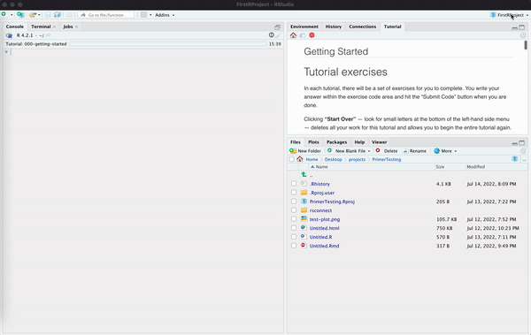
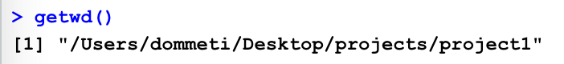
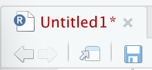
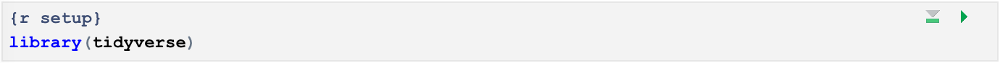
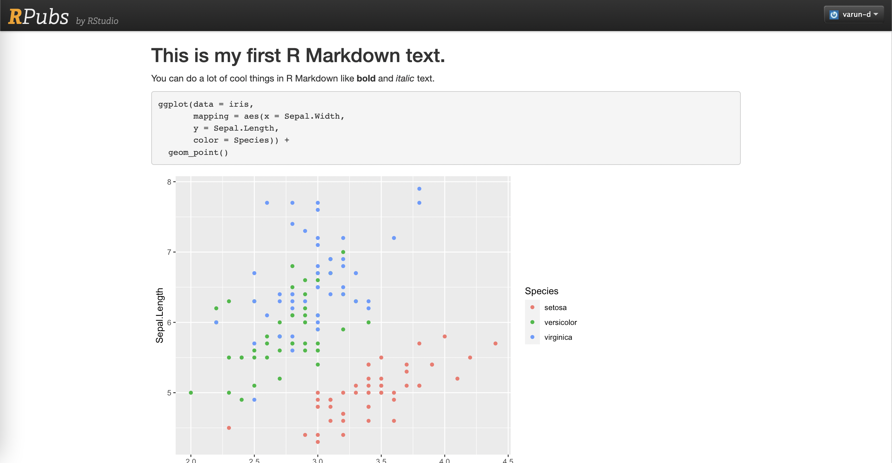

```{r setup, include = FALSE}
library(learnr)
library(primer.tutorials)
library(primer.data)
library(tidyverse)
library(knitr)
library(gistr)
knitr::opts_chunk$set(echo = FALSE)
options(tutorial.exercise.timelimit = 60, 
        tutorial.storage = "local")
```

```{r copy-code-chunk, child = "../../child_documents/copy_button.Rmd"}
```

```{r info-section, child = "../../child_documents/info_section.Rmd"}
```

<!-- Need shorter version of "Copy and paste both the command and the result into the space below." How about CP/CR? Mention the abbreviation in the first question of all tutorials: Getting Started, this one and RStudio and Github. Done- M-->

<!-- Restart R session several times. Restart RStudio session at least twice. Once for R Projects and once before starting R scripts.  -->

<!-- Do everything in visual with first Quarto document and then use source with the second.  Note how I misunderstood this! I thought "source" meant sourcing the code. This is about "Source" versus "Visual" buttons. -->

<!-- Make at least 3 Quarto documents. The first starts with all the junk. So does the second, so we can see how source connects to visual. Start the 3rd empty. -->

<!-- Code chunk names are important. Always use them, at least in second Quarto document creation.-->

<!-- Make a second script. And maybe a third. -->

<!-- Should include a better code chunk options example. Not sure warning message example discussion works. Worth improving. Or maybe replacing with something simpler like echo or eval. Just want students to be comfortable with code chunk options. (Is this still the terminology in Quarto?) -->

<!-- Discuss options for whole document and how it goes in header. Example:  -->

<!-- execute: -->

<!--   echo: false -->

## Introduction
### 

Until now, you have been typing your code into the neat boxes in our tutorials. What if you want to start working in your own? In this tutorial you will learn how to use R scripts and Quarto documents, and how to publish your work with RPubs!

## Checking your setup
### 

This tutorial assumes that you have read and completed all the steps in the [Getting Started](https://ppbds.github.io/primer/00-getting-started.html) chapter of the *Primer*. We will ask you to **c**opy/**p**aste the **c**ommand/**r**esponse so often, we will be shortening this instruction to CP/CR.

### Exercise 1

In the [Getting Started](https://ppbds.github.io/primer/00-getting-started.html) chapter of the *Primer*, you should have installed the **tidyverse** package, among others.

### 

Load the `tidyverse` package into your R Console using the `library()` function.

### 

Run `search()` in the Console to see the libraries that you've currently loaded, then copy and paste the result into the space below.

```{r checking-your-setup-1}
question_text(NULL,
    answer(NULL, correct = TRUE),
    allow_retry = TRUE,
    try_again_button = "Edit Answer",
    incorrect = NULL,
    rows = 3)
```

### 

There should be strings such as "package:tidyverse" in the output. These are the packages that you are currently loaded in your work space.

### Exercise 2

In the Console, run:

```{r eval = FALSE, echo = TRUE}
rstudioapi::readRStudioPreference(name = "load_workspace", 
                                  default = "Code failed.")
```

CP/CR.

```{r checking-your-setup-2}
question_text(NULL,
    answer(NULL, correct = TRUE),
    allow_retry = TRUE,
    try_again_button = "Edit Answer",
    incorrect = NULL,
    rows = 3)
```

### 

The result should be FALSE. If the result was not FALSE, you should redo to the *Getting Started* tutorial.

### Exercise 3

Look at the top left of your R Console. Here you should see the version of R you are running. It should look something like the image below.

```{r}
include_graphics("images/r_version.png")
```

Type `R.version` into the Console and hit return. CP/CR.

```{r checking-your-setup-3}
question_text(NULL,
    answer(NULL, correct = TRUE),
    allow_retry = TRUE,
    try_again_button = "Edit Answer",
    incorrect = NULL,
    rows = 3)
```

This should return a list of variables, including "major" and "minor", which tell you your R Version. This should be the same as the version you saw at the top left of the Console. `R.version` does not include parentheses at the end.

### Exercise 4

Shortly, we will create a new project for you to start working in. Before we do this, it might be useful to understand where you are right now.

In the R Console, run `getwd()`. CP/CR.

```{r checking-your-setup-4}
question_text(NULL,
    answer(NULL, correct = TRUE),
    allow_retry = TRUE,
    try_again_button = "Edit Answer",
    incorrect = NULL,
    rows = 3)
```

### 

This function returns the path to your current R Project. A path is simply the path you would use to reach a location on your computer. In this case, if you wanted to find the folder for your current R Project, you would follow the path returned by `getwd()`.

More info on paths can be found on the [UC Berkeley website](https://people.ischool.berkeley.edu/~kevin/unix-tutorial/section3.html).

### Exercise 5

Whenever you start a new R Project, you will want to store it somewhere in which you can find it easily. Right now, you are likely in a secluded location on your computer. It would be much more useful to have a location dedicated to your R Projects to make them easier to find.

Let's make a folder, and call it `projects`

If you need help making a folder, helpful resources can be found [here](https://support.microsoft.com/en-us/office/create-a-new-folder-cbbfb6f5-59dd-4e5d-95f6-a12577952e17) for Windows, and [here](https://support.apple.com/guide/mac-help/organize-files-using-folders-mh26885/mac) for macOS.

It would also be a good idea to to store this folder on your desktop, so that it can be found easily. **NOTE**: Do not store this folder inside of a cloud storage directory such as OneDrive. This can cause heaps of unforeseen problems for you in the future.

## R Projects
### 

Good data scientists keep their work organized. You should place your work in different R Projects, which are simply folders (or directories) on your computer with some helper files.

### Exercise 1

<!-- Background: https://support.rstudio.com/hc/en-us/articles/200526207-Using-RStudio-Projects#:~:text=RStudio%20projects%20are%20associated%20with,have%20R%20code%20and%20data -->

Please read all of the instructions before moving on, as you will be locked out of this tutorial while making your project.

Click on the dropdown menu at the top right of your R Studio Session. Then click "New Project". Recall the "Getting Started" tutorial, where we saw the "Terminate Jobs" warning. Remember that continuing here will close this tutorial.

In the new window which appears, click "New Directory" and then "New Project".

Name the Project `analysis-1` and change the project subdirectory to your new `projects` folder. Click create project. Remember that you will need to reopen this tutorial in your new session after it has been created.

```{r}

```

Good Work! You've created a new R Project. For the rest of this tutorial we will be working in `analysis-1`.

### 

Run `getwd()`. CP/CR.

```{r r-projects-1}
question_text(NULL,
    answer(NULL, correct = TRUE),
    allow_retry = TRUE,
    try_again_button = "Edit Answer",
    incorrect = NULL,
    rows = 3)
```

This path should now be different than our previous path, similar to the path below. Creating/opening an R Project moves RStudio to that directory.

```{r}

```

If your path does not include your `projects` folder, you likely did not select the `projects` directory when making `analysis-1`.

### Exercise 2

Run `list.files()`. CP/CR.

```{r r-projects-2}
question_text(NULL,
    answer(NULL, correct = TRUE),
    allow_retry = TRUE,
    try_again_button = "Edit Answer",
    incorrect = NULL,
    rows = 3)
```

`list.files()` returns files contained in your current R Project. This should return only the file `analysis-1.Rproj`.

### Exercise 3

Type `readLines("analysis-1.Rproj")` in the R Console and hit enter. CP/CR.

```{r r-projects-3}
question_text(NULL,
    answer(NULL, correct = TRUE),
    allow_retry = TRUE,
    try_again_button = "Edit Answer",
    incorrect = NULL,
    rows = 3)
```

This should return lines containing some basic settings for your R Project. For example, `RestoreWorkspace` is set to `default`.

## R Scripts
### 

So far, we have only worked in the R Console, but it's quite difficult to type more than a few lines of code into the Console at once.

That's when we use **R Scripts**. These are files which contain a permanent copy of our code.

### Exercise 1

Create an R Script by clicking the drop down menu at the top left of your R Studio Session, and clicking "R Script".

```{r}
include_graphics("images/new_r_script.gif")
```

### 

An untitled, empty file should pop up above the R Console. This is your R Script file.

### 

Type `5 * 5` into your R Script file and run the file by clicking the Run button in the top right corner. This will run in the Console. Copy and paste the output into the space below.

```{r r-scripts-1}
question_text(NULL,
    answer(NULL, correct = TRUE),
    allow_retry = TRUE,
    try_again_button = "Edit Answer",
    incorrect = NULL,
    rows = 2)
```

### 

The `5 * 5` should have run in your R Console, as well as it's return value `25`. Whenever you run an R Script file, it will run all selected code and return it in the R Console.

### Exercise 2

Go back to the first line in your R Script. Change `5 * 5` to `x = 5 * 5`, that way you have an `x` object . Run the script again, this time using the shortcut cmd/ctrl + enter. You should not see any value returned

In the Console tab, run `ls()` and copy-paste the output into the space below.

```{r r-scripts-2}
question_text(NULL,
    answer(NULL, correct = TRUE),
    allow_retry = TRUE,
    try_again_button = "Edit Answer",
    incorrect = NULL,
    rows = 2)
```

### 

`ls()` returns a list of values present your environment tab, in the top right corner of R Studio. You should see that it returned `x`, as you defined `x` using our R Script file.

### Exercise 3

So far, we have been working in an unsaved file. At the top of your R Script file. The file should currently be called `Untitled1`. You will see that the text is in red, with an asterisk. This indicates that there are unsaved changes in the file.

```{r}

```

### 

Delete all code currently in your R Script file. Then click the save icon below the Script title, or use the shortcut cmd + s to save the Script file. The first time you save a file you name it. Let's call this file `script-1`. The `.R` suffix will be added automatically.

In the Console tab, run `list.files()` and CP/CR.

```{r r-scripts-3}
question_text(NULL,
    answer(NULL, correct = TRUE),
    allow_retry = TRUE,
    try_again_button = "Edit Answer",
    incorrect = NULL,
    rows = 2)
```

### 

Recall when we ran this in the R Projects section, it returned only the `analysis-1.Rproj` file. It should now also return the `script-1.R` file.

### Exercise 4

Now that we're settled in and have started working with R Scripts, lets get to plotting. We will be making the following plot, step by step.

```{r}
hist_p <- ggplot(data = qscores, 
                 mapping = aes(x = rating)) +
  geom_histogram(bins = 5,
                 color = "white") + 
  labs(title = "Histogram of Student Ratings of Harvard Classes", 
       subtitle = "Ratings of 1 and 2 are very rare", 
       x = "Rating", 
       y = "Count", 
       caption = "Source: Harvard Q-Guide (2018-2019)")

hist_p
```

### 

At the top of your R Script file, type

```{r eval = FALSE, echo = TRUE}
`library(primer.data)`
`library(tidyverse`
```

Run the entire file using the shortcut cmd + shift + enter. Then use the `search()` function in your R Console. Copy and paste the output into the space below.

```{r r-scripts-4}
question_text(NULL,
    answer(NULL, correct = TRUE),
    allow_retry = TRUE,
    try_again_button = "Edit Answer",
    incorrect = NULL,
    rows = 2)
```

### 

This function returns a list of loaded packages. This should include strings such as `package:tidyverse` and `package:primer.data`.

### Exercise 5

On the next line, start a `ggplot()`, setting `data` to `qscores` and mapping `x` to `rating` with the following code.

```{r eval = FALSE, echo = TRUE}
ggplot(data = qscores,
       mapping = aes(x = rating))
```

Run the entire file again. This should generate a blank plot in the plots tab at the bottom right of your R Studio session.

In the Console tab, run `readLines("script-1.R")` and copy-paste the output into the space below.

```{r r-scripts-5}
question_text(NULL,
    answer(NULL, correct = TRUE),
    allow_retry = TRUE,
    try_again_button = "Edit Answer",
    incorrect = NULL,
    rows = 2)
```

### 

Remember that `ggplot()` will always generate a blank plot, until a `geom` layer is added. For a full list of geoms provided in the `tidyverse` package, check the ggplot2 [reference page](https://ggplot2.tidyverse.org/reference/#geoms).

### Exercise 6

Add a layer with `geom_histogram()`. Change the border color in our graph by setting `color` to `"white"` within `geom_histogram`, and change the number of columns in our plot using setting the `bins` argument to `5`.

```{r eval = FALSE, echo = TRUE}
geom_histogram(bins = 5,
               color = "white")
```

Run the file. This should generate columns on your plot.

In the Console tab, run `readLines("script-1.R")` and copy-paste the output into the space below.

```{r r-scripts-6}
question_text(NULL,
    answer(NULL, correct = TRUE),
    allow_retry = TRUE,
    try_again_button = "Edit Answer",
    incorrect = NULL,
    rows = 2)
```

### 

Keep in mind that the `color` argument used here modifies the border color of our columns. To change the fill color, use the `fill` argument.

### Exercise 7

Now let's make our graph look a little nicer by adding a `labs()` layer. Add appropriate title, subtitle, and axis labels.

Reminder, this is what our graph should look like

```{r}
hist_p
```

Run your R Script file to see your completed plot. In the Console tab, run `readLines("script-1.R")` and copy-paste the output into the space below.

```{r r-scripts-7}
question_text(NULL,
    answer(NULL, correct = TRUE),
    allow_retry = TRUE,
    try_again_button = "Edit Answer",
    incorrect = NULL,
    rows = 2)
```

### Exercise 8

Now we have a plot stored in our R script. How do we use this plot for other things? Right now we have to run our script every time we want to see the plot, which is a little inconvenient.

### 

Here we can use the `ggsave()` function. Type `?ggsave` in the R Console. This will open the help page for `ggsave()`. Copy and paste the description into the space below.

```{r r-scripts-8}
question_text(NULL,
    answer(NULL, correct = TRUE),
    allow_retry = TRUE,
    try_again_button = "Edit Answer",
    incorrect = NULL,
    rows = 2)
```

`ggsave()` is used to save plots as graphics. In this case we will be using the .png format. For a full list of graphics devices look into the `device` argument in the `ggsave()` help page.

### Exercise 9

First, we need to save our entire graph to an object, which can be done by setting our pipe equal to a variable. Call this variable `hist_p`.

Now using the `ggsave()` function we can create a png of our plot from our code. In `ggsave()`, set `plot` to `hist_p`, `file` to `"hist-harvard.png"`.

In the Console tab, run `list.files()` and copy-paste the output into the space below.

```{r r-scripts-9}
question_text(NULL,
    answer(NULL, correct = TRUE),
    allow_retry = TRUE,
    try_again_button = "Edit Answer",
    incorrect = NULL,
    rows = 2)
```

This lists the files in your project directory. You should see your R Project as well as the `hist_p.png` file containing your plot. In the bottom right corner of your workspace in the `files` tab, click on the png to view your plot.

If the title text flows out of the image, you might want to modify the `scale` argument in `ggsave()` to find a better image size. `scale` is set to 1 by default.

## Quarto 1
### 

<!-- Shorten descriptions in this section by splitting them into separate questions. -->

Quarto files are the primary way that we are going to be coding in R. Quarto is a file format for making dynamic documents with R. To learn more about Quarto and how to use it, check out the [official webpage](https://quarto.org/)!

### Exercise 1

First, let's ensure we are using an updated version of R Studio. Quarto is only shipped with R Studio in versions of R Studio after `2022.7.1.554`. Quarto builds upon an older format, R Markdown, but produces a cleaner, better, and more useful file.

To see if you are running an up-to-date version of R Studio, click on help -\> check for updates.

```{r}
include_graphics("images/check_for_updates.png")
```

### 

If you are prompted to update, follow the steps to download the latest version of R Studio. If not, you're good to go!

### Exercise 2

Now we can make our first Quarto document. To do this, click the dropdown menu at the top left of your R Studio window, and click "Quarto Document". Name the file `quarto-1`.

```{r}
include_graphics("images/new_quarto_doc.gif")
```

### 

Save the Quarto document by clicking the save icon at the top of the file, or by using the shortcut cmd + s.

Notice that you will be once again asked to name the file. Name the file `quarto-1` again. The first time you named the file, you changed the `title` in the header at the top of the file. Now you are changing the file name.

### 

In the top left corner of your Quarto document, you should see the words "Source", and "Visual". Click on "Source". This will revert how we see our Quarto document to be more similar to our R Script. We will explore the "Visual" option shortly.

### 

Now that the document is saved, run `list.files()`. Copy and paste the output into the space below.

```{r quarto-1-2}
question_text(NULL,
    answer(NULL, correct = TRUE),
    allow_retry = TRUE,
    try_again_button = "Edit Answer",
    incorrect = NULL,
    rows = 2)
```

### 

This should now return `quarto-1.qmd`, as well as `script-1.R` and `analysis-1.Rproj`. Notice the different suffixes used for our different types of files.

### Exercise 3

The default Quarto file should look like this:

```{r out.width = "875px"}
include_graphics("images/qmd_source.png")
```

### 

As you can see, a lot of the text is regular plain text, not code. However, there are code chunks that display code. Here's an example of an R code chunk:

```{r}
knitr::include_graphics("images/source_chunk.png")
```

Quarto documents utilize markdown (an easy-to-write plain text format), which contain chunks of embedded code. These code chunks can be written in many languages, including R and Python. These allow you to use R to create plots and other graphics, then display them in a rendered Quarto document with plain text descriptions.

### 

Delete everything except the YAML header (in the box at the top of the file) then add "This is my first Markdown text." at the bottom. Markdown is the plain-text language we are writing in.

### 

Save the file and run `readLines("quarto-1.qmd") |> tail()`. Copy and paste the output into the space below.

```{r quarto-1-3}
question_text(NULL,
    answer(NULL, correct = TRUE),
    allow_retry = TRUE,
    try_again_button = "Edit Answer",
    incorrect = NULL,
    rows = 2)
```

### 

This should return the last 6 lines of your Quarto document.

### 

### Exercise 4

The main function of a Quarto document, which differs it from a Script, is to render into a **report**. To render our Quarto document, click the render button at the top of the file, or use the shortcut cmd + shift + k.

In the following box, copy all of the text from your rendered Quarto document.

```{r quarto-1-4}
question_text(NULL,
    answer(NULL, correct = TRUE),
    allow_retry = TRUE,
    try_again_button = "Edit Answer",
    incorrect = NULL,
    rows = 2)
```

### 

This should open your Quarto file's name, and "This is my first Markdown text." Keep this page open, as it will update each time we render the file.

### Exercise 5

In Quarto documents, you can use Markdown syntax. You can use this to create **bold** or *italic* text, and headers. This is useful for formatting in your reports, to make them cleaner and easier to understand.

### 

Make the text created in the previous section a header by adding `##` at the beginning of the line, then adding this text under that as a description: `You can do a lot of cool things in R Markdown like **bold** and *italic* text.` render the file again and return to the page in your browser to make sure everything has rendered properly.

### 

Run `readLines("quarto-1.qmd") |> tail()` in the Console, then copy-paste the command and the output below.

```{r quarto-1-5}
question_text(NULL,
    answer(NULL, correct = TRUE),
    allow_retry = TRUE,
    try_again_button = "Edit Answer",
    incorrect = NULL,
    rows = 2)
```

### 

This should contain the text that you created in this exercise as well as the previous text. You can find a full list of markdown formatting styles and commands [here](https://www.markdownguide.org/basic-syntax/).

### Exercise 6

We will be exploring the "Visual" setting in the Quarto Document. In the top left corner or your screen, you should be able to see two buttons labeled "Source" and "Visual". We will be switching often to see what the document looks like without knitting it. "Source" shows you all the code while "Visual" shows you a cleaner version of the document. You can edit any given Quarto Document in both "Source" and "Visual".

### 

We are going to switch to "Visual" and explore how we can edit while still in "Visual".

### 

Switch to "Visual".

### 

Type "I made this through Quarto" below "This is my first Markdown text" while still in "Visual". Copy and paste everything in your document (while still in "Visual") into the box below.

```{r quarto-1-6}
question_text(NULL,
    answer(NULL, correct = TRUE),
    allow_retry = TRUE,
    try_again_button = "Edit Answer",
    incorrect = NULL,
    rows = 2)
```

Render the document, just to make sure it worked.

### Exercise 7

Now let's try to add code chunks into our Quarto document. Under the text that we added earlier, add a code chunk either by pressing the Add Chunk command at the top of the editor (the green C button with a plus sign next to it) or with the shortcut `option + cmd + i`. The code chunk should be empty, like the example from earlier.

### 

Save the file, and run `readLines("quarto-1.qmd") |> tail()` in the Console, then copy-paste the command and the output below.

```{r quarto-1-7}
question_text(NULL,
    answer(NULL, correct = TRUE),
    allow_retry = TRUE,
    try_again_button = "Edit Answer",
    incorrect = NULL,
    rows = 2)
```

### 

This should show the code chunk you created.

### Exercise 8

Let's try graphing the **iris** data within our code chunk. First of all, we need to load the libraries that we need.

### 

We will often make a "setup" code chunk when we begin working in a file, where we can load libraries and prepare data for use. At the top of the file, directly below the YAML header, create another code chunk, as seen below.

In the setup code chunk, use the `library()` function with the argument **tidyverse**. You might also want to label your code chunk, as adding a label can make code chunks a little bit easier to sort and understand. Your setup chunk should look like this:

```{r}

```

### 

Right now, your libraries haven't been loaded. To load them, you must run the code chunk. This can be done using the Run button in the top right of your .Rmd file, or with the shortcut cmd + shift + enter.

Run the code chunk.

### 

Run `readLines("quarto-1.qmd") |> head(15)` in the Console, then copy-paste the command and the output below.

```{r quarto-1-8}
question_text(NULL,
    answer(NULL, correct = TRUE),
    allow_retry = TRUE,
    try_again_button = "Edit Answer",
    incorrect = NULL,
    rows = 2)
```

### 

Whenever we load libraries in our Quarto documents, we will use the setup code chunk. Do not load libraries in the same chunk as your plots.

### Exercise 9

Go back to the code chunk that you first created. Let's create the following scatter plot in our Quarto document:

```{r}
scat_p <- ggplot(data = iris, 
                 mapping = aes(x = Sepal.Width, 
                               y = Sepal.Length, 
                              color = Species)) +
  geom_point() +
  labs(title = "Measurements for Different Species of Iris",
       subtitle = "Virginica has the longest sepals",
        x = "Sepal.Width",
        y = "Sepal.Length", 
       caption = "Fisher (1936)")
scat_p
```

This graph should be similar to ones you have created in previous visualization tutorials.

### 

Copy the code below into your R Code Chunk.

```{r eval = FALSE, echo = TRUE}
ggplot(data = iris, 
       mapping = aes(x = Sepal.Width, 
       y = Sepal.Length, 
       color = Species))
```

### 

Render the file. You should now see your R Code Chunk, as well as a blank plot, as we have not added a geom layer.

Run `readLines("quarto-1.qmd") |> tail(10)` in the Console, then copy-paste the command and the output below.

```{r quarto-1-9}
question_text(NULL,
    answer(NULL, correct = TRUE),
    allow_retry = TRUE,
    try_again_button = "Edit Answer",
    incorrect = NULL,
    rows = 2)
```

### Exercise 10

To add a geom layer, add `geom_point()` to our plot. You will need to render the file again. Now our plot isn't empty! It shows a scatterplot!

Run `readLines("quarto-1.qmd") |> tail(10)` in the Console, then copy-paste the command and the output below.

```{r quarto-1-10}
question_text(NULL,
    answer(NULL, correct = TRUE),
    allow_retry = TRUE,
    try_again_button = "Edit Answer",
    incorrect = NULL,
    rows = 2)
```

### 

The output should include the last 10 lines of code in your Quarto document.

### Exercise 11

We just built the basic graph, but it still looks a little ugly. Labels are important for adding context to the graph and making it easier to understand.

Use the `labs()` function to add appropriate title and axis labels to the graph.

Reminder, this is what our plot should look like

```{r echo = FALSE}
scat_p
```

### 

Render the file again to see our completed graph.

Run `readLines("quarto-1.qmd") |> tail(10)` in the Console, then copy-paste the command and the output below.

```{r quarto-1-11}
question_text(NULL,
    answer(NULL, correct = TRUE),
    allow_retry = TRUE,
    try_again_button = "Edit Answer",
    incorrect = NULL,
    rows = 2)
```

### Exercise 12

Now, we just used a code chunk because we wanted to do a full graph. An R Code Chunk limits you from using R Code in the same line as text. This is when we use Inline R Code.

Inline R code is essentially a way for you to put simple R calculations in the same line as your text. Add the following code to your setup code chunk.

```{r echo = FALSE}
x <- 1234567890
```

The setup chunk should now look like this.

```{r}
knitr::include_graphics("images/new_setup_chunk.png")
```

### 

Run the code chunk, then in the console, type `x` to verify that x has been defined. Copy-paste the command and the output below.

```{r quarto-1-12}
question_text(NULL,
    answer(NULL, correct = TRUE),
    allow_retry = TRUE,
    try_again_button = "Edit Answer",
    incorrect = NULL,
    rows = 2)
```

### Exercise 13

Lets make our inline R Code.

Into your Quarto document, directly after the code chunk we just made, type the following text and inline R code. **NOTE**: Type this manually, do not copy. Pasted code can be finicky, and might not register as inline R code.

The variable x has a value of: `` `r knitr::inline_expr("scales::comma(x)")` ``.

### 

Render the file. You should see that the line now looks like,

```{r}
knitr::include_graphics("images/x_value.png")
```

### 

As you can see, it's just a condensed version of a full code chunk. We declare the language (R) and then state our function (`scales::comma(x)`). By doing this, we can put R code in the same line as actual text. Remember that we use backticks to signify code here.

### 

Run `readLines("quarto-1.qmd") |> tail(10)` in the Console, then copy-paste the command and the output below.

```{r quarto-1-13}
question_text(NULL,
    answer(NULL, correct = TRUE),
    allow_retry = TRUE,
    try_again_button = "Edit Answer",
    incorrect = NULL,
    rows = 2)
```

### 

Instead of hardcoding values into text in your Markdown file, you should always try to calculate values on the fly using inline R Code. This ensures that values will always be accurate, regardless of changes to given data sets. For more info on inline R Code, look at the [Quarto Execution Options Guide](https://quarto.org/docs/computations/execution-options.html).

### Exercise 14

Right now, our Quarto document looks a little ugly. We don't want our code to be displayed in the rendered report. We can get rid of it using code chunk arguments.

Code chunk arguments are a way to tell a chunk what it should do when rendered. Code chunk options are written after the `{r}` in our code chunk. Let's change `echo` to `FALSE` to stop the code from showing in our report.

Run `readLines("quarto-1.qmd")` in the Console, then copy-paste the command and the output below.

```{r quarto-1-14}
question_text(NULL,
    answer(NULL, correct = TRUE),
    allow_retry = TRUE,
    try_again_button = "Edit Answer",
    incorrect = NULL,
    rows = 2)
```

### 

Some more useful code chunk options to look into include `warning` and `message`. A full list of code chunk options can be found on the [Quarto Execution Options Guide](https://quarto.org/docs/computations/execution-options.html). We will almost always use `echo = FALSE` to hide code in our projects.

### 

Congratulations on creating a full Quarto document. You have learned how to create plots, add text, use inline R code.

## Quarto 2
<!-- Need to finish section -->

Now let's make another Quarto document, and explore some more options!

### Exercise 1

Make a new Quarto document. If you need a refresher on how to make the document, check the previous section.

Name the document `quarto-2`, and instead of creating the document as normal, hit "Create Empty Document", in the bottom left corner of the creation screen.

```{r}
knitr::include_graphics("images/qmd_creation.png")
```

Save the document as `quarto-2` and run `readLines("quarto-2.qmd")`. CP/CR.

```{r quarto-2-1}
question_text(NULL,
    answer(NULL, correct = TRUE),
    allow_retry = TRUE,
    try_again_button = "Edit Answer",
    incorrect = NULL,
    rows = 2)
```

### Exercise 2

Quarto, unlike RMarkdown, does not include a setup chunk. We are going to make a fake setup chunk, where you can load all the libraries you need. Add a new code chunk
### 

The document should be completely empty, apart from the YAML header

### Exercise 2

Remember our .png file from earlier? Lets add that image to our Quarto document!

### 

Run `search()` in the Console. CP/CR

```{r quarto-2-2}
question_text(NULL,
    answer(NULL, correct = TRUE),
    allow_retry = TRUE,
    try_again_button = "Edit Answer",
    incorrect = NULL,
    rows = 2)
```

### 

This should include the string `package:knitr`, indicating that `knitr` is loaded.

### Exercise 3

Make a new header with the title "Harvard Histogram". Remember we do this using `##`. Under this header, create a new code chunk. Use the argument `echo = FALSE` to stop your code from showing up upon knitting the file.

### 

In your new code chunk, use the function `include_graphics()`. Set the argument to the name of your .png. Remember to use quotes. The command should look like `include_graphics("hist_harvard.png")`.

### 

Render the file, and take a look at your completed R Markdown. It should now include your `iris` graph, the `x` text, and your `qscores` graph.

Run `readLines("quarto-1.qmd") |> tail(10)` in the Console. CP/CR.

```{r quarto-2-3}
question_text(NULL,
    answer(NULL, correct = TRUE),
    allow_retry = TRUE,
    try_again_button = "Edit Answer",
    incorrect = NULL,
    rows = 2)
```

## Publishing
### 

We'll be publishing our Quarto documents on the Internet by using [RPubs](https://rpubs.com/), a free web publishing service. This is a fairly simple process, but you will need to create a Quarto Pub account.

### Exercise 1

Render the Quarto document that you've been working in so far. By rendering, you are generating a report written in HTML, which is what RPubs publishes on the web.

### 

Run `list.files()` in the Console, then copy-paste the command and the result below.

```{r publishing-1}
question_text(NULL,
    answer(NULL, correct = TRUE),
    allow_retry = TRUE,
    try_again_button = "Edit Answer",
    incorrect = NULL,
    rows = 2)
```

### 

You should see a `quarto-1.html` file, which generates upon knitting your markdown.

### 

It's recommended to change the YAML header to get rid of information like the date and title, as it looks bad in the final render. However, make sure not to mess with the rest of the YAML formatting because it is a very structurally sensitive language. You can learn more about YAML editing at [bookdown.org](https://bookdown.org/yihui/bookdown/r-markdown.html).

### Exercise 2

Notice a blue icon in the upper right-hand corner of your Quarto document. It should look like the image below.

```{r out.width = "875px"}
include_graphics("images/publish_button.png")
```

### Exercise 3

You will be asked whether you want to publish to Rpubs or to RStudio Connect. For our purpose here we will be using RPubs. You will get a reminder that all documents you publish on RPubs are publicly visible. Click "Publish".

```{r}
include_graphics("images/rpubs-6.png")
```

### Exercise 4

This will take you to the RPubs website. You will need to create an account. Follow the steps as prompted.

```{r}
include_graphics("images/rpubs-7.png")
```

### Exercise 5

Add document details. Name your document. Add a meaningful slug (a unique website name that's often just the name of your project), otherwise you will end up with an ugly, long address you didn't choose and can't remember. You can leave the description blank if you don't want to add one.

```{r}
include_graphics("images/rpubs-8.png")
```

### Exercise 6

Hit "Continue". You have now published your first document to RPubs! People can now access it on the internet and see your work!

```{r out.width = "875px"}

```

### Exercise 7

You finished publishing your page to RPubs! Put the link to your RPubs page in the space below.

```{r publishing-7}
question_text(NULL,
    answer(NULL, correct = TRUE),
    allow_retry = TRUE,
    try_again_button = "Edit Answer",
    incorrect = NULL,
    rows = 2)
```

### 

Keep in mind that this is now a website that can be found on the internet, for anyone to see.

## Summary
Good work on finishing this tutorial! You now know how to use R projects, R Scripts, Quarto Documents, how to publish a page on the internet using RPubs, and how to use a plethora of useful R commands!

```{r download-answers, child = "../../child_documents/download_answers.Rmd"}
```
