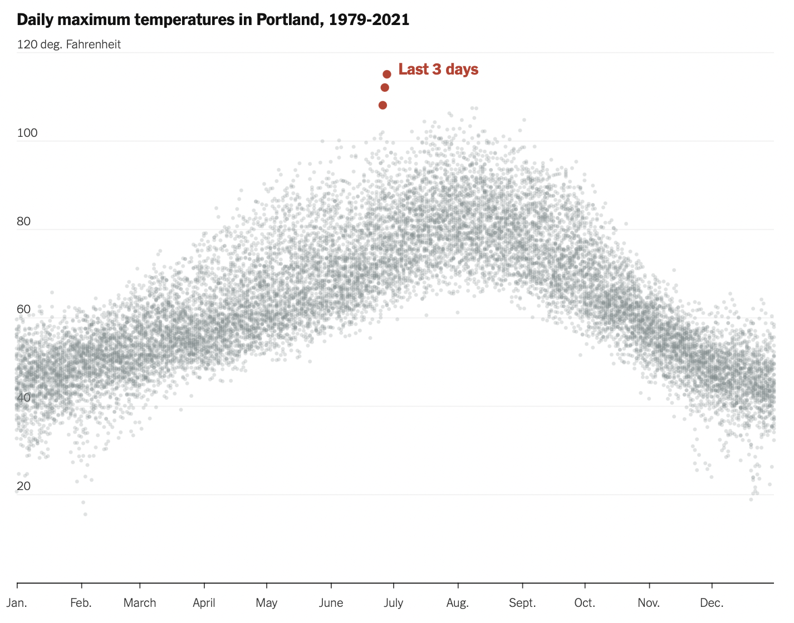

```{r setup, include = FALSE}
library(learnr)
library(knitr)
library(primer.tutorials)
library(tidyverse)
library(primer.data)
library(socviz)
library(ggthemes)
library(systemfonts)
library(ggforce)
knitr::opts_chunk$set(echo = FALSE)
options(tutorial.exercise.timelimit = 60, 
        tutorial.storage = "local") 
```

```{r copy-code-chunk, child = "../../child_documents/copy_button.Rmd"}
```

```{r info-section, child = "../../child_documents/info_section.Rmd"}
```

<!-- Maybe use 5 or 6 of these plots: -->

<!-- https://www.cedricscherer.com/slides/RLadiesTunis-2021-favorite-ggplot-extensions.pdf -->

<!-- Although we may need to simplify them so that they don't require 30 Exercises. You will often need to find the code elsewhere, often at the Github repo for the package. Example: https://github.com/davidsjoberg/ggstream. I think the movie type graphic works well. -->

<!-- Create Portland temperature example. Place a screen shot from the NY Times in the images/ directory. Show them the plot we will make, which does not need to be identical, and then make it. Add the portland data to the data/ directory. No need to make it identical to Cedric's. Probably don't have time to do all his magic. See: https://gist.github.com/z3tt/275e6cffa5933c85332bacfad717eb88.  -->

<!-- Also, maybe stuff from: https://www.cedricscherer.com/2019/08/05/a-ggplot2-tutorial-for-beautiful-plotting-in-r/.  -->

## The US Life Expectancy Gap

### 

We will be making this plot here. 

```{r fig.width = 10}
final_plot <- 
  oecd_sum %>% 
  drop_na() %>% 
  ggplot(mapping = aes(x = year, y = diff, fill = hi_lo)) +
      geom_col() + 
      guides(fill = "none") +
      theme_minimal() +
      labs(x = NULL, 
           y = "Difference in Years",
           title = "The US Life Expectancy Gap",
           subtitle = "Difference between US and OECD average life expectancies,\n1960-2015",
           caption = "Data: OECD. After a chart by Christopher Ingraham,\nWashington Post, December 27th 2017.") +
      theme(plot.title = element_text(face = "bold",
                                      size = 20,
                                      margin = margin(b = 5)),
            plot.subtitle = element_text(face = "italic",
                                         size = 15,
                                         margin = margin(b = 10)),
            plot.caption = element_text(face = "italic",
                                        margin = margin(t = 5)),
            axis.title.y = element_text(face = "bold"),
            axis.text = element_text(face = "bold"))

final_plot
```

### Exercise 1

We will first explore the data set we will be using for the first graph. Run `oecd_sum` in the code chunk below.

```{r the-us-life-expectan-1, exercise = TRUE}

```

```{r the-us-life-expectan-1-hint-1, eval = FALSE}
oecd_sum
```

### 

The data set is from the Organisation for Economic Co-operation and Development, otherwise known as OECD. 

### Exercise 2

We will explore the `oecd_sum` data set further. Go onto this website [here](https://kjhealy.github.io/socviz/reference/oecd_sum.html). Copy and paste what the hi_lo and diff variables represent.

```{r the-us-life-expectan-2}
  question_text(NULL,
    answer(NULL, correct = TRUE),
    allow_retry = TRUE,
    try_again_button = "Edit Answer",
    incorrect = NULL,
    options = list(nrows = 3))
```

### 

This dataset focuses specifically on the USA in relation to OECD stats.

### Exercise 3

We will be building a plot mapping the USA's average life expectancy compared to the OECD's from 1960 to 2015. Start by building a pipe with the data set. Use the function `select()`. Within select, input `-other, -usa`. 

```{r the-us-life-expectan-3, exercise = TRUE}

```

```{r the-us-life-expectan-3-hint-1, eval = FALSE}
oecd_sum %>% 
  select(-other, -usa)
```

We do not need to know the life expectancy in OECD countries or in the US. We simply need to know the difference in life expectancy, which is already calculated for us. 

### Exercise 4

Continue the pipe with ggplot. Within `ggplot()`, set the argument `mapping` to equal `aes()`. Within `aes()`, map `year` to the x-axis and `diff` to the y-axis.

```{r the-us-life-expectan-4, exercise = TRUE}

```

<button onclick = "transfer_code(this)">Copy previous code</button>

```{r the-us-life-expectan-4-hint-1, eval = FALSE}
oecd_sum %>% 
  select(...) %>% 
  ggplot(mapping = aes(x = ...,
                       y = ...))
```

### 

Remember: simply mapping variables to the x and y axis will create an empty plot. You must add a geom layer to visualize the data.

### Exercise 5

Continue building your plot. Reminder, since you are building the plot layer by layer, you must use `+`. Within `aes`, set the `fill` argument to `hi_lo`.
```{r the-us-life-expectan-5, exercise = TRUE}

```

<button onclick = "transfer_code(this)">Copy previous code</button>

```{r the-us-life-expectan-5-hint-1, eval = FALSE}
oecd_sum %>% 
  select(...) %>% 
  ggplot(mapping = aes(x = ...,
                       y = ...,
                       fill = ...))
```

### 

This will allow the bars to be a different colour if the US' life expectancy is below/above the OECD's.

### Exercise 6

Add the `geom_col()` layer.

```{r the-us-life-expectan-6, exercise = TRUE}

```

<button onclick = "transfer_code(this)">Copy previous code</button>

```{r the-us-life-expectan-6-hint-1, eval = FALSE}
oecd_sum %>% 
  select(...) %>% 
  ggplot(mapping = aes(x = ...,
                       y = ...,
                       fill = ...)) +
    geom_col()
```

### 

We choose to use `geom_col()` instead of `geom_bar()` since we already have the math done for how big the difference is between the US's life expectancy and OECD's in the `diff` column.

### Exercise 7

Add the layer `guides(fill = "none")`

```{r the-us-life-expectan-7, exercise = TRUE}

```

<button onclick = "transfer_code(this)">Copy previous code</button>

```{r the-us-life-expectan-7-hint-1, eval = FALSE}
oecd_sum %>% 
  select(...) %>% 
  ggplot(mapping = aes(x = ...,
                       y = ...,
                       fill = ...)) +
    geom_col() +
    guides(fill = "none")
```

### 

`guides(fill = "none)` tells ggplot to drop the legend that would be generated automatically when the `fill` argument is used, when we have no need for it. The other way to accomplish this would be to do `theme(legend.position = "none")`.

### Exercise 8

Add the theme `theme_minimal()`.

```{r the-us-life-expectan-8, exercise = TRUE}

```

<button onclick = "transfer_code(this)">Copy previous code</button>

```{r the-us-life-expectan-8-hint-1, eval = FALSE}
oecd_sum %>% 
  select(...) %>% 
  ggplot(mapping = aes(x = ...,
                       y = ...,
                       fill = ...)) +
    geom_col() +
    guides(fill = "none") +
    theme_minimal()
```

### 

This is part of the ggplot2 package. Explore the themes on the ggplot2 package [here](https://www.shanelynn.ie/themes-and-colours-for-r-ggplots-with-ggthemr/).

### Exercise 9

Add the labs() layer to give your plot the appropriate title, subtitle, captions, etc. Reminder: this is the plot we are trying to create:

```{r}
final_plot
```

```{r the-us-life-expectan-9, exercise = TRUE}

```

<button onclick = "transfer_code(this)">Copy previous code</button>

```{r the-us-life-expectan-9-hint-1, eval = FALSE}
oecd_sum %>% 
  select(...) %>% 
  ggplot(mapping = aes(x = ...,
                       y = ...,
                       fill = ...)) +
    geom_col() +
    guides(fill = FALSE) +
    theme_minimal() +
    labs(title = ...,
         subtitle = ...,
         caption = ...,
         x = ...,
         y = ...)
```

### Exercise 10

Skim through [this documentation here](https://ggplot2-book.org/polishing.html#modifying-theme-components). We will be using these functions to modify the font of the graph and make it bold. What are the four element functions that can be used in `theme()`? 

```{r the-us-life-expectan-10}
question_text(NULL,
	message = "element_text(), element_line(), element_rect(), element_blank()",
	answer(NULL,
	correct = TRUE),
	allow_retry = FALSE,
	incorrect = NULL,
	options = list(nrows = 6))
```

### 

We will primarily be using element_text().

### Exercise 11

Summarize in your own words what the function `element_text()` does.
```{r the-us-life-expectan-11}
question_text(NULL,
	answer(NULL, correct = TRUE),
	allow_retry = TRUE,
	try_again_button = "Text for button",
	incorrect = NULL)
```

### 

Note: the only family fonts that will reliably work are "serif", "sans", and "mono". The usage of any other is not guaranteed to work.

### Exercise 12

We will now use `theme(plot.title = ...)` to change the plot title. Set the argument `face` to "bold".

```{r the-us-life-expectan-12, exercise = TRUE}

```

<button onclick = "transfer_code(this)">Copy previous code</button>

```{r the-us-life-expectan-12-hint-1, eval = FALSE}
... +
  theme(plot.title = element_text(face ="bold")
```

### Exercise 13

Add the `size` argument within element_text(). Set the size to 20.

```{r the-us-life-expectan-13, exercise = TRUE}

```

<button onclick = "transfer_code(this)">Copy previous code</button>

```{r the-us-life-expectan-13-hint-1, eval = FALSE}
... +
  theme(plot.title = element_text(face = "bold",
                                  size = 20)
```

### 

This aligns with the typical font sizes you have on your laptop.

### Exercise 14

We will adjust the margins to increase readability. Margins act as a buffer around each individual text block. Add the argument `margin` and then set it to `margin(b = 5)`

```{r the-us-life-expectan-14, exercise = TRUE}

```

<button onclick = "transfer_code(this)">Copy previous code</button>

```{r the-us-life-expectan-14-hint-1, eval = FALSE}
... +
  theme(plot.title = element_text(face = ...,
                                  size = ...,
                                  margin = margin(b = 5))
```

### 

`b` stands for the "bottom" margin. 

### Exercise 15

We will now format the subtitle. Within the big `theme()` function, add a new argument titled `plot.subtitle`. Set it equal to element_text(). Note: there will be an error if you attempt to run this since there is no arguments within element_text().

```{r the-us-life-expectan-15, exercise = TRUE}

```

<button onclick = "transfer_code(this)">Copy previous code</button>

```{r the-us-life-expectan-15-hint-1, eval = FALSE}
... +
  theme(plot.title = element_text(face = ...,
                                  size = ...,
                                  margin = ...),
        plot.subtitle = element_text())
```

### 

### Exercise 16

Add the argument `face` to element_text(). Set it equal to "italic".

```{r the-us-life-expectan-16, exercise = TRUE}

```

<button onclick = "transfer_code(this)">Copy previous code</button>

```{r the-us-life-expectan-16-hint-1, eval = FALSE}
...,
plot.subtitle = element_text(face = "italic")
```

### 

### Exercise 17

Change the font size to 15.

```{r the-us-life-expectan-17, exercise = TRUE}

```

<button onclick = "transfer_code(this)">Copy previous code</button>

```{r the-us-life-expectan-17-hint-1, eval = FALSE}
...,
plot.subtitle = element_text(face = "italic",
                             size = 15)
```

### 

### Exercise 18

From here, set the bottom margin to 10 to create space between the subtitle and the graph.

```{r the-us-life-expectan-18, exercise = TRUE}

```

<button onclick = "transfer_code(this)">Copy previous code</button>

```{r the-us-life-expectan-18-hint-1, eval = FALSE}
...,
plot.subtitle = element_text(face = "italic",
                             size = 15,
                             margin = margin(b = 10))
```

### 

The margin is measured in pixels.

### Exercise 19

We will now modify the caption to make it italic, and also create some space between the caption and the graph. Add the `plot.caption =` argument within `theme()`. Set it to element_text(). 

```{r the-us-life-expectan-19, exercise = TRUE}

```

<button onclick = "transfer_code(this)">Copy previous code</button>

```{r the-us-life-expectan-19-hint-1, eval = FALSE}
...,
plot.subtitle = element_text(face = "italic",
                             size = 15,
                             margin = margin(b = 10)),
plot.caption = element_text()
```

### 

### Exercise 20

Make the font italic.

```{r the-us-life-expectan-20, exercise = TRUE}

```

<button onclick = "transfer_code(this)">Copy previous code</button>

```{r the-us-life-expectan-20-hint-1, eval = FALSE}
...,
plot.caption = element_text(face = "italic")
```

### Exercise 21

Set the top margin to 5. We do this by using `margin = margin(t = 5)`.

```{r the-us-life-expectan-21, exercise = TRUE}

```

<button onclick = "transfer_code(this)">Copy previous code</button>

```{r the-us-life-expectan-21-hint-1, eval = FALSE}
...,
plot.caption = element_text(face = "italic",
                            margin = margin(t = 5))
```

### 

"t" stands for the top margin.

### Exercise 22

We will now simply set the y-axis title to be bold. Add axis.title.y as an argument to theme(). Set it equal to element_text(), and then face = "bold".

```{r the-us-life-expectan-22, exercise = TRUE}

```

<button onclick = "transfer_code(this)">Copy previous code</button>

```{r the-us-life-expectan-22-hint-1, eval = FALSE}
axis.title.y = element_text(face = "bold")
```

### 

Any code that modifies the axes will have the prefix "axis" instead of "plot".

### Exercise 23

Last but not least, we will modify the axes ticks to be bold, so they are more easily readable. Add `axis.text` to within the `theme()` argument. Set it equal to `element_text()`. Make the font bold.

```{r the-us-life-expectan-23, exercise = TRUE}

```

<button onclick = "transfer_code(this)">Copy previous code</button>

```{r the-us-life-expectan-23-hint-1, eval = FALSE}
axis.text = element_text(face = "bold"))
```

Reminder: your final graph should look like this.
```{r}
final_plot
```

### 

## Portland's Heatwave in 2021

<!-- Data taken from https://projects.oregonlive.com/weather/pdx_temps.csv -->
<!-- HL: I also have no idea why the colour of the dots won't change -->

```{r}
portland_data <- 
  read_csv("data/portlandtemp.csv",
           col_types = cols(date = col_date(format = ""),
                   tmax = col_double(),
                   tmin = col_double())) %>% 
  filter(date >= as.Date("1979-01-01")) %>% 
  mutate(yday = lubridate::yday(date),
         year = lubridate::year(date),
         new_record = if_else(tmax > 100 & year == 2021, "Last 3 Days in Portland", ""))

months <- 
  tibble(yday = c(1, 32, 60, 91, 121, 152, 182, 213, 244, 274, 305, 335),
                 label = c("Jan.", "Feb.", "March", "April", "May", "June", "July", "Aug.", "Sept.", "Oct.", "Nov.", "Dec."))
```

In July 2021, the US Pacific Northwest and some of Canada's west coast faced some of the most devastating heat they'd seen in history. Over 200 people died (as of July 9th) due to the extreme heat. You can read more about it in [this Guardian article.](https://www.theguardian.com/us-news/2021/jul/08/pacific-northwest-heatwave-deaths)

###

The inspiration for this exercise was taken from [this New York Times article](https://www.nytimes.com/interactive/2021/06/29/upshot/portland-seattle-vancouver-weather.html).

```{r}

```

Credits to Cédric Scherer on Twitter for providing the code breakdown of a slightly modified graph. You can find the GitHub code [here.](https://gist.github.com/z3tt/275e6cffa5933c85332bacfad717eb88)

###

The plot that we will be designing is shown below.
```{r}
portland_1 <- ggplot(data = portland_data, 
         mapping = aes(x = yday, 
                       y = tmax)) +
  geom_point(alpha = .05, size = .9) +
  geom_point(data = filter(portland_data, 
                    new_record != ""), 
             mapping = aes(color = "#C1392B"),
             size = 2.3) +
  guides(color = "none") +
  scale_x_continuous(breaks = months$yday,
                     labels = months$label, 
                     expand = c(.001, .001)) +
  scale_y_continuous(labels = function(x) paste0(x, "°F"), 
                     breaks = seq(20, 120, by = 20)) +
  theme_minimal() +
  labs(x = NULL, 
       y = NULL, 
       title = "Daily maximum temperatures in Portland, 1979–2021",
       caption = "Data: National Oceanic and Atmospheric Administration via Oregon Live. \nGraphic: Cédric Scherer.") +
  theme(plot.title = element_text(face ="bold"),
        panel.grid.minor = element_blank(),
        panel.grid.major.x = element_blank(),
        axis.line.x = element_line(size = 0.2),
        axis.ticks.x = element_line())

portland_final <- portland_1 + annotate("text",
                                        x = 210,
                                        y = 118,
                                        label = "Last 3 days",
                                        fontface = "bold",
                                        color = "#C1392B")
portland_final
```

### Exercise 1

We will be using the `portland_data` tibble, taken from [Oregon Live Data](https://www.oregonlive.com/data/). The data has been prepared for you. Run `portland_data` in the code chunk below to explore the data set.

```{r portlands-heatwave-i-ex-1, exercise = TRUE}

```

<button onclick = "transfer_code(this)">Copy previous code</button>

```{r portlands-heatwave-i-ex-1-hint, eval = FALSE}
portland_data
```

###

Good! Note: the temperatures are all in Fahrenheit, and `tmax` and `tmin` represent the highest temperature and the lowest temperature for that day.

### Exercise 2

Run `glimpse()` on the portland_data tibble.

```{r portlands-heatwave-i-ex-2, exercise = TRUE}

```

<button onclick = "transfer_code(this)">Copy previous code</button>

```{r portlands-heatwave-i-ex-2-hint, eval = FALSE}
glimpse(portland_data)
```

###
Take note of the column specifications (date, dbl, chr, etc).

### Exercise 3

What are the column specifications of columns `new_record`, `yday`, and `date`?
```{r portlands-heatwave-i-ex-3}
question_text(NULL,
	message = "chr, dbl, date",
	answer(NULL,
	correct = TRUE),
	allow_retry = FALSE,
	incorrect = NULL,
	options = list(nrows = 6))
```

###

The `new_record` column is a character column. This will help us create those three dots you see on the New York Times graphic. The `yday` column being a `dbl` instead of a `date` column allows us to better plot points on the graph. You will learn more about data types in Chapter 2.

### Exercise 4

Let's start building the plot! First, let's use the function `ggplot()`. Within the function, set the argument `data` equal to `portland_data`.

```{r portlands-heatwave-i-ex-4, exercise = TRUE}

```

<button onclick = "transfer_code(this)">Copy previous code</button>

```{r portlands-heatwave-i-ex-4-hint, eval = FALSE}
ggplot(data = portland_data)
```

###

Good! This merely tells the plot what dataset to use. We have not told it what to plot yet.

### Exercise 5

Next, let's assign the `x` and `y` variables. Within ggplot, set the `x` variable to `yday` and the `y` variable to `tmax`. Remember to set this within `mapping = aes()` in ggplot. 

```{r portlands-heatwave-i-ex-5, exercise = TRUE}

```

<button onclick = "transfer_code(this)">Copy previous code</button>

```{r portlands-heatwave-i-ex-5-hint, eval = FALSE}
ggplot(data = portland_data,
       mapping = aes(x = yday,
                     y = tmax))
```

###

Good! The original plot by the New York Times mapped maximum temperature, so we will use the `tmax` column.

### Exercise 6

Next, we will start adding the scatterplot. Add the layer `geom_point`. Remember to use a `+` sign after the `ggplot` layer.
```{r portlands-heatwave-i-ex-6, exercise = TRUE}

```

<button onclick = "transfer_code(this)">Copy previous code</button>

```{r portlands-heatwave-i-ex-6-hint, eval = FALSE}
ggplot(data = portland_data,
       mapping = aes(x = yday,
                     y = tmax)) +
  geom_point()
```

###

You may notice there's a significant degree of overplotting. We will rectify this in the next exercise. 

### Exercise 7

Within `geom_point`, add the argument alpha and set it to .05. Furthermore, set the argument `size` (still within geom_point) to .9. 

```{r portlands-heatwave-i-ex-7, exercise = TRUE}

```

<button onclick = "transfer_code(this)">Copy previous code</button>

```{r portlands-heatwave-i-ex-7-hint, eval = FALSE}
ggplot(...) +
  geom_point(alpha = .05,
             size = .9)
```

###

Since there is around 40 years of data, there will be a significant degree of overplotting. We fixed this by reducing the size of each point and changing the alpha.

### Exercise 8

Now, we want to get the 3 dots that the NYT graphic highlights. We will add another geom_point layer to create those three dots. 

```{r portlands-heatwave-i-ex-8, exercise = TRUE}

```

<button onclick = "transfer_code(this)">Copy previous code</button>

```{r portlands-heatwave-i-ex-8-hint, eval = FALSE}
ggplot(...) +
  geom_point(alpha = .05,
             size = .9) +
  geom_point()
```

###

Right now, we have simply added another layer which was the exact same as the layer in Exercise 6. We will filter the data specifically for those 3 dots.

### Exercise 9

Within the second `geom_point`, we must filter the data. First, use the argument `data = ...`. Next, within that argument, use `filter()`. The first argument should be `portland_data` (since we are filtering that data set), and then the second argument should be `new_record != ""`.

```{r portlands-heatwave-i-ex-9, exercise = TRUE}

```

<button onclick = "transfer_code(this)">Copy previous code</button>

```{r portlands-heatwave-i-ex-9-hint, eval = FALSE}
ggplot(...) +
  geom_point(...) +
  geom_point(data = filter(portland_data, 
                    new_record != ""))
```

###

The `new_record` column 

```{r download-answers, child = "../../child_documents/download_answers.Rmd"}
```
