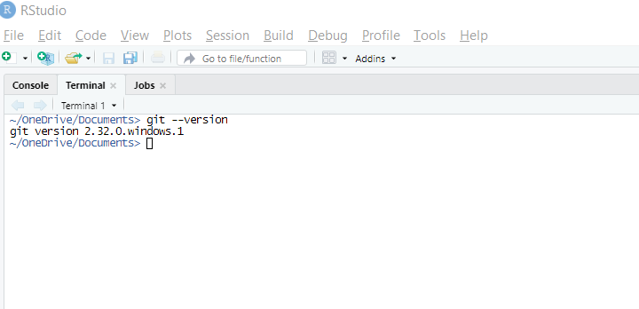
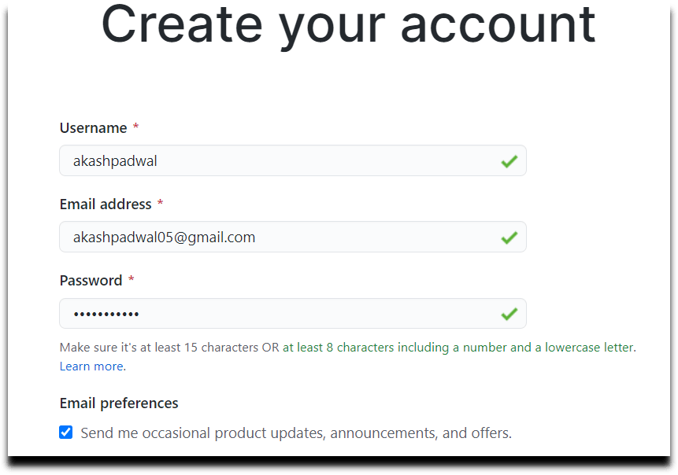
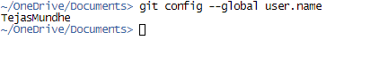
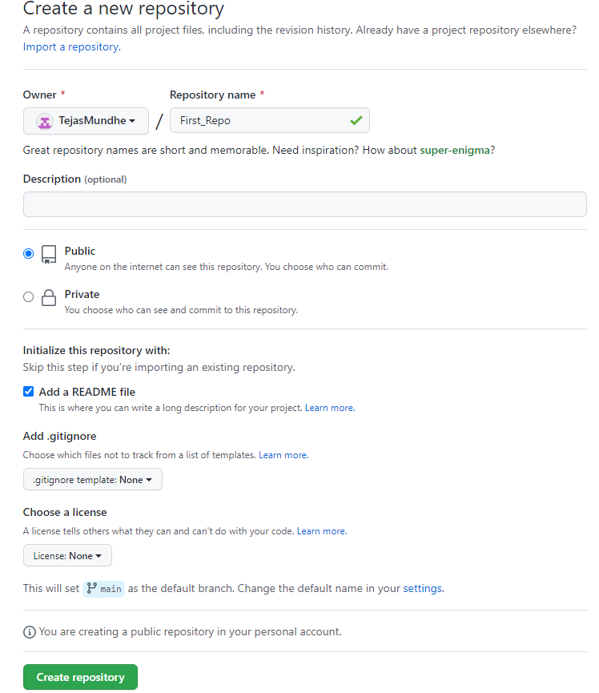
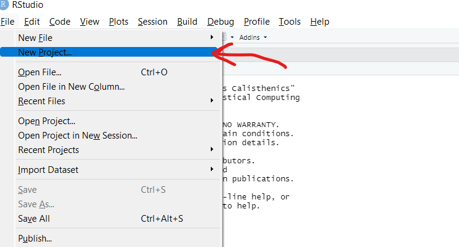
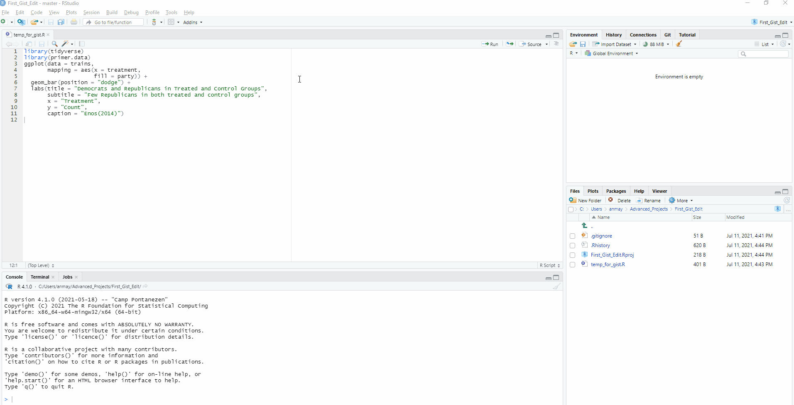

```{r setup, include = FALSE}
library(learnr)
library(primer.tutorials)
library(primer.data)
library(tidyverse)
library(knitr)
library(gistr)
knitr::opts_chunk$set(echo = FALSE)
options(tutorial.exercise.timelimit = 60, 
        tutorial.storage = "local")
```

```{r copy-code-chunk, child = "../../child_documents/copy_button.Rmd"}
```

```{r info-section, child = "../../child_documents/info_section.Rmd"}
```

<!-- Give short introduction to Terminal so that students are comfortable using it.  -->
<!-- Remove Overview section. -->
<!-- You own this tutorial! Fix the images. -->
<!-- Write Publish to RPubs section. Don't forget to add rsconnect to .gitignore. -->
<!-- Fix PR set up on Primer. -->
<!-- Remove unused images/ -->
<!-- Remove all references to the Terminal. Often, there are usethis functions which do the same. -->

## Introduction
###

Up until now, you have been programming awesome plots on your own computer. But what if you want to share and save them online, in case your computer blows up? Well, that's where tools like GitHub and RPubs come in.

###

This tutorial will walk you through a basic introduction of the terminal. Then it will show you the process of creating a Github account, and you'll finish by learning how to upload your first visualization onto the internet!

## Terminal Overview
### 
<!-- TM: To be completed, but keeping the terminal commands in tutorial for now. -->
We'll start by learning some basics about the [RStudio terminal](https://support.rstudio.com/hc/en-us/articles/115010737148-Using-the-RStudio-Terminal-in-the-RStudio-IDE). There is a full tutorial on this that you will be completing in the future.


### Exercise 1
On the left side of your RStudio session you should have the "Console" tab open. Next to this tab there should be a tab to enter the "Terminal". Click on this tab.

```{r out.width="875px"}

```

###
The terminal is a way for us to communicate directly with our computer using commands. We will enter our commands after the "prompt" which looks like a dollar sign.

###
Copy and paste the lines before the prompt below.

```{r terminal-1}
question_text(NULL,
    answer(NULL, correct = TRUE),
    allow_retry = TRUE,
    try_again_button = "Edit Answer",
    incorrect = NULL,
    rows = 2)
```


### Exercise 2

Enter the command `pwd` into the Terminal and hit return. This should return the folder that you are currently in, called your **P**resent **W**orking **D**irectory. 

```{r}
include_graphics("images/terminal_pwd.png")
```

###
Copy and paste the command and result into the box below.

```{r terminal-2}
question_text(NULL,
    answer(NULL, correct = TRUE),
    allow_retry = TRUE,
    try_again_button = "Edit Answer",
    incorrect = NULL,
    rows = 2)
```

###
Sometimes you'll need to change directories or list the files inside of your current directory. This is something you'll learn more about in the "Terminal" tutorial.

### Exercise 3
For the purposes of this tutorial you will often need to paste commands that are provided into the terminal, often beginning with `git--`. You'll then be asked to paste the command and result into the exercise answer box.

###
Practice by entering the command `echo $0` into the next line of the terminal. Paste the command and result into the box below.

```{r terminal-3}
question_text(NULL,
    answer(NULL, correct = TRUE),
    allow_retry = TRUE,
    try_again_button = "Edit Answer",
    incorrect = NULL,
    rows = 2)
```

###
Your answer will return the name of the "shell" you are currently using. The [shell](https://cfss.uchicago.edu/setup/shell/) works like a command interpreter, but for now just make sure something is returned. You should now be prepared to take on the rest of this tutorial!


## Setting up GitHub

### 

GitHub is, more or less, a Google Drive for all your R code and projects. In the professional world, what you have on your GitHub account is more important than what you have on your resume. It is a verifiable demonstration of your abilities.

### Exercise 1

Install [Git](https://git-scm.com/) by follow the instructions of the [Install Git](https://happygitwithr.com/install-git.html) chapter in *[Happy Git and GitHub for the useR](https://happygitwithr.com/)*.


### 

Run `git --version` in the *Terminal* to make sure that git is installed and accessible.

<!-- I don't think we need this -->

<!-- The Terminal tab will have a dollar sign (`$`) as the prompt. If it doesn't have that and instead uses an arrow (`>`), please visit [the HappyGitWithR tutorial](https://happygitwithr.com/rstudio-see-git.html). -->

```{r}

```

### 

Copy/paste the result of the git command into the space below.

```{r setting-up-github-1}
question_text(NULL,
    answer(NULL, correct = TRUE),
    allow_retry = TRUE,
    try_again_button = "Edit Answer",
    incorrect = NULL,
    rows = 2)
```

### 

If you want to learn more about Git and what it does, see *[Pro Git](https://git-scm.com/book/en/v2)*.

### Exercise 2

The next step is creating a GitHub account by following the instructions at the [GitHub mainpage](https://github.com/). Follow **[this advice](https://happygitwithr.com/github-acct.html#username-advice) when choosing your username.** 

```{r}

```

### 

Copy your GitHub profile URL in the field below. It should look like:

<https://github.com/your-username>

```{r setting-up-github-2}
question_text(NULL,
    answer(NULL, correct = TRUE),
    allow_retry = TRUE,
    try_again_button = "Edit Answer",
    incorrect = NULL,
    rows = 2)
```

### 

[Git](https://en.wikipedia.org/wiki/Git) is "software for tracking changes in any set of files, usually used for coordinating work among programmers collaboratively developing source code during software development." 

### Exercise 3

Now that you have your GitHub account, you need to connect it to RStudio. We can do this by first giving RStudio your GitHub account email and your name.

### 

Run `usethis::use_git_config(user.name = "your-username", user.email = "your@email.org")` in the Console, substituting the email and name you used for your GitHub account.

### 

Run `git config --global user.name` in the *Terminal* to make sure your computer remembers your GitHub username. Copy paste the command and result below.

```{r out.width="700px"}

```

```{r setting-up-github-3}
question_text(NULL,
    answer(NULL, correct = TRUE),
    allow_retry = TRUE,
    try_again_button = "Edit Answer",
    incorrect = NULL,
    rows = 2)
```

###

This should return the Username you made in exercise 1. Now run `git config --global user.email` in the *Terminal* to make sure your GitHub email is stored too.

Copy and paste the command and results to the space below.

```{r setting-up-github-4}
question_text(NULL,
    answer(NULL, correct = TRUE),
    allow_retry = TRUE,
    try_again_button = "Edit Answer",
    incorrect = NULL,
    rows = 2)
```

### 

Your GitHub username and email are stored so that your computer can automate a lot of the tedious actions required to communicate with GitHub. 

### 

**Note:** You cannot do the following sections of this tutorial if you did not get the outputs of your name and email associated with Github account for the last two exercises.

## GitHub Repositories

### 

GitHub is our Google Drive. GitHub repositories, or "repos", are the Google folders where we store our work. Let's make a practice repo!

### Exercise 1

To begin, sign into GitHub and go to the homepage. Click the green new button that says "New" on the left of the website.

```{r}
include_graphics("images/github_new_repo.png")
```

### Exercise 2

Name your repository "First_Repo". Then, select the "public" option for your repo and check the box saying "Add a README file". [README](https://en.wikipedia.org/wiki/README) is a document where programmers often add or explain details of their project. When in doubt follow [these instructions](https://happygitwithr.com/push-pull-github.html#make-a-repo-on-github).

After you've done that, go ahead and click "Create repository" to create your first repo!

```{r out.width="700px"}

```

###

Copy the url of your project page (the page which GitHub should have directed you to after creating the repo) and paste it below.

```{r github-repositories-2}
question_text(NULL,
    answer(NULL, correct = TRUE),
    allow_retry = TRUE,
    try_again_button = "Edit Answer",
    incorrect = NULL,
    rows = 2)
```

### 

The option of "public" means that anyone will be able to view the repository while only you can edit it. And you might have noticed "Add .gitignore" as another option. We will never check this box when creating a repo since RStudio will do it for us automatically.

### Exercise 3

The next step will be to create the exact same project in your local computer through the process of **cloning**. By having a local and a GitHub version, you can edit your project on your computer and send all the changes you've made to GitHub, so the GitHub version can be synced up with your local version.

To clone the repo, click on the green button that says "Code". Then copy the link shown. You can use the clipboard button on the right to automatically copy it.

```{r, out.width="875px"}
include_graphics("images/repo_clone.png")
```

Paste the link below.

```{r github-repositories-3}
question_text(NULL,
    answer(NULL, correct = TRUE),
    allow_retry = TRUE,
    try_again_button = "Edit Answer",
    incorrect = NULL,
    rows = 2)
```

###

This link points to your project folder stored in GitHub. It is slightly different from the url of the project page because the `.git` suffix shows it is a special GitHub object and not a webpage.

## Connecting GitHub to RStudio

### 

<!-- Liam: May need to restart the R session or R Studio to get .environ to work. Sys.getenv() was not working without this. -->

Now, we've created a new repository on GitHub.

Let's connect your `First_Repo` repository to RStudio.

### Exercise 1

Open a new RStudio session(separate from this tutorial). Go to File, then New Project.

```{r}

```

### Exercise 2

A window pops up. Select Version Control and then Git. It should look like the two images below.

```{r}
knitr::include_graphics("images/git_project_1.png")
knitr::include_graphics("images/git_project_2.png")
```

Paste the link you copied from GitHub into "Repository URL". Then, click on "Browse..." and find the folder you created for your R projects, which will be where you store the clone of `First_Repo`.

Then click "Create Project".

Navigate to the Terminal tab and run `git remote -v`. Then copy and paste both the command and the output into the space below. The output should contain the original link you pasted.

**Note:** If the output does not contain the link, try switching from Terminal to the Console tab and run `system("git remote -v")`. If the output still does not contain the link, stop the tutorial and **reach out on Discord**.

```{r connecting-github-to-2}
question_text(NULL,
    answer(NULL, correct = TRUE),
    allow_retry = TRUE,
    try_again_button = "Edit Answer",
    incorrect = NULL,
    rows = 2)
```

### 

You've successfully linked another repo to RStudio!

### Exercise 3

Now, you've linked your GitHub repo to your project, but you haven't proven that you are someone with editing access to the project. If we just let anyone with the GitHub link edit, that's obviously going to lead to problems with security down the line. This is when we use something known as a **P**ersonal **A**ccess **T**oken, or a **PAT**.

### 

A PAT is just a special computer-generated password between your computer and GitHub that lets GitHub connect your GitHub account and your computer together. If you want to learn more, see section "[Personal access token for HTTPS](https://happygitwithr.com/https-pat.html)" from *[Happy Git and GitHub for the useR](https://happygitwithr.com/)*

### 

Create a PAT by using the `usethis::create_github_token()` function in the Console. This should redirect you to a GitHub page about creating a PAT.

### 

Set the "Note" field to "My First PAT" and keep the scopes the same as the **default**. It should look something like the picture below (Doesn't have to be exact).

```{r, out.width="625px"}
include_graphics("images/pat.png")
```

### 

Press "Generate Token" at the bottom of the page to finalize your PAT.

### Exercise 4

Now that we've created our PAT, first temporarily copy and paste it somewhere you have easy access to (ex: notes). We will store it in several places in RStudio to make sure the computer doesn't forget.

### 

Run `gitcreds::gitcreds_set()` in the Console and follow the prompts, providing your token when asked.

### 

Now, restart your R session. Remember to do this in the session where your github repo is running, **not the session where the tutorial is**. Restart your R session by going to "Session" at the top bar, and then the option to Restart R should be under that tab. Then run `usethis::git_sitrep()` in the Console and copy-paste the result in the space below.

```{r connecting-github-to-4}
question_text(NULL,
    answer(NULL, correct = TRUE),
    allow_retry = TRUE,
    try_again_button = "Edit Answer",
    incorrect = NULL,
    rows = 2)
```

### 

It should look similar to this:

```{r}
include_graphics("images/sitrep.png")
```

If there are any errors, you may need to recreate your PAT and go through the process again. You can reach out on Discord for help if needed.

### Exercise 5

It's also a good idea to save your GitHub PAT to your `.Renviron` file. This is a file that stores information on your computer rather than on your project, making it a safe place to store sensitive information like your GitHub PAT or API keys.

### 

Run `usethis::edit_r_environ()` in the Console to open your `.Renviron` file. If you can't open the file, it's likely due to you using OneDrive or a cloud drive service to store your projects. **Please store your projects on your own computer in order to prevent future errors**.

### 

Add the line `GITHUB_PAT=` and your GitHub PAT in the first line of your .Renviron file and save. Make sure your PAT is surrounded with "quotes" because it is a string.

It should look something like this.

```{r}
include_graphics("images/save-pat.png")
```

### 

Run `Sys.getenv("GITHUB_PAT")` in the Console. Copy-paste the command and the output in the space below. If you are nervous about sharing your GITHUB_PAT, feel free to change it after your copy/paste it into the answer.

```{r connect-git-ex-5}
question_text(NULL,
    answer(NULL, correct = TRUE),
    allow_retry = TRUE,
    try_again_button = "Edit Answer",
    incorrect = NULL,
    rows = 2)
```

### 

Packages like `usethis` will read your .Renviron file and access the `GITHUB_PAT` variable, so make sure that you use the correct formatting and name your variables correctly.

## Updating .gitignore

### 

One thing you should always do when working with a new repo is updating the `.gitignore` file. You can open this file from the bottom right window under the Files tab. The purpose of `.gitignore` is to list all the files that you don't want to be uploaded to GitHub. This can come in handy when you are working with big datasets or files with private information.

###

### Exercise 1

Open the `.gitignore` and add `*.Rproj`. The `\*` tells your computer that we want to prevent all files ending in `.Rproj` from being uploaded. You could also just add `First_Repo.Rproj`.

```{r}
include_graphics("images/rproj.png")
```

### Exercise 2

Save the `.gitignore` file and on your top right panel, navigate to the Git tab. You should see `.gitignore` listed but not `First_Repo.Rproj`. The Git tab shows all the changes you have made on your local computer. Since you added `First_Repo.Rproj` in `.gitignore`, it shouldn't show up as one of the changed files that the GitHub version should be synced with.

If you do see `First_Repo.Rproj`, try clicking on the refresh button in the upper left or make sure you got it spelled right.

```{r}
include_graphics("images/updated_gitignore.png")
```

### 

Run `readLines(".gitignore")` in the Console. Copy and paste the command as well as the output into the space below.

```{r updating-gitignore-2}
question_text(NULL,
    answer(NULL, correct = TRUE),
    allow_retry = TRUE,
    try_again_button = "Edit Answer",
    incorrect = NULL,
    rows = 2)
```

### 

This should output all of the lines in your `.gitignore` file.

### Exercise 3

Now that we've updated our `.gitignore` file, we want to upload this new version to GitHub. Otherwise, GitHub doesn't know that we want to hide our `.Rproj` file.

### 

To do so, first check the checkbox next to the `.gitignore` file and then click on the `Commit` button in the Git tab.

```{r}
include_graphics("images/commit.png")
```

### 

This will open a new window where you will write a commit message. The message is meant to note what you're adding/changing within the repo. And yes it's mandatory.

### Exercise 4

Let's fill out this window.

### 

Check all of the boxes on the left-hand side. Then, write the commit message "Updated .gitignore" and press `Commit`.

<!-- TM: Add to close pop-up window that appears after pressing commit. -->
<!-- Image is weird, need to change to get rid of the `push` arrow. -->

```{r}
include_graphics("images/commit_push.png")
```

### 

Run `gert::git_log() |> select(-commit, -merge, -files) |> slice(1)`, which returns the author, time, and message of the last commit. If the error "could not find slice function" is thrown then load the library "dplyr" with `library(dplyr)` and try again.

Copy and paste the command and result into the space below.

```{r updating-gitignore-4}
question_text(NULL,
    answer(NULL, correct = TRUE),
    allow_retry = TRUE,
    try_again_button = "Edit Answer",
    incorrect = NULL,
    rows = 2)
```

### Exercise 5

Next, press `Push` with the green arrow on the top right. This pushes or uploads the files and changes to GitHub! Open up GitHub and refresh the project page to see your commit message at the top of your repo page.

### 

Run `gert::git_ahead_behind()$ahead` in the Console. Copy and paste the command and result below.

```{r updating-gitignore-5}
question_text(NULL,
    answer(NULL, correct = TRUE),
    allow_retry = TRUE,
    try_again_button = "Edit Answer",
    incorrect = NULL,
    rows = 2)
```

### 

This should return `0`, showing that you are 0 commits out of sync with the GitHub version.

## Publish to Rpubs Again

### 

Let's publish our project onto the internet again by using [RPubs](https://rpubs.com/).


### Exercise 1

First lets make an R Markdown file. In your current project(First_Repo) press File, New File, then R Markdown. Change the title to "Example" and keep the other fields as the default values. Save the file and name it `example.Rmd`.

###

Run `list.files()` in the Console and copy-paste the output below.

```{r preparing-to-publish-again-1}
question_text(NULL,
    answer(NULL, correct = TRUE),
    allow_retry = TRUE,
    try_again_button = "Edit Answer",
    incorrect = NULL,
    rows = 2)
```

###

You should see `example.Rmd` somewhere in the output.


### Exercise 2

Knit this RMarkdown file. A new window should open showing an example project. Knitting is the process of converting your RMarkdown file into HTML, the language used to make web-pages.

###

Run `list.files()` in the Console and copy-paste the output below. 

```{r preparing-to-publish-again-2}
question_text(NULL,
    answer(NULL, correct = TRUE),
    allow_retry = TRUE,
    try_again_button = "Edit Answer",
    incorrect = NULL,
    rows = 2)
```

###

`example.html` should be one of the files outputted.

### Exercise 3

Now press the `Publish` button in the top right corner of your knitted window. Choose `RPubs` and click "Publish". You should already have an account from the "RStudio and Code" tutorial. Name your document, and add a slug. Hit `Continue`.

```{r, out.width="875px"}
include_graphics("images/rpubs-5.png")
include_graphics("images/rpubs-8.png")
```

### Exercise 4

This should make your document accessible on the internet.

###

Copy paste the RPubs link in the answer box below.

```{r preparing-to-publish-again-4}
question_text(NULL,
    answer(NULL, correct = TRUE),
    allow_retry = TRUE,
    try_again_button = "Edit Answer",
    incorrect = NULL,
    rows = 2)
```

### Exercise 5

Finally, add the folder `rsconnect` to your `.gitignore` file and save it.

### 

Paste the output of `read_Lines(".gitignore")` in the box below.

```{r preparing-to-publish-again-5}
question_text(NULL,
    answer(NULL, correct = TRUE),
    allow_retry = TRUE,
    try_again_button = "Edit Answer",
    incorrect = NULL,
    rows = 2)
```
### 

You should see `rsconnect` somewhere in the output.

###

Nice work! You've created another RPubs page.

## Gists
### 

So far we've been working out of GitHub repos. And while these are extremely useful, they're way too big if we just want to share some code with a friend or put a small code snippet on the web. That's where gists come in, similar to "Mini repos".

### 

Think of it like sending a text versus sending an email. It's not optimal to attach a lot of files (or really anything that's not an image) to a text, but that perfectly suits emailing. On the other hand, it's not very useful to send a 7 word email to somebody when you could have just texted them the same thing.


### Exercise 1

In order to create gists using R, we need to download the **gistr** package. While you can create gists through GitHub, using **gistr** is a lot quicker and is more convenient.

### 

Run `install.packages("gistr")` in the Console. Then run `library(gistr)`.

### 

In the Console tab, run `search()` and copy-paste the output into the space below.

```{r gists-1}
question_text(NULL,
    answer(NULL, correct = TRUE),
    allow_retry = TRUE,
    try_again_button = "Edit Answer",
    incorrect = NULL,
    rows = 2)
```

### 

You should now see "package:gistr" somewhere in the output.

### Exercise 2

Press File, then "Open File". Navigate to your R Projects folder and find your project from the "RStudio and Code" tutorial. Open the `FirstRScript.R` file by double clicking.

Let's try to publish our `FirstRScript.R` file as a Gist. We can do this by using the `gist_create()` function in the **gistr** package.

### 

Run `gist_create("FirstRScript.R")` in the Console. This should bring you to a GitHub page.

```{r, out.width="875px"}
include_graphics("images/gist_create.png")
```

### 

And that's it! This is the finished gist. Copy the URL of the gist into the box below.

```{r gists-2}
question_text(NULL,
    answer(NULL, correct = TRUE),
    allow_retry = TRUE,
    try_again_button = "Edit Answer",
    incorrect = NULL,
    rows = 3)
```

### 

This is how you can share R code between different people. Just send the link to the gist and they'll be able to use it like a normal repository but only for that one code file. It's quick and easy!

### Exercise 3

Now, a notable feature of gists is the fact that they can be used to display code. Websites like [Medium](https://medium.com/@alenanikulina0/embed-github-gists-in-medium-beginner-friendly-718ea8dce176) often use this to clearly display and format code in articles.

<!-- =html tag is used to render the gist in the tutorial, I have adjusted test-code-chunks.R to allow =html to pass -->

```{=html}
<script src="https://gist.github.com/AnmayG/7bbbddbb38855e7c25fce5d5e8b1a461.js"></script>
```

### 

In the top right of the Gists webpage, you should see a box that allows you to copy something that looks like this:

`<script src="https://gist.github.com/YourUserName/7bbbddbb38955e7c25fce5d5e8b1a461.js"></script>`

This is how you would embed a Gist (like the one above) into an R Markdown file or something similar. You can just copy that code into your R Markdown file (you don't need to use a code chunk), and it would show the Gist like it does above.

### 

Copy and paste that stretch of code into the box below.

```{r gists-3}
question_text(NULL,
    answer(NULL, correct = TRUE),
    allow_retry = TRUE,
    try_again_button = "Edit Answer",
    incorrect = NULL,
    rows = 3)
```

### 

This make Gists very useful for displaying code in your website.

### Exercise 4

But what if you want to edit a gist and add new files to it? This is where gists really shine because they're the same thing as a normal repository, just a lot more lightweight. Let's try to add the image of our graph to our gist.

### 

We first need to pull the gist into R so that we can edit it. We can do this just like we would a normal repository: by copying the HTTPS link and pulling it into RStudio.

### 

let's walk through this. In the top right corner, there is a dropdown menu labeled "Embed". Click that, then click "Clone via HTTPS".

```{r, out.width="875px"}
include_graphics("images/gist_clone.gif")
```

### 

Copy and paste that URL into the box below.

```{r gists-4}
question_text(NULL,
    answer(NULL, correct = TRUE),
    allow_retry = TRUE,
    try_again_button = "Edit Answer",
    incorrect = NULL,
    rows = 3)
```

### 

This should be a URL similar to the one that we used to copy our GitHub repository, but for Gists instead.

### Exercise 5

Now just use that link to create a new RStudio Project like we did with the GitHub repositories. Rename the project to `First_Gist_Edit`.

```{r, out.width="875px"}
include_graphics("images/gist_proj.gif")
```

### 

Run `list.files()` in the Console and copy-paste the output into the box below.

```{r gists-5}
question_text(NULL,
    answer(NULL, correct = TRUE),
    allow_retry = TRUE,
    try_again_button = "Edit Answer",
    incorrect = NULL,
    rows = 3)
```

### 

This should contain your R Script file and a .gitignore file, among others. Remember to update the `.gitignore` file to ignore the `.Rproj` file so that you don't upload it to your Gist.

### Exercise 6

Now let's add a picture of our graph to the Gist. We can do this by saving the graph produced by our R Script file as an image.

### 

First, run the R Script file so that the graph shows up in the Plots tab in the bottom right. You should then be able to click "Export" and follow the steps to save the graph as a PNG file. Name the file `graph.png` and **save it in your gist project folder**.

```{r, out.width="875px"}

```

### 

Run `list.files()` in the Console then copy-paste the command and the output into the box below.

```{r gists-6}
question_text(NULL,
    answer(NULL, correct = TRUE),
    allow_retry = TRUE,
    try_again_button = "Edit Answer",
    incorrect = NULL,
    rows = 3)
```

### 

This should contain the PNG file that you just saved.

### Exercise 7

Now let's push our graph into the Gist.

### 

Go to the Git tab, then commit the `graph.png` file by pressing the "Commit" button and checking the boxes. Write a meaningful message like "added graph.png".

### 

Run `gert::git_ahead_behind()$ahead` in the Console, then copy-paste the command and the output into the box below.

```{r gists-7}
question_text(NULL,
    answer(NULL, correct = TRUE),
    allow_retry = TRUE,
    try_again_button = "Edit Answer",
    incorrect = NULL,
    rows = 3)
```

### 

This should return `1` to signify that your computer is 1 commit ahead of the Gist. Let's fix that by pushing our changes.

### Exercise 8

As we went over earlier, pushing uploads the files on your computer to GitHub.

### 

Press the green "Push" arrow to push the files. GitHub here will prompt for your username and password, which might seem weird at first because we should have already linked our GitHub account to RStudio.

This is due to RStudio misinterpreting GitHub Gist with the website of gist.github.com as separate from GitHub with the website of github.com.

So enter your GitHub username for username and Personal Access Token for password (**retrieve your PAT with `usethis::edit_r_environ()`**).

Then go to your Gist tab and reload.

```{r, out.width="875px"}
include_graphics("images/gist_push.gif")
```

### 

Run `gert::git_ahead_behind()$ahead` in the Console, then copy-paste the command and the output into the box below.

```{r gists-8}
question_text(NULL,
    answer(NULL, correct = TRUE),
    allow_retry = TRUE,
    try_again_button = "Edit Answer",
    incorrect = NULL,
    rows = 3)
```

### 

This should return `0` to signify that your computer and GitHub have the same files. Congratulations on successfully creating and editing your Gist.

### 

When it comes to gists, there's one rule to follow:

> **Use a gist to display one or two files and use a repository to store your entire project.**

This is the basic guideline when it comes to storing your files on GitHub and sharing them with other people.

On a website called [Liquid Web](https://www.liquidweb.com/), you can find a [more detailed walkthrough](https://www.liquidweb.com/kb/little-known-ways-to-utilize-github-gists/) on how to create gists through GitHub.

<!-- ## Using GitHub -->

<!-- ### -->

<!-- AG: Graduation case study begins here -->

<!-- For the last part of the tutorial, let's go over using GitHub to download somebody's work and tinker with it ourselves. -->

<!-- ### -->

<!-- AG: Need to build case study repo, then include the information about forking and a link to HappyGitWithR -->

## Summary

Good work on finishing this tutorial! You now know how to make a GitHub repo, and connect it RStudio. From there you can commit and push your files to save your work online, and even make Gists to share lightweight code and images!

```{r download-answers, child = "../../child_documents/download_answers.Rmd"}
```
