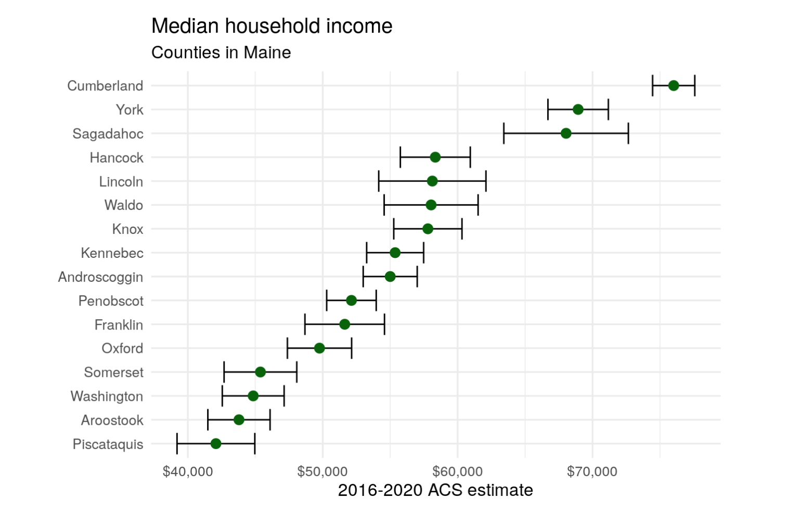
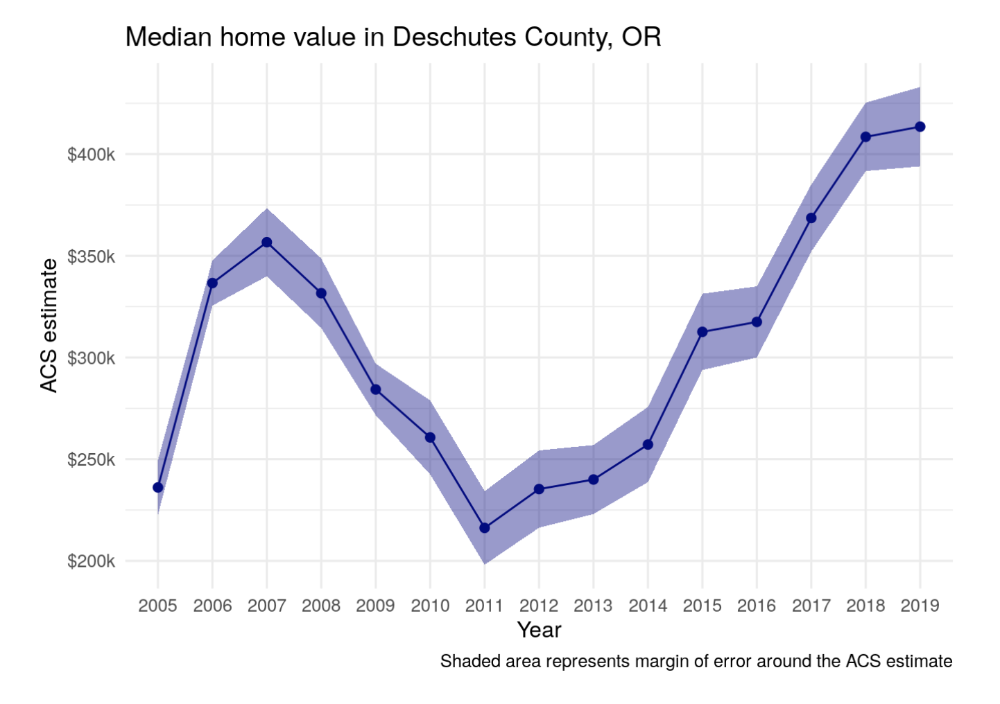
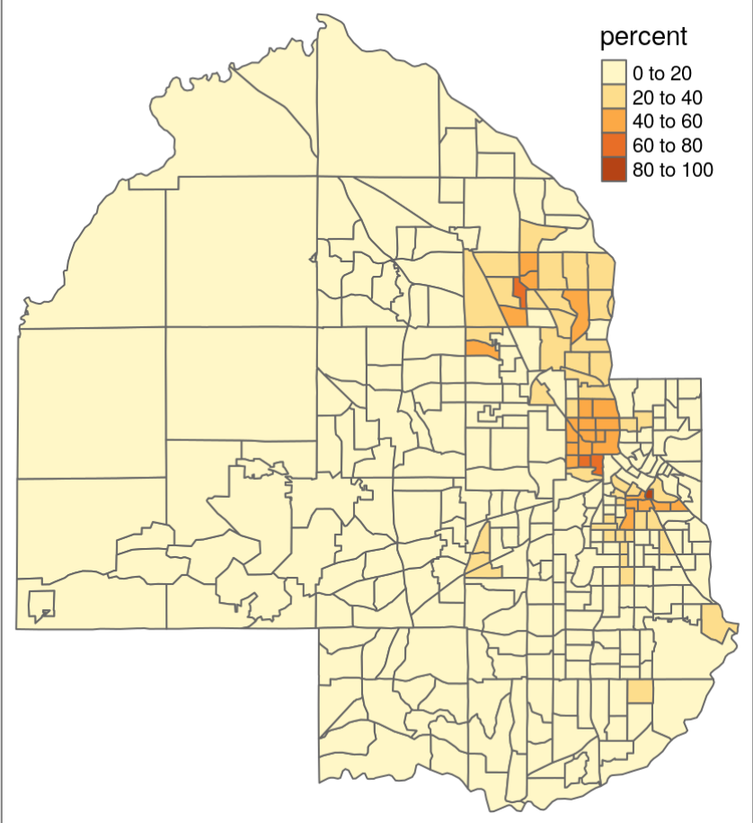
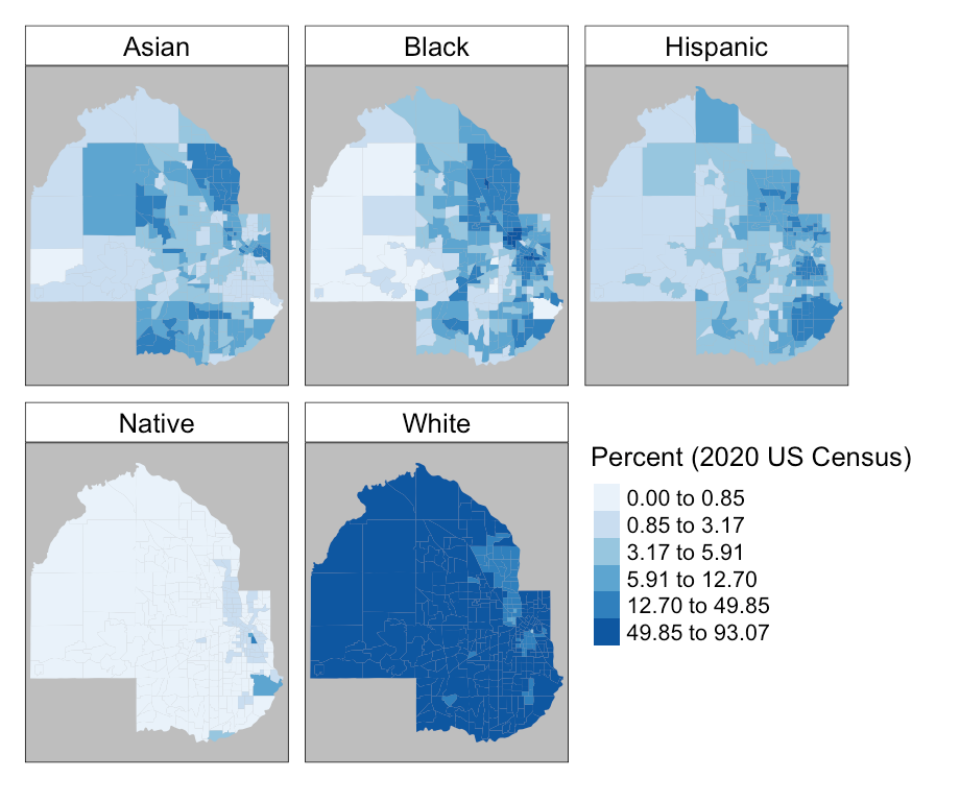
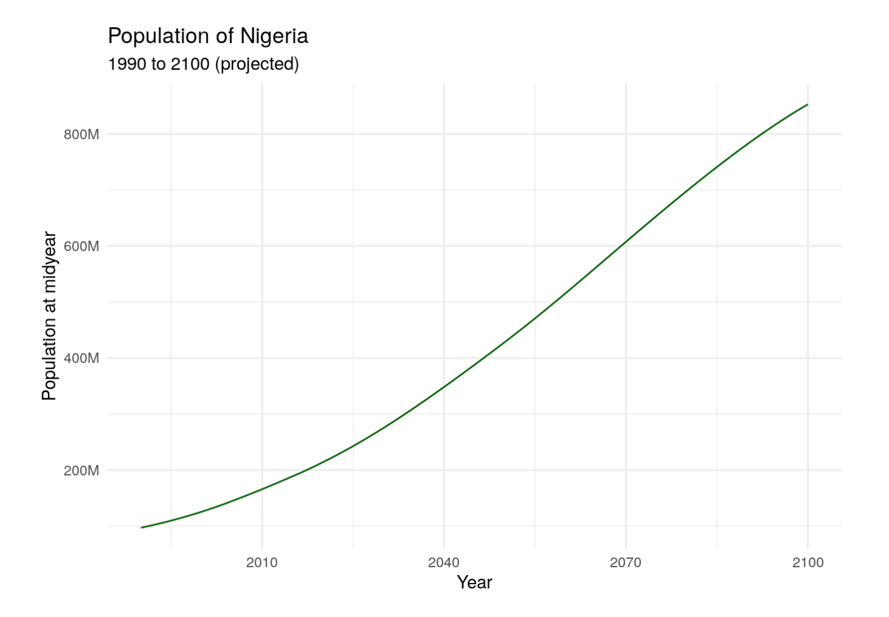

```{r setup, include = FALSE}
library(learnr)
library(all.primer.tutorials)
library(tidyverse)
library(stringr)
library(primer.data)
library(tidycensus)
library(ipumsr)
library(ggthemes)
library(knitr)
library(stringr)
library(tigris)
library(tmap)
library(mapview)
library(leaflet)
library(ggplot2)
library(patchwork)
library(glue)
library(idbr)
library(ggiraph)
library(purrr)
library(sf)
knitr::opts_chunk$set(echo = FALSE)
options(tutorial.exercise.timelimit = 60, 
        tutorial.storage = "local",
        tigris_use_cache = TRUE) 


# Center the tutorial around this book: https://walker-data.com/census-r/index.html

st <- states(year = 2019)

dc_income <- read_rds("data/dc_income.rds") 

us_median_age <- read_rds("data/us_median_age.rds") 

hennepin_race <- read_rds("data/hennepin_race.rds") 

dallas_bachelors <- read_rds("data/dallas_bachelors.rds") 


hennepin_black <- hennepin_race |> 
  filter(variable == "Black")
 
pal <- colorNumeric(
  palette = "magma",
  domain = dallas_bachelors$estimate
)

fertility_data <- read_rds("data/fertility_data.rds")

fertility_data$tooltip <- paste0(fertility_data$name, ": ", 
                                 round(fertility_data$tfr, 2))

## Needed for chapter 4 - margin of error

years <- 2005:2019

```

```{r copy-code-chunk, child = "../../child_documents/copy_button.Rmd"}
```

```{r info-section, child = "../../child_documents/info_section.Rmd"}
```


<!-- MH: The newest Census Data (2021) comes out Dec. 8, I think I will use that, but I will have to wait for a while -->

## Introduction

Let's learn how to access, work with and map data from the US Census. We (mostly) follow the approach of [*Analyzing US Census Data: Methods, Maps, and Models in R*](https://walker-data.com/census-r/index.html) by Kyle Walker. If you would like to work more with census data, follow Walker's advice closely.

## Accessing the Census API
### 

Before we can start mapping, we need to gain access to the Census API.

### Exercise 1

We will access the US Census API via the **tidycensus** package. The **tidycensus** package utilizes an API key to access Census data.

### 

Load the **tidycensus** package into your R session.

### 

Run `search()` in the Console to see the libraries that you've currently loaded. CP/CR.

```{r accessing-the-census-1}
question_text(NULL,
    answer(NULL, correct = TRUE),
    allow_retry = TRUE,
    try_again_button = "Edit Answer",
    incorrect = NULL,
    rows = 3)
```

### 

The output should include the string "package:tidycensus". Kyle Walker is also the author of the **[tidycensus](https://walker-data.com/tidycensus/)** package.

### Exercise 2

Now that we have the package needed to access the Census database, we need to get an API key. 

###

An API key is basically a password for an API, but they often come with certain restrictions. For example, the Census API only allows you to collect 50 variables (or columns) from a database at a time. 

### 

Visit [https://api.census.gov/data/key_signup.html](https://api.census.gov/data/key_signup.html) and request an API key. Use your school or other organization name for the `Organization Name` field. Follow the steps and verify your API key via email. 

### 

Copy and paste your API key into the box below. If you don't want to share your API key, change a few letters to make it different after you have pasted it into the box.

```{r accessing-the-census-2}
question_text(NULL,
    answer(NULL, correct = TRUE),
    allow_retry = TRUE,
    try_again_button = "Edit Answer",
    incorrect = NULL,
    rows = 3)
```

### 

While an API key isn't mandatory for accessing the Census, it allows you to do more requests and use multiple computers to collect data. It's  also necessary for using the **tidycensus** package.

### Exercise 3

You may remember putting your GitHub Personal Access Token into your `.Renviron` file for safekeeping. We'll be doing the same for our Census API key, but the process looks a little bit different.

### 

The **tidycensus** package makes the process much simpler. Run `census_api_key("YOUR API KEY HERE", install = TRUE)` in the Console, substituting your API key in the field.

This should save your key into your `.Renviron` file. Restart your R session.

### 

Run `Sys.getenv("CENSUS_API_KEY")` in the Console. Copy-paste the command and the output in the space below. 

```{r accessing-the-census-3}
question_text(NULL,
    answer(NULL, correct = TRUE),
    allow_retry = TRUE,
    try_again_button = "Edit Answer",
    incorrect = NULL,
    rows = 2)
```

### 

This should contain your Census API key. If you want to see where the key is stored, run `usethis::edit_r_environ()` in the Console. It should open up your `.Renviron` file and show you all of the keys that you have stored there so far. Make sure to close this file after every usage, for it stores very sensitive information that you don't want to accidentally alter or delete. 


## Getting data 

### 

The Census API works by accessing Census databases and tables. We can find these tables by visiting [data.census.gov](data.census.gov). We will learn how to access data from the **American Community Survey**, the **Decennial Census**, and the **Population Estimates Program** in this section. 

### Exercise 1

Let's try accessing the Decennial Census database. In order to do this, we'll use the `get_decennial()` function with the `geography`, and `variables` arguments.

### 

Let's try to find the total American population by state. First of all, we need to access the variable containing these populations, which is `P001001`.

### 

Run `get_decennial()` below setting `geography` to  `"state"`, and `variables` to `"P001001"`.

```{r getting-data-1, exercise = TRUE}

```

```{r getting-data-1-hint-1, eval = FALSE}
get_decennial(... = "...", 
              variables = "...")
```

### 

This should return a tibble with 52 rows and 4 columns, and should start like the image below.

```{r}
include_graphics("images/first_decennial.png")
```

### 

The `geography` argument determines the scope of the data (such as `us` for the entire country and `county` for counties), and the `variables` argument defines which variables you want to use.

### Exercise 2

`get_decennial()` has a default value for the `year` argument, which is `2010`. Copy and paste your code from above and add the `year` argument, and set it to `2020`. Change the `variables` argument to `"P1_001N"`, because the `"P001001"` was renamed starting in 2020.

```{r getting-data-2, exercise = TRUE}

```

<button onclick = "transfer_code(this)">Copy previous code</button>

```{r getting-data-2-hint-1, eval = FALSE}
get_decennial(... = "...", 
              variables = "...",
              year = ...)
```

### 

By changing the `year` argument, we can specify when we want our data to be from. 

### Exercise 3

Along with the arguments we have already learned, there is also the `sumfile` argument, or "summary file". 

### 

Run the `get_decennial()` function below setting `geography` to `"state"`, `variables` to `"P1_005N"`, `year` to `2020`, and `sumfile` to `"pl"`.

<!-- AG: I'm not planning on breaking up API requests into different exercises since there is a limit. Plus a bad API request will make you load gigabytes onto your computer and take forever. -->


```{r getting-data-3, exercise = TRUE}

```

<button onclick = "transfer_code(this)">Copy previous code</button>

```{r getting-data-3-hint-1, eval = FALSE}
get_decennial(geography = "...",
        variables      = "...",
        year = ...,
        sumfile = "..."
)
```

### 

This retrieves information on the American Indian & Alaska Native population by state from the 2020 decennial Census. The `pl` summary file is one type that is a limited subset of variables from the decennial US Census to be used for legislative redistricting. 

To learn more about the `sumfile`, we again recommend Walker's [book](https://walker-data.com/census-r/an-introduction-to-tidycensus.html#getting-started-with-tidycensus).

### Exercise 4

Just as `get_decennial()` gets information from the Decennial Census, `get_acs()` gets information from the **A**merican **C**ommunity **S**urvey. 

### 

Run the `get_acs()` function setting `geography` to  `"state"`, `variables` to `"B05006_150"` and `year` to `2020`.

```{r getting-data-4, exercise = TRUE}

```

```{r getting-data-4-hint-1, eval = FALSE}
get_acs(geography = "...",
        variables      = "...",
        year = ...
)
```

### 

The example above fetches data on the number of residents born in Mexico by state. Notice that the tibble produced has an `estimate` and a `moe` column rather than a `value` column like the Decennial Census data. 

<!-- DK: Awkward. -->

**This is important.**

### Exercise 5

Along with the arguments, we've already learned, there is also a `survey` argument. This argument defaults to 5 year periods if not specified. We can change it to a one-year period rather than a default 5-year period by adding `survey = "acs1"`.

### 

Run `get_acs` below setting `geography` to `"state"`, `variables` to `"B05006_150"`, `survey` = `"acs1"`, and `year` to `2019`.


```{r getting-data-5, exercise = TRUE}

```

<button onclick = "transfer_code(this)">Copy previous code</button>

```{r getting-data-5-hint-1, eval = FALSE}
get_acs(... = "...", 
        variables = "...", 
        survey = "...",
        ... = 2019)
```

### 

The above function yields data on the number of residents born in Mexico by state in the year of just 2019 instead of a 5-year period as earlier. 

### 

Notice the the GEOID column contains the [FIPS code](https://transition.fcc.gov/oet/info/maps/census/fips/fips.txt#:~:text=FIPS%20codes%20are%20numbers%20which,to%20which%20the%20county%20belongs.) of the area the data covers. This code is a standardized way to identify different geographical areas. It gets larger as the area under consideration narrows. The FIPS for Massachusetts is 25. For Middlesex County within Massachusetts, the FIPS is 25017.


### Exercise 6

Rather than using the `variables` argument, you can supply a table name to the `table` parameter in `get_acs()`; this will return data for every variable in that table. 

Run `get_acs()` below setting `geography` to `"state"`, `table` to `"B01001"`, and `year` to `2020`

```{r getting-data-6, exercise = TRUE}

```

<button onclick = "transfer_code(this)">Copy previous code</button>

```{r getting-data-6-hint-1, eval = FALSE}
get_acs(... = "...", 
        table = "...",
        ... = ...)
```

### 

This code got all variables associated with table `B01001`, which covers sex broken down by age, from the 2016-2020 5-year ACS.

### Exercise 7

What if we want to analyze a variable at the county level, but only in one state? We can use the `state` argument along with the geography argument.

### 

Run `get_acs()` below setting `geography` = `"county"`, `variables` to `"B19013_001"`, `state` to `"WI"`, and `year` to `2020`


```{r getting-data-7, exercise = TRUE}

```

<button onclick = "transfer_code(this)">Copy previous code</button>

```{r getting-data-7-hint-1, eval = FALSE}
get_acs(... = "...", 
        variables = "...", 
        ... = "WI",
        year = ...)
```

### 

The example above returns average household income by county, but only in the state of Wisconsin. When using the `state` argument, you can use the state name (`"Wisconsin"`), the state postal code (`"WI"`), or the FIPS code (`"55"`).

### Exercise 8

Smaller geographies, such as Census tracts, can be subsetted as well by the `county` argument. 

Run `get_acs()` below setting `geography` = `"tract"`, `variables` to `"B19013_001"`, `state` to `"WI"`, `county` to `"Dane"`, and `year` to `2020`

```{r getting-data-8, exercise = TRUE}

```

<button onclick = "transfer_code(this)">Copy previous code</button>

```{r getting-data-8-hint-1, eval = FALSE}
get_acs(geography = "...", 
        variables = "...", 
        state = "...", 
        ... = "Dane",
        ... = ...)
```

### 

The above code retrieves the average household income for every tract in Dane County in Wisconsin. Subsetting is extremely useful, as it allows you to download only the data which is relevant to you.

### Exercise 9

Let's switch gears. What if we don't know what a variable ID means; after all, they're just a bunch of letters and numbers.

Luckily, the **tidycensus** packages offers the `load_variables()` function. 

Run `load_variables()` setting `year` to `2016`, and `dataset` to `"acs5"`

```{r getting-data-9, exercise = TRUE}

```

<button onclick = "transfer_code(this)">Copy previous code</button>

```{r getting-data-9-hint-1, eval = FALSE}
load_variables(year = ..., dataset = "...")
```


###

Notice the "label" and "concept" columns, providing information about each variable. To learn more about `load_variables()` and its arguments, click [here](https://walker-data.com/census-r/an-introduction-to-tidycensus.html#searching-for-variables-in-tidycensus). 

### Exercise 10

Now we may know what a variable name means, but it's probably pretty annoying to type that every, single time you need it. So how can we rename it?

Run `get_acs()` below setting `geography` to `"county"`, `state` = `"Georgia"`, `variables` to a vector containing `medinc` which is assigned to `"B19013_001"` and `medage` which is assigned to `"B01002_001"`, and `year` to `2020`.  

```{r getting-data-10, exercise = TRUE}

```

<button onclick = "transfer_code(this)">Copy previous code</button>

```{r getting-data-10-hint-1, eval = FALSE}
get_acs(geography = "...",
        state = "...",
        ... = c(medinc = "...",
                      medage = "..."),
        year = ...)
```

### 

In the variable column, the values are "medinc" and "medage", not the complex ones we imported. 

### Exercise 11

Now, let's learn about `get_estimates()`.
This gets data from the **Population Estimates Program** (PEP). 

Run `get_estimates` below setting `geography` to `"county"`, `product` to `"components"`, `state` to `"NY"`, `county` to `"Queens"`, and `year` to `2019`

```{r getting-data-11, exercise = TRUE}

```

<button onclick = "transfer_code(this)">Copy previous code</button>

```{r getting-data-11-hint-1, eval = FALSE}
get_estimates(geography = "...",
              product = "...",
              ... = "...",
              county = "...",
              ... = ...)
```

### 

The code above requested all components of change population estimates for 2019 for Queens County in NY. 

The confusing part of this function is probably the `product` argument, which essentially allows the user to access the indicators used to produce the intercensal population estimates. 

Learn more about `get_estimates()` and its arguments [here](https://walker-data.com/census-r/an-introduction-to-tidycensus.html#other-census-bureau-datasets-in-tidycensus)

### Exercise 12

`get_flows()` allows for analysis of immigrants, emigrants, and net migration for a given geography using data from a given 5-year ACS sample.

Run `get_flows()` below setting `geography` to `"county"`, `state` to `"HI"`, `county` to `"Honolulu"`, and `year` to `2019`

```{r getting-data-12, exercise = TRUE}

```

<button onclick = "transfer_code(this)">Copy previous code</button>


```{r getting-data-12-hint-1, eval = FALSE}
get_flows(geography = "...",
          ... = "...",
          county = "...",
          ... = ...)
```

### 

This should return a tibble with 6 columns, one of them being "variable". We can see variables such as "MOVEDIN" and the corresponding estimate of 152 as the number of people who moved from Africa (look at the `FULL2_NAME` variable) to Honolulu in 2019

### 

Congrats! You now have the necessary skills to pull all kinds of data from the [US Census Bureau](https://www.census.gov/).


## Margin of error

In this section, we are going to learn what a margin of error (moe) is, and how we can analyze and visualize it.

### Exercise 1

Run `get_acs()` below setting `geography` to `"county"`, `state` to `"Rhode Island"`, `variables` to `"B19013_001"` (median household income), and `year` to `2020`.

```{r margin-of-error-1, exercise = TRUE}

```

<button onclick = "transfer_code(this)">Copy previous code</button>

```{r margin-of-error-1-hint, eval = FALSE}
get_acs(geography = "...",
        state = "...",
        variables = "B19013_001",
        year = ...)
```

###

Look at the `estimate` column. Unlike the Decennial Census, the American Community Survey uses samples. This means they might only ask 20 people for their household income. Based on the statistical variables taken from that sample, they can **estimate** the true **population parameter**. 

Examples of a population parameter include: mean age of the US, proportion of college students in the US, etc. 

###

Because we are estimating, we can cast a 'safety net' per say, or something to give us a little wiggle room if we're wrong. So along with our estimate, we give ourselves a **margin of error**.

The estimate plus or minus the margin of error is known as a **confidence interval**. Let's explore that. 

### Exercise 2

Copy/paste your code from above. Add the `moe_level` argument and set it to `95`.

```{r margin-of-error-2, exercise = TRUE}

```

<button onclick = "transfer_code(this)">Copy previous code</button>

```{r margin-of-error-2-hint, eval = FALSE}
get_acs(geography = "...",
        state = "...",
        variables = "...",
        year = ...,
        moe_level = 95)
```

###

The estimate remains constant, but the margin of error changes... why?

###

Every confidence interval comes with a **confidence level**. When we import data from the ACS, this level defaults to 90%, but we changed it to 95% just now.

### Exercise 3

Copy/paste your code from above and change the `moe_level` from `95` to `99`.

```{r margin-of-error-3, exercise = TRUE}

```

<button onclick = "transfer_code(this)">Copy previous code</button>

```{r margin-of-error-3-hint, eval = FALSE}
get_acs(geography = "...",
        state = "...",
        variables = "...",
        year = ...,
        moe_level = 99)
```

###

The `moe` column changed again.

###

When the confidence level is 99%, it means that 99 out of 100 times, the population parameter (in this case median household income) will fall between the confidence interval's upper bound and lower bound. 

In the examples earlier, as confidence level increased, so did margin of error because if your interval is larger, it makes more sense that there is a higher chance that the true population parameter falls within it.

### Exercise 4

Copy/paste the code from Exercise 3 and run it without any changes.

```{r margin-of-error-4, exercise = TRUE}

```

<button onclick = "transfer_code(this)">Copy previous code</button>

###

Let's look at the first column. The estimate is 85413,	and the margin of error is 9527.246. So the bottom bound of this interval is 85413 - 9527.246 (75,885.75) and the upper bound is 85413 + 9527.246 (94,940.25). 

The final interval is (75.885.75, 94,940.25) which is saying that the mean household income for Bristol County is between \$75.885.75 and \$94,940.25.

###

You can learn more about a margin of error and some related functions [here](https://walker-data.com/census-r/wrangling-census-data-with-tidyverse-tools.html#handling-margins-of-error-in-the-american-community-survey-with-tidycensus).

### Exercise 5

So now that we have an idea of what a confidence interval and a margin of error is, let's visualize it.

We are going to create this graph:

```{r}

```


###

Run `get_acs()` below setting `state` to `"Maine"`, `geography` to `"county"`, `variables` to `c(hhincome = "B19013_001")` (remember we can rename variable names by doing it in a vector), and `year` to `2020`.

```{r margin-of-error-5, exercise = TRUE}

```

<button onclick = "transfer_code(this)">Copy previous code</button>

```{r margin-of-error-5-hint, eval = FALSE}
get_acs(state = "...",
        geography = "...",
        variables = c(hhincome = "..."),
        year = ...)
```

###

This gives you your data, but the `NAME` column is somewhat annoying because it includes "County" and "Maine". We already know that they are counties in Maine so let's clean it up.

### Exercise 6

Copy/paste your code from last exercise. Pipe it into `mutate()`. Inside `mutate()`, set the `NAME` column to `str_remove(NAME, " County, Maine")`.

```{r margin-of-error-6, exercise = TRUE}

```

<button onclick = "transfer_code(this)">Copy previous code</button>

```{r margin-of-error-6-hint, eval = FALSE}
get_acs(state = "...",
        geography = "...",
        variables = c(hhincome = "..."),
        year = ...) |> 
  mutate(NAME = str_remove(NAME, " County, Maine"))
```

###

The `str_remove()` function looked at the `NAME` column (1st argument) and removed the text that was specified in the second argument. This is an extremely useful wrangling tool.

### Exercise 7

Copy/paste your code from above and pipe it into `ggplot()`. Set `x` to `estimate` and `y` to `reorder(NAME, estimate)`.

```{r margin-of-error-7, exercise = TRUE}

```

<button onclick = "transfer_code(this)">Copy previous code</button>

```{r margin-of-error-7-hint, eval = FALSE}
... |> 
  ggplot(aes(x = ..., y = reorder(NAME, estimate)))
```

###

By reordering the names on the y-axis based on their estimate value, we can see a clear trend line instead of a bunch of random points in random counties.

### Exercise 8

We can graph the actual estimate points with `geom_point()`. Add this layer setting `size` to `3` and `color` to `"darkgreen"`.

```{r margin-of-error-8, exercise = TRUE}

```

<button onclick = "transfer_code(this)">Copy previous code</button>

```{r margin-of-error-8-hint, eval = FALSE}
... +
  geom_point(size = ..., color = "...")
```

###

Now comes the new part.

### Exercise 9

We can plot error bars for the margin of error by using `geom_errorbar()`.

###

Add the `geom_errorbar()` layer setting `xmin` to `estimate - moe` and `xmax` to `estimate + moe`. You will need to do this inside `aes` because you are mapping it to the graph.

```{r margin-of-error-9, exercise = TRUE}

```

<button onclick = "transfer_code(this)">Copy previous code</button>

```{r margin-of-error-9-hint, eval = FALSE}
... +
  geom_errorbar(aes(xmin = estimate - moe,
                    xmax = estimate + moe))
```

###

This added the errorbars to our graph as you can see. Let's continue customization.

### Exercise 10

Add the `theme_minimal()` layer setting `base_size` to `12.5`.

```{r margin-of-error-10, exercise = TRUE}

```

<button onclick = "transfer_code(this)">Copy previous code</button>

```{r margin-of-error-10-hint, eval = FALSE}
... +
  theme_minimal(base_size = ...)
```

###

Let's fix our x-axis.

### Exercise 11

Well, I guess you could say "make better" instead of fix. We should add dollar signs to signify that this represents money.

###

Add the `scale_x_continuous()` layer setting `labels` to `scales::label_dollar()`.

```{r margin-of-error-11, exercise = TRUE}

```

<button onclick = "transfer_code(this)">Copy previous code</button>

```{r margin-of-error-11-hint, eval = FALSE}
... +
  scale_x_continuous(labels = scales::label_dollar())
```

###

Notice the dollar signs on the x-axis now. 

### Exercise 12

Add the appropriate labels. Remember, our graph should look like this:

```{r}

```


```{r margin-of-error-12, exercise = TRUE}

```

<button onclick = "transfer_code(this)">Copy previous code</button>

```{r margin-of-error-12-hint, eval = FALSE}
... + 
  labs(...)
```

###

Nice! We just visualized margin of error... but at one moment in time. Let's see how we can observe it over time.

### Exercise 13

We are going to create this plot:

```{r}

```


Create a vector named `years` that goes from `2005` through `2019`

```{r margin-of-error-13, exercise = TRUE}

```

<button onclick = "transfer_code(this)">Copy previous code</button>

```{r margin-of-error-13-hint, eval = FALSE}
years <- 2005:2019
```

###

These are the years we will iterate over.

### Exercise 14

Run `library(purrr)` below

```{r margin-of-error-14, exercise = TRUE}

```

<button onclick = "transfer_code(this)">Copy previous code</button>

```{r margin-of-error-14-hint, eval = FALSE}
library(...)
```

###

We will be using `map_dfr()` from the `purrr` package for this graph.

###

For exercises 15-24, add the following line at the top of every code box:

`names(years) <- years`

Otherwise your graph will be a little (or a lot) wacky.

### Exercise 15

Run `map_dfr` below, setting the first argument to `years`. You WILL get an error.

```{r margin-of-error-15, exercise = TRUE}

```

<button onclick = "transfer_code(this)">Copy previous code</button>

```{r margin-of-error-15-hint, eval = FALSE}
names(years) <- years
map_dfr(years)
```

###

The first argument just tells `map_dfr()` which object to iterate over.

### Exercise 16

Copy/paste your code from above. Your second argument should be enclosed within `~{}` (Curly brackets with a tilde in front.)

Inside the curly brackets, run `get_acs()` setting `geography` to `"county"`, `variables`   to `"B25077_001"`, `state` to `"OR"`, `county` to `"Deschutes"`, `year` to `.x`, and `survey` to `"acs1"`.

```{r margin-of-error-16, exercise = TRUE}

```

<button onclick = "transfer_code(this)">Copy previous code</button>

```{r margin-of-error-16-hint, eval = FALSE}
...
map_dfr(years,  ~{
  get_acs(
    geography = "...",
    variables = "...",
    state = "...",
    county = "...",
    year = .x,
    survey = "...")})

```

###

By setting `year` to `.x`, the function iterates through our vector and grabs data from each year instead of just one. 

Our data should be there, but it's confusing to know which year is which. 

### Exercise 17

Copy/paste your code from above. Add a third argument in `map_dfr()`. The argument is `.id`, and you should set it to `"Year"`.

```{r margin-of-error-17, exercise = TRUE}

```

<button onclick = "transfer_code(this)">Copy previous code</button>

```{r margin-of-error-17-hint, eval = FALSE}
...
map_dfr(years,  ~{
  get_acs(geography = "...",
    variables = "...",
    state = "...",
    county = "...",
    year = .x,
    survey = "...")},
  .id = "Year")
```

###

If you look at the data now, there should be a new `Year` column. This is what the `.id` argument does: it creates a new column in the output data frame that contains values equivalent to the names of the input object, which in this case is `years`.

Ok we have our data, let's plot it.

### Exercise 18

Copy/paste your code from above. Pipe it into `ggplot()` setting `x` to `Year`, `y` to `estimate`, and `group` to `1`.

```{r margin-of-error-18, exercise = TRUE}

```

<button onclick = "transfer_code(this)">Copy previous code</button>

```{r margin-of-error-18-hint, eval = FALSE}
... +
  ggplot(aes(x = Year, y = estimate, group = 1))
```

###

The argument group = 1 is used to help `ggplot()` understand how to connect the yearly data points with lines given that only one county is being visualized.

### Exercise 19

Add the `geom_line()` and `geom_point()` layers.

```{r margin-of-error-19, exercise = TRUE}

```

<button onclick = "transfer_code(this)">Copy previous code</button>

```{r margin-of-error-19-hint, eval = FALSE}
... + 
  geom_line() +
  geom_point()
```

###

`geom_line()` draws the lines, and we layer points on top of the lines as well to highlight the actual ACS estimates.

### Exercise 20

We will add the margin of error component with `geom_ribbon()`.

###

Add the `geom_ribbon` layer. Inside `aes()` set `ymin` to `estimate - moe` and `ymax` to `estimate + moe`.

```{r margin-of-error-20, exercise = TRUE}

```

<button onclick = "transfer_code(this)">Copy previous code</button>

```{r margin-of-error-20-hint, eval = FALSE}
... + 
  geom_ribbon(aes(ymin = estimate - moe,
                  ymax = estimate + moe))
```

###

Now we need to add some styling arguments within `geom_ribbon()` outside of `aes()`

### Exercise 21

Outside of `aes()` but inside `geom_ribbon()`, set `fill` to `"navy"` and `alpha` to `0.4`.

```{r margin-of-error-21, exercise = TRUE}

```

<button onclick = "transfer_code(this)">Copy previous code</button>

```{r margin-of-error-21-hint, eval = FALSE}
... + 
  geom_ribbon(aes(...), fill = "...", alpha = ...)
```

###

Now let's do the things we did in the last graph.

### Exercise 22

Add the `theme_minimal()` layer setting `base_size` to `12`.

```{r margin-of-error-22, exercise = TRUE}

```

<button onclick = "transfer_code(this)">Copy previous code</button>

```{r margin-of-error-22-hint, eval = FALSE}
... + 
  theme_minimal(base_size = 12)
```

###

Now let's relabel the y-axis.

### Exercise 23

It's more appealing to see $400k for money rather than 400000. Let's do that.

###

Add the `scale_y_continuous()` layer setting `labels` to `scales::label_dollar()`. Inside `label_dollar()`, set `scale` to `.001` and `suffix` to `"k"`.

```{r margin-of-error-23, exercise = TRUE}

```

<button onclick = "transfer_code(this)">Copy previous code</button>

```{r margin-of-error-23-hint, eval = FALSE}
... + 
  scale_y_continuous(labels = scales::label_dollar(scale = .001, suffix = "k"))
```

###

We label the y-axis with dollar signs, divide them by 1000, and then add the "k" suffix.

### Exercise 24

Add the appropriate labels.

Remember our plot should look like this:

```{r}

```


```{r margin-of-error-24, exercise = TRUE}

```

<button onclick = "transfer_code(this)">Copy previous code</button>

```{r margin-of-error-24-hint, eval = FALSE}
... + 
  labs(...)
```

###

Congrats! We went through what a margin of error is, and how we can plot it! 

## Census geographic data

Census and ACS data are associated with geographies, which are the units at which the data is aggregated. We are going to learn how to work with these.

<!-- DK: Teach about usethis::edit_r_profile(). -->

### Exercise 1

Load the `tigris` package 

```{r census-geographic-da-1, exercise = TRUE}

```

<button onclick = "transfer_code(this)">Copy previous code</button>

```{r census-geographic-da-1-hint-1, eval = FALSE}
library(...)
```

### 

Working with spatial datasets is quite complex. Fortunately, the `tigris` package does a lot of the work for us. Let's explore the basic functions of this package. 

### Exercise 2

One problem with `tigris` is that sometimes it will take a long time to download data. We can avoid this by editing our `.Rprofile` file. 

Run `usethis::edit_r_profile()` in the Console. Then put `options(tigris_use_cache = TRUE)` in your `.Rprofile` file. Save and close the file.

### 

Type `readLines("~/.Rprofile")` in the Console. CP/CR.

```{r census-geographic-da-2}
question_text(NULL,
	answer(NULL, correct = TRUE),
	allow_retry = TRUE,
	try_again_button = "Edit Answer",
	incorrect = NULL,
	rows = 3)
```

### 

The `~` symbol indicates your home directory. The command should have returned the content of your `.Rprofile` file, which should be the one line you just added. But, depending on your computer set up, this might not work. No worries if so!

### Exercise 3

Go ahead and restart your R session. This will close the tutorial. Just open it again after R restarts. (Note that restarting your R session is not the same thing as restarting RStudio.) 

Then in your console, run `options("tigris_use_cache")`. CP/CR. 

```{r census-geographic-da-3}
question_text(NULL,
	answer(NULL, correct = TRUE),
	allow_retry = TRUE,
	try_again_button = "Edit Answer",
	incorrect = NULL,
	rows = 3)
```

### 

This should return a value of `TRUE`. Now this setting will be in your `.Rprofile` until you change it.


### Exercise 4

Using the assignment operator, create a variable named `st` and assign it to `states(year = 2019)`. On the line right below that, run `class()` with `st` as the argument. 

```{r census-geographic-da-4, exercise = TRUE}

```

<button onclick = "transfer_code(this)">Copy previous code</button>

```{r census-geographic-da-4-hint-1, eval = FALSE}
... <- states()
class(...)
```

### 

This should return two datatypes: `sf` and `data.frame`

The object `st` includes a data frame with multiple columns representing characteristics of states such as name, postal code, and Census ID (the GEOID column). It also contains a special list-column, **"geometry"**, which is made up of a sequence of coordinate of longitude/latitude coordinate pairs that show the boundary of the state.

### Exercise 5

We can visualize this `geometry` column with the `plot()` function. Run `plot()` below with the `geometry` column as the argument. Remember we extract columns using the `$` operator. 

```{r census-geographic-da-5, exercise = TRUE}

```

<button onclick = "transfer_code(this)">Copy previous code</button>

```{r census-geographic-da-5-hint-1, eval = FALSE}
plot(st$...)
```

### 

This should show a zoomed out map of the US. 

### Exercise 6

We can also just grab counties from a specific state. 

Create a variable below named `nm_counties` and assign it to the function `counties()` with the argument `"NM"`. Then below that, run `plot()` with the `geometry` column extracted from the variable. 

```{r census-geographic-da-6, exercise = TRUE}

```

<button onclick = "transfer_code(this)">Copy previous code</button>

```{r census-geographic-da-6-hint-1, eval = FALSE}
nm_counties <- ...("NM")
plot(...$geometry)
```

### 

It should produce a graph like this: 

```{r}
include_graphics("images/counties.png")
```

We can visualize all the counties in New Mexico with the `counties()` function. 

### 

We can do the same thing with the `tract()` function, using the `state` and `county` arguments.

### Exercise 7

Now, Let’s acquire landmark point data for DC.

Create a variable named `dc_landmarks` and assign it to the `landmarks()` function. Set the first argument to `"DC"`, and set the second argument, `type`, to `"point"`. Then below that, use `plot()` to plot the extracted geometry column from the variable.  

```{r census-geographic-da-7, exercise = TRUE}

```

<button onclick = "transfer_code(this)">Copy previous code</button>

```{r census-geographic-da-7-hint-1, eval = FALSE}
dc_landmarks <- landmarks("...", type = "...")

plot(dc_landmarks$...)
```

### 

This should produce a bunch of what seems like random points, which represent all the landmarks in DC.

### Exercise 8

We've created dots with landmarks, but what if we want to study something like roads? Lines would be more useful.

Create a variable named `dc_roads` and assign it to the `primary_secondary_roads()` function with a single argument of `"DC"`. Below that, plot the extracted `geometry` column from the variable just like before.

```{r census-geographic-da-8, exercise = TRUE}

```

<button onclick = "transfer_code(this)">Copy previous code</button>

```{r census-geographic-da-8-hint-1, eval = FALSE}
dc_roads <- ...("DC")
plot(...)
```

### 

You should see a bunch of lines which represent DC's roads.

### Exercise 9

Points and lines are cool, but sometimes we may need to use two-dimensional shapes/polygons. 

Create a variable below named `dc_block_groups` and assign it to the function `block_groups()` with a single argument of `"DC"`. Then below that, plot the geometry column like before. 

```{r census-geographic-da-9, exercise = TRUE}

```

<button onclick = "transfer_code(this)">Copy previous code</button>

```{r census-geographic-da-9-hint-1, eval = FALSE}
dc_block_groups <- block_groups("...")
plot(...)
```

### 

Now you should see a map of DC that is divided into many different shapes. 

### Exercise 10

We just went throught the basic usage of the `tigris` package. Now we're going to plot geographic data using the `ggplot2` package. 

We have already defined `la_tracts` for you in the box below. Below that, run `ggplot()` with `la_tracts` as the argument and then add the `geom_sf()` layer. 

```{r census-geographic-da-10, exercise = TRUE}
la_tracts <- tracts("NM", "Los Alamos")
```

<button onclick = "transfer_code(this)">Copy previous code</button>

```{r census-geographic-da-10-hint-1, eval = FALSE}
la_tracts <- tracts("NM", "Los Alamos")
ggplot(...) + 
  geom_sf()
```

### 

This should return a regular mapped graph; however, notice that it has an annoying background. 

### Exercise 11

Copy and paste your code from before and add the `theme_void()` layer. 

```{r census-geographic-da-11, exercise = TRUE}

```

<button onclick = "transfer_code(this)">Copy previous code</button>

```{r census-geographic-da-11-hint-1, eval = FALSE}
... +
  theme_void()
```

### 

This should get rid of the background and just show the tracts. 

**Note: If you ever want to compare two graphs without faceting, simply create the two graphs and concatenate them in a new line using the `+` operator. **

<!-- VD: Not that this isn't useful, but is this note relevant here? -->

### Exercise 12

We can also make our graphs interactive by using the `mapview` package. The package visualizes geographic data on an interactive, zoomable map.

Below `la_tracts`, run `mapview()` with the variable as the argument.

```{r census-geographic-da-12, exercise = TRUE}
la_tracts <- tracts("NM", "Los Alamos")
```

<button onclick = "transfer_code(this)">Copy previous code</button>

```{r census-geographic-da-12-hint-1, eval = FALSE}
la_tracts <- tracts("NM", "Los Alamos")
mapview(...)
```

### 

Notice that our map is now interactive. We can hover above areas and see something pop up, and we can also zoom in and out.

### Exercise 13

Let's take it one step further. Logically, we can assume that tracts change with each decennial census. In order to show this, we will need the packages `patchwork` and `glue` along with `tidyverse`. 

### 

Take a look below. We have created a variable for you already. This will focus on data from Tarrant County, Texas. The `map` function iterates through each year, grabbing a cartographic boundary file of Census tracts for the four decennial Census years.

Below the `tracts()` function but inside the end `})`, start a graph with `ggplot()` and `year_tracts` as the argument. Add the `geom_sf()` layer and the `theme_void` layer. Finally, add the following layer: `labs(title = glue("{.x}: {nrow(year_tracts)} tracts"))`.


```{r census-geographic-da-13, exercise = TRUE}
yearly_plots <- map(seq(1990, 2020, 10), ~{
  year_tracts <- tracts("TX", "Tarrant", year = .x,
                        cb = TRUE)

})
```

<button onclick = "transfer_code(this)">Copy previous code</button>

```{r census-geographic-da-13-hint-1, eval = FALSE}
yearly_plots <- map(seq(1990, 2020, 10), ~{
  year_tracts <- tracts("TX", "Tarrant", year = .x,
                        cb = TRUE)

  ggplot(...) + 
    geom_sf() + 
    theme_void() + 
    labs(title = glue("{.x}: {nrow(year_tracts)} tracts"))
})
```

### 

By using the `glue` package in `labs()`, we create a custom title for each year that shows how many Census tracts are there. 

This generates the graphs, but we are not done yet. The graphs are now stored in the `yearly_plots` variable.  

### Exercise 14

Now, we can use `patchwork` to facet the graphs.

Copy and paste your code from above. Then below that, use `patchwork` to facet it. Check the hint to see how we should format this. We are indexing the `yearly_plot` object using double brackets. 

```{r census-geographic-da-14, exercise = TRUE}

```

<button onclick = "transfer_code(this)">Copy previous code</button>

```{r census-geographic-da-14-hint-1, eval = FALSE}
... 
(yearly_plots[[1]] + ...[[2]]) / 
  (yearly_plots[[...]] + ...[[...]])
I sense a pattern...
```

### 

Your graph should look like this:

```{r}
include_graphics("images/time_facet.png")
```

The forward slash that we included basically stacks graphs 1 and 2 on top of graphs 3 and 4 instead of putting all 4 next to each other. 

### 

We've successfuly faceted a graph by time, how cool is that?!

### Exercise 15

For geographic data to appropriately represent locations in mapping and spatial analysis, they must be referenced to some model of the Earth’s surface correctly. In simpler terms - a data model of the state of Florida should represent where Florida is actually located relative to other locations! This is defined as a coordinate reference system (CRS).

### 

When plotting an object with `geom_sf()` we can specify a CRS with `coord_sf()`

Create a variable named `fl_counties` and assign it to the `counties()` function with arguments `"FL"` and `cb = TRUE`. Below that, use `ggplot()` and `geom_sf()` to plot the variable. 

```{r census-geographic-da-15, exercise = TRUE}

```

<button onclick = "transfer_code(this)">Copy previous code</button>

```{r census-geographic-da-15-hint-1, eval = FALSE}
fl_counties <- counties("...", cb = ...)
ggplot(...) + 
  geom_sf()
```

### 

Good! Now let's incorporate a specified CRS with `coord_sf()`.

### Exercise 16

Copy and paste your code from before. Add the `coord_sf()` layer and set the argument `crs` to `3087`.

```{r census-geographic-da-16, exercise = TRUE}

```

<button onclick = "transfer_code(this)">Copy previous code</button>

```{r census-geographic-da-16-hint-1, eval = FALSE}
... + 
  coord_sf(crs = ...)
```

### 

Now that we've specified a CRS, your graph should look like this:

```{r}
include_graphics("images/crs_mod.png")
```

### Exercise 17

As seen in the earlier graph, the tick marks default to longitude and latitude. We can change this with the `datum` argument.

Copy and paste your code from above. Within `coord_sf()`, add another argument (`datum`) and set it to `3087`.

```{r census-geographic-da-17, exercise = TRUE}

```

<button onclick = "transfer_code(this)">Copy previous code</button>

```{r census-geographic-da-17-hint-1, eval = FALSE}
... + 
  coord_sf(... = ..., datum = ...)
```

### 

Now we know how to modify both our CRS, and our axis ticks. 

### Exercise 18

Let's shift gears to national US mapping. A common problem for national display of the United States is the fragmented nature of US states and territories geographically. A lot of times, programmers have to decide what to do with Hawaii, Alaska, and Puerto Rico. 

Using the `tigris` function `states()` with `cb` set to `TRUE`, create a variable named `us_states` and assign it. Below that, use `ggplot()`, `geom_sf()` and `theme_void()` to construct a map. 


```{r census-geographic-da-18, exercise = TRUE}

```

<button onclick = "transfer_code(this)">Copy previous code</button>

```{r census-geographic-da-18-hint-1, eval = FALSE}
us_states <- states(cb = ...)
ggplot(...) + 
  geom_sf() +
  theme_void()
```

### 

We can see how difficult it is to get anything useful from this map. 

### Exercise 19

We can fix this by using a a projected coordinate reference system appropriate for the United States, such as the continental US Albers Equal Area projection. 

### 

Copy and paste your code from earlier and add the `coord_sf()` layer. Within this function, set `crs` to `"ESRI:102003"`. 


```{r census-geographic-da-19, exercise = TRUE}

```

<button onclick = "transfer_code(this)">Copy previous code</button>

```{r census-geographic-da-19-hint-1, eval = FALSE}
... + 
  coord_sf(crs = "...")
```

### 

Notice that this reformats the graph and makes it much easier to analyze. 

### Exercise 20

We can do this same thing and make it a lot easier through the `tigris` package. 

Notice that we redefined `us_states` for you. Below that, create a new variable named `us_states_shifted` and assign it to the function `shift_geometry()` with `us_states` as the argument. 

```{r census-geographic-da-20, exercise = TRUE}
us_states <- states(cb = TRUE)
```

<button onclick = "transfer_code(this)">Copy previous code</button>

```{r census-geographic-da-20-hint-1, eval = FALSE}
us_states <- states(cb = TRUE)
us_states_shifted <- shift_geometry(...)
```

### 

`shift_geometry()` does all the reformatting work for us, so now we can just plot it.

### Exercise 21

Copy and paste your code from above. Below that, create a plot using `ggplot()`, `geom_sf()`, and `theme_void()`.

```{r census-geographic-da-21, exercise = TRUE}

```

<button onclick = "transfer_code(this)">Copy previous code</button>

```{r census-geographic-da-21-hint-1, eval = FALSE}
us_states <- states(cb = TRUE)
us_states_shifted <- shift_geometry(...)
ggplot(...) +
  geom_sf() +
  theme_void()
```

### 

Your graph should look like this:

```{r}
include_graphics("images/shift_geom.png")
```

We have seen how we can `tigris` and its functions to reformat graphs. Learn more about `shift_geometry()` and its arguments [here](https://walker-data.com/census-r/census-geographic-data-and-applications-in-r.html#shifting-and-rescaling-geometry-for-national-us-mapping).

### Exercise 22

Let's explore some other useful reformatting options, such as changing polygons to points. 

### 

Look below to what we've already written. `tx_places` uses the `places()` function to get places from Texas, and `tx_outline` gets the actual state outline of Texas using `states()`. Click run code. 

```{r census-geographic-da-22, exercise = TRUE}
tx_places <- places("TX", cb = TRUE) %>%
  filter(NAME %in% c("Dallas", "Fort Worth", "Houston",
                     "Austin", "San Antonio", "El Paso")) %>%
  st_transform(6580)

tx_outline <- states(cb = TRUE) %>%
  filter(NAME == "Texas") %>%
  st_transform(6580)

ggplot() + 
  geom_sf(data = tx_outline) + 
  geom_sf(data = tx_places, fill = "red", color = NA) + 
  theme_void()
```

<button onclick = "transfer_code(this)">Copy previous code</button>

```{r census-geographic-da-22-hint-1, eval = FALSE}

```

### 

The issue with this graphic is that city geographies are pretty irregular All  cities spread across large areas, have holes, and  include portions that are far from the main city. We can fix this by making the polygons into points. 

### Exercise 23

Copy and paste the code above. Before `ggplot()`, create a new variable named `tx_centroids`. Set this variable to the `st_centroid()` function with the argument `tx_places`. Then in the second `geom_sf()`, set `data` to `tx_centroids`, `color` to `"red"`, and `size` to `3`.

```{r census-geographic-da-23, exercise = TRUE}

```

<button onclick = "transfer_code(this)">Copy previous code</button>

```{r census-geographic-da-23-hint-1, eval = FALSE}
...

tx_centroids <- st_centroids(...)
ggplot() +
  geom_sf(...) + 
  geom_sf(data = ..., color = "...", size = ...) + 
  theme_void()
```

### 

Notice that the cities are displayed as circles instead of irregular polygons now. 

### 

Learn more about polygons and their features [here](https://walker-data.com/census-r/census-geographic-data-and-applications-in-r.html#exploding-multipolygon-geometries-to-single-parts).

In this section, we learned how to work with geographic data and different ways to format and map it. 

## Mapping Census data
### 

This chapter will cover map-making with Census data utilizing the **tidycensus** package.


### Exercise 1

Run `get_acs()` below setting `geography` to `"tract"`, `variables` to `"B19013_001"`, `state` to `"DC"`, `year` to `2020`, and `geometry` to `TRUE` and assign this to an object named `dc_income`.

```{r mapping-census-data-1, exercise = TRUE}

```

<button onclick = "transfer_code(this)">Copy previous code</button>

```{r mapping-census-data-1-hint-1, eval = FALSE}
dc_income <- get_acs(
  geography = "...", 
  variables = "...",
  ... = "...", 
  ... = 2020,
  ... = TRUE
)
```

### 

The code above fetches information on median household income for Census tracts in the District of Columbia. By setting the `geometry` argument to `TRUE`, we enable ourselves to map this data. 

### Exercise 2

The result from Exercise 1 is very hard to understand. Let's fix this by visualizing our data.

Run `plot()` below selecting the `"estimate"` column from `dc_income` using brackets. 

```{r mapping-census-data-2, exercise = TRUE}

```

<button onclick = "transfer_code(this)">Copy previous code</button>

```{r mapping-census-data-2-hint-1, eval = FALSE}
plot(dc_income["..."])
```

###

Most objects in R have an associated "method" for the function `plot()`. In other words, `plot()` knows to do different things depending on the class of the object which you give it.

### Exercise 3

Along with **tidycensus**, we can create maps using `ggplot()` and `geom_sf()`. In order to do this, we will need to have **tidyverse**, **tidycensus**, and **tigris** loaded, which we have already done for you in this tutorial. 

Run `get_acs()` below setting `geography` to `"state"`, `variables` to `"B01002_001"`, `year` to `2019`, `survey` to `"acs1"`, `geometry` to `TRUE`, and `resolution` to `"20m"`, and pipe this to `shift_geometry()`.

```{r mapping-census-data-3, exercise = TRUE}

```

<button onclick = "transfer_code(this)">Copy previous code</button>

```{r mapping-census-data-3-hint-1, eval = FALSE}
get_acs(geography = "...",
        variables = "...",
        ... = 2019,
        survey = "...",
        geometry = ...,
        ... = "20m") |> 
  shift_geometry()
```

### 

The `resolution` argument is necessary in this case because it will omit the long archipelago of islands to the northwest of Hawaii. The `shift_geometry()` function shifts and rescales areas for national mapping. 

### Exercise 4

Copy and paste your code from last time. Set the result from `get_acs()` to an object named `us_median_age`. Then below that, run `plot()` with `us_median_age$geometry` as the argument

```{r mapping-census-data-4, exercise = TRUE}

```

<button onclick = "transfer_code(this)">Copy previous code</button>

```{r mapping-census-data-4-hint-1, eval = FALSE}
us_median_age <- get_acs(
  geography = "...",
  variables = "...",
  ... = 2019,
  survey = "...",
  geometry = ...,
  ... = "20m"
)  |> 
  shift_geometry()

plot(...$...)
```

### 

This should produce a map of the US. 

### Exercise 5

Instead of using `plot()`, we can just pass `us_median_age` as the argument to `ggplot()`. Run `ggplot()` setting `data` to `us_median_age`, and within `aes()`, set `fill` to `estimate`. Add a `geom_sf()` layer. 

```{r mapping-census-data-5, exercise = TRUE}

```

<button onclick = "transfer_code(this)">Copy previous code</button>

```{r mapping-census-data-5-hint-1, eval = FALSE}
ggplot(data = ..., 
       ...(... = estimate)) + 
  geom_sf()
```

### 

Just a few lines of code are producing some impressive looking plots! As you can see, it is now shaded depending on the `estimate` column. 

### Exercise 6

We can customize this even further. Copy and paste your code from last time and add the layer `scale_fill_distiller()`, setting `palette` to `"RdPu"`, and `direction` to `1`.

```{r mapping-census-data-6, exercise = TRUE}

```

<button onclick = "transfer_code(this)">Copy previous code</button>

```{r mapping-census-data-6-hint-1, eval = FALSE}
... +
  scale_fill_distiller(palette = "..."
                       direction = ...)
```

### 

`scale_fill_distiller()` changes the color palette of the graph. 

### Exercise 7

Copy and paste your code from above. Add appropriate labels using the `labs()` function and also add the `theme_void()` layer. Additionally within `labs()`, set the `fill` argument to `"ACS estimate"`

```{r mapping-census-data-7, exercise = TRUE}

```

<button onclick = "transfer_code(this)">Copy previous code</button>

```{r mapping-census-data-7-hint-1, eval = FALSE}
... +
  labs(title = "...",
       caption = "...",
       fill = "ACS estimate") + 
  theme_void()
```

### 

Nice! You've successfully mapped Census data with `ggplot()`. 

### Exercise 8

<!-- DK: Akward section. Maybe cut for space reasons? -->

Along with `plot()` and `ggplot()`, we can also use functions from another package, `tmap`, to map Census data.

### 

We have defined a variable for you already named `hennepin_race` as seen below. It holds data on non-Hispanic white, non-Hispanic Black, Asian, and Hispanic populations for Census tracts in Hennepin County, Minnesota. Click "run code". 

```{r mapping-census-data-8, exercise = TRUE}
hennepin_race <- get_decennial(
  geography = "tract",
  state = "MN",
  county = "Hennepin",
  variables = c(
    Hispanic = "P2_002N",
    White = "P2_005N",
    Black = "P2_006N",
    Native = "P2_007N",
    Asian = "P2_008N"
  ),
  summary_var = "P2_001N",
  year = 2020,
  geometry = TRUE
) %>%
  mutate(percent = 100 * (value / summary_value))
```

<button onclick = "transfer_code(this)">Copy previous code</button>

```{r mapping-census-data-8-hint-1, eval = FALSE}

```

### 

Now that you've inspected the data, let's create the graph with `tmap`, which is very similar to `ggplot()` in the sense that they both use layers to construct graphs. 

### Exercise 9

Create a variable named `hennepin_black` which is just `hennepin_race` but **filtered** so it is when `variable` is "Black". 

```{r mapping-census-data-9, exercise = TRUE}

```

<button onclick = "transfer_code(this)">Copy previous code</button>

```{r mapping-census-data-9-hint-1, eval = FALSE}
hennepin_black <- hennepin_race |> 
  filter(variable == "...")
```

### 

Now we only have data on the "Black" population from Hennepin County. 

### Exercise 10

Run `tm_shape()` with `hennepin_black` as the argument, and add the `tm_polygons()` layer. 

```{r mapping-census-data-10, exercise = TRUE}

```

<button onclick = "transfer_code(this)">Copy previous code</button>

```{r mapping-census-data-10-hint-1, eval = FALSE}
tm_shape(...) + 
  tm_polygons()
```

### 

This should show a default view of Hennepin County. 

**We always have to initialize graphs in `tmap` with the `tm_shape()` function.**

### Exercise 11

Copy and paste your code from before. Within `tm_polygons()`, set `col` to `"percent"`

```{r mapping-census-data-11, exercise = TRUE}

```

<button onclick = "transfer_code(this)">Copy previous code</button>

```{r mapping-census-data-11-hint-1, eval = FALSE}
... + 
  ...(col = "...")
```

### 

This should produce a graph which looks like this:

```{r}

```

By adding a `col` argument, we can see the change. 

### Exercise 12

Because our data is skewed, we have a lot of the same color on our graph. We can change the way data is divided for different colors. 

### 

Copy and paste your code from above and add the following arguments to `tm_polygons()`. Set `style` to `"quantile"` and `n` to `5`, which solves our problem above. Also set `palette` to `"Purples"` and `title` to `"2020 US Census"` for further customization. 

```{r mapping-census-data-12, exercise = TRUE}

```

<button onclick = "transfer_code(this)">Copy previous code</button>

```{r mapping-census-data-12-hint-1, eval = FALSE}
... + 
  ...(col = "...",
          style = "...",
          ... = 5,
          palette = "...",
          title = "...")
```

### 

This changed the color of our graph and also added more variation throughout the county. By switching to `quantile`, we ensure that each class has the same number of Census tracts. The `n = 5` shows that we want 5 quantiles. 

### Exercise 13

Finish off your graph by adding the `tm_layout()` layer and set `title` to `"Percent Black\nby Census Tract"`, `frame` to `FALSE`, and `legend.outside` to `TRUE`.

```{r mapping-census-data-13, exercise = TRUE}

```

<button onclick = "transfer_code(this)">Copy previous code</button>

```{r mapping-census-data-13-hint-1, eval = FALSE}
... + 
  tm_layout(title = "...",
            frame = ...,
            legend.outside = ...)
```

### 

Your graph should look like this: 

```{r}
include_graphics("images/tmap_cust.png")
```

`tm_layout()` is used to customize the styling of the map. You can learn more about it by running `??tm_layout` in your console. 

### Exercise 14

We can also facet `tmap` graphs with the `tm_facets()` function. The `by` argument specifies the column to be used to identify unique groups in the data.

Initialize the graph using `tm_shape()` with `hennepin_race` as the argument. Add the `tm_facets()` layer setting `by` to `"variable"` and `scale.factor` to `4`. 

```{r mapping-census-data-14, exercise = TRUE}

```

<button onclick = "transfer_code(this)">Copy previous code</button>

```{r mapping-census-data-14-hint-1, eval = FALSE}
...(hennepin_race) + 
  tm_facets(by = "...", scale.factor = ...)
```

### 

This facets the graph by the `variable` column. 

### Exercise 15

Copy and paste your code from before. Add the `tm_fill()` layer setting `col` to `"percent"`, `style` to `"quantile"`, `n` to `6`, `palette` to `"Blues"`, and `title` to `"Percent (2020 US Census)"`.

```{r mapping-census-data-15, exercise = TRUE}

```

<button onclick = "transfer_code(this)">Copy previous code</button>

```{r mapping-census-data-15-hint-1, eval = FALSE}
... + 
  tm_fill(... = "percent",
          style = "...",
          ... = 6,
          palette = "...",
          title = "...") 
```

### 

This should change the color palette a bit. We are also changing our fill to be based on the `percent` column in a "quantile" `style`. By now, we are starting to get an idea of the arguments that we can use to customize our graph. 

### Exercise 16

Finally, let's add some text. Copy and paste your code from earlier and add the `tm_layout()` layer, setting `bg.color` (background color) to `"grey"`, `legend.position` to a vector containing (-0.7, 0.15), and `panel.label.bg.color` to `"white"`. 

```{r mapping-census-data-16, exercise = TRUE}

```

<button onclick = "transfer_code(this)">Copy previous code</button>

```{r mapping-census-data-16-hint-1, eval = FALSE}
tm_layout(... = "grey", 
            ... = c(-..., ...),
            panel.label.bg.color = "...")
```

### 

Your graph should look like this:

```{r}

```

As you can see, it is successful faceted by race!

### 

There are so many different things you can do with `tmap` that we can't possibly cover in this tutorial, so check out this [link](https://walker-data.com/census-r/mapping-census-data-with-r.html#choropleth-maps-with-tmap) to learn more about it.

### Exercise 17

Now, all of the graphs we've covered so far are static; however, what if we want to create an interactive graph. We can do this using the `leaflet`, `mapview`, or `tmap` package. Let's dive in!

We have defined a variable, `dallas_bachelors`, for you below which holds data from Dallas County, Texas tracts. Below that, use the `mapview()` function with `dallas_bachelors` as the first argument, and set `zcol` to `"estimate"`.  

```{r mapping-census-data-17, exercise = TRUE}
dallas_bachelors <- get_acs(
  geography = "tract",
  variables = "DP02_0068P",
  year = 2020,
  state = "TX",
  county = "Dallas",
  geometry = TRUE
)
```

<button onclick = "transfer_code(this)">Copy previous code</button>

```{r mapping-census-data-17-hint-1, eval = FALSE}
...
mapview(..., zcol = "...")
```

### 

This should create an interactive map. Hover your mouse over different parts of it and see what it says. Note that you can also zoom in and out. 

The `zcol` argument takes a column in the dataset as an argument, and visualizes that column with an interactive map. The first argument just tells `mapview()` which dataset to take the column from. 

### Exercise 18

Another way you can make interactive graphs is through `tmap` itself. Before creating any graphs, you can do `tmap_mode("view")`. This will make all future tmap graphs interactive

Run `tmap_mode("view")` below. Then below that use `tm_shape()` to initialize the `dallas_bachelors`. 

```{r mapping-census-data-18, exercise = TRUE}

```

<button onclick = "transfer_code(this)">Copy previous code</button>

```{r mapping-census-data-18-hint-1, eval = FALSE}
tmap_mode("...")
tm_shape(...)
```

### Exercise 19

Copy and paste your code from above. Now let's add the `tm_fill()` layer, setting `col` to `"estimate"`, `palette` to `"magma"`, and `alpha` to `0.5`.

```{r mapping-census-data-19, exercise = TRUE}

```

<button onclick = "transfer_code(this)">Copy previous code</button>

```{r mapping-census-data-19-hint-1, eval = FALSE}
...
... + 
  tm_fill(col = "...",
          palette = "...",
          alpha = ...)
```

### 

You can switch back to static graphs by doing `tmap_mode("plot")`.

### Exercise 20

Finally, we can create interactive graphs using `leaflet`. This package gives us more fine-grained control over our interactive graph.

### 

We have defined `pal` variable below which is storing a function to convert data values to colors for a given color palette.  

```{r mapping-census-data-20, exercise = TRUE}
pal <- colorNumeric(
  palette = "magma",
  domain = dallas_bachelors$estimate
)
```

<button onclick = "transfer_code(this)">Copy previous code</button>

```{r mapping-census-data-20-hint-1, eval = FALSE}

```

For exercises 21-23, start the code box with the following code before anything else. You will get some strange bugs and your graph won't be interactive otherwise.

Code: `pal(c(10, 20, 30, 40, 50))`

### Exercise 21

Start a pipe with `leaflet()`. Then pipe it into `addProviderTiles()` with the argument `providers$Stamen.TonerLite`.

```{r mapping-census-data-21, exercise = TRUE}

```

<button onclick = "transfer_code(this)">Copy previous code</button>

```{r mapping-census-data-21-hint-1, eval = FALSE}
pal(c(10, 20, 30, 40, 50)) 
leaflet() |> 
  addProviderTiles(providers$Stamen.TonerLite)
```

### 

All we did so far was initialize the graph and add a basemap under it for reference. 

### Exercise 22

Copy and paste your earlier code and pipe `addPolygons()`. Within this, set `data` to `dallas_bachelors`, `color` to `pal(estimate)`, `weight` to `0.5`, `smoothFactor` to `0.2`, `fillOpacity` to `0.5`, and `label` to `~estimate`.

```{r mapping-census-data-22, exercise = TRUE}

```

<button onclick = "transfer_code(this)">Copy previous code</button>

```{r mapping-census-data-22-hint-1, eval = FALSE}
... |> 
  addPolygons(data = ...,
              ... = ~pal(estimate),
              weight = ...,
              smoothFactor = ...,
              fillOpacity = ...,
              ... = ~estimate)
```

### 

This has added shapes to our maps. 

### Exercise 23

Copy and paste your code from earlier and pipe `addLegend()`. Within this function, set `position` to `"bottomright"`, `pal` to `pal`, `values` to `dallas_bachelors$estimate`, and `title` to `"% with bachelor's<br/>degree"`

```{r mapping-census-data-23, exercise = TRUE}

```

<button onclick = "transfer_code(this)">Copy previous code</button>

```{r mapping-census-data-23-hint-1, eval = FALSE}
... |> 
  addLegend(
    ... = "bottomright",
    pal = pal,
    values = ...,
    ... = "% with bachelor's<br/>degree"
  )
```

### 

We just added a legend for your graph and finished it off. Congrats!

### 

You should now have a basic sense of how to create interactive graphs in multiple ways. 

There are alternate ways to create interactive graphs that you can check out [here](https://walker-data.com/census-r/mapping-census-data-with-r.html#interactive-mapping).


## International data

In this section we are going to learn how to work with and graph/map census data about the world! Let's get started. 

### Exercise 1

Load the `idbr` package. On the next line, run `get_idb()` with `country` set to `"Nigeria"`, `variables"` to `"pop"`, and `year` to `1990:2100`.

```{r international-data-1, exercise = TRUE}

```

<button onclick = "transfer_code(this)">Copy previous code</button>

```{r international-data-1-hint, eval = FALSE}
library(...)
get_idb(country = "...",
        variables = "...",
        year = 1990:2100)
```

###

Notice how we can not only use historical data, but also projected data for the future. 

### Exercise 2

Let's make a plot. Pipe this into `ggplot()` setting `x` to `year` and `y` to `pop`. Also add the `geom_line()` layer setting `color` to `"darkgreen"`. 

```{r international-data-2, exercise = TRUE}

```

<button onclick = "transfer_code(this)">Copy previous code</button>

```{r international-data-2-hint, eval = FALSE}
... |> 
  ggplot(mapping = aes(x = ..., y = ...)) + 
  geom_line(color = "...")
```

###

Let's finish this graph. 

### Exercise 3

Add the `theme_minimal()` layer and the `scale_y_continuous()` layer setting `labels` to `scales::label_number_si()`. 

```{r international-data-3, exercise = TRUE}

```

<button onclick = "transfer_code(this)">Copy previous code</button>

```{r international-data-3-hint, eval = FALSE}
... +
  theme_minimal() +
  scale_y_continuous(... = scales::label_number_si())
```

### Exercise 4

Add the appropriate labels using `labs()`.

```{r international-data-4, exercise = TRUE}

```

<button onclick = "transfer_code(this)">Copy previous code</button>

```{r international-data-4-hint, eval = FALSE}

```


Reminder: This is what your plot should look like:

```{r}

```

###

Nice! We just successfully made a plot using international Census data. 

Click [here](https://walker-data.com/census-r/working-with-census-data-outside-the-united-states.html#visualizing-idb-data) for info on more advanced plotting!

### Exercise 5

Let's learn how to map this data. Like the other "get" functions, `get_idb()` has a `geometry` argument. 

###

Run `get_idb()` below setting `country` to `"all"`, `year` to `2021`, `variables` to `"tfr"`, and `geometry` to `TRUE`.

```{r international-data-5, exercise = TRUE}

```

<button onclick = "transfer_code(this)">Copy previous code</button>

```{r international-data-5-hint, eval = FALSE}
get_idb(country ="...",
        year = ...,
        variables = "...",
        geometry = ...)
```

###

By importing the geometry argument, we enable ourselves to map it. 

### Exercise 6

Copy/paste your code from above. Pipe your code into `ggplot()` and set `fill` to `tfr`. Additionally, add the `geom_sf()` layer.

```{r international-data-6, exercise = TRUE}

```

<button onclick = "transfer_code(this)">Copy previous code</button>

```{r international-data-6-hint, eval = FALSE}
... |> 
  ggplot(mapping = aes(...)) +
  geom_sf()
```

###

Our map is going to be shaded based on the `tfr` variable. 

### Exercise 7

Add the `theme_bw()` layer. Additionally, add the `coord_sf()` layer setting `crs` to `"ESRI:54030"`.

```{r international-data-7, exercise = TRUE}

```

<button onclick = "transfer_code(this)">Copy previous code</button>

```{r international-data-7-hint, eval = FALSE}
... + 
  theme_bw() + 
  coord_sf(crs = "...")
```

###

Recall that by setting the `crs` argument, we make countries accurate relative to other countries.

### Exercise 8

Finally, add the `scale_fill_viridis_c()` layer and the `labs()` layer setting `fill` to `"Total fertility rate\n(2021)"`.

```{r international-data-8, exercise = TRUE}

```

<button onclick = "transfer_code(this)">Copy previous code</button>

```{r international-data-8-hint, eval = FALSE}
... + 
  labs(fill = "Total fertility rate\n(2021)")
```

###

Your graph should look like this: 

```{r}
include_graphics("images/idb_map.png")
```

###

We just successfully created a map using international Census data!

### Exercise 9

When making world maps, using animation or interactive functions will enhance the map greatly.

###

We assigned the raw data we imported (in exercise 5) to `fertility_data` for you, which will be used in future exercises. Take a look at code below and run it.

```{r international-data-9, exercise = TRUE}
fertility_data$tooltip <- paste0(fertility_data$name, ": ", round(fertility_data$tfr, 2))
```

<button onclick = "transfer_code(this)">Copy previous code</button>

```{r international-data-9-hint, eval = FALSE}

```

###

We created a new `tooltip` column in our `fertility_data` object which is what will display when our mouse hovers over a country in the interactive map. It will display the country name, colon, and tfr rounded to the hundreths place. 

### Exercise 10

Load the `ggiraph` package; we will use this to create an interactive map. 

```{r international-data-10, exercise = TRUE}

```

<button onclick = "transfer_code(this)">Copy previous code</button>

```{r international-data-10-hint, eval = FALSE}
library(...)
```

###

Most of the mapping process is the same as a static graph; the only thing we will have to change is `geom_sf()` with one more step. 

### Exercise 11

Start a pipe with `fertility_data` and pipe it into `ggplot()`, setting `fill` to `tfr`. Additionally, add the `theme_bw()` layer.

```{r international-data-11, exercise = TRUE}

```

<button onclick = "transfer_code(this)">Copy previous code</button>

```{r international-data-11-hint, eval = FALSE}
fertilizer |> 
  ggplot(mapping = aes(fill = ...)) +
  theme_bw()
```

###

As you can see our setup is pretty similar.

### Exercise 12

Add the `geom_sf_interactive()` layer. Inside `aes()`, set `tooltip` to `tooltip` and `data_id` to `code`. Outside the `aes()` function, set `size` to `0.1`. 

```{r international-data-12, exercise = TRUE}

```

<button onclick = "transfer_code(this)">Copy previous code</button>

```{r international-data-12-hint, eval = FALSE}
... +
  geom_sf_interactive(aes(tooltip = tooltip, data_id = ...), size = 0.1)
```

###

The `geom_sf_interactive()` sets up the interactive element of the graph.

### Exercise 13

Add the `coord_sf()`, `scale_fill_viridis_c()`, and `labs()` layers with the same arguments as before in the static graph. 

```{r international-data-13, exercise = TRUE}

```

<button onclick = "transfer_code(this)">Copy previous code</button>

```{r international-data-13-hint, eval = FALSE}
... +
  coord_sf(crs = "ESRI:54030") +
  scale_fill_viridis_c() +
  labs(fill = "...")
```

###

Notice that the output still isn't interactive. This is where we have to utilize the `ggiraph` package.

### Exercise 14

Copy/paste your code from above. Assign the whole pipe to a variable named `map`. Start a new line with the `girafe()` function, setting `ggobj` to `map`.

```{r international-data-14, exercise = TRUE}

```

<button onclick = "transfer_code(this)">Copy previous code</button>

```{r international-data-14-hint, eval = FALSE}
map <- ...
girafe(ggobj = map)
```

###

Your map looks the same as the static one, but if you hover over a country, notice that a number pulls up.

###

We successfully created a interactive graph with international data. 

###

If you want to learn about other country-specific census databases, such as Cansensus, visit [here](https://walker-data.com/census-r/working-with-census-data-outside-the-united-states.html#country-specific-census-data-packages).

## Summary
From this tutorial, you should have gained a basic sense of the Census API, and how to use data from the US Census and World Census to create graphs and maps. 

Check out [this](https://walker-data.com/census-r/index.html) book to see more in-depth Census information. 

```{r download-answers, child = "../../child_documents/download_answers.Rmd"}
```
