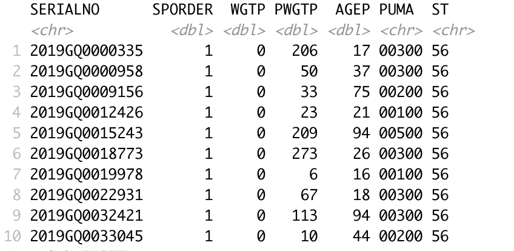
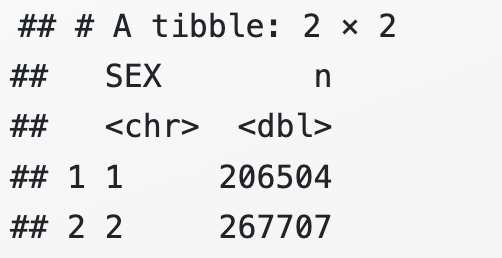
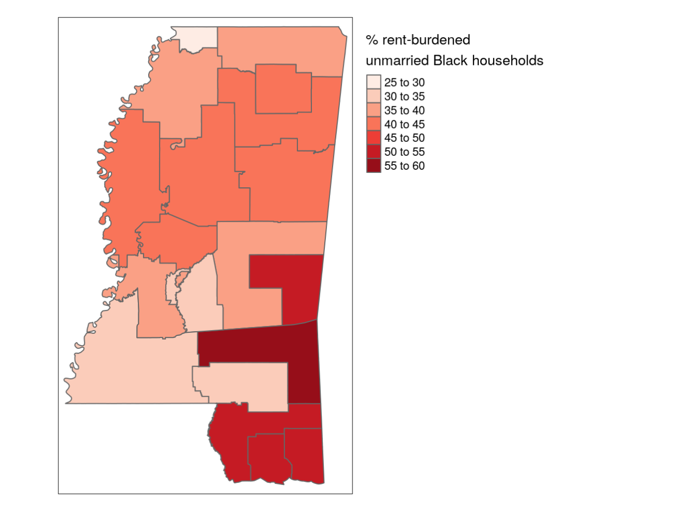
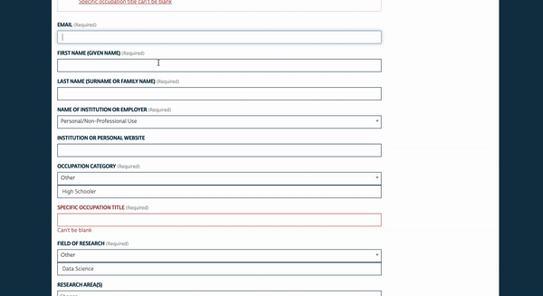
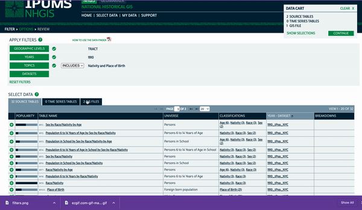
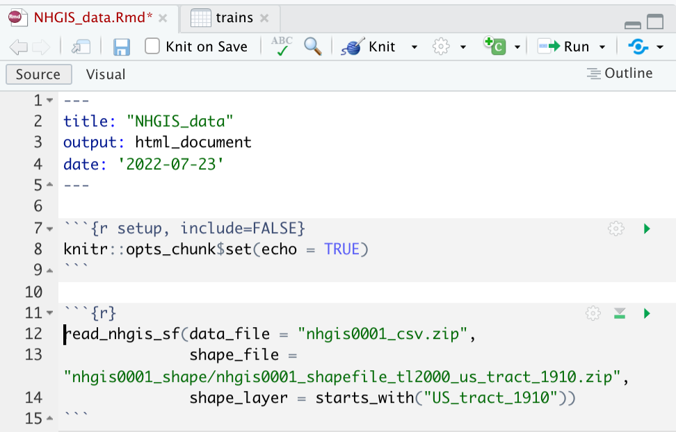
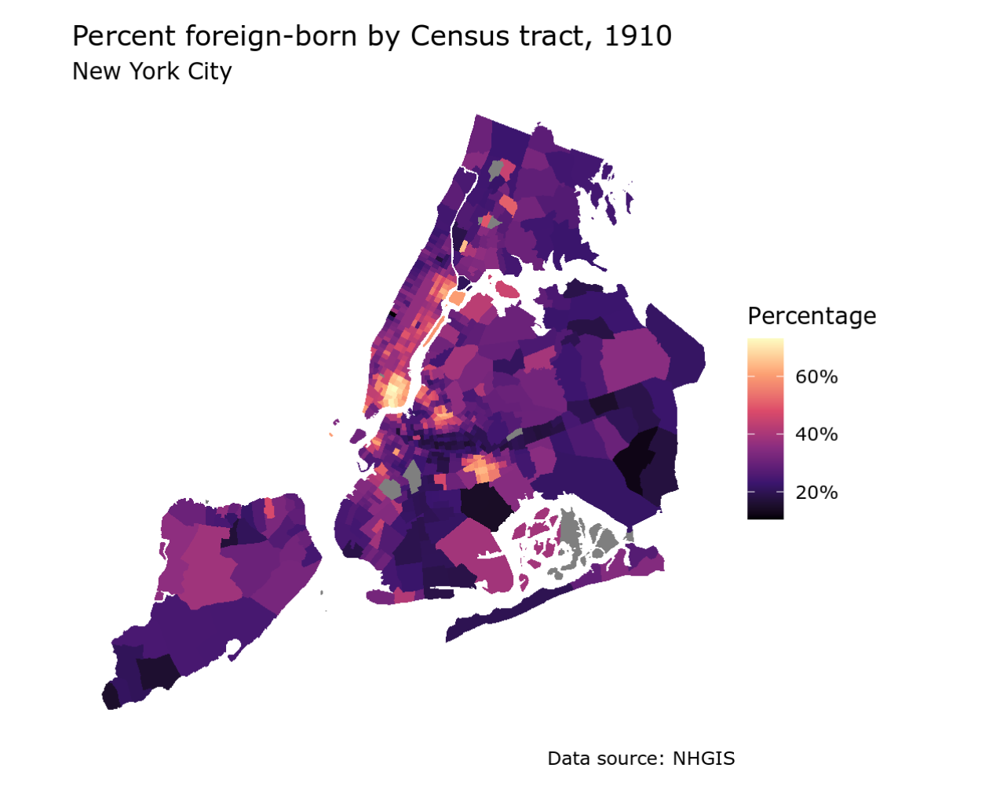
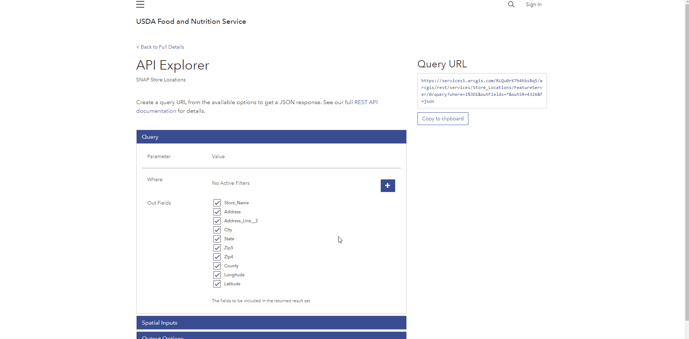

```{r setup, include = FALSE}
library(learnr)
library(primer.tutorials)
library(tidyverse)
library(primer.data)
library(tidycensus)
library(ggthemes)
library(knitr)
library(jsonlite)
library(tmap)
library(dplyr)
library(tigris)
knitr::opts_chunk$set(echo = FALSE)
options(tutorial.exercise.timelimit = 60, 
        tutorial.storage = "local") 

# This is all of the data that the Census Key is needed for. See the rscripts

# rural <- get_decennial(geography = "state",
#                        variables = c("P001001", "P002005"),
#                        year = 2010,
#                        output = "wide")
# write_rds(rural, "data/05-census-rural.rds")

rural <- read_rds("data/rural.rds")

# il_pums <- get_pums(variables = c("PUMA", "FINCP"),
#                     state     = "Illinois",
#                     recode    = TRUE,
#                     survey    = "acs1",
#                     year      = 2019)
# write_rds(il_pums, "data/05-census-il-pums.rds")

il_pums <- read_rds("data/il-pums.rds")
# folder if you want to see the source code for these files.

rural <- read_rds("data/rural.rds")

rural_shifted <- read_rds("data/rural-shifted.rds")

county_data <- read_rds("data/county-data.rds")

pums_map <- read_rds("data/pums-map.rds")

cook_stores <- read_rds("data/stores.rds")

cook_map <- read_rds("data/stores_map.rds")


## Needed for chapter 10

# hh_variables <- c("PUMA", "GRPIP", "RAC1P", 
#                   "HISP", "HHT")
# 
# ms_hh_data <- get_pums(
#   variables = hh_variables, 
#   state = "MS",
#   year = 2020,
#   variables_filter = list(
#     SPORDER = 1,
#     TEN = 3
#   ),
#   recode = TRUE
# )
# 
# write_rds(ms_hh_data, "data/ms_hh_data.rds")

ms_hh_data <- read_rds("data/ms_hh_data.rds")

# ms_pumas <- pumas("MS", year = 2020)
# 
# write_rds(ms_pumas, "data/ms_pumas.rds")

ms_pumas <- read_rds("data/ms_pumas.rds")

ms_map <- ms_hh_data %>%
  mutate(
    race_ethnicity = case_when(
      HISP != "01" ~ "Hispanic",
      HISP == "01" & RAC1P == "1" ~ "White",
      HISP == "01" & RAC1P == "2" ~ "Black",
      TRUE ~ "Other"
    ),
    married = case_when(
      HHT == "1" ~ "Married",
      TRUE ~ "Not married"
    )
  ) |> 
    group_by(race_ethnicity, married, PUMA) |> 
  summarize(percent_above_40 = 100 *     (sum(WGTP[GRPIP >= 40]) / sum(WGTP))
  ) |> 
  filter(race_ethnicity == "Black",
         married == "Not married")
```

```{r copy-code-chunk, child = "../../child_documents/copy_button.Rmd"}
```

```{r info-section, child = "../../child_documents/info_section.Rmd"}
```

<!-- Perhaps of interest: https://milospopovic.net/how-to-make-choropleth-map-in-r/ and https://github.com/r-spatial/mapview. -->

<!-- DK: Maybe revisit so that census api key is available for Github actions to use. -->

## Introduction

Throughout this tutorial we will be learning how to access and analyze **microdata**. Microdata refers to individual-level data made available to researchers.

###

All files that we create in this tutorial should be placed in your `census_tutorial` subdirectory that you created in `Census Data I`.


## Accessing Census microdata
### 

US Census microdata, named Public Use Microdata Series (PUMS), allows for detailed cross-tabulations not available in aggregated data. We will learn how to access PUMS in this section.

### 

We will be working through [this](https://walker-data.com/census-r/introduction-to-census-microdata.html) book throughout this section. 

### Exercise 1

**American Community Survey** microdata is available using the `get_pums()` function in `tidycensus`. 

Run `get_pums()` below setting `variables` to a vector containing `"SEX"` and `"AGEP"`, and `state` to `"WY"`

```{r accessing-census-mic-1, exercise = TRUE}

```

<button onclick = "transfer_code(this)">Copy previous code</button>

```{r accessing-census-mic-1-hint-1, eval = FALSE}
get_pums(variables = c("...", "..."),
         state = "...")
```

### 

We just got the microdata for variables representing sex and age in Wyoming. We can get national data by setting the `state` argument to `"all"`.

### Exercise 2

Copy and paste your code from above. Add the `year` argument and set it to `2019`.

```{r accessing-census-mic-2, exercise = TRUE}

```

<button onclick = "transfer_code(this)">Copy previous code</button>

```{r accessing-census-mic-2-hint-1, eval = FALSE}
get_pums(variables = c("...", "..."),
         state = "...",
         year = ...)
```

### 

We have now specified a time period for our data. 

### Exercise 3

Copy and paste your code from above. Add the `survey` argument and set it to `"acs1"`.  

```{r accessing-census-mic-3, exercise = TRUE}

```

<button onclick = "transfer_code(this)">Copy previous code</button>

```{r accessing-census-mic-3-hint-1, eval = FALSE}
get_pums(variables = c("...", "..."),
         state = "...",
         year = ...,
         survey = "...")
```

### 

The get_pums() function defaults to the 5-year ACS with survey = "acs5"; 1-year ACS data is available with survey = "acs1". 


### Exercise 4

Notice how the tibble came with variables we didn't request such as `PWGTP` which stands for weight, or `SERIALNO`, which is a specific household identifier. `get_pums()` gets these variables by default, keep this in mind.  

### 

Copy and paste your code from above. Using the pipe operator, filter the data to where `SERIALNO` is `"2019HU0456721"`. We are only looking at one house. 


```{r accessing-census-mic-4, exercise = TRUE}

```

<button onclick = "transfer_code(this)">Copy previous code</button>

```{r accessing-census-mic-4-hint-1, eval = FALSE}
... |> 
  filter(SERIALNO == "...")
```

### 

Take a look at the data. The `HHT` column being `1` shows that this is a married household. Also look at the `SEX` and `PWGTP` (weight) columns. We've just successfully inspected the data for a single household. 

### Exercise 5

So far we've just returned households, but what about housing units? What if they're vacant. 

Copy and paste your code from above without the `filter()` command. Add the argument `return_vacant` and set it to `TRUE`.

```{r accessing-census-mic-5, exercise = TRUE}

```

<button onclick = "transfer_code(this)">Copy previous code</button>

```{r accessing-census-mic-5-hint-1, eval = FALSE}
get_pums(variables = c("...", "..."),
         state = "...",
         year = ...,
         survey = "...",
         return_vacant = ...)
```

### 

Vacant housing units are included in the dataset, but as they do not have person-level characteristics, all person-level variables like `AGEP` and `SEX` have values of `NA`. 

### Exercise 6

So by now we have been exposed to a couple PUMS variables such as `AGEP`, `SEX`, `PWGTP`, etc. 

Run `View()` with `pums_variables` as the argument. 

```{r accessing-census-mic-6, exercise = TRUE}

```

<button onclick = "transfer_code(this)">Copy previous code</button>

```{r accessing-census-mic-6-hint-1, eval = FALSE}
View(...)
```

### 

By running this, we get a look at various different PUMS variables. You’ll use information in the `var_code` column to fetch variables. Learn more about the other columns [here](https://walker-data.com/census-r/introduction-to-census-microdata.html#variables-available-in-the-acs-pums).

### Exercise 7

We can also return additional contextual information for variables by using the `recode` argument.

Copy and paste your code from exercise 3. Add the `recode` argument and set it to `TRUE`. 

```{r accessing-census-mic-7, exercise = TRUE}

```

<button onclick = "transfer_code(this)">Copy previous code</button>

```{r accessing-census-mic-7-hint-1, eval = FALSE}
wy_pums_recoded <- get_pums(
  variables = c(..., ...),
  state = "...",
  ...elt() = "acs1",
  year = ...,
  recode = TRUE
)
```

### 

Note that the dataset returns three new columns: `ST_label`, `HHT_label`, and `SEX_label` which include longer and more informative descriptions of the value labels.

### Exercise 8

Sometimes getting PUMS data takes a very long time. We can subset data. 

### 

Copy and paste your code from exercise 3. Add the `variables_filter` argument and set it to a list where `SEX` is `2`. You will need to use the `list()` function.

```{r accessing-census-mic-8, exercise = TRUE}

```

<button onclick = "transfer_code(this)">Copy previous code</button>

```{r accessing-census-mic-8-hint-1, eval = FALSE}
get_pums(
  variables = c("...", "..."),
  state = "...",
  ... = "acs1",
  variables_filter = list(SEX = 2),
  year = ...
)
```

### 

Look at the `SEX` column. Notice that everything is `2`.

### Exercise 9

Some geographical information is available in the PUMS samples in the form of the **Public Use Microdata Area**, or **PUMA**.

### 

Run `pumas()` below setting state to `"WY"`, `cb` to `TRUE`, and `year` to `2019`.

```{r accessing-census-mic-9, exercise = TRUE}

```

<button onclick = "transfer_code(this)">Copy previous code</button>

```{r accessing-census-mic-9-hint-1, eval = FALSE}
pumas(state = "...", cb = ..., year = ...)
```

### 

The `pumas()` function returns PUMAs, where you can specify what state and year you want it from. 

### 

The code above just spits out a bunch of random gibberish at us. Let's make this a nice map.  

### Exercise 10

Copy and paste your code from above. Pipe this into `ggplot()`

```{r accessing-census-mic-10, exercise = TRUE}

```

<button onclick = "transfer_code(this)">Copy previous code</button>

```{r accessing-census-mic-10-hint-1, eval = FALSE}
... |> 
  ggplot()
```

### 

This is the base for our map. 

### Exercise 11

Copy and paste your code from above. Add the `geom_sf()` and `theme_void()` layers. 

```{r accessing-census-mic-11, exercise = TRUE}

```

<button onclick = "transfer_code(this)">Copy previous code</button>

```{r accessing-census-mic-11-hint-1, eval = FALSE}
... |> 
  ... + 
  geom_sf() + 
  theme_void()
```

### 

Your map should look like this: 

```{r}
include_graphics("images/puma.png")
```

### 

These are the 5 PUMAS of Wyoming, which cover large rural areas.

### Exercise 12

Copy and paste your code from above. Simply change the `state` argument in `pumas()` to `"NY"` instead of `"WY"`.

```{r accessing-census-mic-12, exercise = TRUE}

```

<button onclick = "transfer_code(this)">Copy previous code</button>

```{r accessing-census-mic-12-hint-1, eval = FALSE}
pumas(state = "NY", cb = ..., year = ...) |> 
 ... + 
  ... + 
  ...
```

### 

Notice that there are a lot more PUMAs, which are more aligned with community districts in the area because it is mostly urban. 

### 

You should now know how to create simple maps of PUMAs.

### Exercise 13

PUMA information is also available in `get_pums()` under the variable code `PUMA`.

### 

Copy and paste your code from exercise 3. In the `variables` column, change `"SEX"` to `"PUMA"`. Keep everything else the same. 

```{r accessing-census-mic-13, exercise = TRUE}

```

<button onclick = "transfer_code(this)">Copy previous code</button>

```{r accessing-census-mic-13-hint-1, eval = FALSE}
get_pums(
  variables = c("PUMA", "..."),
  state = "...",
  survey = "...",
  year = ...
)
```

### 

You should get a tibble that starts like this: 

```{r}

```

From this tibble, we can see PUMA is an attribute of PUMS data. 

### Exercise 14

Copy and paste your code from above. Add the `puma` argument and set it to `"00500"` and have variables only set to `"AGEP"`.

```{r accessing-census-mic-14, exercise = TRUE}
get_pums(
  variables = "AGEP",
  state = "...",
  survey = "...",
  year = ...,
  puma = "00500"
)
```

<button onclick = "transfer_code(this)">Copy previous code</button>

```{r accessing-census-mic-14-hint-1, eval = FALSE}

```

### 

We can utilize the `puma` argument to select a certain PUMA code. 

### Exercise 15

We can also look at PUMAs from different states at the same time by changing the `state` argument.

### 

Copy and paste your code from above. Set the `state` argument to `"multiple"`. You **WILL** get an error, we will fix that in the next exercise. 

```{r accessing-census-mic-15, exercise = TRUE}

```

<button onclick = "transfer_code(this)">Copy previous code</button>

```{r accessing-census-mic-15-hint-1, eval = FALSE}
get_pums(
  variables = "...",
  state = "multiple",
  survey = "...",
  year = ...,
  puma = "..."
)
```

### 

Let's fix the error. 

### Exercise 16

### 

We now have to also modify the `puma` argument. Set `puma` to a vector with one element being `"WY" = "00500"`, and the other being `"UT" = "05001"`.

```{r accessing-census-mic-16, exercise = TRUE}

```

<button onclick = "transfer_code(this)">Copy previous code</button>

```{r accessing-census-mic-16-hint-1, eval = FALSE}
get_pums(
  variables = "...",
  state = "...",
  survey = "...",
  year = ...,
  puma =c("WY" = "...", "UT" = "...") 
)
```

### 

If you iterated through all the rows in this tibble, you would see PUMA codes of "05001" and "00500". We just looked at two different PUMA codes from different states, pretty neat huh?

### 

You should now have a basic idea of how to get microdata(PUMS), inspect PUMS variables, and see geographic microdata(PUMA).

## Analyzing Census microdata
### 

In this section we will learn how to properly analyze and create detailed plots from microdata.

### Exercise 1

Take a look below at the data we've imported already. This is for the state of Mississippi. Pipe it to the `count()` function with argument `wt` set to `PWGTP`

```{r analyzing-census-mic-1, exercise = TRUE}
get_pums(
  variables = c("SEX", "AGEP"),
  state = "MS",
  survey = "acs5",
  year = 2020
)
```

<button onclick = "transfer_code(this)">Copy previous code</button>

```{r analyzing-census-mic-1-hint-1, eval = FALSE}
get_pums(
  variables = c("SEX", "AGEP"),
  state = "MS",
  survey = "acs5",
  year = 2020
) |> 
  count(wt = ...)
```

### 

This should return **2981835**. We just utilized the `count()` function to see how many people there are in Mississippi and did a simple tabulation.

### Exercise 2

Copy and paste your code from above. Before the `wt` argument, add 2 arguments. One should be `SEX_label`, and the other should be `AGEP`. You should have 3 arguments in total. 

```{r analyzing-census-mic-2, exercise = TRUE}

```

<button onclick = "transfer_code(this)">Copy previous code</button>

```{r analyzing-census-mic-2-hint-1, eval = FALSE}
... |> 
  count(SEX_label, AGEP, wt = ...)
```

### 

We just tabulated data by unique values of age and sex in Mississippi. By specifying `wt = PWGTP`, we say that the `PWGTP` column is the appropriate weight for data tabulation.

### Exercise 3

We can also perform more custom tabulations. 

### 

Take for example the PUMS data from earlier. Filter this data so that `AGEP` is 65 or above.

```{r analyzing-census-mic-3, exercise = TRUE}
get_pums(
  variables = c("SEX", "AGEP"),
  state = "MS",
  survey = "acs5",
  year = 2020
) 
```

<button onclick = "transfer_code(this)">Copy previous code</button>

```{r analyzing-census-mic-3-hint-1, eval = FALSE}
get_pums(
  variables = c("SEX", "AGEP"),
  state = "MS",
  survey = "acs5",
  year = 2020
) |> 
  filter(AGEP >= ...)
```

### 

We just filtered the data so it only includes people who are 65 or older. Now let's tabulate it by sex. 

### Exercise 4

Continue your pipe from earlier and use the `count()` function to tabulate by `SEX`. Also make sure to set the `wt` argument to `PWGTP`. 

```{r analyzing-census-mic-4, exercise = TRUE}

```

<button onclick = "transfer_code(this)">Copy previous code</button>

```{r analyzing-census-mic-4-hint-1, eval = FALSE}
... |> 
  count(SEX, wt = ...)
```

### 

Your code should produce this: 

```{r}

```

### 

You should now feel comfortable doing simple tabulations with your microdata using `count()`.

### 

If you want to learn more about tabulation in a real-life application, visit [here](https://walker-data.com/census-r/analyzing-census-microdata.html#group-wise-data-tabulation). This could be your final project!

### Exercise 5

Now let's map our microdata.

### 

Take a look at the variable we've defined. Below that, use `plot()` with the extracted `geometry` column to map it.

```{r analyzing-census-mic-5, exercise = TRUE}
ms_pumas <- pumas("MS", year = 2020)
```

<button onclick = "transfer_code(this)">Copy previous code</button>

```{r analyzing-census-mic-5-hint-1, eval = FALSE}
ms_pumas <- pumas("MS", year = 2020)
plot(...$geometry)
```

### 

It should produce this: 

```{r}
include_graphics("images/pums_plt.png")
```

This is just a graph of the PUMAs but without any data to shade it. Remember the `ms_pumas` variable, it will come back later. 

### Exercise 6

The variable we defined below is just a vector of the variables we want to import from PUMS. Add a `get_pums()` function below setting `variables` to `hh_variables` and `state` to `"MS"`. Don't click run, this is just a set up for the next exercise. 

```{r analyzing-census-mic-6, exercise = TRUE}
hh_variables <- c("PUMA", "GRPIP", "RAC1P", 
                  "HISP", "HHT")
```

<button onclick = "transfer_code(this)">Copy previous code</button>

```{r analyzing-census-mic-6-hint-1, eval = FALSE}
hh_variables <- c("PUMA", "GRPIP", "RAC1P", 
                  "HISP", "HHT")
get_pums(variables = ...,
         state = "...")
```

### 

 `GRPIP` is rent burden. `RAC1P` anf `HISP` are race and ethnicity respectively. `HHT` is household type. 
 
### 

Since we are making a map, we need geographic microdata, shown by the `PUMA` variable. 

### Exercise 7

Copy and paste your code from above. Add the `year` argument and set it to `2020`. Additionally, add this code as an argument: `variables_filter = list(SPORDER = 1, TEN = 3)`. Assign this to variable called `ms_hh_data`.

```{r analyzing-census-mic-7, exercise = TRUE}

```

<button onclick = "transfer_code(this)">Copy previous code</button>

```{r analyzing-census-mic-7-hint-1, eval = FALSE}
hh_variables <- c("PUMA", "GRPIP", "RAC1P", 
                  "HISP", "HHT")
ms_hh_data <- get_pums(variables = ...,
         state = "...",
         year = ...,
         variables_filter = list(SPORDER = 1, TEN = 3))
```

### 

The `variables_filter` argument filtered the sample to only renter-occupied households paying cash rent, speeding download time. Learn more about this argument by looking at its documentation in R.

### Exercise 8

Now we're going to recode this with the `case_when()` function from the `dplyr` package. 

### 

First run `library(dplyr)`.

```{r analyzing-census-mic-8, exercise = TRUE}

```

<button onclick = "transfer_code(this)">Copy previous code</button>

```{r analyzing-census-mic-8-hint-1, eval = FALSE}
library(...)
```

### 

Now that this package is loaded let's move on with our graph. 

### Exercise 9

Start a pipe with `ms_hh_data`. Pipe to `mutate()`. Create a new column named `race_ethnicity` and set it to the `case_when()` function. When you run this, it should not work correctly.

```{r analyzing-census-mic-9, exercise = TRUE}

```

<button onclick = "transfer_code(this)">Copy previous code</button>

```{r analyzing-census-mic-9-hint-1, eval = FALSE}
ms_hh_data |> 
  mutate(... = case_when())
```

### 

Now let's add arguments to the `case_when()` function. 

### Exercise 10

Look at how we have formatted the first argument. We are saying that when `HISP` is not `"01"`, the new `race_ethniciy` column should be `"Hispanic"`. Make `race_ethnicity` equal `"White"` when `HISP` is `"01"` AND `RAC1P` is `"1"`.

```{r analyzing-census-mic-10, exercise = TRUE}
ms_hh_data |> 
  mutate(race_ethnicity = case_when(
      HISP != "01" ~ "Hispanic"))
```

<button onclick = "transfer_code(this)">Copy previous code</button>

```{r analyzing-census-mic-10-hint-1, eval = FALSE}
... |> 
  mutate(... = case_when(
      HISP != "01" ~ "Hispanic"),
      HISP == "..." & ... == "1" ~ "White"))
```

### 

Nice! Notice at the end we use the `~` sign to say that when this condition is filled, the `race_ethnicity` column is "...". 

### Exercise 11

Add another argument to `case_when()`. Make `race_ethnicity` equal `"Black"` when `HISP` is `"01"` AND `RAC1P` is `"2"`. Add a comma after this and make the last argument `TRUE ~ "Other"`.

```{r analyzing-census-mic-11, exercise = TRUE}

```

<button onclick = "transfer_code(this)">Copy previous code</button>

```{r analyzing-census-mic-11-hint-1, eval = FALSE}
... |> 
  mutate(... = case_when(
      HISP != "01" ~ "Hispanic"),
      HISP == "..." & ... == "1" ~ "White",
      ... == "01" & RAC1P == "..." ~ "Black",
      TRUE ~ "Other"))
```

### 

We just used `case_when()` to create a new `column` in our data. Let's create one more column. 

### Exercise 12

Look below; we have created a `married` column that is `"Married"` when `HHT` is `"1"` and `"Not Married"` when it is not. Click run code and notice these two new columns. 

```{r analyzing-census-mic-12, exercise = TRUE}
ms_hh_data |> 
  mutate(
    race_ethnicity = case_when(
      HISP != "01" ~ "Hispanic",
      HISP == "01" & RAC1P == "1" ~ "White",
      HISP == "01" & RAC1P == "2" ~ "Black",
      TRUE ~ "Other"),
    married = case_when(
      HHT == "1" ~ "Married",
      TRUE ~ "Not married"))
```

<button onclick = "transfer_code(this)">Copy previous code</button>

```{r analyzing-census-mic-12-hint-1, eval = FALSE}

```

### 

Let's move into the next step of recoding. 

### Exercise 13

Continue your pipe into `group_by()` and group by `race_ethnicity`, `married`, and `PUMA`. Running this shouldn't do much but we will fix that in the next exercise. 

```{r analyzing-census-mic-13, exercise = TRUE}

```

<button onclick = "transfer_code(this)">Copy previous code</button>

```{r analyzing-census-mic-13-hint-1, eval = FALSE}
... |> 
  mutate(...) |> 
  group_by(..., ..., ...)
```

### 

When using the `group_by()` function, the `summarize()` function is almost always used as well. Let's do that. 

### Exercise 14

Continue your pipe into the `summarize()` function. Create a new column called `percent_above_40`. Set it to the total amount of people where `GRPIP` is greater than or equal to `40` divided by the total amount of people and then that value times `100`. 

Hint: You can do total people by `sum(WGTP)`

```{r analyzing-census-mic-14, exercise = TRUE}

```

<button onclick = "transfer_code(this)">Copy previous code</button>

```{r analyzing-census-mic-14-hint-1, eval = FALSE}
... |> 
  group_by(..., ..., ...) |> 
  summarize(percent_above_40 = 100 * (sum(WGTP[GRPIP >= ...]) / sum(WGTP)))
```

### 

This should create a new `percent_above_40` column. 

### Exercise 15

Continue your pipe to filter the data so `race_ethnicity` is `"Black"` and `married` is `"Not married"`. Finally save this whole pipe to a variable called `ms_map`. 

```{r analyzing-census-mic-15, exercise = TRUE}
ms_map <- ... |> 
  filter(race_ethnicity == "...",
         married == "...")
```

<button onclick = "transfer_code(this)">Copy previous code</button>

```{r analyzing-census-mic-15-hint-1, eval = FALSE}

```

### 

We have one more step to do before starting the actual plotting. 

### Exercise 16

We have to join this `ms_map` object to the MS template `ms_pumas` object. We will use `left_join()` for this. 

### 

Start a pipe with `ms_pumas` and pipe it into the `left_join()` function. Make the first argument `ms_map` and make the second argument, `by`, equal to `c("PUMACE10" = "PUMA"))`. 

```{r analyzing-census-mic-16, exercise = TRUE}

```

<button onclick = "transfer_code(this)">Copy previous code</button>

```{r analyzing-census-mic-16-hint-1, eval = FALSE}
ms_pumas |> 
  left_join(..., by = c(... = ...))
```

### 

We are joining `ms_pumas` and `ms_map` **by** the `PUMA`/`PUMACE10` column. They are the same column; they just have different names which is why we set them equal to each other in the vector.Recall that you can rename things in a vector.

### 

Ok enough modifying and recoding. Let's plot :)

### Exercise 17

We will be using `tmap` to plot. Copy and paste your code from last exercise. Continue your pipe into `tm_shape()`.  

```{r analyzing-census-mic-17, exercise = TRUE}

```

<button onclick = "transfer_code(this)">Copy previous code</button>

```{r analyzing-census-mic-17-hint-1, eval = FALSE}
... |> 
  tm_shape()
```

### 

Remember that `tm_shape()` has initializes the graph. 

### Exercise 18

Add the `tm_polygons()` layer. Set `col` to `"percent_above_40"`, `palette` to `"Reds"`, and `title` to `"% rent-burdened\nunmarried Black households"`. The \n in the title is just to start a new line for formatting purposes. 

```{r analyzing-census-mic-18, exercise = TRUE}

```

<button onclick = "transfer_code(this)">Copy previous code</button>

```{r analyzing-census-mic-18-hint-1, eval = FALSE}
... +
  tm_polygons(col = "...",
              palette = "...",
              title = "...")
```

### 

By setting the `col` argument to `percent_above_40`, we are saying that the shading will be dependent on this column. We are using a red `palette`. 

### Exercise 19

Add the `tm_layout()` layer. Set `legend.outside` to `TRUE` `legend.outside.position` to `"right"`. 

```{r analyzing-census-mic-19, exercise = TRUE}

```

<button onclick = "transfer_code(this)">Copy previous code</button>

```{r analyzing-census-mic-19-hint-1, eval = FALSE}
... +
  tm_layout(legend.outside = ...,
            legend.outside.position = "...")
```

### 

Your graph should look like this: 

```{r}

```

Congrats! Although it's a long process, see how detailed this graph is. 

### 

You should now know how to do a little analysis and plotting with PUMS data. 

## NGHIS
### 

In this section we are going to be learning about the National Historical Geographic Information System. This database is extremely useful for data prior to 2000 (historical data). Let's dive in. 

### Exercise 1

Go to the [NGHIS](https://www.nhgis.org/) website. In the left panel click register and go through the steps. Look at the gif below to see how we did it. Type "done" when you are finished registering. 

```{r nghis-1}
question_text(NULL,
	answer(NULL, correct = TRUE),
	allow_retry = TRUE,
	try_again_button = "Edit Answer",
	incorrect = NULL,
	rows = 3)
```

```{r}

```

### 

Return the home page and click "get data". Let's - you guessed it - get data!

### Exercise 2

Notice the 4 panels on the right:

```{r}
include_graphics("images/filters.png")
```

### 

"Geographic Levels" is the level of aggregation for your data. The middle 2 are pretty self-explanatory. "Datasets" specifies which dataset you want to get data from. 

### 

Click Geographic levels, add "CENSUS TRACTS" by clicking the green plus and submit it. Click Years, add 1910 under "Decennial Years' by clicking the green plus and submit it. Type "done" when you are finished. 

```{r nghis-2}
question_text(NULL,
	answer(NULL, correct = TRUE),
	allow_retry = TRUE,
	try_again_button = "Edit Answer",
	incorrect = NULL,
	rows = 3)
```

### 

Let's specify the Topic and Datasets options. 

### Exercise 3

Click Topic and add the "Nativity and Place of Birth" topic. Then submit. Type "done" when you are finished. 

```{r nghis-3}
question_text(NULL,
	answer(NULL, correct = TRUE),
	allow_retry = TRUE,
	try_again_button = "Edit Answer",
	incorrect = NULL,
	rows = 3)
```

### 

The "Datasets" filter is useful when there are multiple datasets for a given year. This does not apply to our data so there is no need to do anything here.

### Exercise 4

In the "Select Data" menu, choose tables “NT26: Ancestry” and “NT45: Race/Ethnicity” by clicking the green plus as you did for the filters. You will have to navigate to the second page to select table 45. 

```{r nghis-4}
question_text(NULL,
	answer(NULL, correct = TRUE),
	allow_retry = TRUE,
	try_again_button = "Edit Answer",
	incorrect = NULL,
	rows = 3)
```

### 

Let's finish getting our data. 

### Exercise 5

Under "Select Data" click the tab to go to "2 GIS Files" and add the first option. Click continue until you get to the "Review and Submit" page. Make sure "Comma Delimited" is chosen, add a description if you would like, and submit your request. See gif to make sure you did it correctly and type "done" when finished.

```{r nghis-5}
question_text(NULL,
	answer(NULL, correct = TRUE),
	allow_retry = TRUE,
	try_again_button = "Edit Answer",
	incorrect = NULL,
	rows = 3)
```

```{r}

```

### 

Your request should be queued for a little. You should receive a notification in your email when your request is ready and it should say completed in the "Extracted Requests" page. Download your "TABLES" and "GIS" files in the same directory (in the `census_tutorial` subdirectory).

### Exercise 6

Load `tidyverse` and `ipumsr` in your console. You may need to you `install.packages()` for `ipumsr` before you use the `library()` command. Run `search()` and copy/paste the command/output below.

```{r nghis-6}
question_text(NULL,
	answer(NULL, correct = TRUE),
	allow_retry = TRUE,
	try_again_button = "Edit Answer",
	incorrect = NULL,
	rows = 3)
```

### 

Both `tidyverse` and `ipumsr` should be there. 

### Exercise 7

Create a new R markdown document in your `census_tutorial` subdirectory titled "NHGIS_data". Click the blue save icon in top left and save the document in the same name. Run `list.files()` in your console and copy/paste the output below.

```{r nghis-7}
question_text(NULL,
	answer(NULL, correct = TRUE),
	allow_retry = TRUE,
	try_again_button = "Edit Answer",
	incorrect = NULL,
	rows = 3)
```

### 

"NHGIS_data" should be one of the files listed. The csv.zip and shape.zip files should also be listed as you should have downloaded them to this folder. If they are not listed use `setwd()` in the console to set your working directory to your `census_tutorial` subdirectory and make sure this R Markdown file, along with the csv.zip and shape.zip files, are in this folder.

### Exercise 8

Delete everything in this document except the YAML header and setup chunk and create a new code chunk. We are going to utilize the `read_nhgis_sf()` function from `ipumsr` to read this data.

### 

Run `read_nhgis_sf()` in the chunk, setting `data_file` to `"nhgis0001_csv.zip"`.  Run `readLines("NHGIS_data.Rmd")` in the console and copy/paste the output below. 

Make sure your RStudio is running in your `census_tutorial` subdirectory and the csv and shape files are there too. 

```{r nghis-8}
question_text(NULL,
	answer(NULL, correct = TRUE),
	allow_retry = TRUE,
	try_again_button = "Edit Answer",
	incorrect = NULL,
	rows = 3)
```

### 

This should return an error saying we have no `shape_file` argument. Let's fix that.

### Exercise 9

You will need to unzip your shape.zip file. 
Click [here](https://library.ulethbridge.ca/c.php?g=256368&p=1711582) and follow the instructions for your respective operating system.

Put the unzipped file/folder in the same place as your csv.zip file.
### 

Set `shape_file` to `"nhgis0001_shape/nhgis0001_shapefile_tl2000_us_tract_1910.zip"` (path to unzipped file, your path may differ). Run `readLines("NHGIS_data.Rmd")`. 

```{r nghis-9}
question_text(NULL,
	answer(NULL, correct = TRUE),
	allow_retry = TRUE,
	try_again_button = "Edit Answer",
	incorrect = NULL,
	rows = 3)
```

### 

We have one more argument to add, `shape_file()`.

### Exercise 10

Add `shape_file` and set it to `starts_with("US_tracts_1910")`.

```{r nghis-10}
question_text(NULL,
	answer(NULL, correct = TRUE),
	allow_retry = TRUE,
	try_again_button = "Edit Answer",
	incorrect = NULL,
	rows = 3)
```

### 

This is what your document should look like so far:

```{r}

```

### Exercise 11

Pipe your function and use `str_detect()` to **filter** the data so only rows where `GISJOIN` is `"G36"` stay. Assign this whole thing to a variable named `nyc_1910`. Run `readLines("NHGIS_data.Rmd")` in the console and copy/paste the output below. 

*Hint: `filter(str_detect(GISJOIN, "..."))`*

```{r nghis-11}
question_text(NULL,
	answer(NULL, correct = TRUE),
	allow_retry = TRUE,
	try_again_button = "Edit Answer",
	incorrect = NULL,
	rows = 3)
```

### 

Nice! Now let's map it. 

### Exercise 12

Create a new code chunk. Use `plot()` to map the extracted geometry column from `nyc_1910`. Run `readLines("NGHIS_data.Rmd")` in the console and copy/paste the output below. 

Hint: You will need to use the `$` symbol.

```{r nghis-12}
question_text(NULL,
	answer(NULL, correct = TRUE),
	allow_retry = TRUE,
	try_again_button = "Edit Answer",
	incorrect = NULL,
	rows = 3)
```

###

This should just show the tracts in NYC. Let's customize this. 

### Exercise 13

Delete the `plot()` line. Start a pipe with `nyc_1910` and pipe it into `rowwise()`. Run `readLines("NGHIS_data.Rmd")` in the console and copy/paste the output below. 

```{r nghis-13}
question_text(NULL,
	answer(NULL, correct = TRUE),
	allow_retry = TRUE,
	try_again_button = "Edit Answer",
	incorrect = NULL,
	rows = 3)
```

###

This allows us to do our calculations across the row. 

### Exercise 14

Continue your pipe into mutate with the argument `total = sum(c_across(A60001:A60007))`. Then continue your pipe with `ungroup()`. Run `readLines("NGHIS_data.Rmd")` in the console and copy/paste the output below. 

```{r nghis-14}
question_text(NULL,
	answer(NULL, correct = TRUE),
	allow_retry = TRUE,
	try_again_button = "Edit Answer",
	incorrect = NULL,
	rows = 3)
```

###

We've created a `total` column for the population of NYC. Let's finish our modifications.

### Exercise 15

Continue your pipe with `mutate()`. Create a column named `pct_fb` (percent foreign-born) which is `A60005 / total`. A60005 is the foreign-born population so when divided by total, you get the percent. Run `readLines("NGHIS_data.Rmd")` in the console and copy/paste the output below. 

```{r nghis-15}
question_text(NULL,
	answer(NULL, correct = TRUE),
	allow_retry = TRUE,
	try_again_button = "Edit Answer",
	incorrect = NULL,
	rows = 3)
```

###

Your code chunk should look like this:

```{r}
include_graphics("images/NHGIS_mod.png")
```

### Exercise 16

Continue your pipe with `ggplot()` mapping `pct_fb` to `fill`. Remember to use `aes()`. Also add the `geom_sf()` layer and set `color` to `NA`.  Run `readLines("NGHIS_data.Rmd")` in the console and copy/paste the output below. 

```{r nghis-16}
question_text(NULL,
	answer(NULL, correct = TRUE),
	allow_retry = TRUE,
	try_again_button = "Edit Answer",
	incorrect = NULL,
	rows = 3)
```

###

Let's finish off our map. 

### Exercise 17

Add the `scale_fill_viridis_c()` layer  setting `options` to `"magma"` and `labels` to `scales::percent` so our axis has percentages.  Run `readLines("NGHIS_data.Rmd")` in the console and copy/paste the output below. 

```{r nghis-17}
question_text(NULL,
	answer(NULL, correct = TRUE),
	allow_retry = TRUE,
	try_again_button = "Edit Answer",
	incorrect = NULL,
	rows = 3)
```

###

Almost done!

### Exercise 18

Add the `theme_void()` layer and set `base_family` to `"Verdana"`. Finally, use `labs()` to add a `title`, `subtitle`, `caption`, and `fill`. `fill` should be set to `Percentage`. Run `readLines("NGHIS_data.Rmd")` in the console and copy/paste the output below. 

```{r nghis-18}
question_text(NULL,
	answer(NULL, correct = TRUE),
	allow_retry = TRUE,
	try_again_button = "Edit Answer",
	incorrect = NULL,
	rows = 3)
```

Your graph should look like this: 

```{r}

```


###

This section should have gave you a basic understand of NHGIS, and how you can get and plot data from it. 


## Mapping points

<!-- This is the section for mapping latitude and longitude -->

<!-- Address to lat long converter found here: https://www.census.gov/programs-surveys/geography/technical-documentation/complete-technical-documentation/census-geocoder.html may be a good idea to download a bunch of addresses and then map them. Library found here: https://cran.r-project.org/web/packages/tidygeocoder/tidygeocoder.pdf -->

<!-- The plan is map McDonald locations vs avg income by county and see how they differ. Or something similar to show how there are a bunch of food deserts based on income, forcing people to eat unhealthy foods. It's an interesting concept that I feel suits a final project.-->

<!-- Teach about addresses in the notes. -->

But a lot of the time, we don't have convenient shape files or nice data points from the Census.  

Sometimes, we just have a bunch of addresses or longitude and latitude points that don't look very nice on a map.

Let's create a map of food deserts using those points.

```{r echo = FALSE}
cook_clean_map <- cook_map |>
                    mutate(Percent = 100 * (estimate / summary_est))

cook_stores_map <- ggplot(data = cook_clean_map,
                          aes(fill = Percent, color = Percent)) +
                     geom_sf() +
                     scale_fill_viridis_c(direction = -1) +
                     scale_color_viridis_c(direction = -1) +
                     geom_point(data = cook_stores,
                                aes(x = Longitude, y = Latitude),
                                size = 0.5,
                                inherit.aes = FALSE) +
                     labs(title = "Grocery Stores and Income in Cook County",
                          subtitle = "Cook County has a small food desert in the south.",
                          caption = "Source: SNAP Retailer Locator, U.S. Department of Agriculture Food and Nutrition Service") +
                     theme_void()
cook_stores_map
```

### Exercise 1

First, we need to get our data. We'll do this by using another API: The [Food and Nutrition Service's Snap Retailer Locator](https://www.fns.usda.gov/snap/retailer-locator).

### 

Visit [https://usda-fns.hub.arcgis.com/datasets/USDA-FNS::snap-store-locations/api]() to create your API request. 

Fill out the request form, filtering it so that you only receive data about the store name, state, county, longitude, and latitude.

###

Then, filter out the state and county so that you only request data about Illinois and Cook County. Make sure to use acronyms like "IL" and "COOK" rather than the full name. Make sure to click "enter" to apply the filter.

```{r out.width = "875px"}

```

### 

Copy and paste the URL in the top right corner of the webpage into the space below. This is the URL that we'll be pulling our data from.

```{r mapping-points-1}
question_text(NULL,
	answer(NULL, correct = TRUE),
	allow_retry = TRUE,
	try_again_button = "Edit Answer",
	incorrect = NULL,
	rows = 3)
```

### 

You may have noticed that there's also an address field on the API. While we don't *need* to get the address of the store since we have the coordinates, you may need to convert between addresses and coordinates in future projects.

You can do this by either using the [Census' API](https://www.census.gov/programs-surveys/geography/technical-documentation/complete-technical-documentation/census-geocoder.html) or by using the [tidygeocoder package](https://cran.r-project.org/web/packages/tidygeocoder/tidygeocoder.pdf). 

Keep in mind that this will slow down your data collection process, so it's best to find coordinate data before looking for addresses.

### Exercise 2

Now we need to create a new R Markdown file to hold our map and its related information.

### 

Create a new R Markdown file titled `deserts.Rmd` in your `census_tutorial` subdirectry. and delete all of the text except for the setup chunk and the YAML header. Then, load the **tidyverse**, **tidycensus**, **jsonlite**, and **ggthemes** libraries into the setup chunk using the `library()` command. 

### 

Run `list.files()` in the Console to list all of the files within your project. Copy and paste the output into the space below.

```{r mapping-points-2}
question_text(NULL,
	answer(NULL, correct = TRUE),
	allow_retry = TRUE,
	try_again_button = "Edit Answer",
	incorrect = NULL,
	rows = 3)
```

### 

Add some plain text information about your map and what you're plotting.

Since we're trying to find food deserts in Cook County, you can write about how poorer areas often don't have access to grocery stores, forcing the people living there to walk for miles just so that they can feed themselves.

### Exercise 3

Now, the URL we got earlier ends in `.json`, signifying that it'll give us a JSON file. We need to parse that file into an R object so that we can actually use it.

### 

Create a new code chunk in `deserts.Rmd`, then save your URL to the variable `json_url`. 

After that, add the line `fromJSON(json_url)` to your code chunk.

### 

Run `readLines("deserts.Rmd") |> tail(15)` in the Console to list the last 15 lines in `deserts.Rmd`. Copy and paste the output into the space below.

```{r mapping-points-3}
question_text(NULL,
	answer(NULL, correct = TRUE),
	allow_retry = TRUE,
	try_again_button = "Edit Answer",
	incorrect = NULL,
	rows = 3)
```

### 

Most of the time when you try to pull data from the Internet, it'll come in the form of a JSON file. It's important to understand what file you're pulling into your R session and what format it is so that you can deal with it easily.

### Exercise 4

We also need to save our data so that we aren't constantly pulling it from the Internet.

### 

Save the result of the previous exercise to the variable `county_stores`.

Then add the line `county_stores <- county_stores$features$attributes` directly after that line.

### 

Run `glimpse(county_stores)`, then copy-paste both the command and the output into the space below.

```{r mapping-points-4}
question_text(NULL,
	answer(NULL, correct = TRUE),
	allow_retry = TRUE,
	try_again_button = "Edit Answer",
	incorrect = NULL,
	rows = 3)
```

### 

When we pulled our data in from the JSON file, we actually got a bunch of tables containing information about the main data set like IDs and variable names. However, since we only care about the attributes (the longitude, latitude, county, state, and store name), we need to use the `$` operator to pull out the `attributes` table from the overall data.

### Exercise 5

However, you may have noticed we didn't actually get any shape files. Instead, we got a bunch of latitude and longitude points.

### 

But in order to create our map, we need to have some shape files. We use the **tidycensus** package to fetch our shape files, then overlay our coordinate points on top of that shape file.

### 

Add a `get_acs()` command to your code chunk, setting the `geography` to `"tract"`, `variables` to `"B06012_002"`, `year` to `2018`, `state` to `"Illinois"`, `county` to `"Cook County"`, `geometry` to `TRUE`, and `summary_var` to `"B02001_001"`. Save the output of this command to a variable named `county_map`.

### 

Run `readLines("deserts.Rmd") |> tail(15)` in the Console to list the last 15 lines in `deserts.Rmd`. Copy and paste the output into the space below.

```{r mapping-points-5}
question_text(NULL,
	answer(NULL, correct = TRUE),
	allow_retry = TRUE,
	try_again_button = "Edit Answer",
	incorrect = NULL,
	rows = 3)
```

### 

This allows us to get ACS data about how many people are below the federal poverty line (`B06012_002`) in every census tract as well as the shape files for every census tract. That means that we can create a normal map describing poverty, then add the grocery store locations to show where the food deserts are.

### Exercise 6

We need to take one more step before we start mapping. We need to calculate the percentage of people in poverty for each Census tract.

### 

Add a `Percent` column to `county_map` that gets the ratio of `estimate` and `summary_est`, then multiplies it by 100 to get the percentage of the population currently in poverty for that Census tract.

### 

Run `readLines("deserts.Rmd") |> tail(15)` in the Console to list the last 15 lines in `deserts.Rmd`. Copy and paste the output into the space below.

```{r mapping-points-6}
question_text(NULL,
	answer(NULL, correct = TRUE),
	allow_retry = TRUE,
	try_again_button = "Edit Answer",
	incorrect = NULL,
	rows = 3)
```

### 

Now our data shows an actual povetry level, not just number of people in poverty.

### Exercise 7

Now we can start mapping.

### 

Pipe the `county_map` variable into a `ggplot()` function, mapping the fill and the color to the `Percent` column. Continue the plot and add the `geom_sf()` layer to complete your map.

### 

Run `readLines("deserts.Rmd") |> tail(15)` in the Console to list the last 15 lines in `deserts.Rmd`. Copy and paste the output into the space below.

```{r mapping-points-7}
question_text(NULL,
	answer(NULL, correct = TRUE),
	allow_retry = TRUE,
	try_again_button = "Edit Answer",
	incorrect = NULL,
	rows = 3)
```

### 

This is a pretty simple map of which census tracts have the most poverty. However, the colors are inverted and we still need to add our points to the map.

### Exercise 8

Continue the plot and add the lines `scale_fill_viridis_c(direction = -1)` and `scale_color_viridis_c(direction = -1)`.

### 

Run `readLines("deserts.Rmd") |> tail(15)` in the Console to list the last 15 lines in `deserts.Rmd`. Copy and paste the output into the space below.

```{r mapping-points-8}
question_text(NULL,
	answer(NULL, correct = TRUE),
	allow_retry = TRUE,
	try_again_button = "Edit Answer",
	incorrect = NULL,
	rows = 3)
```

### 

This sets the darker colors to signify a higher poverty level, making it easier to understand the final map.

### Exercise 9

It's finally time to add our points. These are the locations of every SNAP-certified grocery store in your county, and mapping them will allow us to see which areas are underserved.

### 

We can do this by using the standard `geom_point()` function. Continue the plot and add the `geom_point()` layer, setting `data` to `county_stores`, `inherit.aes` to `FALSE`, and use the `aes()` function to map `x` to `Longitude` and `y` to `Latitude`.

### 

Run `readLines("deserts.Rmd") |> tail(15)` in the Console to list the last 15 lines in `deserts.Rmd`. Copy and paste the output into the space below.  

```{r mapping-points-9}
question_text(NULL,
	answer(NULL, correct = TRUE),
	allow_retry = TRUE,
	try_again_button = "Edit Answer",
	incorrect = NULL,
	rows = 3)
```

### 

If you run this code, you can see how all of of the points are extremely clustered and it's hard to tell exactly where everything is. You can fix this by setting the `size` argument in `geom_point()` to `0.5`.

### Exercise 10

Finally, we need to clean up our map and add our captions.

Our final map should look like this:

```{r}
cook_stores_map
```

### 

Set the labels to what's seen in the graph above and set the theme to `theme_void()`.

### 

Run `readLines("deserts.Rmd") |> tail(15)` in the Console to list the last 15 lines in `deserts.Rmd`. Copy and paste the output into the space below.

```{r mapping-points-10}
question_text(NULL,
	answer(NULL, correct = TRUE),
	allow_retry = TRUE,
	try_again_button = "Edit Answer",
	incorrect = NULL,
	rows = 3)
```

## Summary

From this tutorial, you should have a basic understanding of microdata, how to access and manipulate it, and some special databases such as NHGIS and IPUMS. Additionally, you have some experience with mapping longitude and latitude.

```{r download-answers, child = "../../child_documents/download_answers.Rmd"}
```
