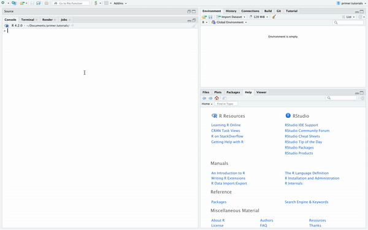
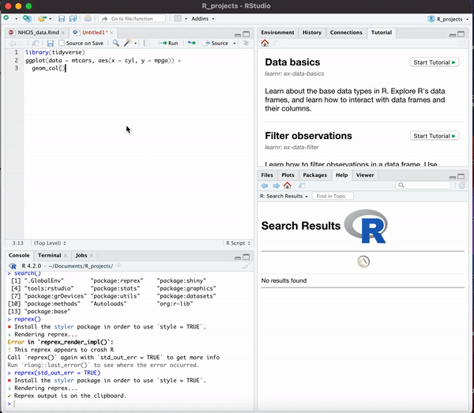

```{r setup, include = FALSE}
library(learnr)
library(all.primer.tutorials)
library(tidyverse)
library(primer.data)
library(knitr)
library(reprex)
knitr::opts_chunk$set(echo = FALSE)
options(tutorial.exercise.timelimit = 60, 
        tutorial.storage = "local") 
```

```{r copy-code-chunk, child = system.file("child_documents/copy_button.Rmd", package = "tutorial.helpers")}
```

```{r info-section, child = system.file("child_documents/info_section.Rmd", package = "tutorial.helpers")}
```

<!-- We really ought to delete all this and start again. -->
<!-- Note how this does not follow our Instructions, .e.g., no Introduction or Summary. SG: Done-->
<!-- Does it really follow best practices. For example, you almost never see someone showing their data in a reprex. Instead, you build a reprex with built in data. If we want to show how to show data, that should be a separate question. SG: Done -->

<!-- Remove part about running head(). SG: Done -->

<!-- Watch Jenny Bryan. https://reprex.tidyverse.org/articles/learn-reprex.html SG: Done-->


## Introduction
This tutorial will give you a basic understanding of how to ask for help in various ways when an unexpected issue arises. This includes checking R documentation, reproducible examples, and more.

## Searching
In this tutorial, we're going to be going over how you can get help with your projects and formatting your questions so that people don't ignore them.

This is useful especially for when you start working on your own independent projects and need to reach out to somebody helpful.

R is the most painful game of spot-the-difference ever, and you're going to run into some errors along the way.

### Exercise 1

Let's preface with the fact that a simple Google search can solve a lot of your problems. 

There's no shame in looking stuff up and it comes with the job.

However, there are certain forums that are especially suited to the problems you may encounter.

### 

The first forum you should look at is [RStudio Community](https://community.rstudio.com/).

This is a community of over 38,000 R developers with hundreds of users active at any given time.

It's basically like Stack Overflow but specifically focused on R and for R packages.

### 

Let's try making an advanced search on RStudio. 

Go to [https://community.rstudio.com/](https://community.rstudio.com/) and navigate to the "Search" button, then click "Options". These are the advanced search options.

Search for posts containing the word "students" that are posted by David Kane (@dkane). Then copy-paste the URL of the first result into the space below.

```{r searching-1}
question_text(NULL,
	answer(NULL, correct = TRUE),
	allow_retry = TRUE,
	try_again_button = "Edit Answer",
	incorrect = NULL,
	rows = 3)
```

### 

As you can see, RStudio Community is a great place to find other people who have had the same question as you with the same packages, letting you quickly find a solution.

### Exercise 2

The next forum to look at is Stack Overflow.

This is **the** most widespread coding forum and it's helped millions of developers.

It's not an understatement to say that modern development runs on Stack Overflow simply because of how many people ask questions on it and how many people it helps.

### 

It's pretty easy to find issues on Stack Overflow similar to yours.

They'll show up on most Google searches and are pretty reliable.

However, it's a little rough to do advanced searches on Stack Overflow because it's based on the text in your search rather than toggleable options.

### 

Go to [https://stackoverflow.com/](https://stackoverflow.com/) and search `"geom_point" [ggplot2]`. Then copy-paste the URL of the first result into the space below.

```{r searching-2}
question_text(NULL,
	answer(NULL, correct = TRUE),
	allow_retry = TRUE,
	try_again_button = "Edit Answer",
	incorrect = NULL,
	rows = 3)
```

### 

This searches for a question containing the text "geom_point" with the tag "ggplot2". The full documentation for advanced searching can be found at [Stack Overflow's help page](https://stackoverflow.com/help/searching).

However, most of the time Stack Overflow pages will show up with a Google search, so advanced searches are rarely used.

### Exercise 3

And finally we have GitHub Issues. 

This is for cases where you think that you have a bug and want to see if anybody's had the same issue.

It's less about getting help with your problem and more about figuring out whether this is a genuine bug and if you can avoid it or not.

### 

GitHub advanced searches are a little bit tougher to do because you need to go to [their special website](https://github.com/search/advanced) for advanced searches.

### 

Go to [https://github.com/search/advanced](https://github.com/search/advanced) and search for closed issues (you have to scroll down for this) containing the word `ggplot()` from the owner `AnmayG` in the repository `demo-issue-repo`.

Then copy-paste the URL of the first result into the space below.

```{r searching-3}
question_text(NULL,
	answer(NULL, correct = TRUE),
	allow_retry = TRUE,
	try_again_button = "Edit Answer",
	incorrect = NULL,
	rows = 3)
```

### 

Your search request should look like `ggplot() user:AnmayG repo:demo-issue-repo state:closed`.

As you can see, the only thing that the advanced search did was change your search request so that it contained a few special keywords. That means that you can do the same searches in the default GitHub search bar if you just add those keywords in naturally.

### Exercise 4

But there's one more source that we can use: the documentation. 

This is the information about the function and often has the most detailed information about it.

However, it doesn't have any information about the use cases, making it hard to use if you're trying to resolve a bug.

### 

Run `help(geom_point)` in the Console, then copy-paste the "Description" section into the space below.

```{r searching-4}
question_text(NULL,
	answer(NULL, correct = TRUE),
	allow_retry = TRUE,
	try_again_button = "Edit Answer",
	incorrect = NULL,
	rows = 3)
```

Along with the `help()` function, we can also use the the question mark character (`?`) and immediately follow with the function name. 

### 

Run `?geom_point` in the Console, then copy-paste the "Description" section into the space below.

```{r searching-4_2}
question_text(NULL,
	answer(NULL, correct = TRUE),
	allow_retry = TRUE,
	try_again_button = "Edit Answer",
	incorrect = NULL,
	rows = 3)
```

You should get the same result! 

### 

Sometimes, you may need to use a double question mark (`??function_name`) if the function is part of a package you don't have installed. RStudio will prompt you to use `??` if `?` doesn't work as seen below. 

In this example, we do not have `tidyverse` loaded, so RStudio doesn't know what `geom_point()` is. However, if we type `??geom_point`, RStudio knows that there is a function `geom_point` in the `tidyverse` package. Pretty cool huh?

```{r}

```

### 

Normally, you'd read the documentation at the start of a project or when you use a function because it details the arguments and gives you some examples. 

The documentation is basically a dictionary for the function that it's about. However, you wouldn't pull out a dictionary when you're trying to figure out if your paragraph is incorrect. You may use examples, but nothing specific to your use case. 


## Reprex

But what if you already scoured the forums piece by piece and post by post for your error (or just got too lazy) and feel the need to ask a new question?

The point of these forums is that they're there to answer questions, so you can obviously post your own.

However, as the totally-real-world issue that you pulled up in the last exercise shows you, nobody will answer your question if you don't give them any context about it.

### Exercise 1

So let's go over [creating our own question](https://reprex.tidyverse.org/articles/articles/learn-reprex.html) and posting it to RStudio Community, with the correct context.

### 

Create a simple plot using the `ggplot()` function by setting `data` to `mtcars` then mapping `x` to `cyl` and `y` to `mpga` using the `aes()` function. Then add the `geom_col()` function so that the graph can actually be shown as a bar graph.

```{r reprex-1, exercise = TRUE}

```

<button onclick = "transfer_code(this)">Copy previous code</button>

```{r reprex-1-hint-1, eval = FALSE}
ggplot(data = ..., aes(x = ..., y = ...)) +
  geom_col()
```

### 

As you can tell, this doesn't work and instead gives you an `object not found` error.

Let's use this error as the basis for our RStudio Community post.

### Exercise 2

First, we need to make a **reproducible example**

We'll do this by bringing our code into an R Script file.

### 

Copy the code created in the previous exercise and paste it into a new R Script file. This R Script should be in your regular R project folder. Save your R Script file and name it `script.R`.

### 

Try to run this code without loading any libraries.

You can restart R to unload the old libraries and start from scratch.

### 

Run `list.files()` in the Console, then copy-paste the command and the result below.

```{r reprex-2}
question_text(NULL,
	answer(NULL, correct = TRUE),
	allow_retry = TRUE,
	try_again_button = "Edit Answer",
	incorrect = NULL,
	rows = 3)
```

### 

**Always bring your code into an R Script file before doing anything else.**

This is because an R Script file is like an independent environment: there's no text, no setup chunks, and no weird formatting errors. It's just your code in its cleanest, plainest format. That means that it's easy to reproduce errors without R Markdown text interfering.

### Exercise 3

As you can see, there is an error, but not the one we want.

Instead, it's an error with us not loading **tidyverse** and as such not loading the `ggplot()` function into our R script.

This is why its important to include any necessary libraries (or files) in your example or people trying to help you will be missing key components of your code.

### 

Let's fix that. Load **tidyverse** using the `library()` command at the top of your R Script file.

Then run the code and make sure that you're getting an `object not found` error rather than a `ggplot() not found` error.

### 

Run `readLines("script.R")` in the Console, then copy-paste the command and the result here.

```{r reprex-3}
question_text(NULL,
	answer(NULL, correct = TRUE),
	allow_retry = TRUE,
	try_again_button = "Edit Answer",
	incorrect = NULL,
	rows = 3)
```

### 

The best way to think about this is trying to help a relative solve a tech problem over the phone - except you are the relative. If you don't want the helper to start pulling their hair out, you need to show every relevant detail and state everything that you are doing.

### Exercise 4

Let's talk about some conventions for a reproducible example.

### 

In our regular file, we might be working with complex data from some external source. When creating a reproducible example, we want to use built-in R data so that helpers don't need to look at external data to figure out the issue.

We will still get the same error regardless of the data and helpers will be able to explore the data and work with it easily. 

If you don't get the same error, you just answered your own question: the problem is with the data itself, not your code!

### 

Run `data()` in your console and copy and paste the first three datasets that appear.

```{r reprex-4}
question_text(NULL,
	answer(NULL, correct = TRUE),
	allow_retry = TRUE,
	try_again_button = "Edit Answer",
	incorrect = NULL,
	rows = 3)
```

### 

All of these datasets are built into R, so people can easily help you when looking at your reproducible example. Notice that if you keep scrolling down that "R data sets" page, you will eventually see `mtcars`.

### Exercise 5

The end goal when you ask a question is that the helper doesn't have to do *anything* to answer your question. They don't have to load it into R, they don't have to run the program, they can just look at your code and say "here is where you messed up".

### 

Think about it like saying that 2 + 10 * 10 = 120. This is incorrect, but it's hard to *immediately* tell what's wrong.

### 

Meanwhile, going through it step by step...

**2 + 10 = 12**  

**12 * 10 = 120**

This shows the incorrect step. Showing the steps you took and their results is a crucial part in making your examples easy to understand.

### 

In terms of programming, we need to show the errors and warnings that we got when we ran the code. We can do this by using the **`reprex`** package.

### 

Load the `reprex` library into your R session by using the `library()` command in the console. 

### 

Run `search()` in the console and copy and paste the output below. `"package:reprex"` should be included in it.

```{r reprex-5}
question_text(NULL,
	answer(NULL, correct = TRUE),
	allow_retry = TRUE,
	try_again_button = "Edit Answer",
	incorrect = NULL,
	rows = 3)
```

### 

A `reprex`, or **reproducible example**, is a code snippet that contains the output of every function as a comment, making it easy to show off code and its output without making it hard to copy-paste and run in its own session. You can learn more about reprex and its uses [here](https://reprex.tidyverse.org/).

### Exercise 6

Now let's create a reprex. There next 3 exercises will show you 3 different ways to create a reprex. 

Select all the text in your Script file. Then go to "Addins" at the top of RStudio. 

### 

Click "Render Reprex". Under "Where is reprex source?" select "current selection". Under "Target venue", make sure "Github or Stack Overflow" is chosen. Also make sure "Preview HTML" is selected.

Then click Render.

### 

Your Reprex is now copied to your clipboard. You can also see it in the "Viewer" tab in the bottom right. Simply paste it below. 

```{r reprex-6}
question_text(NULL,
	answer(NULL, correct = TRUE),
	allow_retry = TRUE,
	try_again_button = "Edit Answer",
	incorrect = NULL,
	rows = 3)
```

See this gif if you're confused.

```{r}

```

###

Notice that when you go to "Render Reprex", you can tailor your reprex for different places. For example, you can tailor it for GitHub, or you can tailor it as a Slack Message. Keep this in mind when creating your reprex depending on where you want to post it and ask your question. 

### Exercise 7

That isn't the only way to create a reprex however...

Copy all of the code in `script.R` onto your clipboard  then run `reprex()` in the Console.

### 

This should have copied the reprex onto your clipboard. Paste the reprex text below.

```{r reprex-7}
question_text(NULL,
	answer(NULL, correct = TRUE),
	allow_retry = TRUE,
	try_again_button = "Edit Answer",
	incorrect = NULL,
	rows = 3)
```

### 

This makes it much easier to create a reprex automatically, but it doesn't allow you to set the source. It's only going to pull the code from the clipboard, so make sure to double-check your reprex before you start to do anything.

### Exercise 8

Finally, we can create a reprex by enclosing our code within a function.

### 

In `script.R`, enclose all of the code (including the library calls) in curly brackets and by the `reprex()` function like the example below. Run the function to create your reprex.

```{r}
reprex({...})
```

### 

Paste your finished reprex into the box below.

```{r reprex-8}
question_text(NULL,
	answer(NULL, correct = TRUE),
	allow_retry = TRUE,
	try_again_button = "Edit Answer",
	incorrect = NULL,
	rows = 3)
```

### 

Remember, reprex is useful for when you want to show the output of code but still make it easy to copy-paste. All of these reprex examples are designed to be easily copy pasted into your own R session, so make sure not to just screenshot the reprex into your question and make it harder to copy-paste.

### Exercise 9

Let's publish your reprex for the world to see.

### 

Visit [this RStudio Community thread](https://community.rstudio.com/t/thread-for-student-to-practice-posting-questions-for-january-2021-please-do-not-answer-them/158014) and reply to the thread by clicking the "Reply" button. You will have to create an RStudio Community account.

### 

Copy-paste in your reprex as well as a short description like "I can't figure out this error" into your reply, then hit "Reply" and submit your post. Keep in mind [this warning](https://community.rstudio.com/t/re-thread-for-student-to-practice-posting-questions-please-do-not-answer-them/107716) from our friend at RStudio "to keep the window open for a few seconds after they've pasted they answer into the window." This prevents RStudio from thinking you are a bot.


### 

At the bottom right of your published post you should see a "Share Link" button. Press that button, then copy the resulting link into the space below.


```{r reprex-9}
question_text(NULL,
	answer(NULL, correct = TRUE),
	allow_retry = TRUE,
	try_again_button = "Edit Answer",
	incorrect = NULL,
	rows = 3)
```

### 


See [here](https://www.garrickadenbuie.com/blog/shrtcts-reprex-to-issue/) to learn more about reprex, its features, and some shortcuts. 

[This video](https://reprex.tidyverse.org/articles/learn-reprex.html) is another very useful resource.

### 

Congratulations on creating a reprex and successfully asking a question in RStudio Community.

Now that we've created a reprex and asked our question, let's flip sides.

## Reprex issues

Just to show you how painful it is for the answer when the questioner doesn't reprex correctly, let's walk through how a bad question can cause problems for the people trying to solve it.

### Exercise 1

The first issue we'll be going through is posting an image instead of the actual code.

### 

Let's try to fix the issue that [this amazing person](https://github.com/AnmayG/demo-issue-repo/issues/1) found. You can also find this issue by going to the "Issues" page at [https://github.com/AnmayG/demo-issue-repo](https://github.com/AnmayG/demo-issue-repo) and opening the first issue from the bottom.

### 

Copy the code in the issue into the box below, then add the `aes()` function into `ggplot()` so that the code works and displays a working graph. Feel free to tinker a little.

```{r reprex-issues-1, exercise = TRUE}

```

<button onclick = "transfer_code(this)">Copy previous code</button>

```{r reprex-issues-1-hint-1, eval = FALSE}
library(tidyverse)
ggplot(iris, aes(x = Sepal.Length, y = Sepal.Width)) +
  geom_point()
```

### 

This likely was a **pain** to do. Manually typing every single command into the box is not fun.

This is the perfect example of what you should **not** do if you have a project because people who want to help you need to put in way too much effort. 

And the worst part is that the people trying to help you can't see your error message either, so they have to bring it all the way into their code, type out every single command, run it, find the problem, fix the problem and *then* answer your question. That's too much work, and it means that nobody will answer the question from the getgo.

### Exercise 2

The second issue we'll look at is a case where somebody copy-pasted from the Console.

### 

[The second issue](https://github.com/AnmayG/demo-issue-repo/issues/2) can be found by opening the second issue from the bottom.

### 

This one's a little bit nicer, so copy-paste the code into the box below and fix it by adding the `geom_point()` function to the pipe.

```{r reprex-issues-2, exercise = TRUE}

```

<button onclick = "transfer_code(this)">Copy previous code</button>

```{r reprex-issues-2-hint-1, eval = FALSE}

```

### 

This one was a *lot* nicer since you could actually copy-paste the code, but it's not perfect. 

There was a lot of junk that we had to clean up like the output from the tidyverse package and the arrows on the left. 

### 

Keep in mind that the final goal when we post a question is that the helper can take one look at it and answer within minutes, not have to bring it into their own session.

### Exercise 3

The next issue you'll solve is one where they didn't load their library into the example.

### 

[The third issue](https://github.com/AnmayG/demo-issue-repo/issues/3) can be found at [https://github.com/AnmayG/demo-issue-repo/issues/3](https://github.com/AnmayG/demo-issue-repo/issues/3).

### 

This person has a much nicer example, but it doesn't actually have the correct error. We're going to need to do some investigating on this one.

### 

Copy the code inside the issue into the space below, then add the `y = Sepal.Width` argument to the `aes()` function next to the `x = Sepal.Width`.

```{r reprex-issues-3, exercise = TRUE}

```

<button onclick = "transfer_code(this)">Copy previous code</button>

```{r reprex-issues-3-hint-1, eval = FALSE}

```

### 

This one was a good example, but they just missed one thing: the library call. That hid the actual error from us, and we needed to do our own investigating by manually parsing through the code. It made things harder since we couldn't just read the error message to tell what was wrong.

Not only that, but what if the `ggplot()` they were using was completely different from what we know? Their issue could have been completely separate, but instead we had to rely on our **past knowledge** about the package, possibly giving us the wrong answer.

### Exercise 4

This is the last question with an incorrect reprex about not loading in the required variables.

### 

[The fourth issue](https://github.com/AnmayG/demo-issue-repo/issues/7) can be found at [https://github.com/AnmayG/demo-issue-repo/issues/7](https://github.com/AnmayG/demo-issue-repo/issues/7).

### 

This is a similar error to the last exercise since we can't see the actual problem, but it's even worse. We don't have *any* context about what the problem is since we don't have the code for `iris_modified`. We can't see anything.

### 

This is [one of the more common errors](https://community.rstudio.com/t/ggplot-not-working-in-r-markdown-html-document/112037) when people share their code because they think that the problem is somewhere else, like their graph. 

However, the variables and how you reached them are a key part of sharing code, and not including it makes your question basically worthless.

### Exercise 5

That's enough horror about bad questions, let's look at what the ideal question would look like.

### 

[The fifth issue](https://github.com/AnmayG/demo-issue-repo/issues/9) can be found at [https://github.com/AnmayG/demo-issue-repo/issues/9](https://github.com/AnmayG/demo-issue-repo/issues/9).

### 

This is the perfect example because it has an error message, shows you what libraries it's importing, and can be easily copy-pasted into your own code.

### 

Copy the code into the space below and change the `fill` argument to `y`.

```{r reprex-issues-5, exercise = TRUE}

```

<button onclick = "transfer_code(this)">Copy previous code</button>

```{r reprex-issues-5-hint-1, eval = FALSE}

```

### 

This is the ideal question format and it makes it easy for people to see the different issues with the code, allowing them to solve it easily as well. 


By making sure to include these parts, you make it easier for the people trying to help you and also attract more attention to your question since it's easy to understand and solve.

### 

Congratulations on completing this tutorial.

## Summary
You should now have an idea of what to do the next time you have an error that you have no idea how to fix. Reprex is an incredibly powerful and useful tool, and asides from that, you can use in-built R features to figure out the error as well. 

### 

```{r download-answers, child = system.file("child_documents/download_answers.Rmd", package = "tutorial.helpers")}
```
