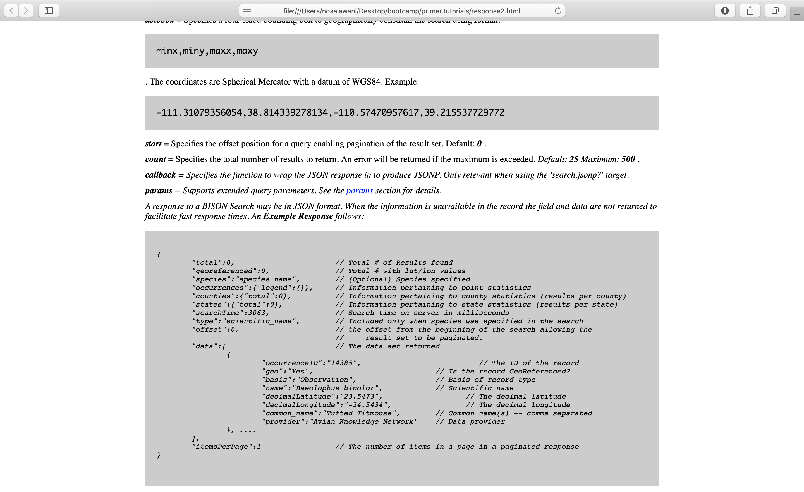

```{r setup, include = FALSE}
library(learnr)
library(tutorial.helpers)
library(tidyverse)
library(httr2)
library(countrycode)
library(jsonlite)
library(rgbif)
library(WDI)
library(plotly)
library(pageviews)
library(stringr)
library(knitr)
knitr::opts_chunk$set(echo = FALSE)
options(tutorial.exercise.timelimit = 60, 
        tutorial.storage = "local") 


# response1 <- request("https://bison.usgs.gov/")
# response1.bin  <- content(response1, "raw")
# 
# response2 <- request("https://bison.usgs.gov/doc/api.jsp")
# response2.bin <- content(response2, "raw")
# 
# bison_base <- "https://bison.usgs.gov/api/search.json"

# response3 <- request(bison_base,
#     query = list(species = "Bison bison",
#                  type = "scientific_name",
#                  count = "1"))
# 
# write_rds(response3, "data/03-data-response3.rds")

# response3 <- read_rds("data/03-data-response3.rds")
#     
# # Meso
# 
# meso_url <- "https://mesonet.agron.iastate.edu/cgi-bin/request/asos.py/"
# 
# meso1 <- request(url = meso_url) 

# denver_response <- request(url = meso_url,
#     query = list(station = "DEN",
#                  data = "tmpf",
#                  year1 = "2017",
#                  month1 = "01",
#                  day1 = "01",
#                  year2 = "2019",
#                  month2 = "12",
#                  day2 = "31",
#                  tz = "America/Denver"))

# write_rds(denver_response, "data/03-data-denver-response.rds")

denver_response <- read_rds("data/03-data-denver-response.rds")


### Wikipedia Objects

# supreme_views <- old_pageviews(project = "en.wikipedia",
#                            article = "Supreme_Court_of_the_United_States",
#                            platform = "all",
#                            user_type = "all",
#                            start = "2008012000",
#                            end = "2016012000") 
# 
# write_rds(supreme_views, file = "data/03-data-supreme-views.rds")

supreme_views <- read_rds("data/03-data-supreme-views.rds")

supreme_plot <- supreme_views |> 
  arrange(date) |> 
  ggplot(aes(date, views, 
             text = paste("Date:", date, "\n"))) +
  geom_col() +
  scale_y_continuous(labels = scales::number_format()) +
  labs(title = "Wikipedia Supreme Court Page During Pres. Obama's Tenure",
       x = "Date", 
       y = "Views", 
       caption = "Wikimedia Traffic Data API") 

### RBison objects

# output <- bison(species = "Accipiter", type = "scientific_name", count = 500)

# write_rds(output, "data/03-data-output.rds")

output <- read_rds("data/03-data-output.rds")

# bison_plot <- bisonmap(input = output, geom = geom_jitter)

### Bison objects

# bison_response <- request(url = "https://bison.usgs.gov/api/search.json",
#     query = list(species = "Accipiter",
#                  type = "scientific_name", 
#                  count = 500))

# write_rds(bison_response, "data/03-data-bison-response.rds")

bison_response <- read_rds("data/03-data-bison-response.rds")

# output_api <- content(bison_response, "text") |> 
#   fromJSON() 

# clean_data_api <- output_api$states$data |> 
#   as_tibble() |> 
#   mutate(across(everything(), as.character)) |> 
#   mutate(names = c("total", "fips")) |> 
#   pivot_longer(cols = -names, 
#                names_to = "state", 
#                values_to = "values") |> 
#   pivot_wider(names_from = names, 
#               values_from = values) |> 
#   mutate(total = as.numeric(total)) |> 
#   mutate(region = tolower(state)) |> 
#   select(-fips, -state)
```

<!-- This tutorial needs a major rewrite. Some thoughts: -->

<!-- -1) Oull out one of the examples into the new Data: Overview tutorial. -->

<!-- 0) Needs an Introduction and Summary. -->

<!-- 1) Must of the material that connects to the chapter should be pulled out and put in a (new) data-overview tutorial. -->

<!-- 2) The BISON website has been revamped by the USGS. This --- https://ipt.gbif.us/ --- is the new home page. We need to rewrite that section to account for this change.  -->

<!-- 3) We need way more knowledge drops. -->

<!-- 4) Could we simplify this so that there is not so much being done in the setup code above? Maybe those calls could be set in the Exercise chunks themselves? -->

<!-- 5) Stick the Census API key stuff here? -->


<!-- Fix *F to be the degree symbol in Denver graphic. -->

<!-- Do not even mention API keys in the initial Query section. Too confusing! Instead, have the second section, called "API Keys" walk through the concept. 

This second section would show an example of using a key we provide in a call to a the API. First question, run request without API key. Get back this failure. Sad! Then run this command with API key. Get back data. Cool! Then run `usethis::edit_r_environ()` -->

<!-- BM: unsure how to implement edit_r_environ in a useful way -->

<!-- > denver <- request(url = meso_url) -->
<!-- > denver -->
<!-- Response [https://mesonet.agron.iastate.edu/cgi-bin/request/asos.py/] -->
<!--   Date: 2021-05-22 14:28 -->
<!--   Status: 500 -->
<!--   Content-Type: text/plain; charset=UTF-8 -->
<!--   Size: 23 B -->

<!-- > class(denver) -->
<!-- [1] "response" -->
<!-- >  -->


```{r copy-code-chunk, child = system.file("child_documents/copy_button.Rmd", package = "tutorial.helpers")}
```

```{r info-section, child = system.file("child_documents/info_section.Rmd", package = "tutorial.helpers")}
```

## Interacting with Sites with `request()`

<!-- DK: Update this section because the main website has changed to https://www.gbif.us/. -->

In order to get data from an API, we use the **httr2** package. The package is designed to imitate standard HTTP in R. Read more about HTTP [here](https://www.jmarshall.com/easy/http/).

### 

### Exercise 1

Load the **httr2** package.  

```{r interacting-with-sit-1, exercise = TRUE}

```

```{r interacting-with-sit-1-hint-1, eval = FALSE}
library(...)
```

### 

<!-- DK: Drop some knowledge! -->

We now have access to the **httr2** package. 

### Exercise 2

`request()` is the key command in the **httr2** package and is used to get information from sites. It takes a URL  and optionally a query to define the limits of the data accessed as its arguments. 

### 

Use `request()` with the `url` argument set to the homepage for USGS BISON, "https://bison.usgs.gov/". Assign the resulting object to `response1`. 

```{r interacting-with-sit-2, exercise = TRUE}

```

```{r interacting-with-sit-2-hint-1, eval = FALSE}
response1 <- request(url = "https://...")
```

```{r interacting-with-sit-2-hint-2, eval = FALSE}
class(response1)
```

### Exercise 3

Print out and read `response1`. 

```{r interacting-with-sit-3, exercise = TRUE}

```

```{r interacting-with-sit-3-hint-1, eval = FALSE}
response1
```

### 

The URL which returns the response is the same one that we contacted. Status 200 mean success. The response is a html file of size 38kB.  We can see a preview of the html file we recieved below the header.

### Exercise 4

Use the function `class()` with the argument `response1`.


```{r interacting-with-sit-4, exercise = TRUE}

```

```{r interacting-with-sit-4-hint-1, eval = FALSE}
class(response1)
```

### 

Output from `request()` is always of class "response".

### Exercise 5

Use the function `content()` to view the content of `response1`.

```{r interacting-with-sit-5, exercise = TRUE}

```

```{r interacting-with-sit-5-hint-1, eval = FALSE}
content(response1)
```

### 

You should see the beginnings of html content.

### Exercise 6

Let's save a copy of `response1` in our working directory. First run `content()` with the argument `response1` and  with the second argument `"raw"`. View this output and then assign it to an object called `response1.bin`. 

```{r interacting-with-sit-6, exercise = TRUE}

```

```{r interacting-with-sit-6-hint-1, eval = FALSE}
response1.bin <- content(..., "raw")
```

### 

The `"raw"` argument saves the file to binary. This is the highest fidelity way to save files. 

### Exercise 7

Use the function `writeBin()` to save the binary object to a file in your present working directory called "response.html". The first argument is the name of the R object, `response1.bin`, and  the second object is the name of the new file. 

```{r interacting-with-sit-7, exercise = TRUE}

```

```{r interacting-with-sit-7-hint-1, eval = FALSE}
writeBin(..., "response.html")
```

### 

The `html` suffix here tells our computer to treat this as an HTML file and open it with a compatible application. 

### Exercise 8

In the Tutorial interface, `writeBin()` does not actually write a file on your computer. If you want to be able to perform the following command, repeat the instructions above on your console. If not, we will provide a picture below.

### 

In the Terminal, run `open response.html`. If this does not work, try to open the file in the file pane in RStudio or in your computer's file viewer. Copy and paste the line of the terminal command for your answer. If you are using the file we have provided, write "done" for your answer. 

```{r interacting-with-sit-8}
question_text(NULL,
    answer(NULL, correct = TRUE),
    allow_retry = TRUE,
    try_again_button = "Edit Answer",
    incorrect = NULL,
    rows = 3)
```

### 

This command opens the file in the default html viewer on your computer, likely your default browser. Read about USGS BISON.

Here is a picture of the site:

```{r image-1}
include_graphics("images/bison1.png")
```

Notice that in place of a URL beginning with "www", there is a file to a local path on a computer. This is the response which has been download.

### Exercise 9

On this page, we see a hyperlink named "API". We cannot click on links because we are not connected to the website on the web, but only to this page on our computer. We can make a new request to communicate with this page. 

### 

If you were to copy the link address, it would return something like this `file:///Users/username/home-directory-subfolder/r-project-folder/r-project/doc/api.jsp`. We should add this path at the end, `/doc/api.jsp` to the site's domain name to get to the API page. If we were looking at the html as a text file, this path would simply be: `./doc/api.jsp`. 

### 

Use `request()` to contact the link "https://bison.usgs.gov/doc/api.jsp". Save this to output to an object called `response2``.

```{r interacting-with-sit-9, exercise = TRUE}

```

```{r interacting-with-sit-9-hint-1, eval = FALSE}
request(url = "https://...")
```

### 

This response is also of type html and 69.3kB. 

### Exercise 10

When navigating an API page for the first time we have two goals. First, to figure find the URL at which we can make our queries and get data. Second, to figure out what parameters we should use to make a query for the particular API. Ideally, there is a page where all of this information is conveniently documented. 

### 

Assign the "raw" version of the `content()` of `response2` to an object called `response2.bin`

```{r interacting-with-sit-10, exercise = TRUE}

```

```{r interacting-with-sit-10-hint-1, eval = FALSE}
response2.bin <- content(..., "raw")
```

### Exercise 11

Use `writeBin` to save `response2.bin` to a file on your computer called `response.html`.

```{r interacting-with-sit-11, exercise = TRUE}

```

```{r interacting-with-sit-11-hint-1, eval = FALSE}
writeBin(response2.bin, "response.html")
```

### 

This overwrites the last thing we saved as `response.html`

### Exercise 12

In the Tutorial interface, `writeBin()` does not actually write a file on your computer. If you want to be able to perform the following command, repeat the instructions above on your console. If not, we will provide a picture of the page below. 

### 

Use the up arrow in the Terminal to access your last command, `open response.html`, and run it. Copy and paste the line of the command for this answer. If you are using the picture we have provided, write "done" for your answer. Read the first section, BISON Search. Look for both a URL at which we can request data and parameters with which we can specify our request. 

```{r interacting-with-sit-12}
question_text(NULL,
    answer(NULL, correct = TRUE),
    allow_retry = TRUE,
    try_again_button = "Edit Answer",
    incorrect = NULL,
    rows = 3)
```

Here are pictures of the page:

```{r image-2}
include_graphics("images/bison2.png")
```

```{r image-3}

```

### Exercise 13

On this page, we see a new url that allows us to make queries for JSON file responses: "https://bison.usgs.gov/api/search.json". Because the URL to make queries is one you will use often, assign it to an R object called `bison_base`.

```{r interacting-with-sit-13, exercise = TRUE}

```

```{r interacting-with-sit-13-hint-1, eval = FALSE}
bison_base <- "https://..."
```

### Exercise 14

In the BISON Search section there are also several parameters for requesting JSON files at the URL, including species, type, and count.

### 

If you studied the example in detail, you should have noticed that in the url all the parameters came after a question mark that follows the base URL. The argument `query` in `request()` essentially creates this question mark.  

### 

Use `request()` with `bison_base` as its first argument. The second argument will be `query`. Set `query` equal to a `list()` in which we will place our parameter requests. Within `list()`, set `species` equal to "Bison bison", set `type` equal to "scientific_name", and set `count` equal to "1". Run this function and assign the output to an object called `response3``.

```{r interacting-with-sit-14, exercise = TRUE}

```

```{r interacting-with-sit-14-hint-1, eval = FALSE}
response3 <- request(bison_base, 
    query = list(species = "Bison bison", 
                 type = "scientific_name", 
                 count = "1"))
```

### Exercise 15

Print and read `response3`

```{r interacting-with-sit-15, exercise = TRUE}

```

```{r interacting-with-sit-15-hint-1, eval = FALSE}
response3
```

### 

Notice that unlike our last two responses, this response comes from a different URL than the one we started from. Notice also that everything our query has added follows  a question mark. This URL matches the parameters we chose and is also a very close match to the example URL on the website. 

### 

The content type is also different. It is no longer an HTML file as before, but a JSON file of 15kB. JSON is a file type which stores data. 

### Exercise 16 

Use `content()` on `response3` with the argument "text" to view the JSON as a text file. 

```{r interacting-with-sit-16, exercise = TRUE}

```

```{r interacting-with-sit-16-hint-1, eval = FALSE}
content(..., "text")
```

### 

You should see lots of brackets, slahses and colons, the syntax of a JSON file. You should also see state and county names and numbers. These are data, and we will work on how to handle this type of data later in the tutorials. 

### Exercise 17

Go to Terminal and use the `rm` command to remove "response.html". Copy and paste the line of the command for this answer. 

```{r interacting-with-sit-17, exercise = TRUE}

```

<!-- ## Iowa Environmental Mesonet -->
<!-- ###  -->

<!-- Let's make the following plot. We will use ASOS data from the Iowa Environmental Mesonet.  -->

<!-- ```{r make-mesonet} -->
<!-- denver_p <- denver_response |> -->
<!--   content() |>  -->
<!--   read_csv(na = "M") |>  -->
<!--   separate(col = valid, -->
<!--            into = c("date", NA), -->
<!--            sep = " ") |> -->
<!--   summarise(avg_temp = mean(tmpf, na.rm = TRUE), -->
<!--             .by = date) |>  -->
<!--   ggplot(aes(y = avg_temp, -->
<!--                   x = date)) + -->
<!--   geom_point() +  -->
<!--   scale_x_discrete(breaks = c("2017-06-01", "2018-06-01", "2019-06-01")) + -->
<!--   labs(x = NULL, -->
<!--        y = "Average Temperature F*", -->
<!--        title = "Daily Average Temperature in Denver, CO", -->
<!--        caption = "Source: Iowa Environmental Mesonet") -->

<!-- denver_p -->
<!-- ``` -->

<!-- ### Exercise 1 -->

<!-- In the last exercise, you started from the homepage and had to find the URL at which you could access the API. In this exercise, we will give you the URL at which to access the API from the start. Below, we will discuss how you would navigate from the home page. -->

<!-- ###  -->

<!-- If you were to naviagte from the home page looking for the ASOS API, you would eventually be redirected to this link, https://mesonet.agron.iastate.edu/request/download.phtml. While this site has some useful documentation such as the variable list at the bottom, the page is designed for interactive use in a browser (hence .phtml instead of just .html)  and so is missing some important information, such as the access URL and the format for time parameters. One option would be to view the html file as a text file, where you could find the access URL and variable names which undergird the UI.  -->

<!-- ###  -->

<!-- Though this cannot be done using `request()`, another way to find information on an interactive site is to make a request on your browser and then look at the resulting link. Doing so, you will see both the base link and the names for as many parameters as you selected.  -->

<!-- ###  -->

<!-- Assign this url, "https://mesonet.agron.iastate.edu/cgi-bin/request/asos.py/"  to an an object named `meso_url`.  -->

<!-- ```{r iowa-environmental-m-1, exercise = TRUE} -->


<!-- ``` -->

<!-- ```{r iowa-environmental-m-1-hint-1, eval = FALSE} -->
<!-- The URL should be a text string when being assigned to an object.  -->
<!-- ``` -->

<!-- ```{r iowa-environmental-m-1-hint-2, eval = FALSE} -->
<!-- meso_url <- "https://..."  -->
<!-- ``` -->

<!-- <!-- In traditional cases, you would store your API key in the .Renviron file and use that reference to access the desired data. This is a simpler example of API use in which we don't need to protect a uniquely generated access key.  --> -->

<!-- You will now have access to this object, the URL for making requests to the API, throughout the rest of this exercise.  -->


<!-- ### Exercise 2 -->

<!-- Use `request()` with the `url` argument set to `meso_url`. Assign the resulting object to `meso1`. In the second line, run `class()` on `meso1`. -->

<!-- ```{r iowa-environmental-m-2, exercise = TRUE} -->

<!-- ``` -->

<!-- ```{r iowa-environmental-m-2-hint-1, eval = FALSE} -->
<!-- my.response <- request(url = ...) -->
<!-- ``` -->

<!-- ```{r iowa-environmental-m-2-hint-2, eval = FALSE} -->
<!-- class(meso1) -->
<!-- ``` -->

<!-- ###  -->

<!-- Note that even without a query specification, the `request()` command appears to run but returns no data. You get an object of `class()` "response" because you are still communicating with the url.  -->

<!-- ### Exercise 3 -->

<!-- Print out `meso1`.  -->

<!-- ```{r iowa-environmental-m-3, exercise = TRUE} -->

<!-- ``` -->

<!-- ```{r iowa-environmental-m-3-hint-1, eval = FALSE} -->
<!-- meso1 -->
<!-- ``` -->

<!-- ###  -->

<!-- Note that the URL is still the base url, which indicates that there was no further query. We can confirm that by looking at the size of the response - 23 Bytes (our previous responses were in **kilo**bytes. `Status: 500` indicates that there was an error.  -->


<!-- ### Exercise 4 -->

<!-- Within the function `request()`, use `meso_url` to fill the `url` argument and then set the argument `query` equal to a `list()` of parameters: `station`, `data`, `year1`.  We want to know for station Denver (`"DEN"`) the temperature in degrees Fahrenheit (`"tpmf"`) starting in the year 2017.  -->

<!-- ```{r iowa-environmental-m-4, exercise = TRUE} -->

<!-- ``` -->

<!-- ```{r iowa-environmental-m-4-hint-1, eval = FALSE} -->
<!-- The abbreviation for temperature in Fahrenheit is "tmpf". -->
<!-- ``` -->

<!-- ```{r iowa-environmental-m-4-hint-2, eval = FALSE} -->
<!-- request(url = meso_url, -->
<!--            query = list(station = "DEN", -->
<!--                         data = "tmpf", -->
<!--                         year1 = 2017)) -->
<!-- ``` -->

<!-- This response is still of `Status: 500`, which means something is wrong.  -->

<!-- ###  -->

<!-- There are several different types of data to be had from this API, including the temperature in degrees celsius, which come with different names to be used as arguments in query. See the discussion at the beginning of this section for where we would find this information on this site and others like it.  -->

<!-- ### Exercise 5 -->

<!-- This API requires a start and end date (Year, Month, and Day) to be supplied in order to return a request successfully.  -->

<!-- ###  -->

<!-- Copy and paste the code from the previous exercise. Within `request()`, you should add parameters to include the start, `year1` `month1` `day1`, and end point of your time frame, `year2` etc. We are interested in the daily records from 01/01/2017 to 12/31/2019. You should also specify the appropriate time zone, `tz` for this station, "America/Denver". View this output and then assign it to an object named `denver_response`.  -->

<!-- ###  -->

<!-- Note: This command may take longer to run.  -->

<!-- ```{r iowa-environmental-m-5, exercise = TRUE, exercise.timelimit = 600} -->

<!-- ``` -->

<!-- ```{r iowa-environmental-m-5-hint-1, eval = FALSE} -->
<!-- All date parameters should be quoted numbers -->
<!-- i.e. "01" is January. -->
<!-- ``` -->

<!-- ```{r iowa-environmental-m-5-hint-2, eval = FALSE} -->
<!-- request(url = meso_url, -->
<!--     query = list(station = "DEN", -->
<!--                  data = "tmpf", -->
<!--                  year1 = "2017", -->
<!--                  month1 = "01", -->
<!--                  day1 = "01", -->
<!--                  year2 = "2019", -->
<!--                  month2 = "12", -->
<!--                  day2 = "31", -->
<!--                  tz = "America/Denver")) -->
<!-- ``` -->

<!-- ###  -->

<!-- Now our response is of `Status: 200`, and much larger (7.98MB) file.  We can see a preview of the data below the header. The response is a text file and we can see that each column is separated by commas.  -->

<!-- ### Exercise 6 -->

<!-- Start a pipe with `denver_response`. Use the `content()` to convert `denver_response` from class response. Then, pipe `read_csv()` to convert the comma separated values in our response file into a tibble.  -->

<!-- ```{r iowa-environmental-m-6, exercise = TRUE} -->

<!-- ``` -->

<!-- ```{r iowa-environmental-m-6-hint-1, eval = FALSE} -->
<!-- request(...) |>  -->
<!--   content() |>  -->
<!--   read_csv() -->
<!-- ``` -->

<!-- ###  -->

<!-- If you scroll through the tibble, you will see that there are values that are not `NA` in the `tmpf` column. We cann assume that temperature was not recorded at every 5 minute interval.  -->

<!-- ### Exercise 7 -->

<!-- Notice all the Ms in the data. These represent missing values. Copy and paste your code from above.  Within `read_csv()`, use the `na` argument to change all occurrences of the lone character `"M"` to `NA`.  -->

<!-- ```{r iowa-environmental-m-7, exercise = TRUE} -->

<!-- ``` -->

<!-- ```{r iowa-environmental-m-7-hint-1, eval = FALSE} -->
<!-- request(url = ..., -->
<!--               query = list(..., -->
<!--                            format = "comma")) |>  -->
<!--   content() |>  -->
<!--   read_csv(na = "M") -->
<!-- ``` -->

<!-- ### Exercise 8 -->

<!-- Let's remove the timestamp from the given date variable and rename the remaining column "date". Copy and paste your code and continue your pipe with the `separate()` function. Within the function `separate()`, use the argument `col` to select which column's content you are separating, use the argument `into` to create a vector of the new column names, `"date"` and `NA`, and use the third argument, `sep` to show by what character you are separating the data `" "` (i.e. a space).   -->

<!-- ```{r iowa-environmental-m-8, exercise = TRUE} -->

<!-- ``` -->

<!-- ```{r iowa-environmental-m-8-hint-1, eval = FALSE} -->
<!--   separate(col = valid, -->
<!--            into = c("...", NA), -->
<!--            sep = " ") -->
<!-- ``` -->

<!-- ###  -->

<!-- The NA operator drops the second column from the separation, removing the need to `select(-)` the unwanted data later.  -->

<!-- ### Exercise 9 -->

<!-- The date column has multiple rows for the same day. Continue your pipe and use `summarize()` to calculate the daily average temperature in a new column named "avg_temp". Remember to exclude `NA` values from calculation of the mean. Use the `.by` argument with a value of `date`. -->

<!-- ```{r iowa-environmental-m-9, exercise = TRUE} -->

<!-- ``` -->

<!-- ```{r iowa-environmental-m-9-hint-1, eval = FALSE} -->
<!-- Within the `mean()` function, set `na.rm` to TRUE  -->
<!-- to remove NA values from calculation.  -->
<!-- ``` -->

<!-- ```{r iowa-environmental-m-9-hint-2, eval = FALSE} -->
<!--   ... |>  -->
<!--   summarise(avg_temp = mean(..., na.rm = TRUE), -->
<!--             .by = date) -->
<!-- ``` -->

<!-- ### Exercise 10 -->

<!-- Continue your pipe with `ggplot()` and `geom_point()`. Create a scatterplot that maps average daily temperature to the y-axis and the date to the x-axis.  -->

<!-- ```{r iowa-environmental-m-10, exercise = TRUE} -->

<!-- ``` -->

<!-- ```{r iowa-environmental-m-10-hint-1, eval = FALSE} -->
<!-- ... |>  -->
<!--   ggplot(aes(x = ..., y = ...)) + -->
<!--   geom_point() -->
<!-- ``` -->

<!-- ### Exercise 11 -->

<!-- There are so many labels for x-axis breaks that they are indistinguishable. Use `scale_x_discrete()` to set only three x axis breaks, "2017-06-01", "2018-06-01", and "2019-06-01". -->

<!-- ```{r iowa-environmental-m-11, exercise = TRUE} -->

<!-- ``` -->

<!-- ```{r iowa-environmental-m-11-hint-1, eval = FALSE} -->
<!-- ... + -->
<!--   scale_x_discrete(breaks = c(...))  -->
<!-- ``` -->

<!-- ### Exercise 12 -->

<!-- Use `labs()` to set an appropriate title, subtitle, caption, axes labels, and captions. -->

<!-- ```{r iowa-environmental-m-12, exercise = TRUE} -->

<!-- ``` -->

<!-- Reminder: The graph should look like this -->

<!-- ```{r show-denver-p} -->
<!-- denver_p -->
<!-- ``` -->

## API Keys
### 

In traditional cases, you would store your API key in the `.Renviron` file and use that reference to access the desired data. The previous and all the following  are examples of API use in which we don't need to use a uniquely generated access key.


### Exercise 1

If you have not already, request a US Census API Key here. You must include both your name and an organization. Write "Done" when you are finished. 

```{r api-keys-1}
question_text(NULL,
    answer(NULL, correct = TRUE),
    allow_retry = TRUE,
    try_again_button = "Edit Answer",
    incorrect = NULL,
    rows = 3)
```

### Exercise 2

In the Terminal, run `cat $HOME/.Renviron`. the .Renviron file makes environmental variables which are run every time R starts up and is where you store sensitive information like API Keys. Copy and paste the command and its result into the box below. 

```{r api-keys-2}
question_text(NULL,
    answer(NULL, correct = TRUE),
    allow_retry = TRUE,
    try_again_button = "Edit Answer",
    incorrect = NULL,
    rows = 3)
```

### 

Most likely, you do not have one yet. In this case the Terminal will return the message "No such file or directory". If you do have one, the Terminal will print the contents of your .Renviron file, which might very well be empty. 

### Exercise 3 

<!-- DK: Combine Exercise 3 and 4. Only answer needed is the result of cat -->

In your Console (not the Terminal!), run the command `usethis::edit_r_environ()`. This is a command that opens the .Renviron file so that we can edit it. If you do not already have a .Renviron file, it will create one for you.  Copy and paste the command into the box below. 

```{r api-keys-3}
question_text(NULL,
    answer(NULL, correct = TRUE),
    allow_retry = TRUE,
    try_again_button = "Edit Answer",
    incorrect = NULL,
    rows = 3)
```

### Exercise 4

In the Terminal run `cat $HOME/.Renviron` again. Now that you have created the file, Terminal should not return "No such file or directory". The file exists, after all. It might have nothing in it. Or it might have something already. Copy and paste the command and its result into the box below. 

```{r api-keys-4}
question_text(NULL,
    answer(NULL, correct = TRUE),
    allow_retry = TRUE,
    try_again_button = "Edit Answer",
    incorrect = NULL,
    rows = 3)
```

### 

If you still get the message "No such file or directory", look at the output of the `edit_r_environ()` function. On many machines, R creates the `.Renviron` in the home directory, but not on all. The output of `edit_r_environ()` contains the path for the `.Renviron` file on your computer. If this is not `/Users/your-user-name/.Renviron` then your file is not in the home directory. Copy the path in the output and run the terminal command with this path in the place of  `$HOME/.Renviron`. 

If the above applies to you, you will have to make the same replacement in Exercise 6 as well. 

### 

If you had content in the .Renviron before, Terminal should return the same content as before since you have not changed it.

### Exercise 5

 
Let's add your Census API Key to `.Renviron`. Type `CENSUS_API_KEY`. This will be the name of the environmental variable. On the same line use an `=` to set the variable to a string that contains your Census API Key. If you have not received a Census API Key, leave a code comment about how you plan to instead. When you are finished, save the file and type "done" in the  box below.

```{r api-keys-5}
question_text(NULL,
    answer(NULL, correct = TRUE),
    allow_retry = TRUE,
    try_again_button = "Edit Answer",
    incorrect = NULL,
    rows = 3)
```

Your completed .Renviron file should look like this:

```{r}
include_graphics("images/apikey.png") 
```

### Exercise 6

Now run `cat $HOME/.Renviron`. Terminal should return the line with your API Key and any other content you may have already had in your .Renviron file. Copy and paste the command and its result into the box below. 

```{r api-keys-6}
question_text(NULL,
    answer(NULL, correct = TRUE),
    allow_retry = TRUE,
    try_again_button = "Edit Answer",
    incorrect = NULL,
    rows = 3)
```

### 

You must restart R for the new environent variable to be able to be used. 

### 

`tidycensus` functions automatically look for this environmental variable. When using API Keys in less developed packages or with `request()`, use the following command `sys.getenv("CENSUS_API_KEY")`. getenv = **get** **env**ironmental variable. 

### 

The primary reason why we do not include API Keys in our code is security. We don't want people who look at our GitHub projects to be able to see our API Key. API Keys are unique for us and can be used for paid services in some cases. Other sensitive information, like GITHUB_PAT or a client's account number is also stored in the .Renviron. 


## Wikipedia Page Access
### 

The **pageviews** package provides helper functions for accesses the API for the World Bank. You can learn more about the package [here](https://cran.rstudio.com/web/packages/pageviews/pageviews.pdf). 


```{r supreme_setup}
final <- ggplotly(supreme_plot, tooltip = "text")

final
```

### 

Note that this graph is interactive and you will use the package `plotly` to add this feature.

### Exercise 1

On the first line, load the **pageviews** package. In this package, the functions `article_pageviews()` and `old_pageviews()` allow us to communicate with the Wikimedia API. 

```{r wikipedia-page-acces-1, exercise = TRUE}

```

```{r wikipedia-page-acces-1-hint-1, eval = FALSE}
library(pageviews)
```

### 

`old_pageviews()` is for counts before 2016. They are not as accurate as they did not omit the activity of web-crawlers and bots.

### Exercise 2

We will be looking at the wikipedia page views for the Supreme Court of the United States countries during President Obama's tenure, from January 20th 2008 to January 20th 2016.

### 

Start a call with `old_pageviews()`. Set the `project` argument equal to `en.wikipedia` and the article to `Supreme_Court_of_the_United_States`. Set the start time and end time in the format: YYYYMMDDHH. Set hours to 00, they do not matter as the granularity is by default daily. Assign this to an object called `supreme_views`.

```{r wikipedia-page-acces-2, exercise = TRUE}

```

```{r wikipedia-page-acces-2-hint-1, eval = FALSE}
old_pageviews(project = "en.wikipedia",
                           article = "...",
                           start = "2008012000",
                           end = "2016012000") 
```

### 

Because this is a package designed to work with this API, we do not need to use a base url. Also, the output of the function is made into a tibble by default.

### Exercise 3

Start a new pipe with `supreme_views`. Use `ggplot()` and `geom_col()` to make a bar graph with `date` on the x-axis and `views` on the y axis. 

```{r wikipedia-page-acces-3, exercise = TRUE}

```

```{r wikipedia-page-acces-3-hint-1, eval = FALSE}
supreme_views |> 
  ggplot(aes(..., ,...)) +
  geom_col()
```

### Exercise 4

Within `ggplot(aes())` Use the `text` argument and the function `paste()` to create a label which you can use for plotly that tells the `date` of an observation.

```{r wikipedia-page-acces-4, exercise = TRUE}

```

```{r wikipedia-page-acces-4-hint-1, eval = FALSE}
supreme_views |> 
  arrange(date) |> 
  ggplot(aes(date, views, 
             text = paste("...", ...))) +
  geom_col()
```

```{r wikipedia-page-acces-4-hint-2, eval = FALSE}
supreme_views |> 
  arrange(date) |> 
  ggplot(aes(date, views, 
             text = paste("Date:", date))) +
  geom_col()
```

### Exercise 5

Add the layer `scale_y_continuous`. Set the argument `labels` to `scales::number_format()` to convert the y-axis from scientific notation.

```{r wikipedia-page-acces-5, exercise = TRUE}

```

```{r wikipedia-page-acces-5-hint-1, eval = FALSE}
supreme_views |> 
  arrange(date) |> 
  ggplot(aes(date, views, 
             text = paste("...", ..., "\n"))) +
  geom_col() +
  scale_y_continuous(... = scales::numer_format())
```

### Exercise 6

Use `labs()` to set an appropriate title, caption, and axes labels

```{r wikipedia-page-acces-6, exercise = TRUE}

```

### 

`plotly` does not support subtitles. 

### Exercise 7

Copy/paste your code. Assign the output of the pipe to an object called `supreme_plot`.

```{r wikipedia-page-acces-7, exercise = TRUE}

```

### Exercise 8

Use the function `ggplotly()` to add interactive labels to supreme_plot.

```{r wikipedia-page-acces-8, exercise = TRUE}

```

```{r wikipedia-page-acces-8-hint-1, eval = FALSE}
ggplotly(..., tooltip = "text")
```

```{r wikipedia-page-acces-8-hint-2, eval = FALSE}
ggplotly(..., tooltip = "text")
```

Reminder: you plot should look like this: 

```{r show-supreme-plot}
final
```


```{r download-answers, child = system.file("child_documents/download_answers.Rmd", package = "tutorial.helpers")}
```
