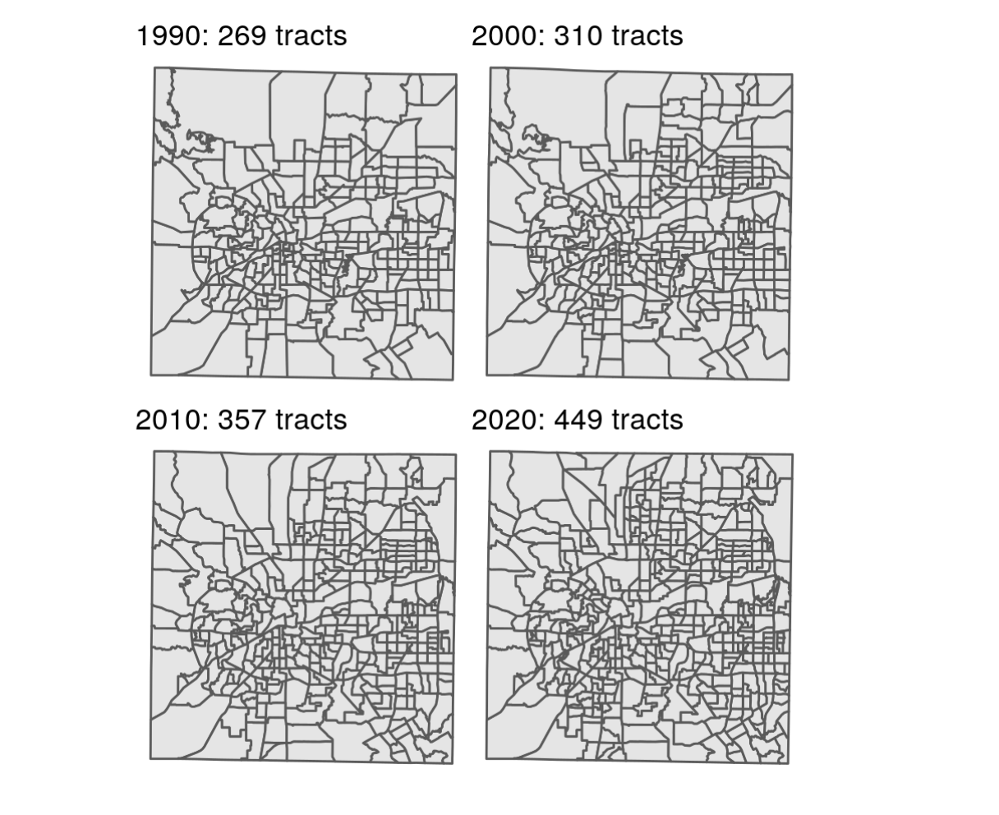
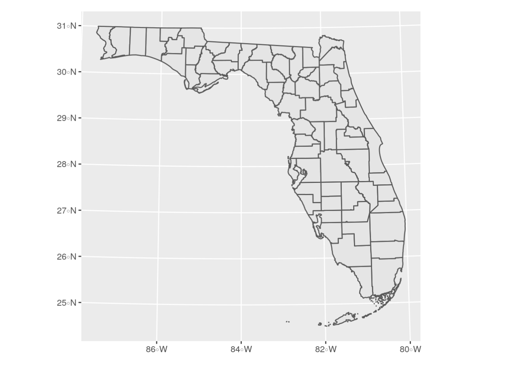
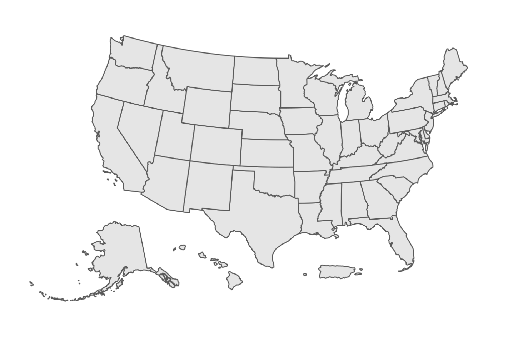
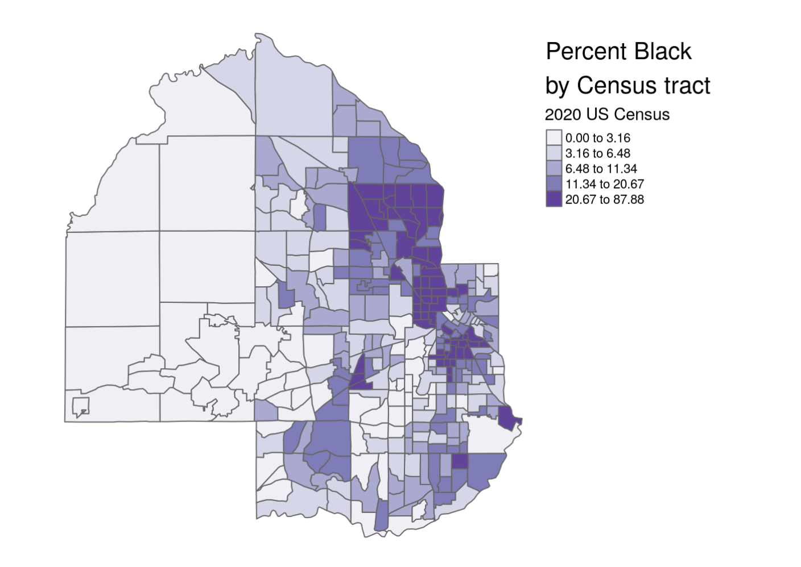

```{r setup, include = FALSE}
library(learnr)
library(primer.tutorials)
library(tidyverse)
library(stringr)
library(primer.data)
library(tidycensus)
library(ipumsr)
library(ggthemes)
library(knitr)
library(stringr)
library(tigris)
library(tmap)
library(mapview)
library(leaflet)
library(ggplot2)
library(patchwork)
library(glue)
knitr::opts_chunk$set(echo = FALSE)
options(tutorial.exercise.timelimit = 60, 
        tutorial.storage = "local",
        tigris_use_cache = TRUE) 


##Needed for chapter 5

st <- states(year = 2019)

##Needed for chapter 6

dc_income <- get_acs(
  geography = "tract", 
  variables = "B19013_001",
  state = "DC", 
  year = 2020,
  geometry = TRUE
)

##Needed for chapter 6

us_median_age <- get_acs(
  geography = "state",
  variables = "B01002_001",
  year = 2019,
  survey = "acs1",
  geometry = TRUE,
  resolution = "20m"
) |> 
  shift_geometry()

##Needed for chapter 6

hennepin_race <- get_decennial(
  geography = "tract",
  state = "MN",
  county = "Hennepin",
  variables = c(
    Hispanic = "P2_002N",
    White = "P2_005N",
    Black = "P2_006N",
    Native = "P2_007N",
    Asian = "P2_008N"
  ),
  summary_var = "P2_001N",
  year = 2020,
  geometry = TRUE
) %>%
  mutate(percent = 100 * (value / summary_value))

##Needed for chapter 6

hennepin_black <- hennepin_race |> 
  filter(variable == "Black")

##Needed for chapter 6 

dallas_bachelors <- get_acs(
  geography = "tract",
  variables = "DP02_0068P",
  year = 2020,
  state = "TX",
  county = "Dallas",
  geometry = TRUE
)

##Needed for chapter 6 
 
pal <- colorNumeric(
  palette = "magma",
  domain = dallas_bachelors$estimate
)


# Center the tutorial around this book: https://walker-data.com/census-r/index.html


# This is all of the data that the Census Key is needed for.

# rural <- get_decennial(geography = "state",
#                        variables = c("P001001", "P002005"),
#                        year = 2010,
#                        output = "wide")
# write_rds(rural, "data/05-census-rural.rds")

rural <- read_rds("data/rural.rds")

# il_pums <- get_pums(variables = c("PUMA", "FINCP"),
#                     state     = "Illinois",
#                     recode    = TRUE,
#                     survey    = "acs1",
#                     year      = 2019)
# write_rds(il_pums, "data/05-census-il-pums.rds")

il_pums <- read_rds("data/il-pums.rds")
```

```{r copy-code-chunk, child = "../../child_documents/copy_button.Rmd"}
```

```{r info-section, child = "../../child_documents/info_section.Rmd"}
```

## Introduction
In this tutorial, we are going to learn how to access Census data, and how we can graph and map that data. 

## Accessing the Census API
### 

In this tutorial, we will cover how to download US Census Bureau data into R and then use it to create graphs.

### Exercise 1

We will access the US Census API via the **tidycensus** package. This will allow us to use an API key to then access Census data.

### 

Load the **tidycensus** package into your R session using `library(tidycensus)`. 

### 

Run `search()` in the Console to see the libraries that you've currently loaded, then copy and paste the command and the result into the space below. 

```{r accessing-the-census-1}
question_text(NULL,
    answer(NULL, correct = TRUE),
    allow_retry = TRUE,
    try_again_button = "Edit Answer",
    incorrect = NULL,
    rows = 3)
```

### 

The output should include the string "package:tidycensus". 

### Exercise 2

Now that we have the package needed to access the Census database, we need to get an API key. 

An API key is basically a password for an API, but it often comes with certain restrictions. For example, the Census only allows you to collect 50 variables (or columns) from a database at a time. 

### 

Visit [https://api.census.gov/data/key_signup.html](https://api.census.gov/data/key_signup.html) and request an API key. Use your school or other organization name for the `Organization Name` field. Follow the steps and verify your API key via email. 

### 

Copy and paste your API key into the box below. If you don't want to share your API key, change a few letters to make it invalid.

```{r accessing-the-census-2}
question_text(NULL,
    answer(NULL, correct = TRUE),
    allow_retry = TRUE,
    try_again_button = "Edit Answer",
    incorrect = NULL,
    rows = 3)
```

### 

While an API key isn't mandatory for accessing the Census, it allows you to do more requests and use multiple computers to collect data. It's also a necessity for using the `tidycensus` package.

### Exercise 3

You may remember putting your GitHub Personal Access Token into your `.Renviron` file for safekeeping. We'll be doing the same for our Census API key, but the process looks a little bit different.

### 

The **tidycensus** package makes the process much simpler. Run `census_api_key("YOUR API KEY HERE", install = TRUE)` in the Console, substituting your API key in the field.

This should save your key into your `.Renviron` file.

### 

Run `Sys.getenv("CENSUS_API_KEY")` in the Console. Copy-paste the command and the output in the space below. 

```{r accessing-the-census-3}
question_text(NULL,
    answer(NULL, correct = TRUE),
    allow_retry = TRUE,
    try_again_button = "Edit Answer",
    incorrect = NULL,
    rows = 2)
```

### 

This should contain your Census API key. If you want to see where the key is stored, run `usethis::edit_r_environ()` in the Console. It should open up your `.Renviron` file and show you all of the keys that you have stored there so far. Make sure to close this file after every usage, for it stores very sensitive information that you don't want to accidently alter or delete. 


## Getting data 
### 

The Census API works by accessing Census databases and tables. We can find these tables by visiting [data.census.gov](data.census.gov). We will learn how to access data from the **American Community Survey**, the **Decennial Census**, and the **Population Estimates Program** in this section. 

Note: Throughout this section we will be working through content from [this](https://walker-data.com/census-r/an-introduction-to-tidycensus.html) book.

<!-- DK: Review for discussion the Maps and IPUMS appendices. SG: Done-->

### Exercise 1

Let's try accessing the Decennial Census database. In order to do this, we'll use the `get_decennial()` function with the `geography`, and `variables` arguments.

### 

Let's try to find the total American population by state. First of all, we need to access the variable containing these populations, which is "P001001".

### 

Run `get_decennial()` below setting `geography` to  `"state"`, and `variables` to `"P001001"`.

```{r getting-data-1, exercise = TRUE}

```

```{r getting-data-1-hint-1, eval = FALSE}
get_decennial(
  ... = "...", 
  variables = "..."
)
```

### 

This should return a tibble with 52 rows and 4 columns, and should start like the image below.

```{r}
include_graphics("images/first_decennial.png")
```

### 

The `geography` argument determines the scope of the data (such as `us` for the entire country and `county` for counties), and the `variables` argument defines which variables you want to use.

### Exercise 2

`get_decennial()` has a default value for the `year` argument, which is `2010`. Copy and paste your code from above and add the `year` argument, and set it to `2020`.

```{r getting-data-2, exercise = TRUE}

```

<button onclick = "transfer_code(this)">Copy previous code</button>

```{r getting-data-2-hint-1, eval = FALSE}
get_decennial(
  ... = "...", 
  variables = "...",
  year = ...
)
```

### 

By changing the `year` argument, we can specify when we want our data from. 

### Exercise 3

Along with the arguments we have already learned, there is also the `sumfile` argument, or "summary file". 

### 

Run the `get_decennial()` function below setting `geography` to `"state"`, `variables` to `"P1_005N"`, `year` to `2020`, and `sumfile` to `"pl"`.

<!-- AG: I'm not planning on breaking up API requests into different exercises since there is a limit. Plus a bad API request will make you load gigabytes onto your computer and take forever. -->


```{r getting-data-3, exercise = TRUE}

```

```{r getting-data-3-hint-1, eval = FALSE}
get_decennial(geography = "...",
        variables      = "...",
        year = ...,
        sumfile = "..."
)
```

### 

This retrieves information on the American Indian & Alaska Native population by state from the 2020 decennial Census. The "pl" summary file is one type that is a limited subset of variables from the decennial US Census to be used for legislative redistricting. 

To learn more about the `sumfile` argument, click [here](https://walker-data.com/census-r/an-introduction-to-tidycensus.html#getting-started-with-tidycensus)

### Exercise 4

Just as `get_decennial()` gets information from the Decennial Census, `get_acs()` gets information from the **A**merican **C**ommunity **S**urvey. 

### 

Run the `get_acs()` function setting `geography` to  `"state"`, `variables` to `"B05006_150"` and `year` to `2020`.

```{r getting-data-4, exercise = TRUE}

```

```{r getting-data-4-hint-1, eval = FALSE}
get_acs(geography = "...",
        variables      = "...",
        year = ...
)
```

### 

The example above fetches data on the number of residents born in Mexico by state. Notice that the tibble produced has an "estimate" and a "moe" column rather than a "value" column like the Decennial Census data. The "estimate" column is ACS's estimate, and the "moe" column is the margin of error around that estimate. 

### Exercise 5

Along with the arguments, we've already learned, there is also a `survey` argument. This argument defaults to 5 year periods if not specified. We can change it to a one-year period rather than a default 5-year period by adding `survey = "acs1"`.

### 

Run `get_acs` below setting `geography` to `"state"`, `variables` to `"B05006_150"`, `survey` = `"acs1"`, and `year` to `2019`.


```{r getting-data-5, exercise = TRUE}

```

<button onclick = "transfer_code(this)">Copy previous code</button>

```{r getting-data-5-hint-1, eval = FALSE}
get_acs(
  ... = "...", 
  variables = "...", 
  survey = "...",
  ... = 2019
)
```

### 

The above yields data on the number of residents born in Mexico by state in the year of just 2019 instead of a 5-year period like exercise 3. 

### 

Notice the the GEOID column contains the FIPS code of the area the data covers. This code is a standardized way to identify the different areas and gets larger as the scope narrows down. You can learn more about FIPS codes [here](https://transition.fcc.gov/oet/info/maps/census/fips/fips.txt#:~:text=FIPS%20codes%20are%20numbers%20which,to%20which%20the%20county%20belongs.).

### Exercise 6

Rather than using the `variables` argument, users can supply a table name to the `table` parameter in `get_acs()`; this will return data for every variable in that table. 

Run `get_acs()` below setting `geography` to `"state"`, `table` to `"B001001"`, and `year` to `2020`

```{r getting-data-6, exercise = TRUE}

```

<button onclick = "transfer_code(this)">Copy previous code</button>

```{r getting-data-6-hint-1, eval = FALSE}
get_acs(
  ... = "...", 
  table = "...",
  ... = ...
)
```

### 

This code got all variables associated with table "B01001", which covers sex broken down by age, from the 2016-2020 5-year ACS.

### Exercise 7

What if we want to analyze a variable at the county level, but only in one state? We can use the `state` argument along with the geography argument.

### 

Run `get_acs()` below setting `geography` = `"county"`, `variables` to `"B19013_001"`, `state` to `"WI"`, and `year` to `2020`


```{r getting-data-7, exercise = TRUE}

```

<button onclick = "transfer_code(this)">Copy previous code</button>

```{r getting-data-7-hint-1, eval = FALSE}
get_acs(
  ... = "...", 
  variables = "...", 
  ... = "WI",
  year = ...
)
```

### 

The example above returns average household income by county, but only in the state of Wisconsin. When using the `state` argument, you can use the state name (`"Wisconsin"`), the state postal code (`"WI"`), or the FIPS code (`"55"`).

### Exercise 8

Smaller geographies, like Census tracts, can be subsetted as well by the `county` argument. 

Run `get_acs()` below setting `geography` = `"tract"`, `variables` to `"B19013_001"`, `state` to `"WI"`, `county` to `"Dane"`, and `year` to `2020`

```{r getting-data-8, exercise = TRUE}

```

<button onclick = "transfer_code(this)">Copy previous code</button>

```{r getting-data-8-hint-1, eval = FALSE}
get_acs(
  geography = "...", 
  variables = "...", 
  state = "...", 
  ... = "Dane",
  ... = ...
)
```

### 

The above code retrieves the average household income for every tract in Dane County in Wisconsin. Subsetting is extremely useful, so that way, you don't have to download a bunch of data that is irrelevant to you.

### Exercise 9

Let's switch gears. What if we don't know what a variable ID means; after all, they're just a bunch of letters and numbers.

Luckily, the `tidycensus` packages offers the `load_variables()` function. 

Run `load_variables()` setting `year` to `2016`, and `dataset` to `"acs5"`

```{r getting-data-9, exercise = TRUE}

```

<button onclick = "transfer_code(this)">Copy previous code</button>

```{r getting-data-9-hint-1, eval = FALSE}
load_variables(year = ..., dataset = "...")
```

### 

It should start with this: 

```{r}
include_graphics("images/load_vars.png")
```

Notice how it shows the variable names and gives it a "definition" per say under the "label" and "concept" column. 

To learn more about `load_variables()` and its arguments, click [here](https://walker-data.com/census-r/an-introduction-to-tidycensus.html#searching-for-variables-in-tidycensus). 

### Exercise 10

Now we may know what a variable name means, but it's probably pretty annoying to type that every, single time you need it. So how can we rename it?

Run `get_acs()` below setting `geography` to `"county"`, `state` = `"Georgia"`, `variables` to a vector containing `medinc` which is assigned to `"B19013_001"` and `medage` which is assigned to `"B01002_001"`, and `year` to `2020`.  

```{r getting-data-10, exercise = TRUE}

```

<button onclick = "transfer_code(this)">Copy previous code</button>

```{r getting-data-10-hint-1, eval = FALSE}
get_acs(
  geography = "...",
  state = "...",
  ... = c(medinc = "...",
                medage = "..."),
  year = ...
)
```

### 

As seen below in the variable column, the names are "medinc" and "medage", not the complex ones we imported. 

```{r}
include_graphics("images/rename_ex.png")
```

### Exercise 11

Now, let's learn about `get_estimates()`.
This gets data from the **Population Estimates Program** (PEP). 

Run `get_estimates` below setting `geography` to `"county"`, `product` to `"components"`, `state` to `"NY"`, `county` to `"Queens"`, and `year` to `2019`

```{r getting-data-11, exercise = TRUE}

```

<button onclick = "transfer_code(this)">Copy previous code</button>

```{r getting-data-11-hint-1, eval = FALSE}
get_estimates(
  geography = "...",
  product = "...",
  ... = "...",
  county = "...",
  ... = ...
)
```

### 

The code above requested all components of change population estimates for 2019 for Queens County in NY. 

The confusing part of this function is probably the `product` argument. Well, this `product` argument essentially allows the user to access the indicators used to produce the intercensal population estimates. 

Learn more about `get_estimates()` and its arguments [here](https://walker-data.com/census-r/an-introduction-to-tidycensus.html#other-census-bureau-datasets-in-tidycensus)

### Exercise 12

`get_flows()` allows for analysis of immigrants, emigrants, and net migration for a given geography using data from a given 5-year ACS sample.

Run `get_flows()` below setting `geography` to `"county"`, `state` to `"HI"`, `county` to `"Honolulu"`, and `year` to `2019`

```{r getting-data-12, exercise = TRUE}

```

<button onclick = "transfer_code(this)">Copy previous code</button>

```{r getting-data-12-hint-1, eval = FALSE}
honolulu_migration <- get_flows(
  geography = "...",
  ... = "...",
  county = "...",
  ... = ...
)
```

### 

This should return a tibble with 6 columns, one of them being "variable". We can see variables such as "MOVEDIN" and corresponding estimates like 152 for the "MOVEDIN" variable.

### 

Congrats! You now have the necessary skills to pull all kinds of data from the [US Census Bureau](https://www.census.gov/)


<!-- DK: Do chapter 5 of the book. SG: Done -->

## Census geographic data
<!-- DK: First question should be library(tigris) SG: Done -->

Census and ACS data are associated with geographies, which are units at which the data is aggregated. We are going to learn how to work with these.

Throughout this section we will be working through content from [this](https://walker-data.com/census-r/census-geographic-data-and-applications-in-r.html) book.

### 

<!-- DK: Teach about usethis::edit_r_profile(). -->

### Exercise 1

Load the `tigris` package 

```{r census-geographic-da-1, exercise = TRUE}

```

<button onclick = "transfer_code(this)">Copy previous code</button>

```{r census-geographic-da-1-hint-1, eval = FALSE}
library(...)
```

### 

Working with spatial datasets from this database is quite complex; fortunately, R offers the `tigris` package which does a lot of the work for us. Let's explore the basic functions of this package. 

### Exercise 2

One problem with `tigris` is that sometimes it will take forever to download data. We can avoid this by editing our `.Rprofile` file. 

Run `usethis::edit_r_profile()` in the console. Then put `options(tigris_use_cache = TRUE)` in your `.Rprofile` file. Save and close the file.

### 

Type `readLines("~/.Rprofile")` in the Console. Copy/paste the command/result:

```{r census-geographic-da-2}
question_text(NULL,
	answer(NULL, correct = TRUE),
	allow_retry = TRUE,
	try_again_button = "Edit Answer",
	incorrect = NULL,
	rows = 3)
```

### 

The `~` symbol indicates your home directory. The command should have returned the content of your `.Rprofile` file, which should be the one line you just added. But, depending on your computer set up, this might not work. No worries if so!


### Exercise 3

Go ahead and restart your R session. This will close the tutorial; just open it again. 

Then in your console, run `options("tigris_use_cache")`. Copy and paste the command and output in the box below. 

```{r census-geographic-da-3}
question_text(NULL,
	message = "answer here",
	answer(NULL,
	correct = TRUE),
	allow_retry = FALSE,
	incorrect = NULL,
	rows = 6)
```

### 

This should return a value of `TRUE`. Now this setting will be in your `.Rprofile` until you change it!


### Exercise 4

Using the assignment operator, create a variable named `st` and assign it to `states(year = 2019)`. On the line right below that, run `class()` with `st` as the argument. 

```{r census-geographic-da-4, exercise = TRUE}

```

<button onclick = "transfer_code(this)">Copy previous code</button>

```{r census-geographic-da-4-hint-1, eval = FALSE}
... <- states()
class(...)
```

### 

This should return two datatypes: `sf` and `data.frame`

The object `st` includes a data frame with multiple columns representing characteristics of  states such as name, postal code, and Census ID (the GEOID column). It also contains a special list-column, **"geometry"**, which is made up of a sequence of coordinate of longitude/latitude coordinate pairs that show the boundary of the state.

### Exercise 5

We can visualize this "geometry" column with the `plot()` function. Run `plot()` below with the `geometry` column as the argument. Remember we extract columns using the `$` operator. 

```{r census-geographic-da-5, exercise = TRUE}

```

<button onclick = "transfer_code(this)">Copy previous code</button>

```{r census-geographic-da-5-hint-1, eval = FALSE}
plot(st$...)
```

### 

This should show a zoomed out map of the US. 

### Exercise 6

We can also just grab counties from a specific state. 

Create a variable below named `nm_counties` and assign it to the function `counties()` with the argument `"NM"`. Then below that, run `plot()` with the `geometry` column extracted from the variable. 

```{r census-geographic-da-6, exercise = TRUE}

```

<button onclick = "transfer_code(this)">Copy previous code</button>

```{r census-geographic-da-6-hint-1, eval = FALSE}
nm_counties <- ...("NM")
plot(...$geometry)
```

### 

It should produce a graph like this: 

```{r}
include_graphics("images/counties.png")
```

We can visualize all the counties in New Mexico with the `counties()` function. 

### 

We can do the same thing with tracts with the `tract()` function with a `state` argument and a `county` argument.

### Exercise 7

Now, Let’s acquire landmark point data for DC.

Create a variable named `dc_landmarks` and assign it to the `landmarks()` function. Set the first argument to `"DC"`, and set the second argument, `type`, to `"point"`. Then below that, use `plot()` to plot the extracted geometry column from the variable.  

```{r census-geographic-da-7, exercise = TRUE}

```

<button onclick = "transfer_code(this)">Copy previous code</button>

```{r census-geographic-da-7-hint-1, eval = FALSE}
dc_landmarks <- landmarks("...", type = "...")

plot(dc_landmarks$...)
```

### 

This should produce a bunch of what seems like random points, which represent all the landmarks in DC.

### Exercise 8

We've created dots with landmarks, but what if we want to study something like roads? Lines would be more useful.

Create a variable named `dc_roads` and assign it to the `primary_secondary_roads()` function with a single argument of `"DC"`. Below that, plot the extracted `geometry` column from the variable just like before.

```{r census-geographic-da-8, exercise = TRUE}

```

<button onclick = "transfer_code(this)">Copy previous code</button>

```{r census-geographic-da-8-hint-1, eval = FALSE}
dc_roads <- ...("DC")
plot(...)
```

### 

You should see a bunch of lines which represent DC's roads.

### Exercise 9

Points and lines are cool, but sometimes we may need to use two-dimensional shapes/polygons. 

Create a variable below named `dc_block_groups` and assign it to the function `block_groups()` with a single argument of `"DC"`. Then below that, plot the geometry column like before. 

```{r census-geographic-da-9, exercise = TRUE}

```

<button onclick = "transfer_code(this)">Copy previous code</button>

```{r census-geographic-da-9-hint-1, eval = FALSE}
dc_block_groups <- block_groups("...")
plot(...)
```

### 

Now you should see a map of DC that is divided into many different shapes. 

### Exercise 10

We just went throught the basic usage of the `tigris` package. Now we're going to plot geographic data using the `ggplot2` package. 

We have already defined la_tracts for you in the box. Below that, run `ggplot()` with `la_tracts` as the argument and then add the `geom_sf()` layer. 

```{r census-geographic-da-10, exercise = TRUE}
la_tracts <- tracts("NM", "Los Alamos")
```

<button onclick = "transfer_code(this)">Copy previous code</button>

```{r census-geographic-da-10-hint-1, eval = FALSE}
la_tracts <- tracts("NM", "Los Alamos")
ggplot(...) + 
  geom_sf()
```

### 

This should return a regular mapped graph; however, notice that it has an annoying background. 
### 

### Exercise 11

Copy and paste your code from before and add the `theme_void()` layer. 

```{r census-geographic-da-11, exercise = TRUE}

```

<button onclick = "transfer_code(this)">Copy previous code</button>

```{r census-geographic-da-11-hint-1, eval = FALSE}
... +
  theme_void()
```

### 

This should get rid of the background and just show the tracts. 

**Note: If you ever want to compare two graphs without faceting, simply create the two graphs and concatenate them in a new line using the `+` operator. **

### Exercise 12

We can also make our graphs interactive by using the `mapview` package. The package visualizes geographic data on an interactive, zoomable map.

Below `la_tracts`, run `mapview()` with the variable as the argument.

```{r census-geographic-da-12, exercise = TRUE}
la_tracts <- tracts("NM", "Los Alamos")
```

<button onclick = "transfer_code(this)">Copy previous code</button>

```{r census-geographic-da-12-hint-1, eval = FALSE}
la_tracts <- tracts("NM", "Los Alamos")
mapview(...)
```

### 

Notice that our map is now interactive. We can hover above areas and see something pop up, and we can also zoom in and out.

### Exercise 13

Let's take it one step further. Logically, we can assume that tracts change with each decennial census. In order to show this, we will need the packages `patchwork` and `glue` along with `tidyverse`. 

### 

Take a look below. We have created a variable for you already. This will focus on data from Tarrant County, Texas. The `map` function iterates through each year, grabbing a cartographic boundary file of Census tracts for the four decennial Census years.

Below the `tracts()` function but inside the end `})`, start a graph with `ggplot()` and `year_tracts` as the argument. Add the `geom_sf()` layer and the `theme_void` layer. Finally, add the following layer: `labs(title = glue("{.x}: {nrow(year_tracts)} tracts"))`.


```{r census-geographic-da-13, exercise = TRUE}
yearly_plots <- map(seq(1990, 2020, 10), ~{
  year_tracts <- tracts("TX", "Tarrant", year = .x,
                        cb = TRUE)

})
```

<button onclick = "transfer_code(this)">Copy previous code</button>

```{r census-geographic-da-13-hint-1, eval = FALSE}
yearly_plots <- map(seq(1990, 2020, 10), ~{
  year_tracts <- tracts("TX", "Tarrant", year = .x,
                        cb = TRUE)

  ggplot(...) + 
    geom_sf() + 
    theme_void() + 
    labs(title = glue("{.x}: {nrow(year_tracts)} tracts"))
})
```

### 

By using the `glue` package in `labs()`, we create a custom title for each year that shows how many Census tracts are there. 

This generates the graphs, but we are not done yet. The graphs are now stored in the `yearly_plots` variable.  

### Exercise 14

Now, we can use `patchwork` to facet the graphs.

Copy and paste your code from above. Then below that, use `patchwork` to facet it. Check the hint to see how we should format this. We are indexing the `yearly_plot` object using double brackets. 

```{r census-geographic-da-14, exercise = TRUE}

```

<button onclick = "transfer_code(this)">Copy previous code</button>

```{r census-geographic-da-14-hint-1, eval = FALSE}
... 
(yearly_plots[[1]] + ...[[2]]) / 
  (yearly_plots[[...]] + ...[[...]])
I sense a pattern...
```

### 

Your graph should look like this:

```{r}

```

The forward slash that we included basically stacks graphs 1 and 2 on top of graphs 3 and 4 instead of putting all 4 next to each other. 

### 

We've successfuly faceted a graph by time, how cool is that?!

### Exercise 15

For geographic data to appropriately represent locations in mapping and spatial analysis, they must be referenced to some model of the Earth’s surface correctly. In simpler terms - a data model of the state of Florida should represent where Florida is actually located relative to other locations! This is defined as a coordinate reference system (CRS).

### 

When plotting an object with `geom_sf()` we can specify a CRS with `coord_sf()`

Create a variable named `fl_counties` and assign it to the `counties()` function with arguments `"FL"` and `cb = TRUE`. Below that, use `ggplot()` and `geom_sf()` to plot the variable. 

```{r census-geographic-da-15, exercise = TRUE}

```

<button onclick = "transfer_code(this)">Copy previous code</button>

```{r census-geographic-da-15-hint-1, eval = FALSE}
fl_counties <- counties("...", cb = ...)
ggplot(...) + 
  geom_sf()
```

### 

Good! Now let's incorporate a specified CRS with `coord_sf()`.

### Exercise 16

Copy and paste your code from before. Add the `coord_sf()` layer and set the argument `crs` to `3087`.

```{r census-geographic-da-16, exercise = TRUE}

```

<button onclick = "transfer_code(this)">Copy previous code</button>

```{r census-geographic-da-16-hint-1, eval = FALSE}
... + 
  coord_sf(crs = ...)
```

### 

Now that we've specified a CRS, your graph should look like this:

```{r}

```

### Exercise 17

As seen in the earlier graph, the tick marks default to longitude and latitude. We can change this with the `datum` argument.

Copy and paste your code from above. Within `coord_sf()`, add another argument (`datum`) and set it to `3087`.

```{r census-geographic-da-17, exercise = TRUE}

```

<button onclick = "transfer_code(this)">Copy previous code</button>

```{r census-geographic-da-17-hint-1, eval = FALSE}
... + 
  coord_sf(... = ..., datum = ...)
```

### 

Now we know how to modify both our CRS, and our axis ticks. 

### Exercise 18

Let's shift gears to national US mapping. A common problem for national display of the United States is the fragmented nature of US states and territories geographically. A lot of times, programmers have to decide what to do with Hawaii, Alaska, and Puerto Rico. 

Using the `tigris` function `states()` with `cb` set to `TRUE`, create a variable named `us_states` and assign it. Below that, use `ggplot()`, `geom_sf()` and `theme_void()` to construct a map. 


```{r census-geographic-da-18, exercise = TRUE}

```

<button onclick = "transfer_code(this)">Copy previous code</button>

```{r census-geographic-da-18-hint-1, eval = FALSE}
us_states <- states(cb = ...)
ggplot(...) + 
  geom_sf() +
  theme_void()
```

### 

We can see how difficult it is to get anything useful from this map. 

### Exercise 19

We can fix this by using a a projected coordinate reference system appropriate for the United States, such as the continental US Albers Equal Area projection. 

### 

Copy and paste your code from earlier and add the `coord_sf()` layer. Within this function, set `crs` to `"ESRI:102003"`. 


```{r census-geographic-da-19, exercise = TRUE}

```

<button onclick = "transfer_code(this)">Copy previous code</button>

```{r census-geographic-da-19-hint-1, eval = FALSE}
... + 
  coord_sf(crs = "...")
```

### 

Notice that this reformats the graph and makes it much easier to analyze. 

### Exercise 20

We can do this same thing and make it a lot easier through the `tigris` package. 

Notice that we redefined `us_states` for you. Below that, create a new variable named `us_states_shifted` and assign it to the function `shift_geometry()` with `us_states` as the argument. 

```{r census-geographic-da-20, exercise = TRUE}
us_states <- states(cb = TRUE)
```

<button onclick = "transfer_code(this)">Copy previous code</button>

```{r census-geographic-da-20-hint-1, eval = FALSE}
us_states <- states(cb = TRUE)
us_states_shifted <- shift_geometry(...)
```

### 

`shift_geometry()` does all the reformatting work for us, so now we can just plot it.

### Exercise 21

Copy and paste your code from above. Below that, create a plot using `ggplot()`, `geom_sf()`, and `theme_void()`.

```{r census-geographic-da-21, exercise = TRUE}

```

<button onclick = "transfer_code(this)">Copy previous code</button>

```{r census-geographic-da-21-hint-1, eval = FALSE}
us_states <- states(cb = TRUE)
us_states_shifted <- shift_geometry(...)
ggplot(...) +
  geom_sf() +
  theme_void()
```

### 

Your graph should look like this:

```{r}

```

We have seen how we can `tigris` and its functions to reformat graphs. Learn more about `shift_geometry()` and its arguments [here](https://walker-data.com/census-r/census-geographic-data-and-applications-in-r.html#shifting-and-rescaling-geometry-for-national-us-mapping).

### Exercise 22

Let's explore some other useful reformatting options, such as changing polygons to points. 

### 

Look below to what we've already written. `tx_places` uses the `places()` function to get places from Texas, and `tx_outline` gets the actual state outline of Texas using `states()`. Click run code. 

```{r census-geographic-da-22, exercise = TRUE}
tx_places <- places("TX", cb = TRUE) %>%
  filter(NAME %in% c("Dallas", "Fort Worth", "Houston",
                     "Austin", "San Antonio", "El Paso")) %>%
  st_transform(6580)

tx_outline <- states(cb = TRUE) %>%
  filter(NAME == "Texas") %>%
  st_transform(6580)

ggplot() + 
  geom_sf(data = tx_outline) + 
  geom_sf(data = tx_places, fill = "red", color = NA) + 
  theme_void()
```

<button onclick = "transfer_code(this)">Copy previous code</button>

```{r census-geographic-da-22-hint-1, eval = FALSE}

```

### 

The issue with this graphic is that city geographies are pretty irregular All  cities spread across large areas, have holes, and  include portions that are far from the main city. We can fix this by making the polygons into points. 

### Exercise 23

Copy and paste the code above. Before `ggplot()`, create a new variable named `tx_centroids`. Set this variable to the `st_centroids()` function with the argument `tx_places`. Then in the second `geom_sf()`, set `data` to `tx_centroids`, `color` to `"red"`, and `size` to `3`.

```{r census-geographic-da-23, exercise = TRUE}

```

<button onclick = "transfer_code(this)">Copy previous code</button>

```{r census-geographic-da-23-hint-1, eval = FALSE}
...

tx_centroids <- st_centroids(...)
ggplot() +
  geom_sf(...) + 
  geom_sf(data = ..., color = "...", size = ...) + 
  theme_void()
```

### 

Notice that the cities are displayed as circles instead of irregular polygons now. 

### 

Learn more about polygons and their features [here](https://walker-data.com/census-r/census-geographic-data-and-applications-in-r.html#exploding-multipolygon-geometries-to-single-parts).

In this section, we learned how to work with geographic data and different ways to format and map it. 

## Mapping Census data
### 

Note: Throughout this section we will be working through [this](https://walker-data.com/census-r/mapping-census-data-with-r.html) book. 

This chapter will cover map-making with Census data utilizing the `tidycensus` package.


### Exercise 1

Run `get_acs()` below setting `geography` to `"tract"`, `variables` to `"B19013_001"`, `state` to `"DC"`, `year` to `2020`, and `geometry` to `TRUE` and assign this to an object named `dc_income`.

```{r mapping-census-data-1, exercise = TRUE}

```

<button onclick = "transfer_code(this)">Copy previous code</button>

```{r mapping-census-data-1-hint-1, eval = FALSE}
dc_income <- get_acs(
  geography = "...", 
  variables = "...",
  ... = "...", 
  ... = 2020,
  ... = TRUE
)
```

### 

The code above fetches information on median household income for Census tracts in the District of Columbia. By setting the `geometry` argument to `TRUE`, we enable ourselves to map this data. 

### Exercise 2

The result from exercise 1 is very hard to understand, so we can fix this by visualizing the data.

Run `plot()` below selecting the `"estimate"` column from `dc_income` using brackets. 

```{r mapping-census-data-2, exercise = TRUE}

```

<button onclick = "transfer_code(this)">Copy previous code</button>

```{r mapping-census-data-2-hint-1, eval = FALSE}
plot(dc_income["..."])
```

### 

Your map should look something like this:

```{r}
include_graphics("images/first_map.png")
```

### Exercise 3

Along with `tidycensus`, we can create maps using `ggplot()` and `geom_sf()`. In order to do this, we will need to have `tidyverse`, `tidycensus`, and `tigris` loaded, which we did for you in this tutorial. 

Run `get_acs()` below setting `geography` to `"state"`, `variables` to `"B01002_001"`, `year` to `2019`, `survey` to `"acs1"`, `geometry` to `TRUE`, and `resolution` to `"20m"`, and pipe this to `shift_geometry()`.

```{r mapping-census-data-3, exercise = TRUE}

```

<button onclick = "transfer_code(this)">Copy previous code</button>

```{r mapping-census-data-3-hint-1, eval = FALSE}
us_median_age <- get_acs(
  geography = "...",
  variables = "...",
  ... = 2019,
  survey = "...",
  geometry = ...,
  ... = "20m") |> 
  shift_geometry()
    
```

### 

The `resolution` argument is necessary in this case because it will omit the long archipelago of islands to the northwest of Hawaii. The `shift_geometry()` function shifts and rescales areas for national mapping. 

### Exercise 4

Copy and paste your code from last time. Set the result from `get_acs()` to an object named `us_median_age`. Then below that, run `plot()` with `us_median_age$geometry` as the argument

```{r mapping-census-data-4, exercise = TRUE}

```

<button onclick = "transfer_code(this)">Copy previous code</button>

```{r mapping-census-data-4-hint-1, eval = FALSE}
us_median_age <- get_acs(
  geography = "...",
  variables = "...",
  ... = 2019,
  survey = "...",
  geometry = ...,
  ... = "20m"
)  |> 
  shift_geometry()

plot(...$...)
```

### 

This should produce a map of the US. 

### Exercise 5

We style this map with regular `ggplot()` conventions. Run `ggplot()` below setting `data` to `us_median_age`, and within `aes()`, set `fill` to `estimate`. Then add the `geom_sf()` layer. 

```{r mapping-census-data-5, exercise = TRUE}

```

<button onclick = "transfer_code(this)">Copy previous code</button>

```{r mapping-census-data-5-hint-1, eval = FALSE}
ggplot(data = ..., ...(... = estimate)) + 
  geom_sf()
```

### 

This should produce a graph that looks like this: 

```{r}
include_graphics("images/ggplot_plt.png")
```

As you can see, it is now shaded depending on the `estimate` column. 

### Exercise 6

We can customize this even further. Copy and paste your code from last time and add the layer, `scale_fill_distiller()`, setting `palette` to `"RdPu"`, and `direction` to `1`.

```{r mapping-census-data-6, exercise = TRUE}

```

<button onclick = "transfer_code(this)">Copy previous code</button>

```{r mapping-census-data-6-hint-1, eval = FALSE}
... +
  scale_fill_distiller(palette = "..."
                       direction = ...)
```

### 

`scale_fill_distiller()` allows the user to change the color palette of the graph. 

### Exercise 7

Copy and paste your code from above. Add appropriate labels using the `labs()` function and also add the `theme_void()` layer. Additionally within `labs()`, set the `fill` argument to `"ACS estimate"`

```{r mapping-census-data-7, exercise = TRUE}

```

<button onclick = "transfer_code(this)">Copy previous code</button>

```{r mapping-census-data-7-hint-1, eval = FALSE}
... +
  labs(title = "...",
       caption = "...",
       fill = "ACS estimate") + 
  theme_void()
```

Your graph should look like this:

```{r}
include_graphics("images/ggplot_plt2.png")
```

### 

Nice! You've successfully mapped Census data with `ggplot()`. 

### Exercise 8

Along with `plot()` and `ggplot()` conventions, we can also use another package to map Census data: `tmap`.

### 

We have defined a variable for you already named `hennepin_race` as seen below. It holds data on non-Hispanic white, non-Hispanic Black, Asian, and Hispanic populations for Census tracts in Hennepin County, Minnesota. Click "run code". 

```{r mapping-census-data-8, exercise = TRUE}
hennepin_race <- get_decennial(
  geography = "tract",
  state = "MN",
  county = "Hennepin",
  variables = c(
    Hispanic = "P2_002N",
    White = "P2_005N",
    Black = "P2_006N",
    Native = "P2_007N",
    Asian = "P2_008N"
  ),
  summary_var = "P2_001N",
  year = 2020,
  geometry = TRUE
) %>%
  mutate(percent = 100 * (value / summary_value))
```

<button onclick = "transfer_code(this)">Copy previous code</button>

```{r mapping-census-data-8-hint-1, eval = FALSE}

```

### 

Now that you've inspected the data, let's create the graph with `tmap`, which is very similar to `ggplot()` in the sense that they both use layers to construct graphs. 

### Exercise 9

Create a variable named `hennepin_black` which is just `hennepin_race` but **filtered** so it is when `variable` is "Black". 

```{r mapping-census-data-9, exercise = TRUE}

```

<button onclick = "transfer_code(this)">Copy previous code</button>

```{r mapping-census-data-9-hint-1, eval = FALSE}
hennepin_black <- hennepin_race |> 
  filter(variable == "...")
```

### 

Now we only have data on the "Black" population from Hennepin County. 

### Exercise 10

Run `tm_shape()` with `hennepin_black` as the argument, and add the `tm_polygons()` layer. 

```{r mapping-census-data-10, exercise = TRUE}

```

<button onclick = "transfer_code(this)">Copy previous code</button>

```{r mapping-census-data-10-hint-1, eval = FALSE}
tm_shape(...) + 
  tm_polygons()
```

### 

This should show a default view of Hennepin County. 

**We always have to initialize graphs in `tmap` with the `tm_shape()` function.**

### 

### Exercise 11

Copy and paste your code from before. Within `tm_polygons()`, set `col` to `"percent"`

```{r mapping-census-data-11, exercise = TRUE}

```

<button onclick = "transfer_code(this)">Copy previous code</button>

```{r mapping-census-data-11-hint-1, eval = FALSE}
... + 
  ...(col = "...")
```

### 

This should produce a graph that looks like this:

```{r}
include_graphics("images/tmap_plt.png")
```

By adding a `col` argument, we can see the change. 

### Exercise 12

Because our data is skewed, we have a lot of the same color on our graph. We can change the way data is divided for different colors. 

### 

Copy and paste your code from above and add the following arguments to `tm_polygons()`. Set `style` to `"quantile"` and `n` to `5`, which solves our problem above. Also set `palette` to `"Purples"` and `title` to `"2020 US Census"` for further customization. 

```{r mapping-census-data-12, exercise = TRUE}

```

<button onclick = "transfer_code(this)">Copy previous code</button>

```{r mapping-census-data-12-hint-1, eval = FALSE}
... + 
  ...(col = "...",
          style = "...",
          ... = 5,
          palette = "...",
          title = "...")
```

### 

This changed the color of our graph and also added more variation throughout the county. By switching to `quantile`, we ensure that each class has the same number of Census tracts. The `n = 5` shows that we want 5 quantiles. 

### Exercise 13

Finish off your graph by adding the `tm_layout()` layer and set `title` to `"Percent Black\nby Census Tract"`, `frame` to `FALSE`, and `legend.outside` to `TRUE`.

```{r mapping-census-data-13, exercise = TRUE}

```

<button onclick = "transfer_code(this)">Copy previous code</button>

```{r mapping-census-data-13-hint-1, eval = FALSE}
... + 
  tm_layout(title = "...",
            frame = ...,
            legend.outside = ...)
```

### 

Your graph should look like this: 

```{r}

```

`tm_layout()` is used to customize the styling of the map. You can learn more about it by running `??tm_layout` in your console. 

### Exercise 14

We can also facet `tmap` graphs with the `tm_facets()` function. The `by` argument specifies the column to be used to identify unique groups in the data.

Initialize the graph using `tm_shape()` with `hennepin_race` as the argument. Add the `tm_facets()` layer setting `by` to `"variable"` and `scale.factor` to `4`. 

```{r mapping-census-data-14, exercise = TRUE}

```

<button onclick = "transfer_code(this)">Copy previous code</button>

```{r mapping-census-data-14-hint-1, eval = FALSE}
...(hennepin_race) + 
  tm_facets(by = "...", scale.factor = ...)
```

### 

This facets the graph by the `variable` column. 

### Exercise 15

Copy and paste your code from before. Add the `tm_fill()` layer setting `col` to `"percent"`, `style` to `"quantile"`, `n` to `6`, `palette` to `"Blues"`, and `title` to `"Percent (2020 US Census)"`.

```{r mapping-census-data-15, exercise = TRUE}

```

<button onclick = "transfer_code(this)">Copy previous code</button>

```{r mapping-census-data-15-hint-1, eval = FALSE}
... + 
  tm_fill(... = "percent",
          style = "...",
          ... = 6,
          palette = "...",
          title = "...") 
```

### 

This should change the color palette a bit. We are also changing our fill to be based on the `percent` column in a "quantile" `style`. By now, we are starting to get an idea of the arguments that we can use to customize our graph. 

### Exercise 16

Finally, let's add some text. Copy and paste your code from earlier and add the `tm_layout()` layer, setting `bg.color` (background color) to `"grey"`, `legend.position` to a vector containing (-0.7, 0.15), and `panel.label.bg.color` to `"white"`. 

```{r mapping-census-data-16, exercise = TRUE}

```

<button onclick = "transfer_code(this)">Copy previous code</button>

```{r mapping-census-data-16-hint-1, eval = FALSE}
tm_layout(... = "grey", 
            ... = c(-..., ...),
            panel.label.bg.color = "...")
```

### 

Your graph should look like this:

```{r}
include_graphics("images/tmap_facet.png")
```

As you can see, it is successful faceted by race!

### 

There are so many different things you can do with `tmap` that we can't possibly cover in this tutorial, so check out this [link](https://walker-data.com/census-r/mapping-census-data-with-r.html#choropleth-maps-with-tmap) to learn more about it.

### Exercise 17

Now, all of the graphs we've covered so far are static; however, what if we want to create an interactive graph. We can do this using the `leaflet`, `mapview`, or `tmap` package. Let's dive in!

We have defined a variable, `dallas_bachelors`, for you below which holds data from Dallas County, Texas tracts. Below that, use the `mapview()` function with `dallas_bachelors` as the first argument, and set `zcol` to `"estimate"`.  

```{r mapping-census-data-17, exercise = TRUE}
dallas_bachelors <- get_acs(
  geography = "tract",
  variables = "DP02_0068P",
  year = 2020,
  state = "TX",
  county = "Dallas",
  geometry = TRUE
)
```

<button onclick = "transfer_code(this)">Copy previous code</button>

```{r mapping-census-data-17-hint-1, eval = FALSE}
...
mapview(..., zcol = "...")
```

### 

This should create an interactive map. Hover your mouse over different parts of it and see what it says. Note that you can also zoom in and out. 

The `zcol` argument takes a column in the dataset as an argument, and visualizes that column with an interactive map. The first argument just tells `mapview()` which dataset to take the column from. 

### Exercise 18

Another way you can make interactive graphs is through `tmap` itself. Before creating any graphs, you can do `tmap_mode("view")`. This will make all future tmap graphs interactive

Run `tmap_mode("view")` below. Then below that use `tm_shape()` to initialize the `dallas_bachelors`. 

```{r mapping-census-data-18, exercise = TRUE}

```

<button onclick = "transfer_code(this)">Copy previous code</button>

```{r mapping-census-data-18-hint-1, eval = FALSE}
tmap_mode("...")
tm_shape(...)
```

### 

### Exercise 19

Copy and paste your code from above. Now let's add the `tm_fill()` layer, setting `col` to `"estimate"`, `palette` to `"magma"`, and `alpha` to `0.5`.

```{r mapping-census-data-19, exercise = TRUE}

```

<button onclick = "transfer_code(this)">Copy previous code</button>

```{r mapping-census-data-19-hint-1, eval = FALSE}
...
... + 
  tm_fill(col = "...",
          palette = "...",
          alpha = ...)
```

### 

You can switch back to static graphs by doing `tmap_mode("plot")`.

### Exercise 20

Finally, we can create interactive graphs using `leaflet`. This package gives us more fine-grained control over our interactive graph.

### 

We have defined `pal` variable below which is storing a function to convert data values to colors for a given color palette.  

```{r mapping-census-data-20, exercise = TRUE}
pal <- colorNumeric(
  palette = "magma",
  domain = dallas_bachelors$estimate
)
```

<button onclick = "transfer_code(this)">Copy previous code</button>

```{r mapping-census-data-20-hint-1, eval = FALSE}

```

### 

### Exercise 21

Start a pipe with `leaflet()`. Then pipe it into `addProviderTiles()` with the argument `providers$Stamen.TonerLite`.

```{r mapping-census-data-21, exercise = TRUE}

```

<button onclick = "transfer_code(this)">Copy previous code</button>

```{r mapping-census-data-21-hint-1, eval = FALSE}
leaflet() |> 
  addProviderTiles(providers$Stamen.TonerLite)
```

### 

All we did so far was initialize the graph and add a basemap under it for reference. 

### Exercise 22

Copy and paste your earlier code and pipe `addPolygons()`. Within this, set `data` to `dallas_bachelors`, `color` to `pal(estimate)`, `weight` to `0.5`, `smoothFactor` to `0.2`, `fillOpacity` to `0.5`, and `label` to `~estimate`.

```{r mapping-census-data-22, exercise = TRUE}

```

<button onclick = "transfer_code(this)">Copy previous code</button>

```{r mapping-census-data-22-hint-1, eval = FALSE}
... |> 
  addPolygons(data = ...,
              ... = ~pal(estimate),
              weight = ...,
              smoothFactor = ...,
              fillOpacity = ...,
              ... = ~estimate)
```

### 

This added shapes to our maps. 

### Exercise 23

Copy and paste your code from earlier and pipe `addLegend()`. Within this function, set `position` to `"bottomright"`, `pal` to `pal`, `values` to `dallas_bachelors$estimate`, and `title` to `"% with bachelor's<br/>degree"`

```{r mapping-census-data-23, exercise = TRUE}

```

<button onclick = "transfer_code(this)">Copy previous code</button>

```{r mapping-census-data-23-hint-1, eval = FALSE}
... |> 
  addLegend(
    ... = "bottomright",
    pal = pal,
    values = ...,
    ... = "% with bachelor's<br/>degree"
  )
```

### 

We just added a legend for your graph and finished it off. Congrats!

### 

You should now have a basic sense of how to create interactive graphs in multiple ways. 

There are  alternate ways to create interactive graphs that you can check out [here](https://walker-data.com/census-r/mapping-census-data-with-r.html#interactive-mapping)

<!-- DK: Do chapter 6 of the book. SG: Done -->

<!-- ## Graphing Census data -->

<!-- ###  -->

<!-- Now that we've successfully accessed a variable name and the information contained within it, let's try graphing the ratio of rural population to the actual population for every state. -->

<!-- ### Exercise 1 -->

<!-- First, let's try to access the Decennial Census. The Decennial Census is conducted every 10 years and is the survey that the Census Bureau was established for in the first place. -->

<!-- ###  -->

<!-- Run the `load_variables()` function, setting the `year` argument to `2010` and the `dataset` argument to `"sf1"`. -->

<!-- ```{r graphing-census-data-1, exercise = TRUE} -->

<!-- ``` -->

<!-- ```{r graphing-census-data-1-hint-1, eval = FALSE} -->
<!-- load_variables(year    = ..., -->
<!--                dataset = ...) -->
<!-- ``` -->

<!-- ###  -->

<!-- This returns all of the variables that the Decennial Census uses. The `"sf1"` dataset contains the summary files for the Decennial Census, so we can look at it in order to see all of the variables used by the Census Bureau. -->

<!-- ### Exercise 2 -->

<!-- This returned a lot of information, but it's a little harder to find what we actually need. In this case, we need to find the actual population variable and the rural population so that we can determine the final ratio. -->

<!-- ###  -->

<!-- We can do this by using a standard `filter()` command like we did with tidyverse.  -->

<!-- ###  -->

<!-- Pipe the `load_variables()` function into a `filter()` command that filters the `concept` so that it equals `"URBAN AND RURAL"`. -->

<!-- ```{r graphing-census-data-2, exercise = TRUE} -->

<!-- ``` -->

<!-- <button onclick = "transfer_code(this)">Copy previous code</button> -->

<!-- ```{r graphing-census-data-2-hint-1, eval = FALSE} -->
<!-- load_variables(year    = ..., -->
<!--                dataset = ...) |> -->
<!--   filter(concept == ... & stringr::str_detect(..., ...)) -->
<!-- ``` -->

<!-- ###  -->

<!-- This filters the variables so that it only has data about the urban and rural populations, but it's absolutely massive and contains almost 9,000 variables, almost none of which are actually intelligible. -->

<!-- ### Exercise 3 -->

<!-- Let's filter out the variables so that they're only part of the "P" group and don't contain any unnecessary information. -->

<!-- ###  -->

<!-- Continue the pipe and use the `filter()` command to filter the `name` column so that it only displays entries containing the string `"P"` using `"string::str_detect()"`. -->

<!-- ```{r graphing-census-data-3, exercise = TRUE} -->

<!-- ``` -->

<!-- <button onclick = "transfer_code(this)">Copy previous code</button> -->

<!-- ```{r graphing-census-data-3-hint-1, eval = FALSE} -->
<!-- load_variables(year    = ..., -->
<!--                dataset = ...) |> -->
<!--   filter(concept == ...) |> -->
<!--   filter(stringr::str_detect(name, ...)) -->
<!-- ``` -->

<!-- ###  -->

<!-- The reason we chose the `"P"` variable group is because it also contains race data, making it useful later on in this tutorial. If you also wanted to find household data, you can use the `"H"` group. If you want to find information about the different variables and their groups, please visit [the Census API documentation](https://api.census.gov/data/2010/dec/sf1/variables.html). -->

<!-- ### Exercise 4 -->

<!-- Now that we have our variable names, let's actually load in our data. We can do this using the `get_decennial()` function, which is very similar to the `get_acs()` function that we used earlier. -->

<!-- ###  -->

<!-- This time, we need to get data from 2 variables: The total population ("P001001") and the rural population ("P002005").  -->

<!-- ###  -->

<!-- Run the `get_decennial()` function, setting the `geography` argument to `"state"`, the `year` argument to `2010`, the `variables` argument to a vector containing these two variable IDs, and the `output` argument to `"wide"`.  -->

<!-- ```{r graphing-census-data-4, exercise = TRUE} -->

<!-- ``` -->

<!-- ```{r graphing-census-data-4-hint-1, eval = FALSE} -->
<!-- get_decennial(geography = ..., -->
<!--               variables = c(..., ...), -->
<!--               year      = ...) -->
<!-- ``` -->

<!-- ###  -->

<!-- This gets all of the 2010 data from the P001001 and P002005 variables and their value for each state. -->

<!-- ### Exercise 5 -->

<!-- The thing is, this is really unhelpful! The variable names are stored in a column next to their values rather than in their own columns, making it really hard to just access one value without breaking your back. -->

<!-- ###  -->

<!-- Luckily, there's an easy way to fix this. Repeat the same code as before, but this time setting the `output` argument to `"wide"`. -->

<!-- ```{r graphing-census-data-5, exercise = TRUE} -->

<!-- ``` -->

<!-- <button onclick = "transfer_code(this)">Copy previous code</button> -->

<!-- ```{r graphing-census-data-5-hint-1, eval = FALSE} -->
<!-- get_decennial(geography = ..., -->
<!--               variables = c(..., ...), -->
<!--               year      = ..., -->
<!--               output    = "wide") -->
<!-- ``` -->

<!-- ###  -->

<!-- By setting the `output` argument to wide, we make the variables their own columns, much like the `pivot_wider()` function. This puts each variable into their own column, making it much easier to access each variable value individually. -->

<!-- ### Exercise 6 -->

<!-- Let's create the following plot using this data. -->

<!-- ```{r} -->
<!-- # Including this in the tutorial instead of in the setup chunk because the -->
<!-- # students aren't supposed to be able to access it. -->

<!-- rural_graph <- rural |> -->
<!--                  mutate(prop_rural = P002005/P001001) |>  -->
<!--                  ggplot(aes(x = prop_rural, y = fct_reorder(NAME, prop_rural))) + -->
<!--                    geom_point() + -->
<!--                    labs(title    = "Rural Population in US States in 2010", -->
<!--                         subtitle = "Maine and Vermont are the most rural states", -->
<!--                         caption  = "Source: US Census", -->
<!--                         x        = "Rural Population Proportion", -->
<!--                         y        = NULL) + -->
<!--                    theme(axis.text.y = element_text(size = 5)) -->

<!-- rural_graph -->
<!-- ``` -->

<!-- ###  -->

<!-- Save the previous output to a variable named `rural` so that we can start out graph. -->


<!-- ```{r graphing-census-data-6, exercise = TRUE} -->

<!-- ``` -->

<!-- <button onclick = "transfer_code(this)">Copy previous code</button> -->

<!-- ```{r graphing-census-data-6-hint-1, eval = FALSE} -->
<!-- rural <- ... -->
<!-- ``` -->

<!-- ###  -->

<!-- We'll be using this tibble to create a graph and save our data. -->

<!-- ### Exercise 7 -->

<!-- First we need to get the proportion of the rural population: the x axis for our graph. -->

<!-- ###  -->

<!-- Start a new pipe using `rural` and, using `mutate()`, add a column named `prop_rural` which equals `P002005` divided by `P001001`. -->

<!-- ```{r graphing-census-data-7, exercise = TRUE} -->

<!-- ``` -->

<!-- ```{r graphing-census-data-7-hint-1, eval = FALSE} -->
<!-- rural |> -->
<!--   mutate(prop_rural = P002005 / P001001) -->
<!-- ``` -->

<!-- ###  -->

<!-- Remember that the P002005 variable represents the population that lives in rural areas while the P001001 variable represents the total population in a state. This way, we can get the proportion of the rural population with ease. -->

<!-- ### Exercise 8 -->

<!-- Let's start our graph. First, we have to map out our axes to the correct data. -->

<!-- ###  -->

<!-- Continue the pipe, adding `ggplot()` and, within `aes()`, setting `x` equal to to `prop_rural` and the `y` argument to `NAME`. -->

<!-- ```{r graphing-census-data-8, exercise = TRUE} -->

<!-- ``` -->

<!-- <button onclick = "transfer_code(this)">Copy previous code</button> -->

<!-- ```{r graphing-census-data-8-hint-1, eval = FALSE} -->
<!-- ... |> -->
<!--   ggplot(aes(x = ..., y = ...)) -->
<!-- ``` -->

<!-- ###  -->

<!-- While this does technically graph our data, it doesn't show anything since we didn't tell it how we wanted to structure our graph. -->

<!-- ### Exercise 9 -->

<!-- Add a `geom_point()` layer to the pipe. -->

<!-- ```{r graphing-census-data-9, exercise = TRUE} -->

<!-- ``` -->

<!-- <button onclick = "transfer_code(this)">Copy previous code</button> -->

<!-- ```{r graphing-census-data-9-hint-1, eval = FALSE} -->
<!-- ... |> -->
<!--   ggplot(aes(x = ..., y = ...)) + -->
<!--     geom_point() -->
<!-- ``` -->

<!-- ###  -->

<!-- This should show all of the states and their rural population proportion in alphabetical order. However, that's not very helpful for actually finding any trends in the data. -->

<!-- ### Exercise 10 -->

<!-- Let's sort the states by their rural population. Change the `y` argument to reorder the names based on the rural population ratio. -->

<!-- ```{r graphing-census-data-10, exercise = TRUE} -->

<!-- ``` -->

<!-- <button onclick = "transfer_code(this)">Copy previous code</button> -->

<!-- ```{r graphing-census-data-10-hint-1, eval = FALSE} -->
<!-- ... |> -->
<!--   ggplot(aes(x = ..., y = fct_reorder(..., ...))) + -->
<!--     geom_point() -->
<!-- ``` -->

<!-- ### Exercise 11 -->

<!-- Now let's add the labels to the graph. -->

<!-- As a reminder, here's what the graph should look like: -->

<!-- ```{r} -->
<!-- rural_graph -->
<!-- ``` -->

<!-- ###  -->

<!-- Additionally, continue the pipe and add the function `theme(axis.text.y = element_text(size = 5))` in order to shrink the size of the labels and let them all fit onto the graph. -->

<!-- ###  -->

<!-- ```{r graphing-census-data-11, exercise = TRUE} -->

<!-- ``` -->

<!-- <button onclick = "transfer_code(this)">Copy previous code</button> -->

<!-- ```{r graphing-census-data-11-hint-1, eval = FALSE} -->
<!-- ... + -->
<!--   labs(title    = ..., -->
<!--        subtitle = ..., -->
<!--        caption  = ..., -->
<!--        x        = ..., -->
<!--        y        = ...) -->
<!-- ``` -->

<!-- ###  -->

<!-- Now that we've looked at American Community Survey and Decennial Census data, let's look at PUMS data. -->

## PUMS data
### 

**P**ublic **U**se **M**icrodata **S**amples, or **PUMS** data, contains advanced census data on individual people. While it only contains data for about 1% of the US, it's extremely deep and lets you do a lot of cool things.

### Exercise 1

While this may seem intimidating, PUMS is largely the same as the previous functions with a few small differences. 

### 

Run the `glimpse()` function on the dataset `pums_variables` to see what each of the variables represents.

```{r pums-data-1, exercise = TRUE}

```

```{r pums-data-1-hint-1, eval = FALSE}
pums_variables
```

### 

The `pums_variables` dataset is automatically constructed by the **tidycensus** package and contains a large amount of information, with 31,759 different variables.

### Exercise 2

Let's try to collect the age, sex, and income data for every single person in PUMS. The `AGEP` variable is for age, the `FINCP` variable is for income, and the `SEX` variable is the sex.

### 

We can do this by using the `get_pums()` function. Run the `get_pums()` function, setting the `variables` argument to the ones described above, `state` to your state's name, `recode` to `TRUE`, and `survey` to `"acs1"`.

```{r pums-data-2, exercise = TRUE}

```

```{r pums-data-2-hint-1, eval = FALSE}
get_pums(variables = c(..., ..., ...),
         state     = ...,
         recode    = TRUE,
         survey    = "acs1")
```

### 

If you wanted to import data from the entire United States, you can set the `state` argument to `state.name`. Keep in mind that this is all 3 million participants in the PUMS program, so it takes up a large amount of space (over 100 megabytes).

The `recode` argument transforms numerical ID codes into human-readable strings, with columns like `ST` holding the FIPS code while `ST_label` has the actual name of the state.

### Exercise 3

Let's try graphing the percent of PUMS participants below the poverty line in your state.

Here's what an Illinois graph should look like.

<!-- All of these hide stuff so I'm using them all. It's lazy but it works. -->

```{r results = 'hide', warning = FALSE}
il_graph <- il_pums |>
              group_by(PUMA) |>
              summarize(total_pop  = sum(PWGTP),
                        pct_income = sum(PWGTP[FINCP < 12880]) / total_pop,
                        .groups    = "drop") |>
              ggplot(aes(x = pct_income, y = fct_reorder(PUMA, pct_income))) +
              geom_point() +
              labs(title    = "Poverty in Illinois PUMA Zones in 2019",
                   subtitle = "PUMA zones in Will County and Kane County have the highest poverty rates.",
                   x        = "Poverty Population Percentage",
                   y        = "PUMA Zone Code") +
              theme(axis.text.y = element_text(size = 3))

il_graph
```

### 

First we need to load our data. Run `get_pums()`, setting the `variables` argument to `"PUMA"` and `"FINCP"`, the `state` to your state's name, `recode` to `TRUE`, the `survey` to `"acs1"`, and the year to 2019. Save this to the `st_pums` variable.

```{r pums-data-3, exercise = TRUE}

```

```{r pums-data-3-hint-1, eval = FALSE}
st_pums <- get_pums(variables = c(..., ...),
                    state     = ...,
                    recode    = TRUE,
                    survey    = "acs1",
                    year      = ...)
```

### Exercise 4

Second, we need to filter and group the different people by their PUMA zones so that we can talk about the things done over the entire population.

### 

Start a new pipe with `st_pums` and group it by the `PUMA` column.

```{r pums-data-4, exercise = TRUE}

```

<button onclick = "transfer_code(this)">Copy previous code</button>

```{r pums-data-4-hint-1, eval = FALSE}
st_pums |>
  group_by(PUMA)
```

### Exercise 5

Now let's use those groups and summarize the entire population by their income. 

### 

Continue the pipe with the `summarize()` function, creating a column named `total_pop` that contains the sum of `PWGTP`.

```{r pums-data-5, exercise = TRUE}

```

<button onclick = "transfer_code(this)">Copy previous code</button>

```{r pums-data-5-hint-1, eval = FALSE}
... |>
  summarize(total_pop = sum(...))
```

### 

The `PWGTP` column is the number of people contained within that sample, so if you total all of the `PWGTP` column then you can get the total population within the study.

### Exercise 6

We just totaled the population, but now we need to add the income information. 

### 

Within the `summarize()` function, add a new column called `pct_income`. This column should include the sum of all the elements of `PWGTP` that have a `FINCP` less than `12880`, then divide it by the total population.

```{r pums-data-6, exercise = TRUE}

```

<button onclick = "transfer_code(this)">Copy previous code</button>

```{r pums-data-6-hint-1, eval = FALSE}
... |>
  summarize(total_pop  = sum(...),
            pct_income = sum(PWGTP[... < ...]) / ...)
```

### 

This gets the percentage of people below the poverty line. It's also advisable to drop the groups after the `summarize()` in order to avoid conflicts later down the road.

### Exercise 7

Continue the pipe with a `ggplot()`, mapping the `x` to `pct_income` and the `y` to `PUMA`. Then add a `geom_point()` layer in order to display the point graph.

```{r pums-data-7, exercise = TRUE}

```

<button onclick = "transfer_code(this)">Copy previous code</button>

```{r pums-data-7-hint-1, eval = FALSE}
... |>
  ggplot(aes(x = ..., y = ...)) +
  geom_point()
```

### Exercise 8

Let's sort the zones by their poverty rates. Change the `y` argument to reorder the names based on the rural population ratio using `fct_reorder()`.

```{r pums-data-8, exercise = TRUE}

```

<button onclick = "transfer_code(this)">Copy previous code</button>

```{r pums-data-8-hint-1, eval = FALSE}
... |>
  ggplot(aes(x = ..., y = fct_reorder(..., ...))) +
    geom_point()
```

<!-- ### Exercise 9 -->

<!-- Now let's add the labels to the graph. -->

<!-- As a reminder, here's what the graph should look like: -->


<!-- ```{r} -->
<!-- rural_graph -->
<!-- ``` -->


<!-- Make sure to change the labels for your state's graph. -->

<!-- ###  -->

<!-- Additionally, continue the pipe and add the function `theme(axis.text.y = element_text(size = 3))` in order to shrink the size of the labels and let them all fit onto the graph. -->

<!-- ###  -->

<!-- ```{r pums-data-9, exercise = TRUE} -->

<!-- ``` -->

<!-- <button onclick = "transfer_code(this)">Copy previous code</button> -->

<!-- ```{r pums-data-9-hint-1, eval = FALSE} -->
<!-- ... + -->
<!--   labs(title    = ..., -->
<!--        subtitle = ..., -->
<!--        caption  = ..., -->
<!--        x        = ..., -->
<!--        y        = ...) -->
<!-- ``` -->

<!-- ###  -->

<!-- If you want to see what PUMA zones correlate to what counties, you can visit the [Census Bureau documentation](https://www.census.gov/geographies/reference-maps/2010/geo/2010-pumas.html). -->

<!-- ## IPUMS data -->

<!-- IPUMS, or the **I**ntegrated **P**ublic **U**se **M**icrodata **S**eries, is a great source for big data.  -->

<!-- It includes the Current Population Survey (CPS) from the U.S. Census as well as other health and housing data.  -->

<!-- ###  -->

<!-- An initial word of caution to those new to the system is that your requests are not filled immediately, so **start early!** -->

<!-- You may have to pause the tutorial while you wait for your account to be approved. -->

<!-- ### Exercise 1 -->

<!-- You are going to be publishing our graph to your RPubs website, so you need to create a new GitHub repo and R project. -->

<!-- ###  -->

<!-- Create a new GitHub repo named "ipums-graph" and link it to an RStudio project. Make sure to edit `.gitignore` to ignore the `.Rproj` file. -->

<!-- ###  -->

<!-- Then create a new R Markdown file titled "IPUMS_Graph". Then save the file and name it "index.Rmd". -->

<!-- ###  -->

<!-- Run `list.files()` in the Console to list all of the files within your project. Copy and paste the output into the space below. -->

<!-- ```{r ipums-data-1} -->
<!-- question_text(NULL, -->
<!-- 	message = "answer here", -->
<!-- 	answer(NULL, -->
<!-- 	correct = TRUE), -->
<!-- 	allow_retry = FALSE, -->
<!-- 	incorrect = NULL, -->
<!-- 	rows = 6) -->
<!-- ``` -->

<!-- ###  -->

<!-- This will be the file that we're coding in for the rest of this tutorial. Knit the file first to make sure that it's all up and running. -->

<!-- ### Exercise 2 -->

<!-- Delete all of the text other than the YAML header and setup chunk in `index.Rmd`. -->

<!-- ###  -->

<!-- Then load the packages **tidyverse**, **ggthemes**, and **ipumsr** into the setup chunk using the `library()` command. We're going to be using these packages throughout the rest of this tutorial. -->

<!-- ###  -->

<!-- Run `readLines("index.Rmd") |> tail(15)` in the Console to list the last 15 lines in `index.Rmd`. Copy and paste the output into the space below. -->

<!-- ```{r ipums-data-2} -->
<!-- question_text(NULL, -->
<!-- 	message = "answer here", -->
<!-- 	answer(NULL, -->
<!-- 	correct = TRUE), -->
<!-- 	allow_retry = FALSE, -->
<!-- 	incorrect = NULL, -->
<!-- 	rows = 6) -->
<!-- ``` -->

<!-- ###  -->

<!-- The **ipumsr** package is an easy way to import IPUMS data. You can learn more about it [here](https://cran.r-project.org/web/packages/ipumsr/vignettes/ipums.html). -->

<!-- ### Exercise 3 -->

<!-- Now that we have our project ready, we need to actually download our data. We'll do this by directly downloading from the IPUMS website and manually generating a request. -->

<!-- ###  -->

<!-- Start at the [IPUMS home page](https://ipums.org/) and select the survey you wish to explore via the 'visit site' option. -->

<!-- ```{r echo = FALSE, output.width = "500px"} -->
<!-- include_graphics("images/step_1visit_site.png") -->
<!-- ``` -->

<!-- ###  -->

<!-- From here you will see a prompt to login or register at the very top of the widow: -->

<!-- ```{r echo = FALSE, output.width = "500px"} -->
<!-- include_graphics("images/login_pt1_02.png") -->
<!-- ``` -->

<!-- ###  -->

<!-- If you have used IPUMS before, then you may proceed to login and move on to select your data. However, if you are a new user, you will need to apply for access. The register tab will ask you for standard account creation information. -->

<!-- ###  -->

<!-- You should list Harvard University as your institution, undergraduate as your occupation, and statistics as your research area. Make sure to state that you are completing the Primer as part of your research statement. Otherwise just use your normal email and don't fill in the optional fields like your occupation title. -->

<!-- ###  -->

<!-- There are a handful of data use agreements you will be required to agree to in this process which you should note specifically with regard to citations. -->

<!-- Once you have applied, you will need to await the confirmation of your account to log in fully. -->

<!-- ###  -->

<!-- The official slogan of IPUMS is **Use it for GOOD -- never for EVIL** and it's even included in the terms and conditions. -->

<!-- As such, we're now contractually obligated to use IPUMS for good things.   -->
<!-- <font size = "1"> There goes my dream of being a mad (data) scientist. </font> -->

<!-- <!-- screw programming i should be a standup comedian. my stand up show would be a genocide --> -->

<!-- ### Exercise 4 -->

<!-- Once you receive the email confirmation and logged in properly, you'll be able to start selecting and importing your data. -->

<!-- ###  -->

<!-- Let's try to recreate the following graph: -->

<!-- <!-- This is a poor imitation of the graph in the Primer, I would like the source code for it since this graph is hacky and stupid, plus I'm not sure if I used the right theme. Contacting Beau Meche about the issue. --> -->

<!-- ```{r out.width = "875px"} -->
<!-- include_graphics("images/ipums_plot.png") -->
<!-- ``` -->

<!-- ###  -->

<!-- The first option you will need to consider and specify will be the samples (see 'select samples' button), or time the period covered by your data. By default, all of the data from all possible years is selected, but that's obviously way too much data for our purposes. -->

<!-- ###  -->

<!-- We only need to read in the data for the year 2019, so change the sample to only use 2019 ACS data. -->

<!-- ```{r out.width = "875px"} -->
<!-- include_graphics("images/sample_select.gif") -->
<!-- ``` -->

<!-- ###  -->

<!-- Keep in mind that we only want 2019 ACS data, not ACS5 data. ACS5 is a 5 year survey that includes all of the data from the past 5 years, which in this case would be 2014-2019. -->

<!-- ### Exercise 5 -->

<!-- When you submit your sample, you'll be redirected to the variable selection page. -->

<!-- ###  -->

<!-- You can see below that the household and person tabs (highlighted) will provide a drop down of common variables from this repository under the respective classifications. To add a variable to your ‘cart’ you simply select the + icon, if not available either there is a corresponding explanation or it simply isn’t available. -->

<!-- ```{r out.width = "875px"} -->
<!-- include_graphics("images/var_selection_01.png") -->
<!-- ``` -->

<!-- ###  -->

<!-- You can also search for variables. In this case, we want the 'INCTOT' and 'EMPSTAT' variables to get the income of a person and their employment status. -->

<!-- Find those variables and add them into your cart. -->

<!-- ### Exercise 6 -->

<!-- Click "View Cart" to show your cart. Here, you can review and revise your selections in the cart menu prior to requesting the ‘pull.’  -->

<!-- ###  -->

<!-- Shown below is what the cart review window should show. An X indicates the existence of data in the given time period. Note that since we're only pulling from one year, we only have data for the 2019 ACS. -->

<!-- ```{r} -->
<!-- include_graphics("images/cart_02.png") -->
<!-- ``` -->

<!-- ###  -->

<!-- The cart also has a large amount of preselected variables. These are mandatory, but they contain a large amount of information such as the year and the serial number of the data. -->

<!-- ### Exercise 7 -->

<!-- When you are satisfied with the sample specifications, you can proceed to the create data extract page.  -->

<!-- ###  -->

<!-- This will provide you with a handful of final options and a text window to describe the sample you’ve created. You should treat this like a commit message in GitHub - brief and meaningful. -->

<!-- Look at the "ESTIMATED SIZE" field. This file is a _massive_ 287.3 MB, or about 1,673 copies of Tales of Beedle the Bard. -->

<!-- Unrecognizable references aside, this is an important fact that you should keep in mind later on. -->

<!-- ###  -->

<!-- Submitting your request should automatically bring you to the request history page associated with your account. You should note that your requests will only be available for 72 hours, and you should make sure to promptly download your information upon receipt. -->

<!-- ```{r} -->
<!-- include_graphics("images/request_history_01.jpg") -->
<!-- ``` -->

<!-- ###  -->

<!-- Download the `.dat` file, the DDI Codebook, and the R Command file from the request page.  -->

<!-- You will need to first download the data via Download.DAT, then you will need to save the DDI and R links (via ‘save as’) in the same location as your .dat.gz file. Then relocate these files into your R project. -->

<!-- ###  -->

<!-- Here's a full GIF of the process: -->

<!-- ```{r out.width = "875px"} -->
<!-- include_graphics("images/full_demo.gif") -->
<!-- ``` -->

<!-- ###  -->

<!-- Run `list.files()` in the Console to list all of the files within your project. Copy and paste the output into the space below. -->

<!-- ```{r ipums-data-7} -->
<!-- question_text(NULL, -->
<!-- 	message = "answer here", -->
<!-- 	answer(NULL, -->
<!-- 	correct = TRUE), -->
<!-- 	allow_retry = FALSE, -->
<!-- 	incorrect = NULL, -->
<!-- 	rows = 6) -->
<!-- ``` -->

<!-- ###  -->

<!-- We finally have all of our files in R, but there's a few things missing before we can start. -->

<!-- ### Exercise 8 -->

<!-- Our data file is currently _compressed_ in a `.gz` folder, which needs to be unzipped. -->

<!-- ###  -->

<!-- Download [7zip](https://www.7-zip.org/download.html), a free unzipping program, and unzip the `dat.gz` file. Extract all of the files from the file, then pull the file out of the resulting folder and place it into your general R project. -->

<!-- ###  -->

<!-- Run `list.files()` in the Console to list all of the files within your project. Copy and paste the output into the space below. -->

<!-- ```{r ipums-data-8} -->
<!-- question_text(NULL, -->
<!-- 	message = "answer here", -->
<!-- 	answer(NULL, -->
<!-- 	correct = TRUE), -->
<!-- 	allow_retry = FALSE, -->
<!-- 	incorrect = NULL, -->
<!-- 	rows = 6) -->
<!-- ``` -->

<!-- ###  -->

<!-- A `.gz` file is a compressed folder much like a ZIP file, reducing the file size. You can learn more about `.gz` files [here](https://www.makeuseof.com/what-is-gz-file/). -->

<!-- This process is used by most government agencies to distribute data to researchers, with databases like [The Cancer Genome Atlas](https://portal.gdc.cancer.gov/) requiring you to download certain case data and then unzip it using 7zip. -->

<!-- ### Exercise 9 -->

<!-- Now that we finally have our data downloaded, let's create our graph. -->

<!-- ###  -->

<!-- First, let's bring our data out of the file and into our R project. Add the line `source(usa_00001.R)` to the setup chunk of `index.Rmd`. -->

<!-- ###  -->

<!-- Run `readLines("index.Rmd") |> tail(15)` in the Console to list the last 15 lines in `index.Rmd`. Copy and paste the output into the space below. -->

<!-- ```{r ipums-data-9} -->
<!-- question_text(NULL, -->
<!-- 	message = "answer here", -->
<!-- 	answer(NULL, -->
<!-- 	correct = TRUE), -->
<!-- 	allow_retry = FALSE, -->
<!-- 	incorrect = NULL, -->
<!-- 	rows = 6) -->
<!-- ``` -->

<!-- ###  -->

<!-- The `source()` command runs an R file at the very beginning of the R Markdown command, which is extremely useful for a case like this where we have our R code already written for us. -->

<!-- When you run the `source(usa_00001.R)` command, it should load the `ddi` and `data` objects. Try running `view(data)` to see all of the data that we just imported from PUMS. It should have over 3 million rows, making it decidedly "big" data. -->

<!-- ### Exercise 10 -->

<!-- So let's start graphing. -->

<!-- ###  -->

<!-- Start a pipe with data and select the `INCTOT` and `EMPSTAT` columns. -->

<!-- ###  -->

<!-- Run `readLines("index.Rmd") |> tail(15)` in the Console to list the last 15 lines in `index.Rmd`. Copy and paste the output into the space below. -->

<!-- ```{r ipums-data-10} -->
<!-- question_text(NULL, -->
<!-- 	message = "answer here", -->
<!-- 	answer(NULL, -->
<!-- 	correct = TRUE), -->
<!-- 	allow_retry = FALSE, -->
<!-- 	incorrect = NULL, -->
<!-- 	rows = 6) -->
<!-- ``` -->

<!-- ###  -->

<!-- These are the only columns that we need, and they're the variables that we asked for in our requests. -->

<!-- ### Exercise 11 -->

<!-- Now if we look closely at our `data` object, we'll see that there are a few columns with the `haven_labelled` datatype. While this is useful for other languages like Stata, it's pretty useless in R. -->

<!-- ###  -->

<!-- Continue the pipe and create a new column named `incstat` that contains `INCSTAT` as an integer. Then create another column named `empstat` that contains `EMPSTAT` as a factor. -->

<!-- ###  -->

<!-- Run `readLines("index.Rmd") |> tail(15)` in the Console to list the last 15 lines in `index.Rmd`. Copy and paste the output into the space below. -->

<!-- ```{r ipums-data-11} -->
<!-- question_text(NULL, -->
<!-- 	message = "answer here", -->
<!-- 	answer(NULL, -->
<!-- 	correct = TRUE), -->
<!-- 	allow_retry = FALSE, -->
<!-- 	incorrect = NULL, -->
<!-- 	rows = 6) -->
<!-- ``` -->

<!-- ###  -->

<!-- To learn more about Haven labelled variables, please visit the [Primer](https://ppbds.github.io/primer/ipums.html#haven-labelled-variables). -->

<!-- ### Exercise 12 -->

<!-- Now, you may have seen that when you opened the "DDI" file from the original request link, it looked something like this: -->

<!-- ```{r} -->
<!-- include_graphics("images/xml_view.png") -->
<!-- ``` -->

<!-- ###  -->

<!-- This is because the `.xml` file contains *metadata*, or information about your imported data. And we can read through that information to find out what we need to use. For example, the metadata about the `EMPSTAT` variable looks like this: -->

<!-- ```{r} -->
<!-- include_graphics("images/variable_view.png") -->
<!-- ``` -->

<!-- We can use the categories to format our data. -->

<!-- ###  -->

<!-- Change the `empstat` column to replace the numbers with the strings shown above. Use the `case_when()` function to replace `0` with `"NA"`, `1` with `"Employed"`, `2` with `"Unemployed"`, and `3` with `"Not in labor force"`. -->

<!-- ###  -->

<!-- Run `readLines("index.Rmd") |> tail(15)` in the Console to list the last 15 lines in `index.Rmd`. Copy and paste the output into the space below. -->

<!-- ```{r ipums-data-12} -->
<!-- question_text(NULL, -->
<!-- 	message = "answer here", -->
<!-- 	answer(NULL, -->
<!-- 	correct = TRUE), -->
<!-- 	allow_retry = FALSE, -->
<!-- 	incorrect = NULL, -->
<!-- 	rows = 6) -->
<!-- ``` -->

<!-- ###  -->

<!-- You can see a lot of important information about each of the different variables by reading through the `.xml` file. XML files are a type of file storage similar to HTML but more suited to data transport. You can read more about XML files [here](https://www.howtogeek.com/357092/what-is-an-xml-file-and-how-do-i-open-one/). -->

<!-- ### Exercise 13 -->

<!-- If we look at the very bottom of the XML file, we can see how INCTOT also has certain exceptions. Specifically, the value `9999999` means `NA`, which is pretty important for our purposes. -->

<!-- ``` -->
<!-- INCTOT Specific Variable Codes -->
<!-- -009995 = -$9,900 (1980) -->
<!-- -000001 = Net loss (1950) -->
<!-- 0000000 = None -->
<!-- 0000001 = $1 or break even (2000, 2005-onward ACS and PRCS) -->
<!-- 9999999 = N/A -->
<!-- ``` -->

<!-- ###  -->

<!-- Mutate the `inctot` column so that the value is `NA` if it's `9999999`. Use the `na_if()` function. -->

<!-- ###  -->

<!-- Run `readLines("index.Rmd") |> tail(15)` in the Console to list the last 15 lines in `index.Rmd`. Copy and paste the output into the space below. -->

<!-- ```{r ipums-data-13} -->
<!-- question_text(NULL, -->
<!-- 	message = "answer here", -->
<!-- 	answer(NULL, -->
<!-- 	correct = TRUE), -->
<!-- 	allow_retry = FALSE, -->
<!-- 	incorrect = NULL, -->
<!-- 	rows = 6) -->
<!-- ``` -->

<!-- ###  -->

<!-- These coding exceptions are listed throughout the XML file, so make sure you read through it whenever you have anything to change. -->

<!-- ### Exercise 14 -->

<!-- There's one more step before we finish wrangling our data. -->

<!-- ###  -->

<!-- Mutate the `inctot` column so that it's divided by 100,000. -->

<!-- ###  -->

<!-- Run `readLines("index.Rmd") |> tail(15)` in the Console to list the last 15 lines in `index.Rmd`. Copy and paste the output into the space below. -->

<!-- ```{r ipums-data-14} -->
<!-- question_text(NULL, -->
<!-- 	message = "answer here", -->
<!-- 	answer(NULL, -->
<!-- 	correct = TRUE), -->
<!-- 	allow_retry = FALSE, -->
<!-- 	incorrect = NULL, -->
<!-- 	rows = 6) -->
<!-- ``` -->

<!-- ###  -->

<!-- This makes our income brackets much smaller and much easier to deal with, rather than the wide, spread out income ranges that make our graph extremely wide. -->

<!-- ### Exercise 15 -->

<!-- Continue the pipe and add the `ggplot()` function, mapping `x` to `inctot`, `y` to `..scaled..`, `fill` to `empstat`, and `color` to `empstat`. -->

<!-- ###  -->

<!-- Then add the `geom_density()` function, setting the `alpha` argument to `0.3` and `na.rm` to `TRUE`. -->

<!-- ###  -->

<!-- Run `readLines("index.Rmd") |> tail(15)` in the Console to list the last 15 lines in `index.Rmd`. Copy and paste the output into the space below.  -->

<!-- ```{r ipums-data-15} -->
<!-- question_text(NULL, -->
<!-- 	message = "answer here", -->
<!-- 	answer(NULL, -->
<!-- 	correct = TRUE), -->
<!-- 	allow_retry = FALSE, -->
<!-- 	incorrect = NULL, -->
<!-- 	rows = 6) -->
<!-- ``` -->

<!-- ###  -->

<!-- This creates a graph that contains the density of each income bracket. The `..scaled..` option means that the density is scaled so that it fits within a range of 0 to 1. -->

<!-- ### Exercise 16 -->

<!-- Now, our graph is extremely big for what it is. -->

<!-- ###  -->

<!-- Limit the x axis to between 0 and 8 using the `xlim()` function. -->

<!-- ###  -->

<!-- Run `readLines("index.Rmd") |> tail(15)` in the Console to list the last 15 lines in `index.Rmd`. Copy and paste the output into the space below. -->

<!-- ```{r ipums-data-16} -->
<!-- question_text(NULL, -->
<!-- 	message = "answer here", -->
<!-- 	answer(NULL, -->
<!-- 	correct = TRUE), -->
<!-- 	allow_retry = FALSE, -->
<!-- 	incorrect = NULL, -->
<!-- 	rows = 6) -->
<!-- ``` -->

<!-- ###  -->

<!-- This constrains the values to a reasonable limit and normalizes most of the data. -->

<!-- ### Exercise 17 -->

<!-- Now let's refine our y axis numbers. -->

<!-- ###  -->

<!-- Add the function `scale_y_continuous(labels = scales::label_number())` to your graph. -->

<!-- ###  -->

<!-- Run `readLines("index.Rmd") |> tail(15)` in the Console to list the last 15 lines in `index.Rmd`. Copy and paste the output into the space below. -->

<!-- ```{r ipums-data-17} -->
<!-- question_text(NULL, -->
<!-- 	message = "answer here", -->
<!-- 	answer(NULL, -->
<!-- 	correct = TRUE), -->
<!-- 	allow_retry = FALSE, -->
<!-- 	incorrect = NULL, -->
<!-- 	rows = 6) -->
<!-- ``` -->

<!-- ###  -->

<!-- This formats the y axis so that it properly formats the decimals without converting it to scientific notation. -->

<!-- ### Exercise 18 -->

<!-- Now, if you tried to generate this graph as it is you'd notice how the legend is still kind of messed up. -->

<!-- ###  -->

<!-- Add the layers `scale_fill_discrete()` and `scale_color_discrete()`, setting the `name` argument to `Employment Status` in both functions. -->

<!-- ###  -->

<!-- Run `readLines("index.Rmd") |> tail(15)` in the Console to list the last 15 lines in `index.Rmd`. Copy and paste the output into the space below. -->

<!-- ```{r ipums-data-18} -->
<!-- question_text(NULL, -->
<!-- 	message = "answer here", -->
<!-- 	answer(NULL, -->
<!-- 	correct = TRUE), -->
<!-- 	allow_retry = FALSE, -->
<!-- 	incorrect = NULL, -->
<!-- 	rows = 6) -->
<!-- ``` -->

<!-- ###  -->

<!-- We're almost done, we just need to set our themes and do the final clean up. -->

<!-- ### Exercise 19 -->

<!-- Let's change our labels and the theme now. -->

<!-- Remember, we're trying to recreate the following graph: -->

<!-- ```{r out.width = "875px"} -->
<!-- include_graphics("images/ipums_plot.png") -->
<!-- ``` -->

<!-- The theme used is `theme_economist(dkpanel = TRUE)`. -->

<!-- ###  -->

<!-- Run `readLines("index.Rmd") |> tail(15)` in the Console to list the last 15 lines in `index.Rmd`. Copy and paste the output into the space below. -->

<!-- ```{r ipums-data-19} -->
<!-- question_text(NULL, -->
<!-- 	message = "answer here", -->
<!-- 	answer(NULL, -->
<!-- 	correct = TRUE), -->
<!-- 	allow_retry = FALSE, -->
<!-- 	incorrect = NULL, -->
<!-- 	rows = 6) -->
<!-- ``` -->

<!-- ###  -->

<!-- We're finally done! Finish formatting your R Markdown file and add descriptions or headers with whatever you want to do.  -->

<!-- ### Exercise 20 -->

<!-- Now we need to commit and push our file. -->

<!-- ```{r ipums-data-20} -->
<!-- question_text(NULL, -->
<!-- 	message = "answer here", -->
<!-- 	answer(NULL, -->
<!-- 	correct = TRUE), -->
<!-- 	allow_retry = FALSE, -->
<!-- 	incorrect = NULL, -->
<!-- 	rows = 6) -->
<!-- ``` -->

<!-- ###  -->

<!-- ## Publishing -->

<!-- We're now going to publish our R Markdown file to RPubs and show it off to the world. -->

<!-- ### Exercise 1 -->

<!-- Publish your file to RPubs by knitting and clicking the "Publish" button. Paste the URL into the space below. -->

<!-- ```{r publishing-1} -->
<!-- question_text(NULL, -->
<!-- 	message = "answer here", -->
<!-- 	answer(NULL, -->
<!-- 	correct = TRUE), -->
<!-- 	allow_retry = FALSE, -->
<!-- 	incorrect = NULL, -->
<!-- 	rows = 6) -->
<!-- ``` -->

<!-- ###  -->

<!-- Congratulations on completing this tutorial. -->

<!-- ###  -->

## Summary
From this tutorial, you should have gained a basic sense of the Census API, and how to use data from the US Census to create graphs and maps. 

Check out [this](https://walker-data.com/census-r/index.html) book to see more in-depth Census information. 

```{r download-answers, child = "../../child_documents/download_answers.Rmd"}
```
