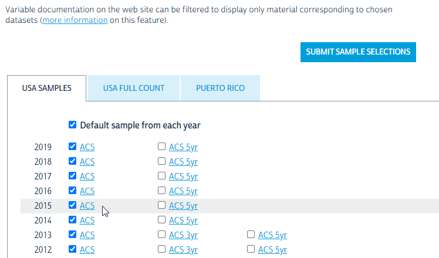
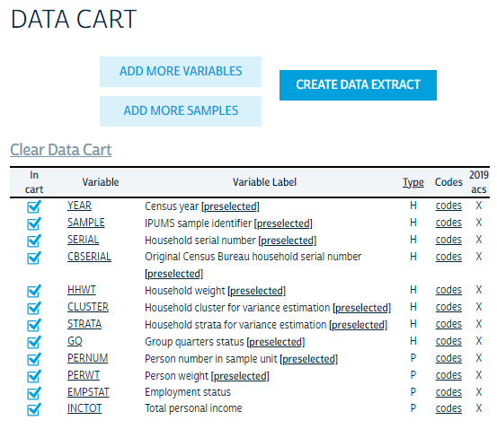
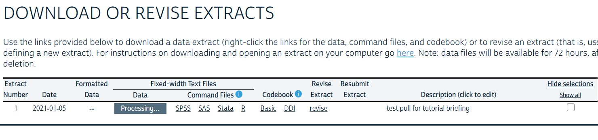

```{r setup, include = FALSE}
library(learnr)
library(primer.tutorials)
library(tidyverse)
library(stringr)
library(primer.data)
library(tidycensus)
library(ipumsr)
library(ggthemes)
library(knitr)
library(stringr)
knitr::opts_chunk$set(echo = FALSE)
options(tutorial.exercise.timelimit = 60, 
        tutorial.storage = "local") 


# Center the tutorial around this book: https://walker-data.com/census-r/index.html


# This is all of the data that the Census Key is needed for.

# rural <- get_decennial(geography = "state",
#                        variables = c("P001001", "P002005"),
#                        year = 2010,
#                        output = "wide")
# write_rds(rural, "data/05-census-rural.rds")

rural <- read_rds("data/rural.rds")

# il_pums <- get_pums(variables = c("PUMA", "FINCP"),
#                     state     = "Illinois",
#                     recode    = TRUE,
#                     survey    = "acs1",
#                     year      = 2019)
# write_rds(il_pums, "data/05-census-il-pums.rds")

il_pums <- read_rds("data/il-pums.rds")
```

```{r copy-code-chunk, child = "../../child_documents/copy_button.Rmd"}
```

```{r info-section, child = "../../child_documents/info_section.Rmd"}
```

## Accessing the Census API
### 

In this tutorial, we will cover how to download US Census Bureau data into R and then use it to create graphs.

### Exercise 1

First, we need to access the US Census API. We will do this by using the **tidycensus** package. This will allow us to use an API key to then access Census data.

### 

Load the **tidycensus** package into your R session using `library(tidycensus)`. You may have to install the package before loading it in.

### 

Run `search()` in the Console to see the libraries that you've currently loaded, then copy and paste the command and the result into the space below. 

```{r accessing-the-census-1}
question_text(NULL,
    answer(NULL, correct = TRUE),
    allow_retry = TRUE,
    try_again_button = "Edit Answer",
    incorrect = NULL,
    rows = 3)
```

### 

The output should include the string "package:tidycensus" in the output. This will be the main package that we are going to use to access the US Census, as it allows us to use simple R functions without having to use the complicated `GET()` requests described in Chapter 3.

### Exercise 2

Now that we have the package needed to access the Census database, we need to get an API key. 

An API key is basically a password for an API, but it often comes with certain restrictions. For example, the Census only allows you to collect 50 variables (or columns) from a database at a time. 

### 

First, visit [https://api.census.gov/data/key_signup.html](https://api.census.gov/data/key_signup.html) and request an API key. Use your school or other organization name for the `Organization Name` field. Then, follow the steps and verify your API key through the email that it sends.

### 

Copy and paste your API key into the box below. If you don't want to share your API key, change a few letters to make it invalid.

```{r accessing-the-census-2}
question_text(NULL,
    answer(NULL, correct = TRUE),
    allow_retry = TRUE,
    try_again_button = "Edit Answer",
    incorrect = NULL,
    rows = 3)
```

### 

While an API key isn't mandatory for accessing the Census, it allows you to do more requests and use multiple computers to collect data. It's also a necessity for using the `tidycensus` package.

### Exercise 3

You may remember putting your GitHub Personal Access Token into your `.Renviron` file for safekeeping. We'll be doing the same for our Census API key, but the process looks a little bit different.

### 

The **tidycensus** package makes the process much simpler. Run `census_api_key("YOUR API KEY HERE", install = TRUE)` in the Console, substituting your API key in the field.

This should save your key into your `.Renviron` file.

### 

Run `Sys.getenv("CENSUS_API_KEY")` in the Console. Copy-paste the command and the output in the space below. If you are nervous about sharing your Census API key, feel free to change it after your copy/paste it into the answer.

```{r accessing-the-census-3}
question_text(NULL,
    answer(NULL, correct = TRUE),
    allow_retry = TRUE,
    try_again_button = "Edit Answer",
    incorrect = NULL,
    rows = 2)
```

### 

This should contain your Census API key. If you want to see where the key is stored, run `usethis::edit_r_environ()` in the Console. It should open up your `.Renviron` file and show you all of the keys that you have stored there so far.

<!-- Do all the commands in Chapter 2 of the book. Force students to type out each command. Hints can't be that good.  -->


## Getting data from the Census API

### 

The Census API works by accessing Census databases and tables. We can find these tables by visiting [data.census.gov](data.census.gov). For this tutorial, we'll be using the **American Community Survey** and the **Decennial Census**.

### 

If you want to see all supported Census tables, please visit [here](https://api.census.gov/data.html). 

If you want to learn more about how the Census API is structured, please look at the official documentation [here](https://www.census.gov/content/dam/Census/data/developers/api-user-guide/api-guide.pdf).

### Exercise 1

Let's try accessing the American Community Survey database. In order to do this, we'll use the `get_acs()` function with the `geography`, `variables`, and `year` arguments.

### 

The geography argument determines the scope of the data (such as `us` for the entire country and `county` for counties), the `year` argument defines the year the data was accessed and the `variables` argument defines which variables you want to use.

### 

Let's try to find the total American population. First of all, we need to access the variable containing that population. We can do this by using the `load_variables()` function.

### 

Run the `load_variables()` function below, setting the `year` argument to 2010 and the `dataset` argument to `"acs5"`.

```{r getting-data-from-th-1, exercise = TRUE}

```

```{r getting-data-from-th-1-hint-1, eval = FALSE}
load_variables(year    = ...,
               dataset = ...)
```

### 

This should show all of the variables that the **A**merican **C**ommunity **S**urvey (ACS) has as well as a brief explanation as to what they actually mean.

As you can see, the first row of the table is the "UNWEIGHTED SAMPLE COUNT OF THE POPULATION", as shown by the `concept` column. That means that the population count is stored within the `B00001_001` variable. Let's try accessing the data under that variable.

### Exercise 2

Now that we have our variable name, we need to use it in our code.

### 

<!-- AG: I'm not planning on breaking up API requests into different exercises since there is a limit. Plus a bad API request will make you load gigabytes onto your computer and take forever. -->

Run the `get_acs()` function below and set the `geography` argument to `"us"`, the `year` argument to `2010`, and the `variables` argument to a string containing the variable that we just found.

```{r getting-data-from-th-2, exercise = TRUE}

```

```{r getting-data-from-th-2-hint-1, eval = FALSE}
get_acs(geography = ...,
        year      = ...,
        variables = ...)
```

### 

This returns a tibble with the geography, the name of the area described, the variable, and the estimate of the total population.

### Exercise 3

But variables contain a lot more information than just that. They also contain information about the different geographies located within that region. Think about each variable as a classification for different information. A variable about population includes information about the population at every level and at every scope.

### 

Run the `get_acs()` function again, setting the `geography` argument to `"state"`, the `year` argument to `2010`, and the `variables` argument to a character vector containing the variables that we used earlier.

```{r getting-data-from-th-3, exercise = TRUE}

```

```{r getting-data-from-th-3-hint-1, eval = FALSE}
get_acs(geography = ...,
        year      = ...,
        variables = ...)
```

### 

As you can see, variables contain a lot of different information at a lot of different levels. 

The GEOID column contains the FIPS code of the area the data covers. This code is a standardized way to identify the different areas and gets larger as the scope narrows down. You can learn more about FIPS codes [here](https://transition.fcc.gov/oet/info/maps/census/fips/fips.txt#:~:text=FIPS%20codes%20are%20numbers%20which,to%20which%20the%20county%20belongs.).

## Graphing Census data

### 

Now that we've successfully accessed a variable name and the information contained within it, let's try graphing the ratio of rural population to the actual population for every state.

### Exercise 1

First, let's try to access the Decennial Census. The Decennial Census is conducted every 10 years and is the survey that the Census Bureau was established for in the first place.

### 

Run the `load_variables()` function, setting the `year` argument to `2010` and the `dataset` argument to `"sf1"`.

```{r graphing-census-data-1, exercise = TRUE}

```

```{r graphing-census-data-1-hint-1, eval = FALSE}
load_variables(year    = ...,
               dataset = ...)
```

### 

This returns all of the variables that the Decennial Census uses. The `"sf1"` dataset contains the summary files for the Decennial Census, so we can look at it in order to see all of the variables used by the Census Bureau.

### Exercise 2

This returned a lot of information, but it's a little harder to find what we actually need. In this case, we need to find the actual population variable and the rural population so that we can determine the final ratio.

### 

We can do this by using a standard `filter()` command like we did with tidyverse. 

### 

Pipe the `load_variables()` function into a `filter()` command that filters the `concept` so that it equals `"URBAN AND RURAL"`.

```{r graphing-census-data-2, exercise = TRUE}

```

<button onclick = "transfer_code(this)">Copy previous code</button>

```{r graphing-census-data-2-hint-1, eval = FALSE}
load_variables(year    = ...,
               dataset = ...) |>
  filter(concept == ... & stringr::str_detect(..., ...))
```

### 

This filters the variables so that it only has data about the urban and rural populations, but it's absolutely massive and contains almost 9,000 variables, almost none of which are actually intelligible.

### Exercise 3

Let's filter out the variables so that they're only part of the "P" group and don't contain any unnecessary information.

### 

Continue the pipe and use the `filter()` command to filter the `name` column so that it only displays entries containing the string `"P"` using `"string::str_detect()"`.

```{r graphing-census-data-3, exercise = TRUE}

```

<button onclick = "transfer_code(this)">Copy previous code</button>

```{r graphing-census-data-3-hint-1, eval = FALSE}
load_variables(year    = ...,
               dataset = ...) |>
  filter(concept == ...) |>
  filter(stringr::str_detect(name, ...))
```

### 

The reason we chose the `"P"` variable group is because it also contains race data, making it useful later on in this tutorial. If you also wanted to find household data, you can use the `"H"` group. If you want to find information about the different variables and their groups, please visit [the Census API documentation](https://api.census.gov/data/2010/dec/sf1/variables.html).

### Exercise 4

Now that we have our variable names, let's actually load in our data. We can do this using the `get_decennial()` function, which is very similar to the `get_acs()` function that we used earlier.

### 

This time, we need to get data from 2 variables: The total population ("P001001") and the rural population ("P002005"). 

### 

Run the `get_decennial()` function, setting the `geography` argument to `"state"`, the `year` argument to `2010`, the `variables` argument to a vector containing these two variable IDs, and the `output` argument to `"wide"`. 

```{r graphing-census-data-4, exercise = TRUE}

```

```{r graphing-census-data-4-hint-1, eval = FALSE}
get_decennial(geography = ...,
              variables = c(..., ...),
              year      = ...)
```

### 

This gets all of the 2010 data from the P001001 and P002005 variables and their value for each state.

### Exercise 5

The thing is, this is really unhelpful! The variable names are stored in a column next to their values rather than in their own columns, making it really hard to just access one value without breaking your back.

### 

Luckily, there's an easy way to fix this. Repeat the same code as before, but this time setting the `output` argument to `"wide"`.

```{r graphing-census-data-5, exercise = TRUE}

```

<button onclick = "transfer_code(this)">Copy previous code</button>

```{r graphing-census-data-5-hint-1, eval = FALSE}
get_decennial(geography = ...,
              variables = c(..., ...),
              year      = ...,
              output    = "wide")
```

### 

By setting the `output` argument to wide, we make the variables their own columns, much like the `pivot_wider()` function. This puts each variable into their own column, making it much easier to access each variable value individually.

### Exercise 6

Let's create the following plot using this data.

```{r}
# Including this in the tutorial instead of in the setup chunk because the
# students aren't supposed to be able to access it.

rural_graph <- rural |>
                 mutate(prop_rural = P002005/P001001) |> 
                 ggplot(aes(x = prop_rural, y = fct_reorder(NAME, prop_rural))) +
                   geom_point() +
                   labs(title    = "Rural Population in US States in 2010",
                        subtitle = "Maine and Vermont are the most rural states",
                        caption  = "Source: US Census",
                        x        = "Rural Population Proportion",
                        y        = NULL) +
                   theme(axis.text.y = element_text(size = 5))

rural_graph
```

### 

Save the previous output to a variable named `rural` so that we can start out graph.


```{r graphing-census-data-6, exercise = TRUE}

```

<button onclick = "transfer_code(this)">Copy previous code</button>

```{r graphing-census-data-6-hint-1, eval = FALSE}
rural <- ...
```

### 

We'll be using this tibble to create a graph and save our data.

### Exercise 7

First we need to get the proportion of the rural population: the x axis for our graph.

### 

Start a new pipe using `rural` and, using `mutate()`, add a column named `prop_rural` which equals `P002005` divided by `P001001`.

```{r graphing-census-data-7, exercise = TRUE}

```

```{r graphing-census-data-7-hint-1, eval = FALSE}
rural |>
  mutate(prop_rural = P002005 / P001001)
```

### 

Remember that the P002005 variable represents the population that lives in rural areas while the P001001 variable represents the total population in a state. This way, we can get the proportion of the rural population with ease.

### Exercise 8

Let's start our graph. First, we have to map out our axes to the correct data.

### 

Continue the pipe, adding `ggplot()` and, within `aes()`, setting `x` equal to to `prop_rural` and the `y` argument to `NAME`.

```{r graphing-census-data-8, exercise = TRUE}

```

<button onclick = "transfer_code(this)">Copy previous code</button>

```{r graphing-census-data-8-hint-1, eval = FALSE}
... |>
  ggplot(aes(x = ..., y = ...))
```

### 

While this does technically graph our data, it doesn't show anything since we didn't tell it how we wanted to structure our graph.

### Exercise 9

Add a `geom_point()` layer to the pipe.

```{r graphing-census-data-9, exercise = TRUE}

```

<button onclick = "transfer_code(this)">Copy previous code</button>

```{r graphing-census-data-9-hint-1, eval = FALSE}
... |>
  ggplot(aes(x = ..., y = ...)) +
    geom_point()
```

### 

This should show all of the states and their rural population proportion in alphabetical order. However, that's not very helpful for actually finding any trends in the data.

### Exercise 10

Let's sort the states by their rural population. Change the `y` argument to reorder the names based on the rural population ratio.

```{r graphing-census-data-10, exercise = TRUE}

```

<button onclick = "transfer_code(this)">Copy previous code</button>

```{r graphing-census-data-10-hint-1, eval = FALSE}
... |>
  ggplot(aes(x = ..., y = fct_reorder(..., ...))) +
    geom_point()
```

### Exercise 11

Now let's add the labels to the graph.

As a reminder, here's what the graph should look like:

```{r}
rural_graph
```

### 

Additionally, continue the pipe and add the function `theme(axis.text.y = element_text(size = 5))` in order to shrink the size of the labels and let them all fit onto the graph.

### 

```{r graphing-census-data-11, exercise = TRUE}

```

<button onclick = "transfer_code(this)">Copy previous code</button>

```{r graphing-census-data-11-hint-1, eval = FALSE}
... +
  labs(title    = ...,
       subtitle = ...,
       caption  = ...,
       x        = ...,
       y        = ...)
```

### 

Now that we've looked at American Community Survey and Decennial Census data, let's look at PUMS data.

## PUMS data

### 

**P**ublic **U**se **M**icrodata **S**amples, or **PUMS** data, contains advanced census data on individual people. While it only contains data for about 1% of the US, it's extremely deep and lets you do a lot of cool things.

### Exercise 1

While this may seem intimidating, PUMS is largely the same as the previous functions with a few small differences. 

### 

Run the `glimpse()` function on the dataset `pums_variables` to see what each of the variables represents.

```{r pums-data-1, exercise = TRUE}

```

```{r pums-data-1-hint-1, eval = FALSE}
pums_variables
```

### 

The `pums_variables` dataset is automatically constructed by the **tidycensus** package and contains a large amount of information, with 31,759 different variables.

### Exercise 2

Let's try to collect the age, sex, and income data for every single person in PUMS. The `AGEP` variable is for age, the `FINCP` variable is for income, and the `SEX` variable is the sex.

### 

We can do this by using the `get_pums()` function. Run the `get_pums()` function, setting the `variables` argument to the ones described above, `state` to your state's name, `recode` to `TRUE`, and `survey` to `"acs1"`.

```{r pums-data-2, exercise = TRUE}

```

```{r pums-data-2-hint-1, eval = FALSE}
get_pums(variables = c(..., ..., ...),
         state     = ...,
         recode    = TRUE,
         survey    = "acs1")
```

### 

If you wanted to import data from the entire United States, you can set the `state` argument to `state.name`. Keep in mind that this is all 3 million participants in the PUMS program, so it takes up a large amount of space (over 100 megabytes).

The `recode` argument transforms numerical ID codes into human-readable strings, with columns like `ST` holding the FIPS code while `ST_label` has the actual name of the state.

### Exercise 3

Let's try graphing the percent of PUMS participants below the poverty line in your state.

Here's what an Illinois graph should look like.

<!-- All of these hide stuff so I'm using them all. It's lazy but it works. -->

```{r results = 'hide', warning = FALSE}
il_graph <- il_pums |>
              group_by(PUMA) |>
              summarize(total_pop  = sum(PWGTP),
                        pct_income = sum(PWGTP[FINCP < 12880]) / total_pop,
                        .groups    = "drop") |>
              ggplot(aes(x = pct_income, y = fct_reorder(PUMA, pct_income))) +
              geom_point() +
              labs(title    = "Poverty in Illinois PUMA Zones in 2019",
                   subtitle = "PUMA zones in Will County and Kane County have the highest poverty rates.",
                   x        = "Poverty Population Percentage",
                   y        = "PUMA Zone Code") +
              theme(axis.text.y = element_text(size = 3))

il_graph
```

### 

First we need to load our data. Run `get_pums()`, setting the `variables` argument to `"PUMA"` and `"FINCP"`, the `state` to your state's name, `recode` to `TRUE`, the `survey` to `"acs1"`, and the year to 2019. Save this to the `st_pums` variable.

```{r pums-data-3, exercise = TRUE}

```

```{r pums-data-3-hint-1, eval = FALSE}
st_pums <- get_pums(variables = c(..., ...),
                    state     = ...,
                    recode    = TRUE,
                    survey    = "acs1",
                    year      = ...)
```

### Exercise 4

Second, we need to filter and group the different people by their PUMA zones so that we can talk about the things done over the entire population.

### 

Start a new pipe with `st_pums` and group it by the `PUMA` column.

```{r pums-data-4, exercise = TRUE}

```

<button onclick = "transfer_code(this)">Copy previous code</button>

```{r pums-data-4-hint-1, eval = FALSE}
st_pums |>
  group_by(PUMA)
```

### Exercise 5

Now let's use those groups and summarize the entire population by their income. 

### 

Continue the pipe with the `summarize()` function, creating a column named `total_pop` that contains the sum of `PWGTP`.

```{r pums-data-5, exercise = TRUE}

```

<button onclick = "transfer_code(this)">Copy previous code</button>

```{r pums-data-5-hint-1, eval = FALSE}
... |>
  summarize(total_pop = sum(...))
```

### 

The `PWGTP` column is the number of people contained within that sample, so if you total all of the `PWGTP` column then you can get the total population within the study.

### Exercise 6

We just totaled the population, but now we need to add the income information. 

### 

Within the `summarize()` function, add a new column called `pct_income`. This column should include the sum of all the elements of `PWGTP` that have a `FINCP` less than `12880`, then divide it by the total population.

```{r pums-data-6, exercise = TRUE}

```

<button onclick = "transfer_code(this)">Copy previous code</button>

```{r pums-data-6-hint-1, eval = FALSE}
... |>
  summarize(total_pop  = sum(...),
            pct_income = sum(PWGTP[... < ...]) / ...)
```

### 

This gets the percentage of people below the poverty line. It's also advisable to drop the groups after the `summarize()` in order to avoid conflicts later down the road.

### Exercise 7

Continue the pipe with a `ggplot()`, mapping the `x` to `pct_income` and the `y` to `PUMA`. Then add a `geom_point()` layer in order to display the point graph.

```{r pums-data-7, exercise = TRUE}

```

<button onclick = "transfer_code(this)">Copy previous code</button>

```{r pums-data-7-hint-1, eval = FALSE}
... |>
  ggplot(aes(x = ..., y = ...)) +
  geom_point()
```

### Exercise 8

Let's sort the zones by their poverty rates. Change the `y` argument to reorder the names based on the rural population ratio using `fct_reorder()`.

```{r pums-data-8, exercise = TRUE}

```

<button onclick = "transfer_code(this)">Copy previous code</button>

```{r pums-data-8-hint-1, eval = FALSE}
... |>
  ggplot(aes(x = ..., y = fct_reorder(..., ...))) +
    geom_point()
```

### Exercise 9

Now let's add the labels to the graph.

As a reminder, here's what the graph should look like:

```{r}
rural_graph
```

Make sure to change the labels for your state's graph.

### 

Additionally, continue the pipe and add the function `theme(axis.text.y = element_text(size = 3))` in order to shrink the size of the labels and let them all fit onto the graph.

### 

```{r pums-data-9, exercise = TRUE}

```

<button onclick = "transfer_code(this)">Copy previous code</button>

```{r pums-data-9-hint-1, eval = FALSE}
... +
  labs(title    = ...,
       subtitle = ...,
       caption  = ...,
       x        = ...,
       y        = ...)
```

### 

If you want to see what PUMA zones correlate to what counties, you can visit the [Census Bureau documentation](https://www.census.gov/geographies/reference-maps/2010/geo/2010-pumas.html).

<!-- ## IPUMS data -->

<!-- IPUMS, or the **I**ntegrated **P**ublic **U**se **M**icrodata **S**eries, is a great source for big data.  -->

<!-- It includes the Current Population Survey (CPS) from the U.S. Census as well as other health and housing data.  -->

<!-- ###  -->

<!-- An initial word of caution to those new to the system is that your requests are not filled immediately, so **start early!** -->

<!-- You may have to pause the tutorial while you wait for your account to be approved. -->

<!-- ### Exercise 1 -->

<!-- You are going to be publishing our graph to your RPubs website, so you need to create a new GitHub repo and R project. -->

<!-- ###  -->

<!-- Create a new GitHub repo named "ipums-graph" and link it to an RStudio project. Make sure to edit `.gitignore` to ignore the `.Rproj` file. -->

<!-- ###  -->

<!-- Then create a new R Markdown file titled "IPUMS_Graph". Then save the file and name it "index.Rmd". -->

<!-- ###  -->

<!-- Run `list.files()` in the Console to list all of the files within your project. Copy and paste the output into the space below. -->

<!-- ```{r ipums-data-1} -->
<!-- question_text(NULL, -->
<!-- 	message = "answer here", -->
<!-- 	answer(NULL, -->
<!-- 	correct = TRUE), -->
<!-- 	allow_retry = FALSE, -->
<!-- 	incorrect = NULL, -->
<!-- 	rows = 6) -->
<!-- ``` -->

<!-- ###  -->

<!-- This will be the file that we're coding in for the rest of this tutorial. Knit the file first to make sure that it's all up and running. -->

<!-- ### Exercise 2 -->

<!-- Delete all of the text other than the YAML header and setup chunk in `index.Rmd`. -->

<!-- ###  -->

<!-- Then load the packages **tidyverse**, **ggthemes**, and **ipumsr** into the setup chunk using the `library()` command. We're going to be using these packages throughout the rest of this tutorial. -->

<!-- ###  -->

<!-- Run `readLines("index.Rmd") |> tail(15)` in the Console to list the last 15 lines in `index.Rmd`. Copy and paste the output into the space below. -->

<!-- ```{r ipums-data-2} -->
<!-- question_text(NULL, -->
<!-- 	message = "answer here", -->
<!-- 	answer(NULL, -->
<!-- 	correct = TRUE), -->
<!-- 	allow_retry = FALSE, -->
<!-- 	incorrect = NULL, -->
<!-- 	rows = 6) -->
<!-- ``` -->

<!-- ###  -->

<!-- The **ipumsr** package is an easy way to import IPUMS data. You can learn more about it [here](https://cran.r-project.org/web/packages/ipumsr/vignettes/ipums.html). -->

<!-- ### Exercise 3 -->

<!-- Now that we have our project ready, we need to actually download our data. We'll do this by directly downloading from the IPUMS website and manually generating a request. -->

<!-- ###  -->

<!-- Start at the [IPUMS home page](https://ipums.org/) and select the survey you wish to explore via the 'visit site' option. -->

<!-- ```{r echo = FALSE, output.width = "500px"} -->
<!-- include_graphics("images/step_1visit_site.png") -->
<!-- ``` -->

<!-- ###  -->

<!-- From here you will see a prompt to login or register at the very top of the widow: -->

<!-- ```{r echo = FALSE, output.width = "500px"} -->
<!-- include_graphics("images/login_pt1_02.png") -->
<!-- ``` -->

<!-- ###  -->

<!-- If you have used IPUMS before, then you may proceed to login and move on to select your data. However, if you are a new user, you will need to apply for access. The register tab will ask you for standard account creation information. -->

<!-- ###  -->

<!-- You should list Harvard University as your institution, undergraduate as your occupation, and statistics as your research area. Make sure to state that you are completing the Primer as part of your research statement. Otherwise just use your normal email and don't fill in the optional fields like your occupation title. -->

<!-- ###  -->

<!-- There are a handful of data use agreements you will be required to agree to in this process which you should note specifically with regard to citations. -->

<!-- Once you have applied, you will need to await the confirmation of your account to log in fully. -->

<!-- ###  -->

<!-- The official slogan of IPUMS is **Use it for GOOD -- never for EVIL** and it's even included in the terms and conditions. -->

<!-- As such, we're now contractually obligated to use IPUMS for good things.   -->
<!-- <font size = "1"> There goes my dream of being a mad (data) scientist. </font> -->

<!-- <!-- screw programming i should be a standup comedian. my stand up show would be a genocide --> -->

<!-- ### Exercise 4 -->

<!-- Once you receive the email confirmation and logged in properly, you'll be able to start selecting and importing your data. -->

<!-- ###  -->

<!-- Let's try to recreate the following graph: -->

<!-- <!-- This is a poor imitation of the graph in the Primer, I would like the source code for it since this graph is hacky and stupid, plus I'm not sure if I used the right theme. Contacting Beau Meche about the issue. --> -->

<!-- ```{r out.width = "875px"} -->
<!-- include_graphics("images/ipums_plot.png") -->
<!-- ``` -->

<!-- ###  -->

<!-- The first option you will need to consider and specify will be the samples (see 'select samples' button), or time the period covered by your data. By default, all of the data from all possible years is selected, but that's obviously way too much data for our purposes. -->

<!-- ###  -->

<!-- We only need to read in the data for the year 2019, so change the sample to only use 2019 ACS data. -->

<!-- ```{r out.width = "875px"} -->
<!--  -->
<!-- ``` -->

<!-- ###  -->

<!-- Keep in mind that we only want 2019 ACS data, not ACS5 data. ACS5 is a 5 year survey that includes all of the data from the past 5 years, which in this case would be 2014-2019. -->

<!-- ### Exercise 5 -->

<!-- When you submit your sample, you'll be redirected to the variable selection page. -->

<!-- ###  -->

<!-- You can see below that the household and person tabs (highlighted) will provide a drop down of common variables from this repository under the respective classifications. To add a variable to your ‘cart’ you simply select the + icon, if not available either there is a corresponding explanation or it simply isn’t available. -->

<!-- ```{r out.width = "875px"} -->
<!-- include_graphics("images/var_selection_01.png") -->
<!-- ``` -->

<!-- ###  -->

<!-- You can also search for variables. In this case, we want the 'INCTOT' and 'EMPSTAT' variables to get the income of a person and their employment status. -->

<!-- Find those variables and add them into your cart. -->

<!-- ### Exercise 6 -->

<!-- Click "View Cart" to show your cart. Here, you can review and revise your selections in the cart menu prior to requesting the ‘pull.’  -->

<!-- ###  -->

<!-- Shown below is what the cart review window should show. An X indicates the existence of data in the given time period. Note that since we're only pulling from one year, we only have data for the 2019 ACS. -->

<!-- ```{r} -->
<!--  -->
<!-- ``` -->

<!-- ###  -->

<!-- The cart also has a large amount of preselected variables. These are mandatory, but they contain a large amount of information such as the year and the serial number of the data. -->

<!-- ### Exercise 7 -->

<!-- When you are satisfied with the sample specifications, you can proceed to the create data extract page.  -->

<!-- ###  -->

<!-- This will provide you with a handful of final options and a text window to describe the sample you’ve created. You should treat this like a commit message in GitHub - brief and meaningful. -->

<!-- Look at the "ESTIMATED SIZE" field. This file is a _massive_ 287.3 MB, or about 1,673 copies of Tales of Beedle the Bard. -->

<!-- Unrecognizable references aside, this is an important fact that you should keep in mind later on. -->

<!-- ###  -->

<!-- Submitting your request should automatically bring you to the request history page associated with your account. You should note that your requests will only be available for 72 hours, and you should make sure to promptly download your information upon receipt. -->

<!-- ```{r} -->
<!--  -->
<!-- ``` -->

<!-- ###  -->

<!-- Download the `.dat` file, the DDI Codebook, and the R Command file from the request page.  -->

<!-- You will need to first download the data via Download.DAT, then you will need to save the DDI and R links (via ‘save as’) in the same location as your .dat.gz file. Then relocate these files into your R project. -->

<!-- ###  -->

<!-- Here's a full GIF of the process: -->

<!-- ```{r out.width = "875px"} -->
<!-- include_graphics("images/full_demo.gif") -->
<!-- ``` -->

<!-- ###  -->

<!-- Run `list.files()` in the Console to list all of the files within your project. Copy and paste the output into the space below. -->

<!-- ```{r ipums-data-7} -->
<!-- question_text(NULL, -->
<!-- 	message = "answer here", -->
<!-- 	answer(NULL, -->
<!-- 	correct = TRUE), -->
<!-- 	allow_retry = FALSE, -->
<!-- 	incorrect = NULL, -->
<!-- 	rows = 6) -->
<!-- ``` -->

<!-- ###  -->

<!-- We finally have all of our files in R, but there's a few things missing before we can start. -->

<!-- ### Exercise 8 -->

<!-- Our data file is currently _compressed_ in a `.gz` folder, which needs to be unzipped. -->

<!-- ###  -->

<!-- Download [7zip](https://www.7-zip.org/download.html), a free unzipping program, and unzip the `dat.gz` file. Extract all of the files from the file, then pull the file out of the resulting folder and place it into your general R project. -->

<!-- ###  -->

<!-- Run `list.files()` in the Console to list all of the files within your project. Copy and paste the output into the space below. -->

<!-- ```{r ipums-data-8} -->
<!-- question_text(NULL, -->
<!-- 	message = "answer here", -->
<!-- 	answer(NULL, -->
<!-- 	correct = TRUE), -->
<!-- 	allow_retry = FALSE, -->
<!-- 	incorrect = NULL, -->
<!-- 	rows = 6) -->
<!-- ``` -->

<!-- ###  -->

<!-- A `.gz` file is a compressed folder much like a ZIP file, reducing the file size. You can learn more about `.gz` files [here](https://www.makeuseof.com/what-is-gz-file/). -->

<!-- This process is used by most government agencies to distribute data to researchers, with databases like [The Cancer Genome Atlas](https://portal.gdc.cancer.gov/) requiring you to download certain case data and then unzip it using 7zip. -->

<!-- ### Exercise 9 -->

<!-- Now that we finally have our data downloaded, let's create our graph. -->

<!-- ###  -->

<!-- First, let's bring our data out of the file and into our R project. Add the line `source(usa_00001.R)` to the setup chunk of `index.Rmd`. -->

<!-- ###  -->

<!-- Run `readLines("index.Rmd") |> tail(15)` in the Console to list the last 15 lines in `index.Rmd`. Copy and paste the output into the space below. -->

<!-- ```{r ipums-data-9} -->
<!-- question_text(NULL, -->
<!-- 	message = "answer here", -->
<!-- 	answer(NULL, -->
<!-- 	correct = TRUE), -->
<!-- 	allow_retry = FALSE, -->
<!-- 	incorrect = NULL, -->
<!-- 	rows = 6) -->
<!-- ``` -->

<!-- ###  -->

<!-- The `source()` command runs an R file at the very beginning of the R Markdown command, which is extremely useful for a case like this where we have our R code already written for us. -->

<!-- When you run the `source(usa_00001.R)` command, it should load the `ddi` and `data` objects. Try running `view(data)` to see all of the data that we just imported from PUMS. It should have over 3 million rows, making it decidedly "big" data. -->

<!-- ### Exercise 10 -->

<!-- So let's start graphing. -->

<!-- ###  -->

<!-- Start a pipe with data and select the `INCTOT` and `EMPSTAT` columns. -->

<!-- ###  -->

<!-- Run `readLines("index.Rmd") |> tail(15)` in the Console to list the last 15 lines in `index.Rmd`. Copy and paste the output into the space below. -->

<!-- ```{r ipums-data-10} -->
<!-- question_text(NULL, -->
<!-- 	message = "answer here", -->
<!-- 	answer(NULL, -->
<!-- 	correct = TRUE), -->
<!-- 	allow_retry = FALSE, -->
<!-- 	incorrect = NULL, -->
<!-- 	rows = 6) -->
<!-- ``` -->

<!-- ###  -->

<!-- These are the only columns that we need, and they're the variables that we asked for in our requests. -->

<!-- ### Exercise 11 -->

<!-- Now if we look closely at our `data` object, we'll see that there are a few columns with the `haven_labelled` datatype. While this is useful for other languages like Stata, it's pretty useless in R. -->

<!-- ###  -->

<!-- Continue the pipe and create a new column named `incstat` that contains `INCSTAT` as an integer. Then create another column named `empstat` that contains `EMPSTAT` as a factor. -->

<!-- ###  -->

<!-- Run `readLines("index.Rmd") |> tail(15)` in the Console to list the last 15 lines in `index.Rmd`. Copy and paste the output into the space below. -->

<!-- ```{r ipums-data-11} -->
<!-- question_text(NULL, -->
<!-- 	message = "answer here", -->
<!-- 	answer(NULL, -->
<!-- 	correct = TRUE), -->
<!-- 	allow_retry = FALSE, -->
<!-- 	incorrect = NULL, -->
<!-- 	rows = 6) -->
<!-- ``` -->

<!-- ###  -->

<!-- To learn more about Haven labelled variables, please visit the [Primer](https://ppbds.github.io/primer/ipums.html#haven-labelled-variables). -->

<!-- ### Exercise 12 -->

<!-- Now, you may have seen that when you opened the "DDI" file from the original request link, it looked something like this: -->

<!-- ```{r} -->
<!-- include_graphics("images/xml_view.png") -->
<!-- ``` -->

<!-- ###  -->

<!-- This is because the `.xml` file contains *metadata*, or information about your imported data. And we can read through that information to find out what we need to use. For example, the metadata about the `EMPSTAT` variable looks like this: -->

<!-- ```{r} -->
<!-- include_graphics("images/variable_view.png") -->
<!-- ``` -->

<!-- We can use the categories to format our data. -->

<!-- ###  -->

<!-- Change the `empstat` column to replace the numbers with the strings shown above. Use the `case_when()` function to replace `0` with `"NA"`, `1` with `"Employed"`, `2` with `"Unemployed"`, and `3` with `"Not in labor force"`. -->

<!-- ###  -->

<!-- Run `readLines("index.Rmd") |> tail(15)` in the Console to list the last 15 lines in `index.Rmd`. Copy and paste the output into the space below. -->

<!-- ```{r ipums-data-12} -->
<!-- question_text(NULL, -->
<!-- 	message = "answer here", -->
<!-- 	answer(NULL, -->
<!-- 	correct = TRUE), -->
<!-- 	allow_retry = FALSE, -->
<!-- 	incorrect = NULL, -->
<!-- 	rows = 6) -->
<!-- ``` -->

<!-- ###  -->

<!-- You can see a lot of important information about each of the different variables by reading through the `.xml` file. XML files are a type of file storage similar to HTML but more suited to data transport. You can read more about XML files [here](https://www.howtogeek.com/357092/what-is-an-xml-file-and-how-do-i-open-one/). -->

<!-- ### Exercise 13 -->

<!-- If we look at the very bottom of the XML file, we can see how INCTOT also has certain exceptions. Specifically, the value `9999999` means `NA`, which is pretty important for our purposes. -->

<!-- ``` -->
<!-- INCTOT Specific Variable Codes -->
<!-- -009995 = -$9,900 (1980) -->
<!-- -000001 = Net loss (1950) -->
<!-- 0000000 = None -->
<!-- 0000001 = $1 or break even (2000, 2005-onward ACS and PRCS) -->
<!-- 9999999 = N/A -->
<!-- ``` -->

<!-- ###  -->

<!-- Mutate the `inctot` column so that the value is `NA` if it's `9999999`. Use the `na_if()` function. -->

<!-- ###  -->

<!-- Run `readLines("index.Rmd") |> tail(15)` in the Console to list the last 15 lines in `index.Rmd`. Copy and paste the output into the space below. -->

<!-- ```{r ipums-data-13} -->
<!-- question_text(NULL, -->
<!-- 	message = "answer here", -->
<!-- 	answer(NULL, -->
<!-- 	correct = TRUE), -->
<!-- 	allow_retry = FALSE, -->
<!-- 	incorrect = NULL, -->
<!-- 	rows = 6) -->
<!-- ``` -->

<!-- ###  -->

<!-- These coding exceptions are listed throughout the XML file, so make sure you read through it whenever you have anything to change. -->

<!-- ### Exercise 14 -->

<!-- There's one more step before we finish wrangling our data. -->

<!-- ###  -->

<!-- Mutate the `inctot` column so that it's divided by 100,000. -->

<!-- ###  -->

<!-- Run `readLines("index.Rmd") |> tail(15)` in the Console to list the last 15 lines in `index.Rmd`. Copy and paste the output into the space below. -->

<!-- ```{r ipums-data-14} -->
<!-- question_text(NULL, -->
<!-- 	message = "answer here", -->
<!-- 	answer(NULL, -->
<!-- 	correct = TRUE), -->
<!-- 	allow_retry = FALSE, -->
<!-- 	incorrect = NULL, -->
<!-- 	rows = 6) -->
<!-- ``` -->

<!-- ###  -->

<!-- This makes our income brackets much smaller and much easier to deal with, rather than the wide, spread out income ranges that make our graph extremely wide. -->

<!-- ### Exercise 15 -->

<!-- Continue the pipe and add the `ggplot()` function, mapping `x` to `inctot`, `y` to `..scaled..`, `fill` to `empstat`, and `color` to `empstat`. -->

<!-- ###  -->

<!-- Then add the `geom_density()` function, setting the `alpha` argument to `0.3` and `na.rm` to `TRUE`. -->

<!-- ###  -->

<!-- Run `readLines("index.Rmd") |> tail(15)` in the Console to list the last 15 lines in `index.Rmd`. Copy and paste the output into the space below.  -->

<!-- ```{r ipums-data-15} -->
<!-- question_text(NULL, -->
<!-- 	message = "answer here", -->
<!-- 	answer(NULL, -->
<!-- 	correct = TRUE), -->
<!-- 	allow_retry = FALSE, -->
<!-- 	incorrect = NULL, -->
<!-- 	rows = 6) -->
<!-- ``` -->

<!-- ###  -->

<!-- This creates a graph that contains the density of each income bracket. The `..scaled..` option means that the density is scaled so that it fits within a range of 0 to 1. -->

<!-- ### Exercise 16 -->

<!-- Now, our graph is extremely big for what it is. -->

<!-- ###  -->

<!-- Limit the x axis to between 0 and 8 using the `xlim()` function. -->

<!-- ###  -->

<!-- Run `readLines("index.Rmd") |> tail(15)` in the Console to list the last 15 lines in `index.Rmd`. Copy and paste the output into the space below. -->

<!-- ```{r ipums-data-16} -->
<!-- question_text(NULL, -->
<!-- 	message = "answer here", -->
<!-- 	answer(NULL, -->
<!-- 	correct = TRUE), -->
<!-- 	allow_retry = FALSE, -->
<!-- 	incorrect = NULL, -->
<!-- 	rows = 6) -->
<!-- ``` -->

<!-- ###  -->

<!-- This constrains the values to a reasonable limit and normalizes most of the data. -->

<!-- ### Exercise 17 -->

<!-- Now let's refine our y axis numbers. -->

<!-- ###  -->

<!-- Add the function `scale_y_continuous(labels = scales::label_number())` to your graph. -->

<!-- ###  -->

<!-- Run `readLines("index.Rmd") |> tail(15)` in the Console to list the last 15 lines in `index.Rmd`. Copy and paste the output into the space below. -->

<!-- ```{r ipums-data-17} -->
<!-- question_text(NULL, -->
<!-- 	message = "answer here", -->
<!-- 	answer(NULL, -->
<!-- 	correct = TRUE), -->
<!-- 	allow_retry = FALSE, -->
<!-- 	incorrect = NULL, -->
<!-- 	rows = 6) -->
<!-- ``` -->

<!-- ###  -->

<!-- This formats the y axis so that it properly formats the decimals without converting it to scientific notation. -->

<!-- ### Exercise 18 -->

<!-- Now, if you tried to generate this graph as it is you'd notice how the legend is still kind of messed up. -->

<!-- ###  -->

<!-- Add the layers `scale_fill_discrete()` and `scale_color_discrete()`, setting the `name` argument to `Employment Status` in both functions. -->

<!-- ###  -->

<!-- Run `readLines("index.Rmd") |> tail(15)` in the Console to list the last 15 lines in `index.Rmd`. Copy and paste the output into the space below. -->

<!-- ```{r ipums-data-18} -->
<!-- question_text(NULL, -->
<!-- 	message = "answer here", -->
<!-- 	answer(NULL, -->
<!-- 	correct = TRUE), -->
<!-- 	allow_retry = FALSE, -->
<!-- 	incorrect = NULL, -->
<!-- 	rows = 6) -->
<!-- ``` -->

<!-- ###  -->

<!-- We're almost done, we just need to set our themes and do the final clean up. -->

<!-- ### Exercise 19 -->

<!-- Let's change our labels and the theme now. -->

<!-- Remember, we're trying to recreate the following graph: -->

<!-- ```{r out.width = "875px"} -->
<!-- include_graphics("images/ipums_plot.png") -->
<!-- ``` -->

<!-- The theme used is `theme_economist(dkpanel = TRUE)`. -->

<!-- ###  -->

<!-- Run `readLines("index.Rmd") |> tail(15)` in the Console to list the last 15 lines in `index.Rmd`. Copy and paste the output into the space below. -->

<!-- ```{r ipums-data-19} -->
<!-- question_text(NULL, -->
<!-- 	message = "answer here", -->
<!-- 	answer(NULL, -->
<!-- 	correct = TRUE), -->
<!-- 	allow_retry = FALSE, -->
<!-- 	incorrect = NULL, -->
<!-- 	rows = 6) -->
<!-- ``` -->

<!-- ###  -->

<!-- We're finally done! Finish formatting your R Markdown file and add descriptions or headers with whatever you want to do.  -->

<!-- ### Exercise 20 -->

<!-- Now we need to commit and push our file. -->

<!-- ```{r ipums-data-20} -->
<!-- question_text(NULL, -->
<!-- 	message = "answer here", -->
<!-- 	answer(NULL, -->
<!-- 	correct = TRUE), -->
<!-- 	allow_retry = FALSE, -->
<!-- 	incorrect = NULL, -->
<!-- 	rows = 6) -->
<!-- ``` -->

<!-- ###  -->

<!-- ## Publishing -->

<!-- We're now going to publish our R Markdown file to RPubs and show it off to the world. -->

<!-- ### Exercise 1 -->

<!-- Publish your file to RPubs by knitting and clicking the "Publish" button. Paste the URL into the space below. -->

<!-- ```{r publishing-1} -->
<!-- question_text(NULL, -->
<!-- 	message = "answer here", -->
<!-- 	answer(NULL, -->
<!-- 	correct = TRUE), -->
<!-- 	allow_retry = FALSE, -->
<!-- 	incorrect = NULL, -->
<!-- 	rows = 6) -->
<!-- ``` -->

<!-- ###  -->

<!-- Congratulations on completing this tutorial. -->

<!-- ###  -->

```{r download-answers, child = "../../child_documents/download_answers.Rmd"}
```
