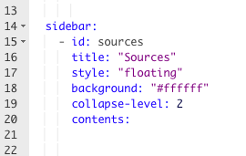
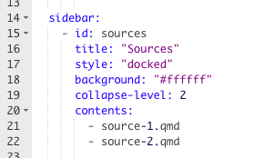
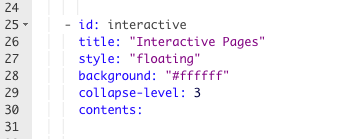
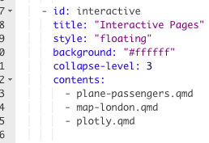

```{r setup, include = FALSE}
knitr::opts_chunk$set(echo = FALSE)
options(tutorial.exercise.timelimit = 240, 
        tutorial.storage = "local") 

library(learnr)
library(all.primer.tutorials)
library(ggthemes)
library(knitr)
library(tidyverse)
library(dygraphs)
library(leaflet)
library(plotly)
```

```{r copy-code-chunk, child = "../../child_documents/copy_button.Rmd"}
```

```{r info-section, child = "../../child_documents/info_section.Rmd"}
```

<!-- Make use of this exchange: https://community.rstudio.com/t/how-to-set-echo-false-for-all-files-in-a-quarto-website/159435 somewhere. -->

<!-- The flow of the tutorial should be more like the flow which we show in class, and the natural flow for when you make a project. Start by creating something cool in the index.qmd file. (This corresponds to class day 1.) There will be both data download and graphics code in that first draft.  -->

<!-- Then, pull out the download code to its own R script. Have it dump out a data object, then load the data in index.qmd, where the graphics code still lives.  Now, we don't re-download the data every time we fuss with something. Then put the graphic code in a different R script, which saves the graphic. index.qmd now just loads this graphic. Very quick! (This corresponds to day 2 in class. In class, might only have time to separate out the data download. Leave graphic move as an exercise. But, in this tutorial, we should do both.) -->

<!-- Now that we have an organized/reasonable home page, we can add some other pages which do other things. Example is some of the cool interactice graphics. Only at this stage do we dive into the _quarto.yml file so that we can add these other pages to the drop down. -->

<!-- Many of the images here are not helpful. First, they don't show enough of the _quarto.yml file. Second, they could just be replaced with copy/pasted text surrounded by simple triple backticks. Copy/pasted is much easier to maintain! -->

<!-- Make sure to add _publish.yml to the .gitignore once it appears. -->

<!-- Do we need quotes as in `cat "plane-passengers.qmd"`. It doesn't seem like we need them on a Mac. Maybe on Windows. If not, get rid of the quotes. Dashes are harmless at the Terminal. Or are they? A student reported:


anybody have an idea on what this means?

cat map-london.qmd
Error: unexpected symbol in "cat map"

-->

<!-- Show how to add execute: -->
<!--                   echo: false -->

<!-- This tutorial allows for an occasion to review and explore a bunch of Quarto fun. -->

<!-- Discuss why index.qmd is named that. -->

<!-- Be more consistent with underscores and dashs: car_plot or car-plot. -->

<!-- Standardize Command+Enter or cmd+enter and so on. -->
                  
<!-- The first repo is called first-website. We need to better distinguish between three things: the Github repo, the R project which is connected to the repo and the website built from the latter. Help students to keep these different concepts clear in their own minds.  -->

<!-- Example: https://github.com/davidkane9/soccer_player_birth_months/ -->

## Introduction
### 

<!-- DK: Drop some more knowledge! What is the most important two or three sentences about the entire tutorial? -->

In this tutorial, you will learn how to [create and modify a Quarto website](https://quarto.org/docs/websites/). 


## Creating a website
### 

<!-- DK: Add some more questions, mostly taking a look at some of the files. Explain what they do!  -->

Let's make a [Quarto](https://quarto.org/docs/websites/) website using RStudio and then connect the R project to Github.

### Exercise 1

For this exercise, first read the five steps involved in the creation of a Quarto website project. Once you have read all the steps, you will see the start of Exercise 2. That is your cue to perform the steps. You will need to terminate this tutorial when you open a new project, but don't worry. None of your owkr will be lost.  

### 

*Step 1*: Navigate to the `File` menu in your RStudio session

```{r out.width = 500}
knitr::include_graphics("images/file.png")
```

### 

*Step 2*: Click on `New Project...`.

```{r out.width = 500}
knitr::include_graphics("images/Directory.png")
```

This will cause the window about terminating the tutorial to appear. Click "Terminate Jobs" as usual.

### 

*Step 3*: Click on "New Directory". We will connect to GitHub later.

### 

*Step 4*: Select "Quarto Website".

```{r out.width = 500}
knitr::include_graphics("images/website.png")
```

### 

This is the last step! Once you have selected "Quarto Website", it will
bring you to *one* more page.

```{r out.width = 500}
knitr::include_graphics("images/first-website-pic.png")
```

*Step 5*: Please name the directory `first-website`. Make sure that the the box for "Create a git repository" is checked. Ensure that no other boxes are checked.  Click "Create Project". 

### 

RStudio will automatically restart and place you within the `first-website` R project. You should also have a directory called `first-website` in the location in which you store your projects.

### 

Restart this tutorial and continue with Exercise 2.

### Exercise 2

In the Terminal, run `ls -a` to view a list of all the files in the directory. The `-a` ensures that **a**ll the files are listed, included the "hidden" ones which begin with a dot. CP/CR.

### 

```{r creating-a-website-2}
question_text(NULL,
    answer(NULL, correct = TRUE),
    allow_retry = TRUE,
    try_again_button = "Edit Answer",
    incorrect = NULL,
    rows = 3)
```

###

In general, we do not touch/manipulate "dot" directories, meaning directories whose names begin with a dot or period. Such directories are meant to be used by the operating system and other programs. For example, the program git uses the `.git` directory to store information about changes in the files in the entire project. 

### Exercise 3

In the Terminal, run `ls` to view a list of the "visible" files in the directory. The "hidden" files will no longer appear. CP/CR.

### 

```{r creating-a-website-3}
question_text(NULL,
    answer(NULL, correct = TRUE),
    allow_retry = TRUE,
    try_again_button = "Edit Answer",
    incorrect = NULL,
    rows = 3)
```

### 

A website is a more complex object than a single Quarto document. It has two main components. First is a "settings" file, `_quarto.yml`, which provides instructions for how the website should be constructed. Second are a collection of Quarto documents, like `index.qmd` and `about.qmd`, which will be rendered into the html files which viewers will see.

### Exercise 4

We don't want to put all the files on Github. So, add `*Rproj` to your `.gitignore` file. 

### 

Run `cat .gitignore`. CP/CR.

```{r creating-a-website-4}
question_text(NULL,
    answer(NULL, correct = TRUE),
    allow_retry = TRUE,
    try_again_button = "Edit Answer",
    incorrect = NULL,
    rows = 3)
```

### 

Good data scientists believe in transparency and reproducibility. We want people --- include "future" us --- to be able to reproduce our work. By default, almost every file belongs on Github. But settings for R projects are both not necessary for replication and often specific to each individual. 


### Exercise 5

Commit all the files. Note how the "push" button is greyed out. This is because we have not connected the R project to Github. There is nowhere to "push" the code to.

### 

Run `git log`. CP/CR.

```{r creating-a-website-5}
question_text(NULL,
    answer(NULL, correct = TRUE),
    allow_retry = TRUE,
    try_again_button = "Edit Answer",
    incorrect = NULL,
    rows = 3)
```

### 

The output from the `git log` command is too complex for us to fully parse. If you want to learn more about how to work with git/Github and R, check out [Happy Git with R](https://happygitwithr.com/existing-github-last.html), a very useful resource.


### Exercise 6

<!-- DK: Split this up somehow? -->


<!-- DK: Lot more teaching could be done! What is the log file? What does it mean? -->

<!--  -->


<!-- DK: How can we avoid committing these files until we have edited the .gitigore?  -->


Let's connect to Github. We are using the **usethis** package, [a library](https://usethis.r-lib.org/), maintained by the nice people at [Posit](https://posit.co/), with lots of handy functions for working with new projects.


From the Console, run `usethis::use_github()`. This will create a new repository on your Github account and connect it to your `first-website` R project. 

### 

Go you to Github account on your favorite browser. (You might automatically be sent there after the `use_github()` command.) Go to the repository section. You should be able to see the new repository (which you just created with the above command) in your Github account. Copy and paste the URL of your `first-website` repo below. The url should be something like: `https://github.com/davidkane9/first-website`. 

```{r creating-a-website-8}
question_text(NULL,
    answer(NULL, correct = TRUE),
    allow_retry = TRUE,
    try_again_button = "Edit Answer",
    incorrect = NULL,
    rows = 3)
```

For the most part, we use the Console and R packages like **usethis** to interact with our projects. But, sometimes, it is useful to "talk to" git directly. We do that from the Terminal.

In previous class work, we have followed the "[Github first](https://happygitwithr.com/new-github-first.html)" mode of development in which the first step is to make a Github repo. When making Quarto websites, however, it is more convenient to use a "[Github last](https://happygitwithr.com/existing-github-last.html)" approach, as above.

### Exercise 9

Now, we are going to set up a [Quarto Pub](quartopub.com) account for hosting the website. 

* In your browser, type `quartopub.com`, it will take you directly to the website

* Click the big blue button that says **Sign Up**. 

* Use your Github username and password. (It is much easier this way, so you don't have to juggle around a bunch of passwords and usernames when you want to publish.)

### 

Now, we are all set up and can publish, but, we should add some plots and text to the website.

<!-- DK: We should publish what we have before we add more material. -->

## Adding visualizations

Right now, your `index.qmd` just has a bunch of random links and math in it. Let's make it look a little bit better now.

### Exercise 1

First, we should delete the initial everything, except for the `title: "first-website"` surrounded by the three dashes, above and below. Do so.

### 

Run `head index.qmd` in the Terminal. CP/CR.

```{r adding-visualization-1}
question_text(NULL,
    answer(NULL, correct = TRUE),
    allow_retry = TRUE,
    try_again_button = "Edit Answer",
    incorrect = NULL,
    rows = 3)
```

### 

The material bracketed by the three dashes at the very top is called a **YAML Header**. These are very sensitive about all sorts of subtle formatting issues. `head` is a terminal command which shows the top (or "head") of a file.

### 

We are going to add the following plot to your website's home page.

```{r adding-visualization-0}
car_plot <- mtcars |> 
  select(mpg, wt) |> 
  ggplot(aes(wt, mpg)) +
  geom_point() +
  geom_smooth(method = "lm", formula = y ~ x, se = FALSE) +
  theme_clean() +
  labs(title = "Fuel Efficiency and Weight",
       subtitle = "Heavier cars are less fuel efficient", 
       x = "Weight (1000s of lbs)", 
       y = "MPG", 
       caption = "Henderson and Vellerman (1981)")

car_plot
```

### Exercise 2

Create a new code chunk in `index.qmd` and load two libraries: **tidyverse** and **ggtheme**.

```{r adding-visualization-2, exercise = TRUE}

```

```{r adding-visualization-2-hint-1, eval = FALSE}
library(tidyverse)
library(ggtheme)
```

### 

Run `tail index.qmd` in the Terminal. CP/CR.

```{r adding-visualization-2-again}
question_text(NULL,
    answer(NULL, correct = TRUE),
    allow_retry = TRUE,
    try_again_button = "Edit Answer",
    incorrect = NULL,
    rows = 3)
```

### 

As you build the website, we will ask you to share the updated files, using Terminal commands like `head`, `tail` and `cat`. `tail` shows the end (or "tail") of the file. Both `head` and `tail` take an argument `-n` which allows you to specify.

<!-- DK: Should we ask `cat` questions for each exercise? Probably not . . . But we should do some teaching each question! There is so much to explain about how websites/quarto work! -->


### Exercise 3

State a new code chunk. Start a pipe with the data set `mtcars` below.

```{r adding-visualization-3, exercise = TRUE}

```

```{r adding-visualization-3-hint-1, eval = FALSE}
mtcars |>
```

### Exercise 4

Select the columns `mpg` and `wt`.

```{r adding-visualization-4, exercise = TRUE}

```

```{r adding-visualization-4-hint-1, eval = FALSE}
mtcars |> 
  select(..., ...)
```

### 

`wt` is weight of the car in 1000s of lbs.

### Exercise 5

Create a scatterplot with `wt` on the x-axis and `mpg` on the y-axis.

```{r adding-visualization-5, exercise = TRUE}

```

```{r adding-visualization-5-hint-1, eval = FALSE}
mtcars |> 
  select(mpg, wt) |> 
  ggplot(aes(wt, mpg)) +
  geom_point()
```

### Exercise 6

Add the layer `geom_smooth()`. Set method to "lm", formula to `y ~ x`,
and `se` to `FALSE`.

```{r adding-visualization-6, exercise = TRUE}

```

```{r adding-visualization-6-hint-1, eval = FALSE}
mtcars |> 
  select(mpg, wt) |> 
  ggplot(aes(wt, mpg)) +
  geom_point() +
  geom_smooth(method = "...", formula = y ~ x, se = ...)
```

### Exercise 7

Adjust the feel of your graph by adding `theme_clean()`

```{r adding-visualization-7, exercise = TRUE}

```

```{r adding-visualization-7-hint-1, eval = FALSE}
mtcars |> 
  select(mpg, wt) |> 
  ggplot(aes(wt, mpg)) +
  geom_point() +
  geom_smooth(method = "lm", formula = y ~ x, se = FALSE) +
  theme_clean()
```

### Exercise 8

Use `labs` to add an appropriate title, subtitle, axes labels, and caption to your graph.

```{r adding-visualization-8, exercise = TRUE}

```

```{r adding-visualization-8-hint-1, eval = FALSE}
mtcars |> 
  select(mpg, wt) |> 
  ggplot(aes(wt, mpg)) +
  geom_point() +
  geom_smooth(method = "lm", formula = y ~ x, se = FALSE) +
  theme_clean() +
  labs(title = "...",
       subtitle = "...", 
       x = "...", 
       y = "...", 
       caption = "...")
```

### 

Reminder: Your plot should look something like this

```{r show-car-plot}
car_plot
```

### Exercise 9

Add these code chunk options to the first code chunk:

`#| output: false`
`#| echo: false`

### 

In the Terminal, run `tail index.qmd `. CP/CR.

```{r adding-visualization-9}
question_text(NULL,
    answer(NULL, correct = TRUE),
    allow_retry = TRUE,
    try_again_button = "Edit Answer",
    incorrect = NULL,
    rows = 3)
```

### 

The output, which prints the last ten lines of your document, should include the addition of the new code chunk options.

### 

Code that works during your R session will not work when your website is rendered if you have not loaded the required libraries into the document.

### Exercise 10

Create a new code chunk in `index.qmd `. Add the following code chunk options:

`#| echo: false`
`#| label: car-plot`

Save the changes to index.qmd .

### 

Render the `index.qmd` with the render button. It should show the plot, along with the code for the plot. You could also render with Cmd-Shift-K (or Ctrl + Alt + K). 

In the Terminal, run `tail index.qmd `. CP/CR.

```{r adding-visualization-10}
question_text(NULL,
    answer(NULL, correct = TRUE),
    allow_retry = TRUE,
    try_again_button = "Edit Answer",
    incorrect = NULL,
    rows = 3)
```

### 

Assigning labels to code chunks helps keeps you organized and helps others understand your code. You cannot assign the same label to multiple code chunks.

### Exercise 11

Copy and paste your code for from Exercise 8 into the `car-plot` code chunk. Save the changes to `index.qmd`.

### 

In the Terminal, run `cat index.qmd`. CP/CR

```{r adding-visualization-11}
question_text(NULL,
    answer(NULL, correct = TRUE),
    allow_retry = TRUE,
    try_again_button = "Edit Answer",
    incorrect = NULL,
    rows = 3)
```

### Exercise 12

Edit the `.gitignore` file to include `*_files`. Save the file.

### 

In the Terminal, run `cat .gitignore`. CP/CR

```{r adding-visualization-12}
question_text(NULL,
    answer(NULL, correct = TRUE),
    allow_retry = TRUE,
    try_again_button = "Edit Answer",
    incorrect = NULL,
    rows = 3)
```

Committing/pushing files like ll the junk in the `_files` directories won't hurt anything. But you want to be organized and intentional. Other developers will judge the cleanliness of your repositories. Impress them!


### Exercise 13

Go to the Git tab, then commit and push your new changes to Github. Include a descriptive commit message, e.g. "Added plot to home page".

### 

In the Terminal type `quarto publish quarto-pub`. You will need to type `Yes` when it asks you to, and then press enter twice. 

### 

Website creation may take a while, but it might ask you if it can use Quarto Pub CLI, so stay by the computer. When that box pops up, select accept. Or it might just work automagically.

### 

It will not bring you to your website, but to your Quarto Pub account, where you will see the website address. Click on it and copy and paste the URL below:

```{r adding-visualization-13}
question_text(NULL,
    answer(NULL, correct = TRUE),
    allow_retry = TRUE,
    try_again_button = "Edit Answer",
    incorrect = NULL,
    rows = 3)
```

## Adding text

Quarto allows for a combination of plain text and R code. This same feature allows you to add plain text to your website.

### Exercise 1

Open `about.qmd `. Delete the "About this Website" and math, and add the following: `## About Me`. Then, render the qmd.

### 

In the Terminal, run `cat about.qmd`. CP/CR

```{r adding-text-1}
question_text(NULL,
    answer(NULL, correct = TRUE),
    allow_retry = TRUE,
    try_again_button = "Edit Answer",
    incorrect = NULL,
    rows = 3)
```

### 

Hash signs in front of text makes the text into a header. The organization of headers is determined by the number of hash signs. Fewer hash signs make higher level headers, i.e. bigger text. More hash signs make lower level headers, i.e. smaller text. 

### Exercise 2

Compose a short description of yourself. Write it below the header. Include your name and school. You may also include interests of yours. Write until the end of the line, i.e. do not use the Enter key to wrap text. When you are finished, render the qmd.

### 

In the Terminal, run `cat about.qmd`. CP/CR

```{r adding-text-2}
question_text(NULL,
    answer(NULL, correct = TRUE),
    allow_retry = TRUE,
    try_again_button = "Edit Answer",
    incorrect = NULL,
    rows = 3)
```

### Exercise 3

Let's bold your name. In the description you have already written surround your name with two asterisks (** **) on each side, e.g. "My name is **Your Name**, and I...". When you are finished render the qmd.

### 

In the Terminal, run `cat about.qmd`. CP/CR.

```{r adding-text-3}
question_text(NULL,
    answer(NULL, correct = TRUE),
    allow_retry = TRUE,
    try_again_button = "Edit Answer",
    incorrect = NULL,
    rows = 3)
```

### 

Quarto, which is based on the Markdown language, has a variety of [formatting options](https://quarto.org/docs/authoring/markdown-basics.html).

### Exercise 4

Add a new header with two hash signs, "About the Project". Underneath the header, include a title and description of your project. Render `about.qmd`.

### 

In the Terminal, run `cat about.qmd`. CP/CR

```{r adding-text-4}
question_text(NULL,
    answer(NULL, correct = TRUE),
    allow_retry = TRUE,
    try_again_button = "Edit Answer",
    incorrect = NULL,
    rows = 3)
```

### Exercise 5

Let's italicize the title of your project. Surround the title of your project with one asterisk on each side, e.g. My project, *The Title of My Project*, explores..."

### 

In the Terminal, run `grep "*" about.qmd`. CP/CR.

```{r adding-text-5}
question_text(NULL,
    answer(NULL, correct = TRUE),
    allow_retry = TRUE,
    try_again_button = "Edit Answer",
    incorrect = NULL,
    rows = 3)
```

We need to include the quotes around `*` in order to cause `grep` to treat it as a simple character, rather than the wild card character associated with regular expressions.

### Exercise 6

Add a new header, "Goals", on a lower level than the previous, using three hash signs.

### 

Let's created a bulleted list of at least two goals of your project. To create a bulleted list begin each line with dash and space. When you want to add a new item to the list, use enter to create a new line and add another dash and space. Render the qmd.

### 

In the Terminal, run `tail about.qmd`. CP/CR.

```{r adding-text-6}
question_text(NULL,
    answer(NULL, correct = TRUE),
    allow_retry = TRUE,
    try_again_button = "Edit Answer",
    incorrect = NULL,
    rows = 3)
```

### Exercise 7

For at least one goal in your bulleted list, add a possible challenge or complication of this goal. To do so, add the text on the line underneath the goal, use tab to indent, and add a `+` before the text.

### 

In the Terminal, run `grep "+" about.qmd`. CP/CR

```{r adding-text-7}
question_text(NULL,
    answer(NULL, correct = TRUE),
    allow_retry = TRUE,
    try_again_button = "Edit Answer",
    incorrect = NULL,
    rows = 3)
```

### 

To create a numbered list, use numbers followed by periods, i.e. 1., instead of asterisks. Sub-items for numbered lists are created in the same way as they are for bulleted lists.

### Exercise 8

Oftentimes you want to wrap text before the default margin. For example, add Preceptor's common saying: `"This is data science"` to the `about.qmd` file. Then on the next line add `~Preceptor`. Render the qmd.

### 

Run `grep  "~" about.qmd`. CP/CR.

```{r adding-text-8}
question_text(NULL,
    answer(NULL, correct = TRUE),
    allow_retry = TRUE,
    try_again_button = "Edit Answer",
    incorrect = NULL,
    rows = 3)
```

### 

This will not work. The quote and its source will be on the same line.

### Exercise 9

To create a manual line break, put the `~Preceptor` two lines below the '"This is data science"', like this:

```{r}
knitr::include_graphics("images/extra-line.png")
```

### 

Then, between the lines, add a backslash (`\`)

### 

In the Terminal, run `grep "data science" about.qmd`. CP/CR.

```{r adding-text-9}
question_text(NULL,
    answer(NULL, correct = TRUE),
    allow_retry = TRUE,
    try_again_button = "Edit Answer",
    incorrect = NULL,
    rows = 3)
```

### 

A backslash is the Quarto manual line break. 

### Exercise 10

Let's create text which is also a hyperlink to the bootcamp website. Enclose the text "Kane's Free Data Science Bootcamp" in brackets `[]`. Then, without a space intervening, add parentheses `()` which enclose a link to the bootcamp website:
`https://bootcamp.davidkane.info`. Render the qmd.

### 

In the Terminal, run `tail about.qmd`. CP/CR


```{r adding-text-10}
question_text(NULL,
    answer(NULL, correct = TRUE),
    allow_retry = TRUE,
    try_again_button = "Edit Answer",
    incorrect = NULL,
    rows = 3)
```

You only need a few [formatting tricks](https://quarto.org/docs/authoring/markdown-basics.html) for working with Quarto files, but you will use those tricks repeatedly.


### Exercise 11

Push all the changes to Git, and issue the `quarto publish quarto-pub` command in the Terminal. You may need to press enter twice.

## Adding new pages

Here you will learn how to create new pages for your website, accessible via the navigation bar at the top.

### Exercise 1

Go to `File -> New File -> Quarto Document...`. Title it "Sources". Select "Create Empty Document" (in the bottom left corner). Save the file, changing the file name from `Untitled.qmd` to `sources.qmd`. 

### 

Run `ls`. CP/CR

```{r adding-new-pages-1}
question_text(NULL,
    answer(NULL, correct = TRUE),
    allow_retry = TRUE,
    try_again_button = "Edit Answer",
    incorrect = NULL,
    rows = 3)
```

### 

You should see `index.qmd`, `about.qmd`, and `sources.qmd` in the output. If not, make sure you are in the `first-website` directory.

### Exercise 2

In the `sources.qmd` file, below the YAML header, add the text `An overview of sources used in my project.` 

### 

You might also click the "Source" button in the upper left in order to exit the "Visual" view. We think that working with the raw source is easier.

### 

In the Terminal, run the command `grep overview sources.qmd`. CP/CR

```{r adding-new-pages-2}
question_text(NULL,
    answer(NULL, correct = TRUE),
    allow_retry = TRUE,
    try_again_button = "Edit Answer",
    incorrect = NULL,
    rows = 3)
```

### 

Why were you automatically placed in the "Visual" view when you created this file? Because, by default, the `_quato.yml` file includes `editor: visual` at the bottom. If you change that to `editor: source`, you will start out in the "Source" view when you create new documents in the future, at least in this project.

### Exercise 3

Add the following sentence: `These are my sources. Here are some challenges. Quarto websites are awesome.` Render `sources.qmd`.

### 

Run `cat sources.qmd` in the Terminal. CP/CR

```{r adding-new-pages-3}
question_text(NULL,
    answer(NULL, correct = TRUE),
    allow_retry = TRUE,
    try_again_button = "Edit Answer",
    incorrect = NULL,
    rows = 3)
```

### Exercise 4

Open the `_quarto.yml` file. You should see a line that says `navbar`. Below this line you should see the line `left`. Below this is the code that creates the header links for the navigation bar on your site. It should look like:


```
website:
  title: "first-website"
  navbar:
    left:
      - href: index.qmd
        text: Home
      - about.qmd
```
    

### 

To add `sources.qmd` as a new page which will appear on the menu, we need to edit this as follows:

```
website:
  title: "first-website"
  navbar:
    left:
      - href: index.qmd
        text: Home
      - about.qmd
      - href: sources.qmd
        text: Sources
```

Note the two additional lines. 

The `href` line tells Quarto to create an html page by rendering `sources.qmd` and to include that new page in the website. 

The `text` line tells Quarto to format the link in the **nav**igation tool**bar** as "Sources."

Make the formatting and spacing match the preceding items in the navbar. **YAML files can be very persnickety when it comes to formatting!** When you are done, save `_quarto.yml`.

### 

In the Terminal, run `cat _quarto.yml`. CP/CR

```{r adding-new-pages-4}
question_text(NULL,
    answer(NULL, correct = TRUE),
    allow_retry = TRUE,
    try_again_button = "Edit Answer",
    incorrect = NULL,
    rows = 3)
```

### 

**YAML files are *very* tricky!** Tabs and white spaces matter. 

### 

The code `left` before the navbar items puts the navigation bar on the right side of your site. This can be changed to `right``.


### Exercise 5

Run `quarto publish` from the Terminal. You may need to hit enter once or twice. Check out your new project! See how "Sources" now appear on the navigation toolbar. Click on "Sources" and see how the text you added to `sources.qmd` now appears on the web.

### 

Run `ls _site/` in the Terminal. CP/CR

```{r adding-new-pages-5}
question_text(NULL,
    answer(NULL, correct = TRUE),
    allow_retry = TRUE,
    try_again_button = "Edit Answer",
    incorrect = NULL,
    rows = 3)
```

You should see several html pages, including `sources.html`. Quarto websites, like many similar frameworks, place all the pages which appear on the web into a single directory, like `_site` and then move that directory onto a hosting service like Quarto Pub.

### Exercise 6

In the `_quarto.yml` file, delete the two lines of code that create the link and header for the Sources page.

### 

In the Terminal, use `rm` to remove `sources.qmd`.

### 

Run `ls` in the Terminal again. CP/CR

```{r adding-new-pages-6}
question_text(NULL,
    answer(NULL, correct = TRUE),
    allow_retry = TRUE,
    try_again_button = "Edit Answer",
    incorrect = NULL,
    rows = 3)
```

### 

There should not be a `sources.qmd` file. We are practicing these skills to make you more comfortable building up and tearing down the parts of a project. You need to build more than one house to get good at house building!

### Exercise 7

Make two more Quarto documents in the same way as you did above. 

You should save them both (so they're not `untitled1` and `untitled2`). Name them `source-1.qmd` and `source-2.qmd`. In the YAML heading at the top of both documents, change the titles to `"Source 1"` and `"Source 2"`.

### 

In the Terminal, run the command `head source-1.qmd source-2.qmd`. CP/CR.

```{r adding-new-pages-7}
question_text(NULL,
    answer(NULL, correct = TRUE),
    allow_retry = TRUE,
    try_again_button = "Edit Answer",
    incorrect = NULL,
    rows = 3)
```

### 

In many terminal commands, you can provide more than one file as the target of the command. In this case, `head` will be applied to `source-1.qmd` and then `source-2.qmd` sequentially.


### Exercise 8

Let's create a drop-down menu called "Sources" through which one could visit either the page for Source 1 or Source 2 from any page in the website.

### 

We will be messing around with YAML settings to make this, so pay very close attention

```{r out.width = 500}
knitr::include_graphics("images/yaml-stuff.png")
```

### 

The Quarto [documentation](https://quarto.org/) provides an [excellent overview](https://quarto.org/docs/websites/website-navigation.html) of approaches to website navigation. 

### Exercise 9

<!-- DK: This section is sloppy. -->

Open `_quarto.yml`.

### 

Inline with `-href:`, after the last thing in the chunk of YAML settings, add `sidebar:sources`

### 

Inline with `navbar`, a line away from the last thing in the section, add `sidebar:`

### 

Add `- id: sidebar` 4 spaces away from the edge on the next line, like this:

```{r out.width = 500}
knitr::include_graphics("images/yaml-id.png")
```

### 

Make sure to spell it and capitalize it the exact same way as the `sidebar:sources`.

### 

The `- id: sources` will make it easier to have the dropdown menu be attached to the top navbar.

### 

Everything else (pretty much) will be inline with the `- id: sources`

### 

Inline with the `i` in `- id:`, add the following:

```
- title: "Sources"
- style: "floating"
- background: "#ffffff"
- collapse-level: 2
- contents:
```

### 

We will add more into `contents` very soon.

### 

It should look exactly like this.

```{r}

```

### 

In the Terminal, run `cat _quarto.yml`. CP/CR.

```{r adding-new-pages-9}
question_text(NULL,
    answer(NULL, correct = TRUE),
    allow_retry = TRUE,
    try_again_button = "Edit Answer",
    incorrect = NULL,
    rows = 3)
```

Let's make the actual dropdown menu.

### 

In line with the `n` in `contents:`, add two dashes, and add `"source-1.qmd"` and `"source-2.qmd"`.

### 

It should look like this:

```{r out.width = 700}

```

### Exercise 10

Go the Git tab, then commit and push your new changes to Github. Include a descriptive commit message, e.g. "Added source pages".

### 

<!-- DK: Is this right? Or are we entering Yes? -->

After pushing, type `quarto publish quarto-pub` in the Terminal. You may need to press enter twice.

### 

You might notice that there is a sidebar throughout the entire website. Keep in mind Quarto is very new and there are still a couple of bugs. There is a very easy way to fix this problem, but we are going to fix that very soon

### 

We walked you through creating only one new page: a sources page. In your final project, disperse your code evenly throughout multiple pages; **don't just stuff everything in `index.qmd`** and call it a day. For example, if you want to make a plot, create a new plot page where you do the work for making it. Then in `index.qmd`, just include the graph object and describe it.

## Using a `.rds` file
### 

An `.rds` file allows us to save any R object in a file. When we load in an .rds, we avoid having to run the code required to make the object and simply have access to the output. This is very convenient for functions that take a long time to run, such as API requests. It can also be convenient for plots.

### Exercise 1

Go to `File -> New File` and then click R Script. Press save in the left of the top panel. Name the file `make-car-plot.R`. The .R suffix will be added automatically.

### 

In the Terminal, run `ls`. CP/CR.

```{r using-a-rds-file-1}
question_text(NULL,
    answer(NULL, correct = TRUE),
    allow_retry = TRUE,
    try_again_button = "Edit Answer",
    incorrect = NULL,
    rows = 3)
```

Make sure that `make-car-plot.R` is one of these files.

### Exercise 2

Though an R script will use the libraries you already have loaded if executed interactively in the Console, it is good practice to include these at the top of the script. Any script you create should run correctly, even if you have just re-started R.

### 

In the R script, load the **tidyverse** and **ggthemes** packages using the `library()` command.

### 

In the Terminal, run `grep library make-car-plot.R`. CP/CR.

```{r using-a-rds-file-2}
question_text(NULL,
    answer(NULL, correct = TRUE),
    allow_retry = TRUE,
    try_again_button = "Edit Answer",
    incorrect = NULL,
    rows = 3)
```

### Exercise 3

Copy the code in the `car-plot` code chunk from `index.qmd.` Paste it into `make-car-plot.R`. Assign it to an object named `car_plot`.

### 

To run the code in the R script, place your cursor at the end of the line (or pipe) you want to run and press Command + Enter (or Ctrl + Enter). Save the R script.

### 

In the Terminal, run `cat make-car-plot.R`. CP/CR.

```{r using-a-rds-file-3}
question_text(NULL,
    answer(NULL, correct = TRUE),
    allow_retry = TRUE,
    try_again_button = "Edit Answer",
    incorrect = NULL,
    rows = 3)
```

### Exercise 4

Under the pasted code, add the function `write_rds()`. The first argument is the R object which you want to store in an .rds file, `car_plot`. The second argument is the name of the file you want to create --- "car-plot.rds" --- which must be quoted.

### 

Place your cursor at the end of the `write_rds()` function and press Command + Enter (or Ctrl + Enter). You should now see the .rds file.

### 

The R script that makes the .rds is not necessary for the building of your website. However, it is useful to include it in the directory that is uploaded to Git so that people can see the code that creates the R object.

### 

In the Terminal, run `ls car*`. This should return a list which contains only "car-plot.rds". CP/CR.

```{r using-a-rds-file-4}
question_text(NULL,
    answer(NULL, correct = TRUE),
    allow_retry = TRUE,
    try_again_button = "Edit Answer",
    incorrect = NULL,
    rows = 3)
```

### Exercise 5

Return to `index.qmd`. Delete the code that makes `car_plot`.

### 

Add the function `read_rds()`. Set the value of the `file` argument to the name of the file you want to read, `car-plot.rds`. Assign the output of the call to `read_rds()` to an R object called `car_plot`. Below this, type the object `car_plot` to print the plot saved in the .rds. Render the .qmd.

Example:

`my_plot <- read_rds(file = "car-plot.rds")`
`my_plot`

### 

In the Terminal, run `grep rds index.qmd`. CP/CR.

```{r using-a-rds-file-5}
question_text(NULL,
    answer(NULL, correct = TRUE),
    allow_retry = TRUE,
    try_again_button = "Edit Answer",
    incorrect = NULL,
    rows = 3)
```

### 

You should now see the same output as you had before when you had the code to make the plot.

### 

Any R object can be made into an .rds file. It is most convenient for functions which take a long time to run and so will slow down your website's loading time, e.g. API requests.

## Images and Comments

We can add graphics and images to Quarto websites many different ways, the easiest being with the package **knitr**.

### Exercise 1

First, we need to make an image. 

### 

In the `car-plot` code chunk, use the function `ggsave()` to make a PNG image of the plot you just made. The first argument is the name of the file you want to save the image to, `car-plot.png`. The next argument is `my_plot`, set that equal to `car_plot`. Render the file. You should see a file named `car-plot.png` appear in your files pane.

### 

In the Terminal, run `ls *png`. CP/CR.

```{r images-and-comments-1}
question_text(NULL,
    answer(NULL, correct = TRUE),
    allow_retry = TRUE,
    try_again_button = "Edit Answer",
    incorrect = NULL,
    rows = 3)
```

### 

With **knitr**, we can include images with different suffixes, like png, jpeg, and jpg.

### Exercise 2

Any images you want to include on your website must be located in your project directory. While referring to images elsewhere on your computer may work when you render and build on your computer, it will not work on other people's devices or, more importantly, when you publish your site to Quarto Pub.

### 

It is often convenient to have a dedicated `images` directory within your main project directory.

### 

In the Terminal, run `pwd` to confirm you are in the main project directory. Then run `mkdir images`. Use the `mv` command to move `car-plot.png` into the `images` directory. Hint: `mv car-plot.png images`

### 

In the Terminal, run `ls images`. Th resulting list of files from the `images` directory should only contain one item: `car-plot.png`.

```{r images-and-comments-2}
question_text(NULL,
    answer(NULL, correct = TRUE),
    allow_retry = TRUE,
    try_again_button = "Edit Answer",
    incorrect = NULL,
    rows = 3)
```

### 

Organization is the secret to good data science. A non-trivial project will often have several directories and more than a dozen files. You need a place for everything and everything in its place.

### Exercise 3

Create a new code chunk at the bottom of your `index.qmd`. Load in the library **knitr**. (Even better, place the `library(knitr)` command in the same code chunk as the other libraries you load above.)

### 

Add the `include_graphics()` function. Its argument is the path of the image you want to include, `"images/car-plot.png"`. Render the .qmd. You should see an image of your plot at the bottom of the page.

### 

In the Terminal, run `grep graphics index.qmd`. CP/CR.

```{r images-and-comments-3}
question_text(NULL,
    answer(NULL, correct = TRUE),
    allow_retry = TRUE,
    try_again_button = "Edit Answer",
    incorrect = NULL,
    rows = 3)
```

### 

Add a comment about the image in the code chunk with #. Describe how you made the image.

### 

Comments are very important to add. That way you know exactly what you are doing, and other people know exactly what you are doing.

### 

Feel free to include more comments on other pages explaining what you are doing. The way you turn text into comments is cmd + shift + c, with the cursor placed in the relevant text.

## Interactive Pages

We will be making 3 interactive graphs on 3 separate pages. You can read more about interactive graphs and how to make them [here](http://www.htmlwidgets.org/showcase_dygraphs.html), and [here](https://quarto.org/docs/interactive/widgets/htmlwidgets.html). 

### 

This is the first graph we are going to make:

```{r echo = FALSE}
library(dygraphs)
dygraph(AirPassengers, main = "Plane Passengers 1950-1960",) |>  
  dyRangeSelector(dateWindow = c("1950-01-01", "1960-01-01"))
```

### Exercise 1

We need to make 3 new documents for our interactive pages. Make 3 Quarto Documents called `plane-passengers`, `map-london`, and `plotly`. The suffix `.qmd` will be added automatically.

### 

In `plane-passengers` change the title in the YAML header to be "Plane Passengers"

### 

Make a new code chunk at the very top and name it `plane`.

### 

In the code chunk, load in the library **dygraphs**.

### 

In the Terminal, run `cat "plane-passengers.qmd"`. CP/CR.

```{r interactive-pages-1}
question_text(NULL,
    answer(NULL, correct = TRUE),
    allow_retry = TRUE,
    try_again_button = "Edit Answer",
    incorrect = NULL,
    rows = 3)
```

### 

The **dygraphs** package is an R interface to the dygraphs JavaScript charting library, and it allows you to make interactive plots.

### Exercise 2

Next, we need to start our dygraph. The data that we will be using is called AirPassengers. Below where you loaded the library **dygraphs**, add the following code:

`dygraph(AirPassengers, main = "Plane Passengers 1950-1960")`

### 

In the Terminal, run `cat "plane-passengers.qmd"`. CP/CR.

```{r interactive-pages-2}
question_text(NULL,
    answer(NULL, correct = TRUE),
    allow_retry = TRUE,
    try_again_button = "Edit Answer",
    incorrect = NULL,
    rows = 3)
```

It should have the newly added code.

### 

The `AirPassengers` is the data you are using and the `main =` is the title of the plot.

### Exercise 3

Add a pipe to the end of your code and add the following code: 

`dyRangeSelector(dateWindow = c("1950-01-01", "1960-12-31"))`

### 

That will add a slider to the bottom of the graph so you can select the years you want to see.

### 

In the Terminal, run `cat plane-passengers.qmd`. CP/CR.

```{r interactive-pages-3}
question_text(NULL,
    answer(NULL, correct = TRUE),
    allow_retry = TRUE,
    try_again_button = "Edit Answer",
    incorrect = NULL,
    rows = 3)
```

<!-- DK: Add knowledge! -->

### Exercise 4

This is the next interactive plot we are going to make:

```{r echo = FALSE}
leaflet() |> 
  setView(lat = 51.4993, lng =  -0.1280, zoom = 12) |> 
  addTiles() 
```

### 

In `map-london`, change the title to be "Map of London"

### 

Add a code chunk and name it `map`. Load in the library **leaflet**. Run `cat "map-london.qmd"`. CP/CR.

```{r interactive-pages-4}
question_text(NULL,
    answer(NULL, correct = TRUE),
    allow_retry = TRUE,
    try_again_button = "Edit Answer",
    incorrect = NULL,
    rows = 3)
```

### 

Leaflet is one of the most popular open-source JavaScript libraries for interactive maps.

### Exercise 5

Now, we need to start building our map. The latitude we will be using is 51.4993 and the longitude we will use is -0.1280.

### 

Copy and paste the following lines below the library call:

```
leaflet() |> 
  setView(lat = 51.4993, lng =  -0.1280, zoom = 12) |> 
  addTiles()

```


### 

It should give you a map of London!


### Exercise 6

**plotly** is a package that allows you to make interactive plots with objects created with `ggplot()`. 

### 

This is the plot we will be making:

```{r echo = FALSE, warning = FALSE, message = FALSE}
fun_thing <- 
  ggplot(data = ChickWeight, 
         mapping = aes(x = weight,
                       y = Diet,
                       text = weight)) + 
    geom_point(color = "black", alpha = 0.5) +
    labs(title = "Diet and Weight of Chicks",
         x = "Weight of Chick (in grams)",
         y = "Diet")

ggplotly(fun_thing, tooltip = "text")
```

### 

It uses a built-in dataset, `ChickWeight`, which you can find more about by typing `?ChickWeight` in the Console.

<!-- DK: Add a question which proves they ran help. -->

### 

In the `plotly.qmd`, change the title in the YAML header to be "Chick Weight"

### 

Add a code chunk in which you load the libraries **plotly** and **tidyverse**.

### 

In the Terminal, run `cat plotly.qmd`. CP/CR.

```{r interactive-pages-6}
question_text(NULL,
    answer(NULL, correct = TRUE),
    allow_retry = TRUE,
    try_again_button = "Edit Answer",
    incorrect = NULL,
    rows = 3)
```

<!-- DK: knowlewdge drop! -->

### Exercise 7

We need to start building our plot.

### 

Start how you normally do, with `ggplot(data = ChickWeight, mapping = aes())`. Set `x` equal to `weight`, `y` equal to `Diet`, and `text` equal to `weight` as well. `text` will come in handy when we make our plot interactive. Recall that `text` argument goes within the `aes()`. 

### 

Copy and paste the code you just wrote below:

```{r interactive-pages-7}
question_text(NULL,
    answer(NULL, correct = TRUE),
    allow_retry = TRUE,
    try_again_button = "Edit Answer",
    incorrect = NULL,
    rows = 3)
```

### 

Interactive plots with plotly are the same as any other plot you make, just with one extra step!

### Exercise 8

Add `geom_point` and set the alpha to 0.5.

### 

Set the appropriate titles and axis labels.

Reminder: This is the plot we are making. It is not yet interactive.

```{r echo = FALSE}
ggplot(data = ChickWeight, 
                    mapping = aes(x = weight,
                                  y = Diet,
                                  text = weight)) + 
  geom_point(color = "black", alpha = 0.5) +
  labs(title = "Diet and Weight of Chicks",
       x = "Weight of Chick (in grams)",
       y = "Diet")
```

### 

Run `cat plotly.qmd` in the Terminal. CP/CR

```{r interactive-pages-8}
question_text(NULL,
    answer(NULL, correct = TRUE),
    allow_retry = TRUE,
    try_again_button = "Edit Answer",
    incorrect = NULL,
    rows = 3)
```

### Exercise 9

Save the plot to an object called `chick_plot` using `<-`. 

### 

At the very bottom of the code chunk, copy and paste the following: `ggplotly(chick_plot, tooltip = "text")`. The `tooltip = "text"` will show the exact weight of the chicks when you hover over it.

### 

Copy and paste the code here.

```{r interactive-pages-9}
question_text(NULL,
    answer(NULL, correct = TRUE),
    allow_retry = TRUE,
    try_again_button = "Edit Answer",
    incorrect = NULL,
    rows = 3)
```

### 

In all of the interactive pages, set `echo`, `message`, and `warning` options to `false` in the code chunk options.

### 

Now, we need to be able to get to the pages!

### Exercise 10

<!-- DK:  Add screenshot. Or at least explain better. -->

Go to the `_quarto.yml` and look under `navbar:`. You should already have a sidebar called `sources`. Inline with `- id: sources` a line under `- source-2.qmd` add `- id: interactive`. 

### 

Inline with the first `i` in `- id: interactive`, add the following lines:

      title: "Interactive Pages"
      style: "floating"
      background: "#ffffff"
      collapse-level: 3
      contents: 
      
### 

It should look like this:

```{r out.width = 700}

```

### 

In `contents:`, inline with the first `n`, add the following:

        - plane-passengers.qmd
        - map-london.qmd
        - plotly.qmd
        
### 

It should look like this:

```{r}

```

### 

Save, push everything to Git, and type `quarto publish quarto-pub` in the Terminal.

### 

If you don't like how the generic website looks, you can go to the bottom of the `_quarto.yaml` file, where it says `theme: cosmo` and you can change it to [any of these](https://bootswatch.com/). Some good simple themes are: yeti, slate, flatly, darkly, sandstone, and united (all lowercase).

## Citations
<!-- DK: Switch to @ usage. -->

The Quarto [documentation](https://quarto.org/) provides [details](https://quarto.org/docs/authoring/footnotes-and-citations.html) about how to create academic citations. There are many possible approaches. In this section, we provide a simple introduction.


### Exercise 1

There are multiple ways to make citations, you can make them manually, or with a citation manager like [Zotero](https://www.zotero.org/) or [CiteDrive](https://www.citedrive.com/). We will be making them manually.

### 

Make a folder called `bib` with `mkdir` from the Terminal. In there, create an empty text file called `references.bib` and save it in `bib`. You will manually make and place references `references.bib`.

### 

Copy and paste the following into `references.bib`:

```
@article{Turing1936,
	author = {Turing, Alan Mathison},
	journal = {Journal of Math},
	number = {345-363},
	pages = {230--265},
	title = {On Computable Numbers, with an Application to the {Entscheidungsproblem}},
	volume = {58},
	year = {1936}}

@article{Lovelace1842,
	author = {Lovelace, Augusta Ada},
	journal = {Taylor's Scientific Memoirs},
	pages = {666--731},
	title = {Sketch of the Analytical Engine Invented by {Charles Babbage}, by {LF Menabrea}, Officer of the Military Engineers, with Notes Upon the Memoir by the Translator},
	volume = {3},
	year = {1842}}

```

Save the file. It is always a good idea for text files, like this one, to have a blank line as the last line in the file.

### 

This will allow you to put `bibliography: bib/references.bib` in any YAML header in the website, making it so you can cite anything in this .bib file.

### 

Run `cat bib/references.bib` in the Terminal. CP/CR

```{r citations-1}
question_text(NULL,
    answer(NULL, correct = TRUE),
    allow_retry = TRUE,
    try_again_button = "Edit Answer",
    incorrect = NULL,
    rows = 3)
```

<!-- DK: Teach them something about BibTex, @ and so on! -->

### Exercise 2

In Source 1, put `bibliography: bib/references.bib` in the YAML headers, inline with title. 

```
---
title: "Source 1"
bibliography: bib/references.bib
---
```

### 

As best we can tell, the bibliography information has to go into each of the Quarto documents in your project which use citations. There is no way to specify it in the `_quarto.yml`.

### 

In the Terminal, run `cat source-1.qmd`. CP/CR.

```{r citations-2}
question_text(NULL,
    answer(NULL, correct = TRUE),
    allow_retry = TRUE,
    try_again_button = "Edit Answer",
    incorrect = NULL,
    rows = 3)
```

<!-- DK: Drop some knowledge about BibTex and related issues. -->


<!-- The citations are automatically in Chicago, you can download different csl files from [Zotero Style Repository](https://www.zotero.org/styles), and add that to the YAML header. -->

### Exercise 3

In Source 1, write the following sentence in the body of the document, i.e., not in the YAML header.

```
@Lovelace1842 is an interesting reference.
```

Render `source-1.Rmd`. You will see in the resulting html that the citation has been "resolved" and that the full reference has been added at the bottom of the page.

### 

Run `cat source-1.qmd` in the Terminal. CP/CR.

```{r citations-3}
question_text(NULL,
    answer(NULL, correct = TRUE),
    allow_retry = TRUE,
    try_again_button = "Edit Answer",
    incorrect = NULL,
    rows = 3)
```

Note that rendering a single page does nothing to change your actual website. To see these changes on the website, you must run `quarto publish` at the Terminal. 


## Summary
### 

You should now have a good idea of how to create a Quarto website, and what kind of things you can do with it. You will have to follow a similar process for your final project.

After making sure all your changes are committed and pushed to Github, go ahead and check out the website you just made!


```{r download-answers, child = "../../child_documents/download_answers.Rmd"}
```
