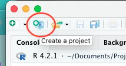
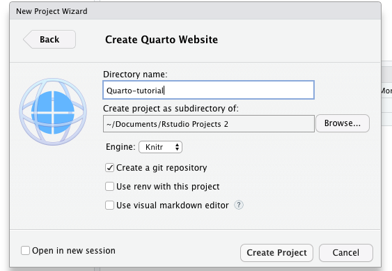
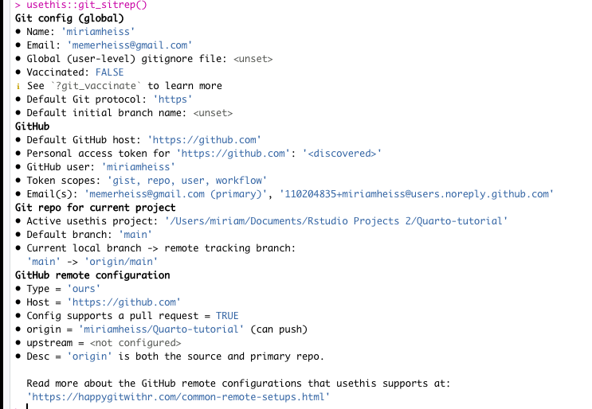
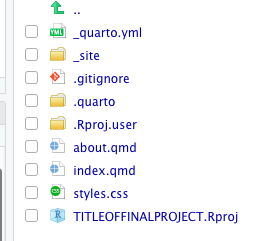
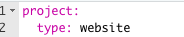
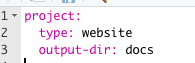
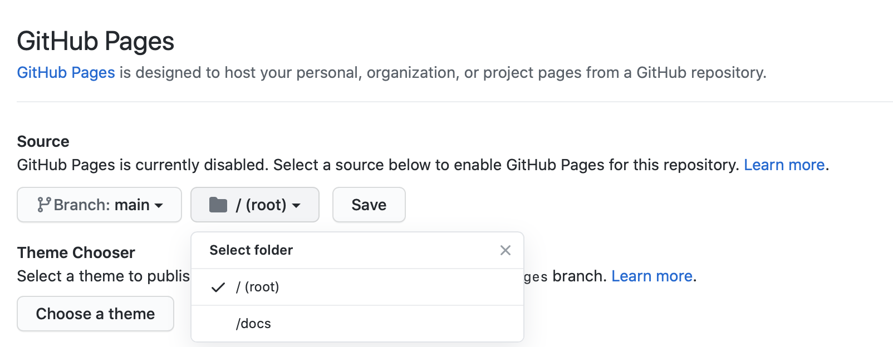

```{r setup, include = FALSE}
knitr::opts_chunk$set(echo = FALSE)
options(tutorial.exercise.timelimit = 60, 
        tutorial.storage = "local") 

library(learnr)
library(primer.tutorials)
library(ggthemes)
library(knitr)
library(tidyverse)
```

```{r copy-code-chunk, child = "../../child_documents/copy_button.Rmd"}
```

```{r info-section, child = "../../child_documents/info_section.Rmd"}
```

<!-- Add some comments to the file. Write two sentences describing the best parts of your town.  Then, confirm that they did with "grep file.R #"
SG: Kind of confused how to do this. Created new comment section and commented parts of graph from "visualization" section.-->


<!-- Add section about cross-talk: https://www.gerkelab.com/blog/2021/09/crosstalk-with-dt/. Need more things which make Distill websites as cool as Shiny. -->

<!-- Is there an easy way to distinguish between the repo distill-tutorial and the R project distill-tutorial? -->

<!-- Example: https://github.com/davidkane9/soccer_player_birth_months/ SG: Added message about dispersing code, not stuffing everything in index.Rmd-->

## Introduction
In this tutorial, you will learn how to create a Quarto website, and how modify it. This is what we will be using to create our final project!


## Creating a website 
We will go over how to make a [Quarto](https://quarto.org/docs/guide/) project in RStudio. We will also configure it for hosting on GitHub pages. 

### Exercise 1

In your RStudio Console, you should see a little icon that looks like this:

``` {r, out.width = 250}

```

###

When you click on that, it should bring you to a page that looks like this:

```{r, out.width = 500}
knitr::include_graphics("images/Directory.png")
```

### 

Click on "New Directory" (we will connect to GitHub in a minute).

###

After you've done that, it will bring you to another page that has a bunch of options. Select "Quarto Website".

```{r, out.width = 500}
knitr::include_graphics("images/website.png")
```

###

This is the last step! Once you have selected "Quarto Website", it will bring you to *one* more page. 

```{r, out.width = 500}

```

Please name the directory "Quarto-tutorial". You need to select **Create a Git Repository**, and click Create Project. 

### 

Now, you should have a directory called "Quarto-tutorial". 

### Exercise 2

In the Terminal, run `ls -a` to view a list of all the files in the directory. You should see a `README.md` which we made when we created the github repo. You should also see two hidden files, `.gitignore` and `.git`, along with some other files/directories.

CP/CR.

### 

```{r creating-a-website-2}
question_text(NULL,
    answer(NULL, correct = TRUE),
    allow_retry = TRUE,
    try_again_button = "Edit Answer",
    incorrect = NULL,
    rows = 3)
```

### Exercise 3

In the Console, load the `usethis` package. Then run the command `git_sitrep()`. Copy and paste the output below. 

```{r creating-a-website-3}
question_text(NULL,
    answer(NULL, correct = TRUE),
    allow_retry = TRUE,
    try_again_button = "Edit Answer",
    incorrect = NULL,
    rows = 3)
```

### 

`git_sitrep()` gives information on the status of Git on your computer and current project. In the "Git repo for current project" section, make sure that the active `usethis` project is set to the correct directory on your computer, i.e., the "quarto-tutorial" directory.

### 

In the Github remote configuration section, make sure that origin is set equal to your github directory and that you have "can push" in parentheses. 

Below is an example of the output of `git_sitrep()` for a working Git repo. Yours should be similar. Do not worry if token scopes differ. 

```{r, out.width = 700}

```

### Exercise 4

<!-- DK: Should split this up into a bunch of questions, each one looking at a different file --- like about.Rmd, site.xml and so on --- and explaining what they do. # MH: Done --- Also, issue "ls -a docs/" and then discuss result. MH: There is not a docs/ folder in quarto websites, it is called _site-->

<!--- MH: I may do the website creation differently (Using the project creation button, connecting to github after), it's also easier to publish using terminal commands (quarto publish gh-pages), maybe make 2 websites and show two ways to publish?---> 

To make a Quarto Website, type `quarto create-project Title-Of-My-Final-Project --type website` in the terminal. Make sure you are in the `quarto_tutorial` directory.

### 

This will create a folder in the directory `quarto_tutorial` called `Title-Of-My-Final-Project`

### 

Within `Title-Of-My-Final-Project` you should see files that you may not have seen yet. Knit the document. It will render the website. Now you should see another file called `_site`

```{r, out.width = 350}

```

### 

Move to `Title-Of-My-Final-Project` so that it is your working directory. Run `ls` in the terminal. CP/CR

```{r creating-a-website-4}
question_text(NULL,
    answer(NULL, correct = TRUE),
    allow_retry = TRUE,
    try_again_button = "Edit Answer",
    incorrect = NULL,
    rows = 3)
```

### Exercise 5

Let's take a deeper look at all of the files. First up, `index.qmd`.

### 

At the very top of the `index.qmd` you should see `title:`. There will be a bunch of `-` between the words. You can delete those and put "Title of my final project" instead. (Keep the quotes). 

### 

You will also see some text and a link. Delete those and type "This is where I will describe my final project." (No quotes).

### 

In the terminal, run `cat Title-Of-My-Final-Project`. CP/CR.

```{r creating-a-website-5}
question_text(NULL,
    answer(NULL, correct = TRUE),
    allow_retry = TRUE,
    try_again_button = "Edit Answer",
    incorrect = NULL,
    rows = 3)
```

### 

Knit the document again.

### Exercise 6

Now, we will look at the `about.qmd`. All you should see is a title and "About this site". Keep both how they are, but add a little more to the about page (e.g. "My name is **Your Name**, and I...")

### 

In the terminal, run `cat about.qmd`. CP/CR

```{r creating-a-website-6}
question_text(NULL,
    answer(NULL, correct = TRUE),
    allow_retry = TRUE,
    try_again_button = "Edit Answer",
    incorrect = NULL,
    rows = 3)
```

### Exercise 7

Now, we need to prepare the site to be published on github pages.

### 

In the `_quarto.yml`, at the very top you should see something that looks like this:


```{r}

```

Before we can publish on github pages, we need to change the output to be `docs`, that way we can publish to github pages. Add `output-dir: docs` to the `.yml`, like this:

``` {r}

```

### 

Run `cat _quarto.yaml` in the terminal. CP/CR

```{r creating-a-website-7}
question_text(NULL,
    answer(NULL, correct = TRUE),
    allow_retry = TRUE,
    try_again_button = "Edit Answer",
    incorrect = NULL,
    rows = 3)
```

### 

Save and knit the website

### 

In the Git tab, you should have several uncommitted changes. Select all of these and press commit. In the window that pops up, add the commit message "initial commit". Press the commit button. Then press the push button, the green arrow at the top right corner of the screen. 

### Exercise 8

In your browser, go to Github. Navigate to the page for your repo, `quarto_tutorial` Check to see that the new files we created are now on Github. 

### 

Navigate to Settings, the last item in the same menu (just below the repo name) where Code (which should be highlighted since you are on that page) is. On the left sidebar menu, click on Pages, which should be towards the bottom. 

### 

"None" should be the selected option in the Source section of Github pages. Click on the dropdown menu and choose "main". 

```{r}
include_graphics("images/github_pages.png")
```

### 

A field will appear in which "/root" is the selected option. Click on the dropdown menu and change this to "/docs".  This tells github to build your website from your /docs directory. 

```{r}

```

### Exercise 9

Before we can press save, we need to add a new folder to your website, called `.nojekyll`, that way github pages can render the website.

Press Save. When you do so, Github will begin to build the website. *This takes a few minutes!* When it is finished, you will be able to access the site at the link which the page provides.  

## Adding visualizations
### 

Putting plots in Distill is just like putting plots in regular R Markdowns. 

Let's add the following plot to your website's home page. 

```{r adding-visualization-0}
car_plot <- mtcars |> 
  select(mpg, wt) |> 
  ggplot(aes(wt, mpg)) +
  geom_point() +
  geom_smooth(method = "lm", formula = y ~ x, se = FALSE) +
  theme_clean() +
  labs(title = "Fuel Efficiency and Weight",
       subtitle = "Heavier cars are less fuel efficient", 
       x = "Weight (1000s of lbs)", 
       y = "MPG", 
       caption = "Henderson and Vellerman (1981)")

car_plot
```

### Exercise 1

Start a pipe with the data set `mtcars`. Do this and the rest of the pipe in the box provided below. 

```{r adding-visualization-1, exercise = TRUE}

```

```{r adding-visualization-1-hint-1, eval = FALSE}
mtcars
```

### Exercise 2

Select the columns `mpg` and `wt`. 

```{r adding-visualization-2, exercise = TRUE}

```

```{r adding-visualization-2-hint-1, eval = FALSE}
mtcars |> 
  select(..., ...)
```

### 

`wt` is weight of the car in 1000s of lbs.

### Exercise 3

Create a scatterplot with `wt` on the x-axis and `mpg` on the y-axis.

```{r adding-visualization-3, exercise = TRUE}

```

```{r adding-visualization-3-hint-1, eval = FALSE}
mtcars |> 
  select(mpg, wt) |> 
  ggplot(aes(wt, mpg)) +
  geom_point()
```

### Exercise 4

Add the layer `geom_smooth()`. Set method to "lm", formula to `y ~ x`, and se to `FALSE`.

```{r adding-visualization-4, exercise = TRUE}

```

```{r adding-visualization-4-hint-1, eval = FALSE}
mtcars |> 
  select(mpg, wt) |> 
  ggplot(aes(wt, mpg)) +
  geom_point() +
  geom_smooth(method = "...", formula = y ~ x, se = ...)
```

### Exercise 5

Adjust the feel of your graph by adding `theme_clean()`

```{r adding-visualization-5, exercise = TRUE}

```

```{r adding-visualization-5-hint-1, eval = FALSE}
mtcars |> 
  select(mpg, wt) |> 
  ggplot(aes(wt, mpg)) +
  geom_point() +
  geom_smooth(method = "lm", formula = y ~ x, se = FALSE) +
  theme_clean()
```

### Exercise 6

Use `labs` to add an appropriate title, subtitle, axes labels, and caption to your graph. 

```{r adding-visualization-6, exercise = TRUE}

```

```{r adding-visualization-6-hint-1, eval = FALSE}
mtcars |> 
  select(mpg, wt) |> 
  ggplot(aes(wt, mpg)) +
  geom_point() +
  geom_smooth(method = "lm", formula = y ~ x, se = FALSE) +
  theme_clean() +
  labs(title = "...",
       subtitle = "...", 
       x = "...", 
       y = "...", 
       caption = "...")
```

### 

Reminder: Your plot should look something like this

```{r show-car-plot}
car_plot
```

### Exercise 7

Open index.Rmd, which should be in the same directory as the .Rproj for your website. In the setup chunk, load the library `tidyverse` and the library `ggthemes`. Read (and then delete) the comments which are added by default in that code chunk.

### 

In the Terminal, run `tail index.Rmd`. Copy and paste the output below. 

```{r adding-visualization-7}
question_text(NULL,
    answer(NULL, correct = TRUE),
    allow_retry = TRUE,
    try_again_button = "Edit Answer",
    incorrect = NULL,
    rows = 3)
```

### 

The output, which prints the last ten lines of your document, should include the addition of the libraries. 

### 

Code that works during your R session will not work when your website is knitted if you have not loaded the required libraries into the document. 

### Exercise 8

Create a new code chunk in `index.Rmd`. At the very top of the chunk, there is a heading `{r}`. Add a space after the `r` and assign a name to your code chunk e.g. `{r car-plot}`. Save the changes to index.Rmd.  

### 

Knit the .Rmd. In the R Markdown tab, you will see a report of the knitting process. Copy and paste everything from the red "Rendering" message to the 100% in the box below. Note that this report is in the Render panel next to the Terminal panel.

```{r adding-visualization-8}
question_text(NULL,
    answer(NULL, correct = TRUE),
    allow_retry = TRUE,
    try_again_button = "Edit Answer",
    incorrect = NULL,
    rows = 3)
```

### 

One of the last items should be your code chunk with its label given. Here is an example:

```{r}
include_graphics("images/rmarkdown.png")
```

### 

Assigning names to code chunks helps keeps you organized and helps others understand your code. You cannot assign the same name to multiple code chunks. 

### Exercise 9

Copy and paste your code for from Exercise 6 into the `car-plot` code chunk. Save the changes to index.Rmd.

### 

In the Terminal, run `tail -n 20 index.Rmd`. Copy and paste the output below. 

```{r adding-visualization-9}
question_text(NULL,
    answer(NULL, correct = TRUE),
    allow_retry = TRUE,
    try_again_button = "Edit Answer",
    incorrect = NULL,
    rows = 3)
```

### 

In the Terminal, `tail` gives you the end of a file while `head` gives you the beginning. The `-n` argument determines the number of lines to show.

### Exercise 10

Go to the Build Tab, click "Build Website". Check to make sure your new graph is on the home page. 

### 

Go the Git tab, then commit and push your new changes to Github. Include a descriptive commit message, e.g. "Added plot to home page".

### 

After pushing, your new changes will be automatically reflected on your Github Pages site. This should take fewer than three minutes. 

<!-- DK: Should give a tour of the new files which are created. For example, note how few files are changed, compared to our initial commit. Why does the search change? What is the purpose of the new jpg in the docs/ directory? -->

<!-- DK: Explain why index.Rmd is called index. -->

## Adding text
### 

R Markdown allows for a combination of plain text and R code. This same feature allows you to add plain text to your website. 

### Exercise 1

Open `about.Rmd`, which should be in the same directory as your `distill-tutorial.Rproj` file. (This is not the same file as the `index.Rmd` which we just edited in the last section.) In the white space below the setup chunk, add the following: `## About Me`. Then, knit the Rmd. 

### 

In the Terminal, run `cat about.Rmd`. Copy and paste the result below. 

```{r adding-text-1}
question_text(NULL,
    answer(NULL, correct = TRUE),
    allow_retry = TRUE,
    try_again_button = "Edit Answer",
    incorrect = NULL,
    rows = 3)
```

### 

Hash signs in front of text makes the text into a header. The organization of headers is determined by the number of hash signs. Fewer hash signs make higher level headers, i.e. bigger text. More hash signs make lower level headers, i.e. smaller text. Notice that Distill has automatically included a line underneath this header. 

### Exercise 2

Compose a short description of yourself. Write it below the header. Include your name and school. You may also include interests of yours. Write until the end of the line, i.e. do not use the Enter key to wrap text. When you are finished, knit the Rmd. 

### 

In the Terminal, run `tail about.Rmd`. Copy and paste the result below. 

```{r adding-text-2}
question_text(NULL,
    answer(NULL, correct = TRUE),
    allow_retry = TRUE,
    try_again_button = "Edit Answer",
    incorrect = NULL,
    rows = 3)
```

### Exercise 3

Let's bold your name. In the description you have already written surround your name with two asteriks on each side, e.g. "My name is **Your Name**, and I...". When you are finished knit the Rmd. 

### 

In the Terminal, run `grep -F "**" about.Rmd`. Copy and paste the result below. 

```{r adding-text-3}
question_text(NULL,
    answer(NULL, correct = TRUE),
    allow_retry = TRUE,
    try_again_button = "Edit Answer",
    incorrect = NULL,
    rows = 3)
```

### 

The option `-F` allows you to use grep to search for characters that would otherwise be used in regular expressions. 

### Exercise 4

Add a new header with two hash signs, "About the Project". Underneath the header, include a title and description of your project. Knit the .Rmd.

### 

In the Terminal, run `cat -n about.Rmd`. Copy and paste the result below. 

```{r adding-text-4}
question_text(NULL,
    answer(NULL, correct = TRUE),
    allow_retry = TRUE,
    try_again_button = "Edit Answer",
    incorrect = NULL,
    rows = 3)
```

### Exercise 5

Let's italicize the title of your project. Surround the title of your project with one asterik on each side, e.g. My project, *The Title of My Project*, explores..."

### 

In the Terminal, run `grep "*" about.Rmd`. Copy and paste the result below. 

```{r adding-text-5}
question_text(NULL,
    answer(NULL, correct = TRUE),
    allow_retry = TRUE,
    try_again_button = "Edit Answer",
    incorrect = NULL,
    rows = 3)
```

### Exercise 6

Add a new header, "Goals", on a lower level than the previous using three hash signs. 

### 

Let's created a bulleted list of at least two goals of your project. To create a bulleted list begin each line with an asterisk. When you want to add a new item to the list, use enter to create a new line and add another asterisk. Knit the Rmd.

### 

In the Terminal, run `tail about.Rmd`. Copy and paste the result below. 

```{r adding-text-6}
question_text(NULL,
    answer(NULL, correct = TRUE),
    allow_retry = TRUE,
    try_again_button = "Edit Answer",
    incorrect = NULL,
    rows = 3)
```

### Exercise 7

For at least one goal in your bulleted list, add a possible challenge or complication of this goal. To do so, add the text on the line underneath the goal, use tab to indent, and add a `+` before the text. 

### 

In the Terminal, run `grep "+" about.Rmd`. Copy and paste the result below. 

```{r adding-text-7}
question_text(NULL,
    answer(NULL, correct = TRUE),
    allow_retry = TRUE,
    try_again_button = "Edit Answer",
    incorrect = NULL,
    rows = 3)
```

### 

To create a numbered list, use numbers followed by periods, i.e. 1., instead of asterisks. Sub-items for numbered lists are created in the same way as they are for bulleted lists. 

### Exercise 8

Oftentimes you want to wrap text before the default margin. For example, add Preceptor's common saying: '"This is data science"' (include the double quotes, not the single quotes). Then on the next line add "~ Preceptor" (do not include the quotes). Knit the Rmd. 

### 

Run `grep  "~" docs/about.html`. Copy and paste the result. 

```{r adding-text-8}
question_text(NULL,
    answer(NULL, correct = TRUE),
    allow_retry = TRUE,
    try_again_button = "Edit Answer",
    incorrect = NULL,
    rows = 3)
```

### 

This will not work. The quote and its source will be on the same line. 

### Exercise 9

To create a manual line break, add two spaces after the final quote in '"This is data science"'. Knit the rmd. 

### 

In the Terminal, run `grep "data science" docs/about.html`. Copy and paste the result. 

```{r adding-text-9}
question_text(NULL,
    answer(NULL, correct = TRUE),
    allow_retry = TRUE,
    try_again_button = "Edit Answer",
    incorrect = NULL,
    rows = 3)
```

### 

Note that the tilde will disappear and create an indent. This is an automatic feature of an R Markdown document. To print the tilde in the knitted document, enclose it within single quotes. 

### Exercise 10

Let's create text which is also a hyperlink to the bootcamp website. Enclose the text "Kane's Free High School Data Science Bootcamp" in brackets `[]`. Then, without a space intervening, add parentheses `()` which enclose a link to the bootcamp website: https://bootcamp.davidkane.info. Knit the Rmd. 

### 

In the Terminal, run `grep info docs/about.html`. Copy and paste the result. 

```{r adding-text-10}
question_text(NULL,
    answer(NULL, correct = TRUE),
    allow_retry = TRUE,
    try_again_button = "Edit Answer",
    incorrect = NULL,
    rows = 3)
```

### Exercise 11

Go to the Build Tab, click "Build Website". Check to make the about page has been updated. 

### 

Go the Git tab, then commit and push your new changes to Github. Include a descriptive commit message, e.g. "Added info to about page".

### 

After pushing, your new changes will be automatically reflected on your Github Pages site. This should take fewer than three minutes. 

## Adding new pages
### 

Here you will learn how to create new pages for your website, accessible via the navigation bar. 

### Exercise 1

In the Console for the project with your website, run `create_article("sources.Rmd")`. This opens an R Markdown called sources.Rmd. 

### 

You cannot make a new .Rmd from the File Tab. This will cause your website to break. You must use the `create_article()` command. Without the `create_article()` command, the necessary line `output: distill::distill_article` does not appear. 

### 

The error that you get when you do not use `create_article()` looks like this. If this happens, delete the problematic .Rmd file and use `create_article()` to re-create it.

```{r adding-new-pages-1}
include_graphics("images/build_error.png")
```

### 

In the Terminal, run the command `ls sources.Rmd`. Copy and paste the result.

```{r pages-1}
question_text(NULL,
    answer(NULL, correct = TRUE),
    allow_retry = TRUE,
    try_again_button = "Edit Answer",
    incorrect = NULL,
    rows = 3)
```

### 

`ls` should return `sources.Rmd`. 

### Exercise 2

Change the title from "Untitled" to "Sources". Change the description to "An overview of sources used in my project". 

Observe that the heading of this new file contains much more information than index.Rmd and about.Rmd. Delete the author and date fields from sources.Rmd so that the file more closely resembles the other two pages for our website. Knit sources.Rmd.

### 

In the Terminal, run the command `grep author sources.Rmd`. Copy and paste the result below. This should return an empty line. 

```{r adding-new-pages-2}
question_text(NULL,
    answer(NULL, correct = TRUE),
    allow_retry = TRUE,
    try_again_button = "Edit Answer",
    incorrect = NULL,
    rows = 3)
```

### Exercise 3

After the setup chunk add the following sentence: "This is where I will describe what sources I used and why I chose them. I may also discuss any broad challenges I faced while finding sources." Knit sources.Rmd. 

### 

In the Terminal, run `tail sources.Rmd`. Copy and paste the result.

```{r adding-new-pages-3}
question_text(NULL,
    answer(NULL, correct = TRUE),
    allow_retry = TRUE,
    try_again_button = "Edit Answer",
    incorrect = NULL,
    rows = 3)
```

### 

**Do not** delete the default text which invites people to learn more about Distill. On your own you may do so, but do not during this exercise because it will be used later. 

### Exercise 4

Go to the Build pane and press "Build Website". Your new page will not appear. 

### 

Open the `_site.yml` file. You should see a line that says `navbar`. Below this line you should see the line `right`. Below this is the code that creates the header links for the navigation bar on your site. 

### 

On a new line after `href: about.html`, add the line `- text: "Sources"`. Then on the line below, add `href: sources.html`. Make the formatting and spacing match the preceding items in the navbar. **YAML files can be very persnickety when it comes to formatting.** When you are done, save `_site.yml`.

### 

In the Terminal, run `grep href _site.yml`. Copy and paste the result. 

```{r adding-new-pages-4}
question_text(NULL,
    answer(NULL, correct = TRUE),
    allow_retry = TRUE,
    try_again_button = "Edit Answer",
    incorrect = NULL,
    rows = 3)
```

### 

This should return three lines. Including your new line addition of `sources.html`. All these html files live in the `docs` folder. `output_dir` at the top of the `yml` controls the location where htmls are knit to. 

### 

When you save `_site.yml` the site is automatically knit and opened. However, this is not the same thing as building the website. Close this. 

### 

The code `right` before the navbar items puts the navigation bar on the right side of your site. This can be changed to `left`. 

### Exercise 5

Go to the Build pane and press Build Website. Now you should see and be able to click through all three tabs. 

### 

In the Build tab, the last red message before `Output created:` should let you know that your new page was being rendered. Copy and paste that message. 

```{r adding-new-pages-5}
question_text(NULL,
    answer(NULL, correct = TRUE),
    allow_retry = TRUE,
    try_again_button = "Edit Answer",
    incorrect = NULL,
    rows = 3)
```

### Exercise 6

In the `_site.yml` file, delete the two lines of code that create the header and link for the Sources page. 

### 

In the Terminal, use `rm` to remove sources.Rmd

### 

In the Console, run `create_article()` twice to create two new files, "source_A.Rmd" and "source_B.Rmd".  

### 

In the Terminal, run `ls source*`. 

```{r adding-new-pages-6}
question_text(NULL,
    answer(NULL, correct = TRUE),
    allow_retry = TRUE,
    try_again_button = "Edit Answer",
    incorrect = NULL,
    rows = 3)
```

### 

This should return both source_A.Rmd and source_B.Rmd

### Exercise 7

Change the tile of the documents from Untitled to "Source A" and "Source B"

### 

Change the description of the documents to "Detailed notes for Source A" and "Detailed notes for Source B". The `|` symbol which comes by default in the description field add more space between the document title and the description. 

### 

Replace "Nora Jones" in the author field with your name. Delete the three subsequent fields after author. Knit the two .Rmds. 

### 

**Do not** delete the Distill credits. You may do so on your own website, but we will use this text later in the tutorial. 

In the Terminal, run the command `head source_A.Rmd source_B.Rmd`. Copy and paste the result below. 

```{r adding-new-pages-7}
question_text(NULL,
    answer(NULL, correct = TRUE),
    allow_retry = TRUE,
    try_again_button = "Edit Answer",
    incorrect = NULL,
    rows = 3)
```

### Exercise 8

Let's create a dropdown menu called "Sources" through which one could visit either the page for Source A or Source B. 

### 

Add the code `- text: "Sources"`. Type this so that it is line with the existing `- text` lines. 

### 

Underneath that, add the code `menu:`. Type this so that it is line with the exisiting `href` lines. Save the `_site.yml` file. 

### 

Go the build pane and hit Build the Website. The site should now have a new tab called "Sources", but nothing will happen when you click on it because it contains no links.

### 

In the Terminal, run `cat _site.yml`. Copy and paste the result below.

```{r adding-new-pages-8}
question_text(NULL,
    answer(NULL, correct = TRUE),
    allow_retry = TRUE,
    try_again_button = "Edit Answer",
    incorrect = NULL,
    rows = 3)
```

### Exercise 9

Open `_site.yml`. On the line underneath `menu` indent and then add the code `- text: "Source A"`. Then directly underneath that add the line `href: source_A.html`. Type it so that `text` and `href` are in line with one another. Since you have indented, they will not be in line with any of the previous.

### 

Underneath that, indent and then add the line `-text: "Source B"`. Then directly underneath that add the line `href: source_B.html`. Type it so that `text` and `href` are in line with one another and with those words for source A. 

### 

Go the build pane and hit Build the Website. The site should now have a tab called "Sources" with an arrow. When you click on it you should be given the option to naviagate either to the Source A page or the Source B page. 

### 

In the Terminal, run `cat _site.yml`. Copy and paste the result below.

```{r adding-new-pages-9}
question_text(NULL,
    answer(NULL, correct = TRUE),
    allow_retry = TRUE,
    try_again_button = "Edit Answer",
    incorrect = NULL,
    rows = 3)
```

### Exercise 10

Go the Git tab, then commit and push your new changes to Github. Include a descriptive commit message, e.g. "Added source pages".

### 

After pushing, your new changes will be automatically reflected on your Github Pages site. This should take fewer than three minutes. 

### 

We walked you through creating only one new page: a sources page. In your final project, disperse your code evenly throughout multiple pages; **don't just stuff everything in `index.Rmd`** and call it a day. For example, if you want to make a plot, create a new plot page where you do the work for making it. Then in `index.Rmd`, just include the graph object and describe it. 

## Using a .rds
### 

An `.rds` file allows us to save any R object in a file. When we load in an .rds, we avoid having to run the code required to make the object and simply have access to the output. This is very convenient for functions that take a long time to run, such as API requests. It can also be convenient for plots.

### Exercise 1

Go to File > New File and then click R Script. Press save in the left of the top panel. Name the file make-car-plot. The .R suffix will be added automatically. 

### 

In the Terminal, run `ls`. Make sure that make-car-plot.R is one of these files.

```{r using-a-rds-1}
question_text(NULL,
    answer(NULL, correct = TRUE),
    allow_retry = TRUE,
    try_again_button = "Edit Answer",
    incorrect = NULL,
    rows = 3)
```

### Exercise 2

Though an R script will use the libraries you already have loaded, it is good practice to include these at the top of the document. 

### 

Load the library `tidyverse`. 

### 

In the Terminal, run `grep library make-car-plot.R`. 

```{r using-a-rds-2}
question_text(NULL,
    answer(NULL, correct = TRUE),
    allow_retry = TRUE,
    try_again_button = "Edit Answer",
    incorrect = NULL,
    rows = 3)
```

### Exercise 3

Copy the code in the `car-plot` chunk in index.Rmd. Paste it into `make-car-plot.R`. Assign it to an object named `car_plot`. 

### 

To run the code in the R script, place your cursor at the end of the line (or pipe) you want to run and press Ctrl (Mac: Command) + Enter. Save the R script. 

### 

In the Terminal, run `cat -n make-car-plot.R`. Copy and paste the result here. 

```{r using-a-rds-3}
question_text(NULL,
    answer(NULL, correct = TRUE),
    allow_retry = TRUE,
    try_again_button = "Edit Answer",
    incorrect = NULL,
    rows = 3)
```

### Exercise 4

Under the pasted code, add the function `write_rds()`. The first argument is the R object which you want to store in an .rds file, `car_plot`. The second argument is the name of the file you want to create, "car-plot.rds". 

### 

Place your cursor at the end of the `write_rds()` function and press Ctrl (Mac: Command)  + Enter. You should now see the .rds file. 

### 

The R script that makes the .rds is not necessary for the building of your website. However, it is useful to include it in the directory that is uploaded to Git so that people can see the code that creates the R object. 

### 

In the Terminal, run `ls car*`. This should return a list which contains only "car-plot.rds". Copy and paste the result here. 

```{r using-a-rds-4}
question_text(NULL,
    answer(NULL, correct = TRUE),
    allow_retry = TRUE,
    try_again_button = "Edit Answer",
    incorrect = NULL,
    rows = 3)
```

### Exercise 5

Return to `index.Rmd`. Delete the code that makes `car_plot`. 

### 

Add the function `read_rds()`. Set its argument to the name of the file you want to read, `car-plot.rds`. Assign this output to an R object called `car_plot`. Below this, type the object `car_plot` to print the plot saved in the .rds. Knit the .Rmd.

### 

In the Terminal, run `grep rds index.Rmd`. Copy and paste the result. 

```{r using-a-rds-5}
question_text(NULL,
    answer(NULL, correct = TRUE),
    allow_retry = TRUE,
    try_again_button = "Edit Answer",
    incorrect = NULL,
    rows = 3)
```

### 

You should now see the same output as you had before when you had the code to make the plot. 

### 

This is a reminder that any R object can be made into an .rds file. It is most convenient for functions which take a long time to run and so will slow down your website's loading time, e.g. API requests. 


## Images
### 

The **knitr** package "provides a general-purpose tool for dynamic report generation in R using [Literate Programming](https://en.wikipedia.org/wiki/Literate_programming) techniques." We can add pictures to our website using this package

### Exercise 1

To add an image to a Distill website, we can use the `include_graphics()` function which is part of the `knitr` package.

### 

First, let's make an image. In the car-plot code chunk, use the function `ggsave()` to make a PNG image of the plot you just made. The first argument is the name of the file you want to save the image to, "car-plot.png". The next argument is `plot`, set that equal to `car_plot`. After you run this function, you should see a file named "car-plot.png" appear in your files pane. 

### 

In the Terminal, run `ls *png`. Copy and paste the result below. 

```{r images-1}
question_text(NULL,
    answer(NULL, correct = TRUE),
    allow_retry = TRUE,
    try_again_button = "Edit Answer",
    incorrect = NULL,
    rows = 3)
```

### Exercise 2

Any images you want to include on your website must be located in your project directory and uploaded to Git. While referring to images elsewhere on your computer may work when you knit and build on your computer, it will not work on other people's devices.

### 

It is often convenient to have a dedicated `images` directory within your main project directory. 

### 

In the Terminal, run `pwd` to confirm you are in the main project directory. Then run `mkdir images`. Use the `mv` command to move `car-plot.png` into the `images` directory. Hint: `mv car-plot.png images`

### 

In the Terminal, run `ls images`. This list should only contain one item, car-plot.png.

```{r images-2}
question_text(NULL,
    answer(NULL, correct = TRUE),
    allow_retry = TRUE,
    try_again_button = "Edit Answer",
    incorrect = NULL,
    rows = 3)
```

### Exercise 3

Create a new code chunk at the bottom of your document named image. 

### 

Add the `include_graphics()` function. Its argument is the path of the picture you want to include, `"images/car-plot.png"`. Knit the .Rmd. You should see an image of your plot at the bottom of the page. 

### 

In the Terminal, run `grep graphics index.Rmd`. Copy paste the result.

```{r images-3}
question_text(NULL,
    answer(NULL, correct = TRUE),
    allow_retry = TRUE,
    try_again_button = "Edit Answer",
    incorrect = NULL,
    rows = 3)
```

## Comments
An important part of an R project, especially one where you are making a website, is commenting. This lets other coders know why you are doing what you did. 

### Exercise 1

Take for example the `car-plot` code chunk in `index.Rmd`.

### 

Add a comment below the `select()` line (but above the `ggplot()` line) describing why we selected these two variables. 

Run `grep "#" index.Rmd` in the terminal and copy and paste the output below.

```{r comments-1}
question_text(NULL,
    answer(NULL, correct = TRUE),
    allow_retry = TRUE,
    try_again_button = "Edit Answer",
    incorrect = NULL,
    rows = 3)
```

### 

Now another person looking at your work knows why you included that `select()` line.

### Exercise 2

Add a comment below the `geom_smooth()` line about why you added that function.

Run `grep "#" index.Rmd` in the terminal and copy and paste the result below.

```{r comments-2}
question_text(
	"prompt here",
	answer(NULL, correct = TRUE),
	allow_retry = TRUE,
	try_again_button = "Text for button",
	incorrect = NULL)
```

### 

This was a short section but we cannot stress the importance of adding comments enough. Not only do they serve as a guide for other people looking at your code, but also as a reminder for yourself of why you did what you did. 

**ADD COMMENTS (or else...)!**

## Adding citations
### 

Distill and R Markdown make it easy to add cite others and create an accessible citation with which others can cite you. We will create our citations in the Bibtex format, which is recognized by text files with the suffix .bib. 

### Exercise 1

In the terminal, run `pwd` to confirm that you are still in the `distill-tutorial` directory. Then, run `touch bibliography.bib`. 

```{r adding-citations-1}
question_text(NULL,
    answer(NULL, correct = TRUE),
    allow_retry = TRUE,
    try_again_button = "Edit Answer",
    incorrect = NULL,
    rows = 3)
```

### Exercise 2

Open the file `bibliography.bib`. 

### 

Copy and paste the following Bibtex citation (for a non-existent work) into your document:
@article{jones2018distill,
author = {Jones, Nora}, 
title = {Distill for R Markdown},
journal = {Journal of Data Science Software}, 
year = {2018},
note = {https://rstudio.github.io/distill},
doi = {10.23915/distill.00010}
}

### 

Save `bibliography.bib`

### 

The label that follows the `@` identifies the medium of the work cited. The first item after the open parentheses is the tag; it can be whatever you want and you will use it as a shorthand to refer to the citation in your code. 

### 

The following fields contain the information that make up your citation. Fields will vary from work to work. However, they must be standard Bibtex fields to be included within your citation. 

Note that the content of these fields is enclosed within curly brackets. Each field is separated by a comma.

### 

Note that the `note` field does not appear by default within the citation. For this citation, the `doi` link takes us to the work's online location. 

### 

For a fuller list of Bibtex categotries and fields see [here](http://bib-it.sourceforge.net/help/fieldsAndEntryTypes.php#note)

### 

In the Terminal, run `cat -n bibliography.bib`. Copy and paste the result. 

```{r adding-citations-2}
question_text(NULL,
    answer(NULL, correct = TRUE),
    allow_retry = TRUE,
    try_again_button = "Edit Answer",
    incorrect = NULL,
    rows = 3)
```

### Exercise 3

Below the previous, copy and paste the following Bibtex citation, for *Primer.data*, into `bibliography.bib`:
@manual{primerdata,
author = {Kane, David}, 
title = {Primer.data},
year = {2020},
howpublished = {\url{https://github.com/PPBDS/primer.data}}
}

### 

Save `bibliography.bib`

### 

We found the information we used to cite this data in the [CITATION document](https://github.com/PPBDS/primer.data/blob/master/inst/CITATION) included in the Primer.data package. Check to see if data sets which you use have such documentation before citing them. 

### 

Most data sets should be cited in the category `@misc`. `@manual` was specified in the citation document document for *Primer.data*.

### 

Note that the tag for this citation `primerdata` bears no resemblance in format to the tag for the previous citation. 

### 

`primer.data` does not have a doi. If we want the URL to appear in the citation, we can use the `howpublished` field. For the URL to have proper formatting, you must enclose it with one set of curly brackets and then with another which contains `\url` after its opening bracket. 

### 

In the Terminal, run `cat -n bibliography.bib`. Copy and paste the result. 

```{r adding-citations-3}
question_text(NULL,
    answer(NULL, correct = TRUE),
    allow_retry = TRUE,
    try_again_button = "Edit Answer",
    incorrect = NULL,
    rows = 3)
```

### Exercise 4

Open `source_A.Rmd`. At the bottom of the header, on the line immediately after output, add the following: `bibliography: bibliography.bib`. 

### 

This tells where to find the citation information for any references we make in this document. 

### 

Knit the .Rmd. It should be unchanged. 

### 

In the Terminal, run `grep bibliography source_A.Rmd`. Copy and paste the result.

```{r adding-citations-4}
question_text(NULL,
    answer(NULL, correct = TRUE),
    allow_retry = TRUE,
    try_again_button = "Edit Answer",
    incorrect = NULL,
    rows = 3)
```

### Exercise 5

Two lines below the setup chunk, add the following plain text: "Source A was Primer.data. It was flawless." Save source_A.Rmd

### 

In the Terminal, run `grep flawless source_A.Rmd`. Copy and paste the result.

```{r adding-citations-5}
question_text(NULL,
    answer(NULL, correct = TRUE),
    allow_retry = TRUE,
    try_again_button = "Edit Answer",
    incorrect = NULL,
    rows = 3)
```

### Exercise 6

Immediately after the sentence we just added. Add `[@primerdata]`.

### 

Brackets which enclose a citation tag preceeded by an `@` lets R Markdown know that you have made a reference to the work in the current page.  Knit the .Rmd. 

### 

At the bottom you should the information from your Bibtex made into a more familiar citation format.

### 

In the Terminal, run the command `grep "@" source_A.Rmd` Copy and paste the result. 

```{r adding-citations-6}
question_text(NULL,
    answer(NULL, correct = TRUE),
    allow_retry = TRUE,
    try_again_button = "Edit Answer",
    incorrect = NULL,
    rows = 3)
```

### Exercise 7

After the last line of the Distill credits. Add `[@jones2018distill]`. 

### 

Knit the .Rmd. Notice that the references are listed in alphabetical order despite the order that they were mentioned in. Notice also that the places where we mentioned the references do not appear in the document. 

```{r adding-citations-7}
question_text(NULL,
    answer(NULL, correct = TRUE),
    allow_retry = TRUE,
    try_again_button = "Edit Answer",
    incorrect = NULL,
    rows = 3)
```

## Summary
You should now have a good idea of how to create a distill website, and what kind of things you can do with it. You will have to follow a similar process for your final project.

### 

After making sure all your changes are comitted and pushed to Github, go ahead and check out the website you just made!

```{r download-answers, child = "../../child_documents/download_answers.Rmd"}
```
