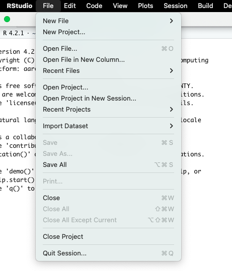
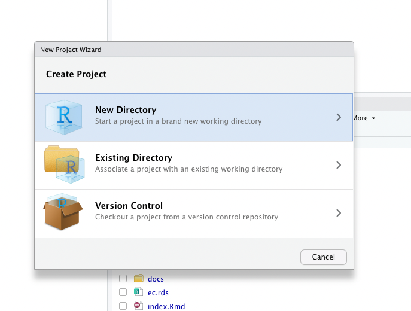
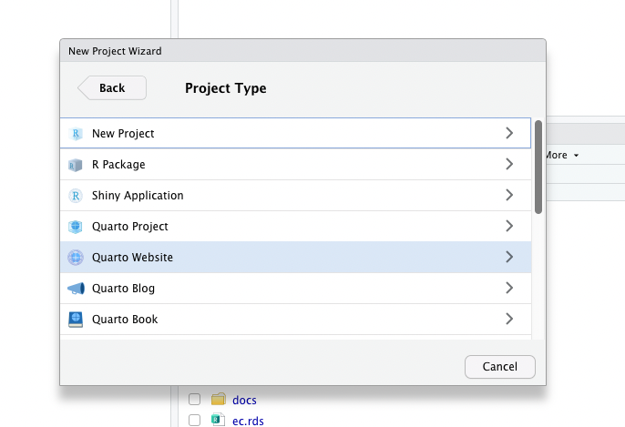
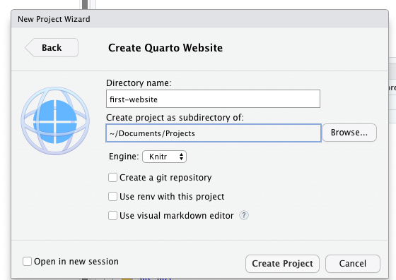
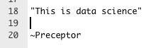
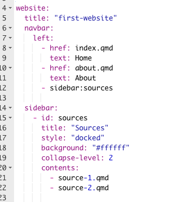
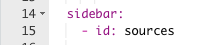

```{r setup, include = FALSE}
knitr::opts_chunk$set(echo = FALSE)
options(tutorial.exercise.timelimit = 60, 
        tutorial.storage = "local") 

library(learnr)
library(primer.tutorials)
library(ggthemes)
library(knitr)
library(tidyverse)
```

```{r copy-code-chunk, child = "../../child_documents/copy_button.Rmd"}
```

```{r info-section, child = "../../child_documents/info_section.Rmd"}
```

<!-- THIS IS YOUR TUTORIAL! Your have moral obligation to the students will will do this tutorial, to make good choices. -->

<!-- Package names are **bolded**. -->

<!-- Maybe repo names should be italized? Or backticked? Or single quotes? You decided! But certainly mention it the first time you do it! -->

<!-- Quarto Pub or Github Pages? -->

<!-- File names should always be in backticks. -->

<!-- Call the repo they create something like first-website. Then, you need to distinguish between three things: the Github repo, the R project which is connected to the repo and the website built from both. Help students to keep these different concepts clear in their own minds.  -->

<!-- Example: https://github.com/davidkane9/soccer_player_birth_months/ -->

## Introduction
### 

In this tutorial, you will learn how to create a Quarto website, and how
modify it. 


## Creating a website
### 

We will go over how to make a [Quarto](https://quarto.org/docs/websites/)
website in RStudio. We will also configure it for hosting on GitHub                
pages.

### Exercise 1

Following along will terminate this tutorial, do not follow along with the instructions, do them after you've read all of the exercise.

###

Navigate to the File menu in your RStudio session

```{r out.width = 500}

```

### 

Click on New Project.

```{r out.width = 500}

```

### 

Click on "New Directory". We will connect to GitHub later.

### 

Select "Quarto Website".

```{r out.width = 500}

```

### 

This is the last step! Once you have selected "Quarto Website", it will
bring you to *one* more page.

```{r out.width = 500}

```

Please name the directory `first-website`, and click "Create Project". 

### 

Please note that we did not add a Git repository, even though we had the option to. This is because we are not connected to Git, and you will lose everything if you commit without a published repository.

### 

Now, you should have a directory called `first-website` in the place you store your projects.

###

Those are all of the instructions for website creation. Terminate the tutorial and make your website. It will save your progress.

### Exercise 2

In the Console, run `list.files(all.files = TRUE)` to view a list of all
the files in the directory.
CP/CR.

### 

```{r creating-a-website-2}
question_text(NULL,
    answer(NULL, correct = TRUE),
    allow_retry = TRUE,
    try_again_button = "Edit Answer",
    incorrect = NULL,
    rows = 3)
```

### Exercise 3

Let's connect to Github now.

### 

We will be following the instructions from [Happy Git with R](https://happygitwithr.com/existing-github-last.html), which is a very useful resource.

### 

In the Console, run `usethis::use_git(message = "Initial commit")` into the Console after.

### 

You should be able to see the repository made in your Github account. Copy and paste the URL of your `first-website` repo below:

```{r creating-a-website-3}
question_text(NULL,
    answer(NULL, correct = TRUE),
    allow_retry = TRUE,
    try_again_button = "Edit Answer",
    incorrect = NULL,
    rows = 3)
```

### 

`use_git()` initializes a Git repository and adds important files to .gitignore.

### Exercise 4

Now, we are going to set up Quarto Pub, where we''re'll be hosting the website
### 

In your browser, type **quartopub.com**, it will take you directly to the website

### 

Click the big blue button that says **Sign Up**. 

### 

Use your Github username and password, it's much easier this way, so you don't have to juggle around a bunch of passwords and usernames when you want to publish.

###

Now, we are all set up and can publish, but, we should add some plots and text to the website.

## Adding visualizations

Right now, your `index.qmd` just has a bunch of random links and math in it. Let's make it look a little bit better now.

### Exercise 1

First, we should delete the initial everything, except for the `title: "first-website"` surrounded by the three lines. 
###

###

Copy and paste everything in `index.qmd` (which should only be the title settings) below

```{r creating-title}
question_text(NULL,
    answer(NULL, correct = TRUE),
    allow_retry = TRUE,
    try_again_button = "Edit Answer",
    incorrect = NULL,
    rows = 3)
```

###

The set of three lines at the very top is called a **YAML Header**. These are very sensitive about everything, but luckily we are just changing the title and nothing else. Please make sure that the `title: "first-website"` is still surrounded by three lines, otherwise it will not work.

###
We are going to add the following plot to your website's home page.

```{r adding-visualization-0}
car_plot <- mtcars |> 
  select(mpg, wt) |> 
  ggplot(aes(wt, mpg)) +
  geom_point() +
  geom_smooth(method = "lm", formula = y ~ x, se = FALSE) +
  theme_clean() +
  labs(title = "Fuel Efficiency and Weight",
       subtitle = "Heavier cars are less fuel efficient", 
       x = "Weight (1000s of lbs)", 
       y = "MPG", 
       caption = "Henderson and Vellerman (1981)")

car_plot
```

### Exercise 1

Start a pipe with the data set `mtcars` below.

```{r adding-visualization-1, exercise = TRUE}

```

```{r adding-visualization-1-hint-1, eval = FALSE}
mtcars |>
```

### Exercise 2

Select the columns `mpg` and `wt`.

```{r adding-visualization-2, exercise = TRUE}

```

```{r adding-visualization-2-hint-1, eval = FALSE}
mtcars |> 
  select(..., ...)
```

### 

`wt` is weight of the car in 1000s of lbs.

### Exercise 3

Create a scatterplot with `wt` on the x-axis and `mpg` on the y-axis.

```{r adding-visualization-3, exercise = TRUE}

```

```{r adding-visualization-3-hint-1, eval = FALSE}
mtcars |> 
  select(mpg, wt) |> 
  ggplot(aes(wt, mpg)) +
  geom_point()
```

### Exercise 4

Add the layer `geom_smooth()`. Set method to `lm`, formula to `y ~ x`,
and `se` to `FALSE`.

```{r adding-visualization-4, exercise = TRUE}

```

```{r adding-visualization-4-hint-1, eval = FALSE}
mtcars |> 
  select(mpg, wt) |> 
  ggplot(aes(wt, mpg)) +
  geom_point() +
  geom_smooth(method = "...", formula = y ~ x, se = ...)
```

### Exercise 5

Adjust the feel of your graph by adding `theme_clean()`

```{r adding-visualization-5, exercise = TRUE}

```

```{r adding-visualization-5-hint-1, eval = FALSE}
mtcars |> 
  select(mpg, wt) |> 
  ggplot(aes(wt, mpg)) +
  geom_point() +
  geom_smooth(method = "lm", formula = y ~ x, se = FALSE) +
  theme_clean()
```

### Exercise 6

Use `labs` to add an appropriate title, subtitle, axes labels, and
caption to your graph.

```{r adding-visualization-6, exercise = TRUE}

```

```{r adding-visualization-6-hint-1, eval = FALSE}
mtcars |> 
  select(mpg, wt) |> 
  ggplot(aes(wt, mpg)) +
  geom_point() +
  geom_smooth(method = "lm", formula = y ~ x, se = FALSE) +
  theme_clean() +
  labs(title = "...",
       subtitle = "...", 
       x = "...", 
       y = "...", 
       caption = "...")
```

### 

Reminder: Your plot should look something like this

```{r show-car-plot}
car_plot
```


### Exercise 5

Underneath the YAML header, add a code chunk with the green c and +, or you can use the keyboard shortcut Cmd + Option + I (Windows: Ctrl + Alt + I)

###

In the code chunk, load the packages `tidyverse` and `ggthemes`. Press cmd + return (cmd + enter) to tell the Console to load the libraries.

### 

You should also see some curly braces (`{}`) with an `r` inside. One space after the `r`, type libraries for your code chunk name. Type a comma and then add `include = FALSE`, that way when we render the website, the code won't show up.

### 

In the Terminal, run `tail index.qmd `. CP/CR.

```{r adding-visualization-7}
question_text(NULL,
    answer(NULL, correct = TRUE),
    allow_retry = TRUE,
    try_again_button = "Edit Answer",
    incorrect = NULL,
    rows = 3)
```

### 

The output, which prints the last ten lines of your document, should
include the addition of the libraries.

### 

Code that works during your R session will not work when your website is
knitted if you have not loaded the required libraries into the document.

### Exercise 8

Create a new code chunk in `index.qmd `. At the very top of the chunk,
there is a heading `{r}`. Add a space after the `r` and assign a name to
your code chunk, e.g. `{r car-plot}`. Save the changes to index.qmd .

### 

Render the qmd with the render button at the very top. It should show the plot, along with the code for the plot.

```{r adding-visualization-8}
question_text(NULL,
    answer(NULL, correct = TRUE),
    allow_retry = TRUE,
    try_again_button = "Edit Answer",
    incorrect = NULL,
    rows = 3)
```

### 

Assigning names to code chunks helps keeps you organized and helps
others understand your code. You cannot assign the same name to multiple
code chunks.

### Exercise 9

Copy and paste your code for from Exercise 6 into the `car-plot` code
chunk. Save the changes to index.qmd .

### 

In the Console, run `readr::read_lines(file = "index.qmd")`. CP/CR

```{r adding-visualization-9}
question_text(NULL,
    answer(NULL, correct = TRUE),
    allow_retry = TRUE,
    try_again_button = "Edit Answer",
    incorrect = NULL,
    rows = 3)
```

### Exercise 10

Go to the Git tab, then commit and push your new changes to Github. Include
a descriptive commit message, e.g. "Added plot to home page".

### 

In the Terminal type `quarto publish quarto-pub`. You will need to type `Yes` when it asks you to, and then press enter twice. 

### Exercise 11

Website creation may take a while, but it will ask you if it can use Quarto Pub CLI, so stay by the computer. When that box pops up, select accept. 

###

It will not bring you to your website, but to your Quarto Pub account, where you will see the website. Click on it and copy and paste the URL below

```{r adding-visualization-11}
question_text(NULL,
    answer(NULL, correct = TRUE),
    allow_retry = TRUE,
    try_again_button = "Edit Answer",
    incorrect = NULL,
    rows = 3)
```

## Adding text
Quarto allows for a combination of plain text and R code. This same
feature allows you to add plain text to your website.

### Exercise 1

Open `about.qmd `. Delete the "About this Website" and math, and add the following: `## About Me`. Then, render the qmd.

### 

In the Console, run `read_lines(file = "about.qmd")`. CP/CR

```{r adding-text-1}
question_text(NULL,
    answer(NULL, correct = TRUE),
    allow_retry = TRUE,
    try_again_button = "Edit Answer",
    incorrect = NULL,
    rows = 3)
```

### 

Hash signs in front of text makes the text into a header. The
organization of headers is determined by the number of hash signs. Fewer
hash signs make higher level headers, i.e. bigger text. More hash signs
make lower level headers, i.e. smaller text. 

### Exercise 2

Compose a short description of yourself. Write it below the header.
Include your name and school. You may also include interests of yours.
Write until the end of the line, i.e. do not use the Enter key to wrap
text. When you are finished, render the qmd.

### 

In the Console, run `read_lines(file = "about.qmd")`. CP/CR

```{r adding-text-2}
question_text(NULL,
    answer(NULL, correct = TRUE),
    allow_retry = TRUE,
    try_again_button = "Edit Answer",
    incorrect = NULL,
    rows = 3)
```

### Exercise 3

Let's bold your name. In the description you have already written
surround your name with two asterisks (** **) on each side, e.g. "My name is
**Your Name**, and I...". When you are finished render the qmd.

### 

In the Terminal, run `grep -F "**" about.qmd`. Copy and paste the result
below.

```{r adding-text-3}
question_text(NULL,
    answer(NULL, correct = TRUE),
    allow_retry = TRUE,
    try_again_button = "Edit Answer",
    incorrect = NULL,
    rows = 3)
```

### 

The option `-F` allows you to use grep to search for characters that
would otherwise be used in regular expressions.

### Exercise 4

Add a new header with two hash signs, "About the Project". Underneath
the header, include a title and description of your project. Render the
.qmd.

### 

In the Console, run `read_lines(file = "about.qmd")`. CP/CR

```{r adding-text-4}
question_text(NULL,
    answer(NULL, correct = TRUE),
    allow_retry = TRUE,
    try_again_button = "Edit Answer",
    incorrect = NULL,
    rows = 3)
```

### Exercise 5

Let's italicize the title of your project. Surround the title of your
project with one asterisk on each side, e.g. My project, *The Title of My
Project*, explores..."

### 

In the Terminal, run `grep "*" about.qmd`. Copy and paste the result
below.

```{r adding-text-5}
question_text(NULL,
    answer(NULL, correct = TRUE),
    allow_retry = TRUE,
    try_again_button = "Edit Answer",
    incorrect = NULL,
    rows = 3)
```

### Exercise 6

Add a new header, "Goals", on a lower level than the previous using
three hash signs.

### 

Let's created a bulleted list of at least two goals of your project. To
create a bulleted list begin each line with dash and space. When you want
to add a new item to the list, use enter to create a new line and add
another dash and space. Render the qmd.

### 

In the Terminal, run `tail about.qmd`. Copy and paste the result below.

```{r adding-text-6}
question_text(NULL,
    answer(NULL, correct = TRUE),
    allow_retry = TRUE,
    try_again_button = "Edit Answer",
    incorrect = NULL,
    rows = 3)
```

### Exercise 7

For at least one goal in your bulleted list, add a possible challenge or
complication of this goal. To do so, add the text on the line underneath
the goal, use tab to indent, and add a `+` before the text.

### 

In the Terminal, run `grep "+" about.qmd`. CP/CR

```{r adding-text-7}
question_text(NULL,
    answer(NULL, correct = TRUE),
    allow_retry = TRUE,
    try_again_button = "Edit Answer",
    incorrect = NULL,
    rows = 3)
```

### 

To create a numbered list, use numbers followed by periods, i.e. 1.,
instead of asterisks. Sub-items for numbered lists are created in the
same way as they are for bulleted lists.

### Exercise 8

Oftentimes you want to wrap text before the default margin. For example,
add Preceptor's common saying: '"This is data science"' (include the
double quotes, not the single quotes). Then on the next line add "\~
Preceptor" (do not include the quotes). Render the qmd.

### 

Run `grep  "~" docs/about.html`. Copy and paste the result.

```{r adding-text-8}
question_text(NULL,
    answer(NULL, correct = TRUE),
    allow_retry = TRUE,
    try_again_button = "Edit Answer",
    incorrect = NULL,
    rows = 3)
```

### 

This will not work. The quote and its source will be on the same line.

### Exercise 9

To create a manual line break, put the '~Preceptor' two lines below the '"This is data science"', like this:

```{r}

```

### 

Then, between the lines, add a backslash (`\`)

In the Terminal, run `grep "data science" docs/about.html`. Copy and
paste the result.

```{r adding-text-9}
question_text(NULL,
    answer(NULL, correct = TRUE),
    allow_retry = TRUE,
    try_again_button = "Edit Answer",
    incorrect = NULL,
    rows = 3)
```

### Exercise 10

Let's create text which is also a hyperlink to the bootcamp website.
Enclose the text "Kane's Free High School Data Science Bootcamp" in
brackets `[]`. Then, without a space intervening, add parentheses `()`
which enclose a link to the bootcamp website:
<https://bootcamp.davidkane.info>. Render the qmd.

### 

In the Terminal, run `read_lines(file = "about.qmd")`. CP/CR


```{r adding-text-10}
question_text(NULL,
    answer(NULL, correct = TRUE),
    allow_retry = TRUE,
    try_again_button = "Edit Answer",
    incorrect = NULL,
    rows = 3)
```

### Exercise 11

Save the qmd and render it too.

### 

Push all the changes to Git, and issue the `quarto publish gh-pages` command in the Terminal. This should take a few minutes.

## Adding new pages
Here you will learn how to create new pages for your website, accessible
via the navigation bar.

### Exercise 1

Let's make pages for our sources with a dropdown menu.

### 

Go to File -> New File -> Quarto Document. Name it "Sources" (No quotes). Then select "Create Empty Document" (in the bottom left corner). Change the file name from `Untitled1` to `sources.qmd` by saving it. It will add the `.qmd` automatically.

### 

Run `list.files(path = ".")`. CP/CR

```{r adding-new-pages-1}
question_text(NULL,
    answer(NULL, correct = TRUE),
    allow_retry = TRUE,
    try_again_button = "Edit Answer",
    incorrect = NULL,
    rows = 3)
```

### 

The `path = "."` signifies that the files listed should be in the working directory. You should see `index.qmd`, `about.qmd`, and `sources.qmd` in the output. If not, make sure you are in the `first-website` directory.

### Exercise 2

 Change the description to
"An overview of sources used in my project".

### 

You may also delete the yaml setting `editor: visual`, as that will get annoying.

### 

In the Terminal, run the command `grep editor sources.qmd`. CP/CR

```{r adding-new-pages-2}
question_text(NULL,
    answer(NULL, correct = TRUE),
    allow_retry = TRUE,
    try_again_button = "Edit Answer",
    incorrect = NULL,
    rows = 3)
```

### 

It should return an empty line because we deleted the `editor` setting in the `sources.qmd`

### Exercise 3

Add the following sentence: "These are my sources. Here are some challenges. Quarto websites are awesome". Render sources.qmd.

### 

Run `read_lines(file = "sources.qmd")` in the Console. CP/CR

```{r adding-new-pages-3}
question_text(NULL,
    answer(NULL, correct = TRUE),
    allow_retry = TRUE,
    try_again_button = "Edit Answer",
    incorrect = NULL,
    rows = 3)
```

### Exercise 4

### 

Open the `_quarto.yml` file. You should see a line that says `navbar`.
Below this line you should see the line `right`. Below this is the code
that creates the header links for the navigation bar on your site.

### 

On a new line after `href: sources.qmd`, add the line
`- text: Sources`. Make the formatting and spacing match the preceding items in the navbar.
**YAML files can be very persnickety when it comes to formatting!** When
you are done, save `_quarto.yml`.

### 

In the Terminal, run `read_lines(file = "_quarto.yml")`. CP/CR

```{r adding-new-pages-4}
question_text(NULL,
    answer(NULL, correct = TRUE),
    allow_retry = TRUE,
    try_again_button = "Edit Answer",
    incorrect = NULL,
    rows = 3)
```

### 

This will have a lot of spaces. That is a good sign, it means that you are doing it right. **Yaml files are *very* tricky!**

### 

The code `right` before the navbar items puts the navigation bar on the
right side of your site. This can be changed to `left`.

### Exercise 5

In the `_site.yml` file, delete the two lines of code that create the
header and link for the Sources page.

### 

In the Terminal, use `rm` to remove `sources.qmd`

### 

Run `list.files(path = ".")` in the Console again. CP/CR

```{r adding-new-pages-5}
question_text(NULL,
    answer(NULL, correct = TRUE),
    allow_retry = TRUE,
    try_again_button = "Edit Answer",
    incorrect = NULL,
    rows = 3)
```

### 

This should not have `sources.qmd` anymore.

### Exercise 6

Make two more Quarto documents the same way. Name them `source-1` and `source-2`

### 

Add the description of the documents to "Detailed notes for Source A"
and "Detailed notes for Source B".
### 

### 

In the Terminal, run the command `head source-1.qmd source-2.qmd`. Copy
and paste the result below.

```{r adding-new-pages-6}
question_text(NULL,
    answer(NULL, correct = TRUE),
    allow_retry = TRUE,
    try_again_button = "Edit Answer",
    incorrect = NULL,
    rows = 3)
```

### Exercise 7

Let's create a dropdown menu called "Sources" through which one could
visit either the page for Source A or Source B from any page in the website.

###

We will be messing around with YAML settings to make this, so pay very close attention

```{r out.width = 500}

```

###

If you want a better understanding of how these work and other ways to make dropdown menus and navigation bars, you can read [this](https://quarto.org/docs/websites/website-navigation.html#hybrid-navigation). It's all about website navigation.

### Exercise 8

Open `_quarto.yml`.

###

Inline with `navbar`, a line away from the last thing in the section, add `sidebar:`

###

Add `- id:` 4 spaces away from the edge on the next line, like this:

```{r out.width = 500}

```

###

The `- id:` will make it easier to have the dropdown menu be attached to the top navbar.

###

Everything else (pretty much) will be inline with the `- id:`

###

Inline with the `i` in `- id:`, add the following:

- `title: "Sources"`
- `style: "docked"`
- `background: "#ffffff"`
- `collapse-level: 2`
- `contents:`

###

We will add more into `contents` very soon, but just leave the colon where it is and how it is.


In the Terminal, run `cat _site.yml`. Copy and paste the result below.

```{r adding-new-pages-8}
question_text(NULL,
    answer(NULL, correct = TRUE),
    allow_retry = TRUE,
    try_again_button = "Edit Answer",
    incorrect = NULL,
    rows = 3)
```

### Exercise 9

Go the Git tab, then commit and push your new changes to Github. Include
a descriptive commit message, e.g. "Added source pages".

### 

After pushing, your new changes will be automatically reflected on your
Github Pages site. This should take fewer than three minutes.

### 

We walked you through creating only one new page: a sources page. In
your final project, disperse your code evenly throughout multiple pages;
**don't just stuff everything in `index.qmd`** and call it a day. For
example, if you want to make a plot, create a new plot page where you do
the work for making it. Then in `index.qmd`, just include the graph
object and describe it.

## Using a .rds
### 

An `.rds` file allows us to save any R object in a file. When we load in
an .rds, we avoid having to run the code required to make the object and
simply have access to the output. This is very convenient for functions
that take a long time to run, such as API requests. It can also be
convenient for plots.

### Exercise 1

Go to File \> New File and then click R Script. Press save in the left
of the top panel. Name the file make-car-plot. The .R suffix will be
added automatically.

### 

In the Terminal, run `ls`. Make sure that make-car-plot.R is one of
these files.

```{r using-a-rds-1}
question_text(NULL,
    answer(NULL, correct = TRUE),
    allow_retry = TRUE,
    try_again_button = "Edit Answer",
    incorrect = NULL,
    rows = 3)
```

### Exercise 2

Though an R script will use the libraries you already have loaded, it is
good practice to include these at the top of the document.

### 

Load the library `tidyverse`.

### 

In the Terminal, run `grep library make-car-plot.R`.

```{r using-a-rds-2}
question_text(NULL,
    answer(NULL, correct = TRUE),
    allow_retry = TRUE,
    try_again_button = "Edit Answer",
    incorrect = NULL,
    rows = 3)
```

### Exercise 3

Copy the code in the `car-plot` chunk in index.qmd. Paste it into
`make-car-plot.R`. Assign it to an object named `car_plot`.

### 

To run the code in the R script, place your cursor at the end of the
line (or pipe) you want to run and press Ctrl (Mac: Command) + Enter.
Save the R script.

### 

In the Terminal, run `cat -n make-car-plot.R`. Copy and paste the result
here.

```{r using-a-rds-3}
question_text(NULL,
    answer(NULL, correct = TRUE),
    allow_retry = TRUE,
    try_again_button = "Edit Answer",
    incorrect = NULL,
    rows = 3)
```

### Exercise 4

Under the pasted code, add the function `write_rds()`. The first
argument is the R object which you want to store in an .rds file,
`car_plot`. The second argument is the name of the file you want to
create, "car-plot.rds".

### 

Place your cursor at the end of the `write_rds()` function and press
Ctrl (Mac: Command) + Enter. You should now see the .rds file.

### 

The R script that makes the .rds is not necessary for the building of
your website. However, it is useful to include it in the directory that
is uploaded to Git so that people can see the code that creates the R
object.

### 

In the Terminal, run `ls car*`. This should return a list which contains
only "car-plot.rds". Copy and paste the result here.

```{r using-a-rds-4}
question_text(NULL,
    answer(NULL, correct = TRUE),
    allow_retry = TRUE,
    try_again_button = "Edit Answer",
    incorrect = NULL,
    rows = 3)
```

### Exercise 5

Return to `index.qmd`. Delete the code that makes `car_plot`.

### 

Add the function `read_rds()`. Set its argument to the name of the file
you want to read, `car-plot.rds`. Assign this output to an R object
called `car_plot`. Below this, type the object `car_plot` to print the
plot saved in the .rds. Render the .qmd.

### 

In the Terminal, run `grep rds index.qmd`. Copy and paste the result.

```{r using-a-rds-5}
question_text(NULL,
    answer(NULL, correct = TRUE),
    allow_retry = TRUE,
    try_again_button = "Edit Answer",
    incorrect = NULL,
    rows = 3)
```

### 

You should now see the same output as you had before when you had the
code to make the plot.

### 

This is a reminder that any R object can be made into an .rds file. It
is most convenient for functions which take a long time to run and so
will slow down your website's loading time, e.g. API requests.

## Images
### 

The **knitr** package "provides a general-purpose tool for dynamic
report generation in R using [Literate
Programming](https://en.wikipedia.org/wiki/Literate_programming)
techniques." We can add pictures to our website using this package

### Exercise 1

To add an image to a Distill website, we can use the
`include_graphics()` function which is part of the `knitr` package.

### 

First, let's make an image. In the car-plot code chunk, use the function
`ggsave()` to make a PNG image of the plot you just made. The first
argument is the name of the file you want to save the image to,
"car-plot.png". The next argument is `plot`, set that equal to
`car_plot`. After you run this function, you should see a file named
"car-plot.png" appear in your files pane.

### 

In the Terminal, run `ls *png`. Copy and paste the result below.

```{r images-1}
question_text(NULL,
    answer(NULL, correct = TRUE),
    allow_retry = TRUE,
    try_again_button = "Edit Answer",
    incorrect = NULL,
    rows = 3)
```

### Exercise 2

Any images you want to include on your website must be located in your
project directory and uploaded to Git. While referring to images
elsewhere on your computer may work when you render and build on your
computer, it will not work on other people's devices.

### 

It is often convenient to have a dedicated `images` directory within
your main project directory.

### 

In the Terminal, run `pwd` to confirm you are in the main project
directory. Then run `mkdir images`. Use the `mv` command to move
`car-plot.png` into the `images` directory. Hint:
`mv car-plot.png images`

### 

In the Terminal, run `ls images`. This list should only contain one
item, car-plot.png.

```{r images-2}
question_text(NULL,
    answer(NULL, correct = TRUE),
    allow_retry = TRUE,
    try_again_button = "Edit Answer",
    incorrect = NULL,
    rows = 3)
```

### Exercise 3

Create a new code chunk at the bottom of your document named image.

### 

Add the `include_graphics()` function. Its argument is the path of the
picture you want to include, `"images/car-plot.png"`. Render the .qmd . You
should see an image of your plot at the bottom of the page.

### 

In the Terminal, run `grep graphics index.qmd `. Copy paste the result.

```{r images-3}
question_text(NULL,
    answer(NULL, correct = TRUE),
    allow_retry = TRUE,
    try_again_button = "Edit Answer",
    incorrect = NULL,
    rows = 3)
```

## Comments
An important part of an R project, especially one where you are making a
website, is commenting. This lets other coders know why you are doing
what you did.

### Exercise 1

Take for example the `car-plot` code chunk in `index.qmd `.

### 

Add a comment below the `select()` line (but above the `ggplot()` line)
describing why we selected these two variables.

Run `grep "#" index.qmd ` in the Terminal and copy and paste the output
below.

```{r comments-1}
question_text(NULL,
    answer(NULL, correct = TRUE),
    allow_retry = TRUE,
    try_again_button = "Edit Answer",
    incorrect = NULL,
    rows = 3)
```

### 

Now another person looking at your work knows why you included that
`select()` line.

### Exercise 2

Add a comment below the `geom_smooth()` line about why you added that
function.

Run `grep "#" index.qmd ` in the Terminal and copy and paste the result
below.

```{r comments-2}
question_text(
	"prompt here",
	answer(NULL, correct = TRUE),
	allow_retry = TRUE,
	try_again_button = "Text for button",
	incorrect = NULL)
```

### 

This was a short section but we cannot stress the importance of adding
comments enough. Not only do they serve as a guide for other people
looking at your code, but also as a reminder for yourself of why you did
what you did.

**ADD COMMENTS (or else...)!**

## Adding citations
### 

Distill and R Markdown make it easy to add cite others and create an
accessible citation with which others can cite you. We will create our
citations in the Bibtex format, which is recognized by text files with
the suffix .bib.

### Exercise 1

In the terminal, run `pwd` to confirm that you are still in the
`distill-tutorial` directory. Then, run `touch bibliography.bib`.

```{r adding-citations-1}
question_text(NULL,
    answer(NULL, correct = TRUE),
    allow_retry = TRUE,
    try_again_button = "Edit Answer",
    incorrect = NULL,
    rows = 3)
```

### Exercise 2

Open the file `bibliography.bib`.

### 

Copy and paste the following Bibtex citation (for a non-existent work)
into your document: @article{jones2018distill, author = {Jones, Nora},
title = {Distill for R Markdown}, journal = {Journal of Data Science
Software}, year = {2018}, note = {<https://rstudio.github.io/distill>},
doi = {10.23915/distill.00010} }

### 

Save `bibliography.bib`

### 

The label that follows the `@` identifies the medium of the work cited.
The first item after the open parentheses is the tag; it can be whatever
you want and you will use it as a shorthand to refer to the citation in
your code.

### 

The following fields contain the information that make up your citation.
Fields will vary from work to work. However, they must be standard
Bibtex fields to be included within your citation.

Note that the content of these fields is enclosed within curly brackets.
Each field is separated by a comma.

### 

Note that the `note` field does not appear by default within the
citation. For this citation, the `doi` link takes us to the work's
online location.

### 

For a fuller list of Bibtex categotries and fields see
[here](http://bib-it.sourceforge.net/help/fieldsAndEntryTypes.php#note)

### 

In the Terminal, run `cat -n bibliography.bib`. Copy and paste the
result.

```{r adding-citations-2}
question_text(NULL,
    answer(NULL, correct = TRUE),
    allow_retry = TRUE,
    try_again_button = "Edit Answer",
    incorrect = NULL,
    rows = 3)
```

### Exercise 3

Below the previous, copy and paste the following Bibtex citation, for
*Primer.data*, into `bibliography.bib`: @manual{primerdata, author =
{Kane, David}, title = {Primer.data}, year = {2020}, howpublished =
{\url{https://github.com/PPBDS/primer.data}} }

### 

Save `bibliography.bib`

### 

We found the information we used to cite this data in the [CITATION
document](https://github.com/PPBDS/primer.data/blob/master/inst/CITATION)
included in the Primer.data package. Check to see if data sets which you
use have such documentation before citing them.

### 

Most data sets should be cited in the category `@misc`. `@manual` was
specified in the citation document document for *Primer.data*.

### 

Note that the tag for this citation `primerdata` bears no resemblance in
format to the tag for the previous citation.

### 

`primer.data` does not have a doi. If we want the URL to appear in the
citation, we can use the `howpublished` field. For the URL to have
proper formatting, you must enclose it with one set of curly brackets
and then with another which contains `\url` after its opening bracket.

### 

In the Terminal, run `cat -n bibliography.bib`. Copy and paste the
result.

```{r adding-citations-3}
question_text(NULL,
    answer(NULL, correct = TRUE),
    allow_retry = TRUE,
    try_again_button = "Edit Answer",
    incorrect = NULL,
    rows = 3)
```

### Exercise 4

Open `source_A.qmd `. At the bottom of the header, on the line
immediately after output, add the following:
`bibliography: bibliography.bib`.

### 

This tells where to find the citation information for any references we
make in this document.

### 

Render the .qmd . It should be unchanged.

### 

In the Terminal, run `grep bibliography source_A.qmd `. Copy and paste
the result.

```{r adding-citations-4}
question_text(NULL,
    answer(NULL, correct = TRUE),
    allow_retry = TRUE,
    try_again_button = "Edit Answer",
    incorrect = NULL,
    rows = 3)
```

### Exercise 5

Two lines below the setup chunk, add the following plain text: "Source A
was Primer.data. It was flawless." Save source_A.qmd 

### 

In the Terminal, run `grep flawless source_A.qmd `. Copy and paste the
result.

```{r adding-citations-5}
question_text(NULL,
    answer(NULL, correct = TRUE),
    allow_retry = TRUE,
    try_again_button = "Edit Answer",
    incorrect = NULL,
    rows = 3)
```

### Exercise 6

Immediately after the sentence we just added. Add `[@primerdata]`.

### 

Brackets which enclose a citation tag preceeded by an `@` lets R
Markdown know that you have made a reference to the work in the current
page. Render the .qmd .

### 

At the bottom you should the information from your Bibtex made into a
more familiar citation format.

### 

In the Terminal, run the command `grep "@" source_A.qmd ` Copy and paste
the result.

```{r adding-citations-6}
question_text(NULL,
    answer(NULL, correct = TRUE),
    allow_retry = TRUE,
    try_again_button = "Edit Answer",
    incorrect = NULL,
    rows = 3)
```

### Exercise 7

After the last line of the Distill credits. Add `[@jones2018distill]`.

### 

Render the .qmd . Notice that the references are listed in alphabetical
order despite the order that they were mentioned in. Notice also that
the places where we mentioned the references do not appear in the
document.

```{r adding-citations-7}
question_text(NULL,
    answer(NULL, correct = TRUE),
    allow_retry = TRUE,
    try_again_button = "Edit Answer",
    incorrect = NULL,
    rows = 3)
```

## Summary
You should now have a good idea of how to create a distill website, and
what kind of things you can do with it. You will have to follow a
similar process for your final project.

### 

After making sure all your changes are comitted and pushed to Github, go
ahead and check out the website you just made!

```{r download-answers, child = "../../child_documents/download_answers.Rmd"}
```
