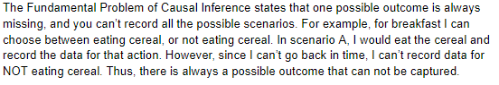
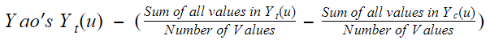

```{r setup, include = FALSE}
library(learnr)
library(primer.tutorials)
library(tidyverse)
library(gt)
library(knitr)

# Key Data 

gt_obj <- tibble(subject = c("Yao", "Emma", "Cassidy", "Tahmid", "Diego"),
       ytreat = c("13", "14", "11", "9", "3"),
       ycontrol = c("9", "11", "6", "12", "4"),
       ydiff = c("? ", "? ", "? ", "? ", "? ")) %>%
   gt() %>%
  cols_label(subject = md("ID"),
                ytreat = md("$$Y_t(u)$$"),
                ycontrol = md("$$Y_c(u)$$"),
                ydiff = md("$$Y_t(u) - Y_c(u)$$")) %>%
  cols_move(columns = c(ytreat, ycontrol), after = c(subject)) %>%
  tab_style(cell_borders(sides = "right"),
            location = cells_body(columns = c(subject))) %>%
  tab_style(style = cell_text(align = "left", v_align = "middle", size = "large"), 
            locations = cells_column_labels(columns = c(subject))) %>%
  cols_align(align = "center", columns = everything()) %>%
  cols_align(align = "left", columns = c(subject)) %>%
  fmt_markdown(columns = everything()) %>%
  tab_spanner(label = "$$\\text{Outcomes}$$", c(ytreat, ycontrol))  %>%
  tab_spanner(label = "$$\\text{Estimand}$$", c(ydiff))


knitr::opts_chunk$set(echo = FALSE)
options(tutorial.exercise.timelimit = 60, 
        tutorial.storage = "local") 
```

<!-- Fix Causal vs predictive models has a typo. And fix the 2 taus table in the 2nd tutorial so that tau is easier to calculate mentally. --> 

<!-- Submit a PR for SZ's typos. -->

<!-- Get rid of all multiple choice questions. -->

<!-- How do we give students information about being wrong or right? Easy for code! -->

<!-- After the definitions, we could have some problems which use the actual train data, calculate some causal effects and then plot them. Lots of good staff there. First, assume a single tau. What is it? How sure are you? Then separate taus for men and women. Or some other grouping. Show facetted plot. -->

<!-- One question could take the trains data and make a Preceptor table. Learn a little gt! Would also need some manipulation to create the two potential outcome columns. -->

<!-- More about confounding. Of course, it needs to be in the book. -->


```{r copy-code-chunk, child = "../../child_documents/copy_button.Rmd"}
```

```{r info-section, child = "../../child_documents/info_section.Rmd"}
```


## Definitions
###

If you have read the chapter, then these questions should be easy.


### Exercise 1

In your own words, give a one sentence definition of a Preceptor Table.

```{r def-ex-1}
question_text(NULL,
    answer(NULL, correct = TRUE),
    allow_retry = TRUE,
    try_again_button = "Edit Answer",
    incorrect = NULL,
    options = list(nrows = 3))
```

###

```{r precept-image-answer}
include_graphics("images/preceptor_table_def.PNG")
```

### Exercise 2

In your own words, give a one sentence definition of a potential outcome.

```{r def-ex-2}
question_text(NULL,
    answer(NULL, correct = TRUE),
    allow_retry = TRUE,
    try_again_button = "Edit Answer",
    incorrect = NULL,
    options = list(nrows = 3))
```

###

```{r potential-image-answer}
include_graphics("images/potential_outcome_def.PNG")
```

### Exercise 3

In your own words, give a one sentence definition of a causal effect.

```{r def-ex-3}
question_text(NULL,
    answer(NULL, correct = TRUE),
    allow_retry = TRUE,
    try_again_button = "Edit Answer",
    incorrect = NULL,
    options = list(nrows = 3))
```

###

```{r causal-image-answer}
include_graphics("images/casual_effect_def.PNG")
```

### Exercise 4

Give a paragraph explanation about the Fundamental Problem of Causal Inference. Include an example relating to your own life.

```{r def-ex-4}
question_text(NULL,
    answer(NULL, correct = TRUE),
    allow_retry = TRUE,
    try_again_button = "Edit Answer",
    incorrect = NULL,
    options = list(nrows = 7))
```

###

```{r fundamental-image-answer}

```

### Exercise 5

In two sentences, explain what what an *ideal* Preceptor Table is, and why it is generally impossible to observe. Use the phrase "potential outcomes" in your answer.

```{r def-ex-5}
question_text(NULL,
    answer(NULL, correct = TRUE),
    allow_retry = TRUE,
    try_again_button = "Edit Answer",
    incorrect = NULL,
    options = list(nrows = 5))
```

###

```{r idealtable-image-answer}
include_graphics("images/ideal_preceptor_def.PNG")
```

### Exercise 6

In one sentence, explain the difference between an *actual* Preceptor Table and an *ideal* Preceptor Table.

```{r def-ex-6}
question_text(NULL,
    answer(NULL, correct = TRUE),
    allow_retry = TRUE,
    try_again_button = "Edit Answer",
    incorrect = NULL,
    options = list(nrows = 3))
```

###

```{r actualvsideal-image-answer}
include_graphics("images/actual_vs_ideal.PNG")
```


## Causal Effect
###

Use the following ideal Preceptor Table to answer some questions about potential estimands we might be interested in.

```{r}
gt_obj
```

### Exercises 1 to 3

```{r ce-ex-1}
quiz(

  question("What is the causal effect of the treatment on Yao?",
    answer("1"),
    answer("2"),
    answer("3"),
    answer("4", correct = TRUE),
    answer("5"),
    allow_retry = FALSE),

  question("For how many of the five people is the causal effect of the treatment positive?",
    answer("1"),
    answer("2"),
    answer("3", correct = TRUE),
    answer("4"),
    answer("5"),
    allow_retry = FALSE),

  question("On whom did the treatment have the most negative causal effect?",
    answer("Yao"),
    answer("Emma"),
    answer("Cassidy"),
    answer("Tahmid", correct = TRUE),
    answer("Diego"),
    allow_retry = FALSE)
)
```


## One tau
###

In these exercises, we will assume that the causal effect, $\tau$ (pronounced tau), is the same for everyone.


Use the following actual Preceptor Table to answer questions about a single value for tau.

```{r question-singletau-setup}
tibble(subject = c("Yao", "Emma", "Cassidy", "Tahmid", "Diego"),
       ytreat = c("13", "14", "?", "?", "3"),
       ycontrol = c("?", "?", "6", "12", "?"),
       ydiff = c("?", "?", "?", "?", "?")) %>%
  gt() %>%
  cols_label(subject = md("ID"),
                ytreat = md("$$Y_t(u)$$"),
                ycontrol = md("$$Y_c(u)$$"),
                ydiff = md("$$Y_t(u) - Y_c(u)$$")) %>%
  cols_move(columns = c(ytreat, ycontrol), after = c(subject)) %>%
  tab_style(cell_borders(sides = "right"),
            location = cells_body(columns = c(subject))) %>%
  tab_style(style = cell_text(align = "left", v_align = "middle", size = "large"), 
            locations = cells_column_labels(columns = c(subject))) %>%
  cols_align(align = "center", columns = everything()) %>%
  cols_align(align = "left", columns = c(subject)) %>%
  tab_spanner(label = "$$\\text{Outcomes}$$", c(ytreat, ycontrol)) %>%
  tab_spanner(label = "$$\\text{Estimand}$$", c(ydiff)) %>%
  fmt_markdown(columns = everything())
```

### Exercise 1

Describe in one sentence/equation how you would estimate Yao's $Y_c(u)$. (Do not use actual numbers, use "tau" in your explanation).

```{r 1-tau-ex-1}
question_text(NULL,
    answer(NULL, correct = TRUE),
    allow_retry = TRUE,
    try_again_button = "Edit Answer",
    incorrect = NULL,
    options = list(nrows = 2))
```

###

```{r yao-image-answer}

```


### Exercise 2

Describe in one sentence/equation how you would estimate Tahmids's $Y_t(u)$. (Do not use actual numbers, use "tau" in your explanation).

```{r 1-tau-ex-2}
question_text(NULL,
    answer(NULL, correct = TRUE),
    allow_retry = TRUE,
    try_again_button = "Edit Answer",
    incorrect = NULL,
    options = list(nrows = 2))
```

###

```{r tahmid-image-answer}
include_graphics("images/tahmid_calc.PNG")
```

### Exercise 3

Describe in one sentence/equation how you would estimate a single value for tau.

```{r 1-tau-ex-3}
question_text(NULL,
    answer(NULL, correct = TRUE),
    allow_retry = TRUE,
    try_again_button = "Edit Answer",
    incorrect = NULL,
    options = list(nrows = 2))
```

###

```{r tao-image-answer}
include_graphics("images/tao_calc.PNG")
```

### Exercises 4 to 6

```{r 1-tau-ex-4}
quiz(

  question("What is your estimate for a single value for tau?",
    answer("-2"),
    answer("2"),
    answer("1", correct = TRUE),
    answer("-1"),
    answer("1.5"),
    allow_retry = FALSE),

  question("What is your estimate for $Y_c(u)$ for Emma?",
    answer("10", correct = TRUE),
    answer("11"),
    answer("12"),
    answer("13"),
    answer("14"),
    allow_retry = FALSE),

  question("What is your estimate for $Y_t(u)$ for Cassidy?",
    answer("6"),
    answer("5"),
    answer("7", correct = TRUE),
    answer("9"),
    answer("8"),
    allow_retry = FALSE)
)
```


```{r download-answers, child = "../../child_documents/download_answers.Rmd"}
```
