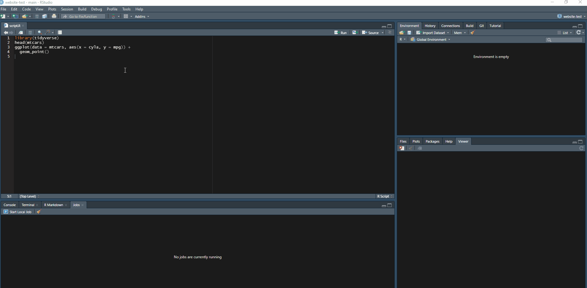

```{r setup, include = FALSE}
library(learnr)
library(primer.tutorials)
library(tidyverse)
library(primer.data)
library(knitr)
knitr::opts_chunk$set(echo = FALSE)
options(tutorial.exercise.timelimit = 60, 
        tutorial.storage = "local") 
```

```{r copy-code-chunk, child = "../../child_documents/copy_button.Rmd"}
```

```{r info-section, child = "../../child_documents/info_section.Rmd"}
```

<!-- * A "help" tutorial which covers all aspects of finding help. Start with the reprex package. Make the reprex in a .R file and show that file as you make progress. Perhaps make a bad reprex first, one which leaves out the library(tidyverse) calls. Also the R package which searches all packages on CRAN. https://www.zuckarelli.de/packagefinder/tutorial.html (Maybe add something about searching Github to help, which I don't know how to do well.) -->

<!-- This is nice: https://themockup.blog/posts/2021-07-28-reminder-to-test-with-a-reprex/ -->

<!-- Maybe: https://rdrr.io/github/brandmaier/ggx/man/gghelp.html -->

<!-- More knowledge to drop: -->

<!-- https://reprex.tidyverse.org/index.html -->
<!-- https://www.youtube.com/watch?v=5gqksthQ0cM -->
<!-- https://reprex.tidyverse.org/articles/articles/learn-reprex.html -->

<!-- https://www.r-project.org/help.html -->


Maybe information about debugging? This might be too advanced: https://www.atorusresearch.com/when-browser-dont-cut-it/. 


## Searching

<!-- AG: This section is about a few important forums and searching for them. I'd like more suggestions for valuable forums because there's only RStudio Community, Stack Overflow, and GitHub right now. -->

In this tutorial, we're going to be going over how you can get help with your projects and formatting your questions so that people don't ignore them.

This is useful especially for when you start working on your own independent projects and need to reach out to somebody helpful.

R is the most painful game of spot-the-difference ever, and you're going to run into some errors along the way.

### Exercise 1

Let's preface with the fact that a simple Google search can solve a lot of your problems. 

There's no shame in looking stuff up and it comes with the job.

However, there are certain forums that are especially suited to the problems you may encounter.

### 

The first forum you should look at is [RStudio Community](https://community.rstudio.com/).

This is a community of over 38,000 R developers with hundreds of users active at any given time.

It's basically like Stack Overflow but specifically focused on R and for R packages.

### 

Let's try making an advanced search on RStudio. 

Go to [https://community.rstudio.com/](https://community.rstudio.com/) and navigate to the "Search" button, then click "Options". These are the advanced search options.

Search for posts containing the word "students" that are posted by David Kane (@dkane). Then copy-paste the URL of the first result into the space below.

```{r searching-1}
question_text(NULL,
	message = "answer here",
	answer(NULL,
	correct = TRUE),
	allow_retry = FALSE,
	incorrect = NULL,
	rows = 6)
```

### 

As you can see, RStudio Community is a great place to find other people who have had the same question as you with the same packages, letting you quickly find a solution.

### Exercise 2

The next forum to look at is Stack Overflow.

This is **the** most widespread coding forum and it's helped millions of developers.

It's not an understatement to say that modern development runs on Stack Overflow simply because of how many people ask questions on it and how many people it helps.

### 

It's pretty easy to find issues on Stack Overflow similar to yours.

They'll show up on most Google searches and are pretty reliable.

However, it's a little rough to do advanced searches on Stack Overflow because it's based on the text in your search rather than toggleable options.

### 

Go to [https://stackoverflow.com/](https://stackoverflow.com/) and search `"geom_point" [ggplot2]`. Then copy-paste the URL of the first result into the space below.

```{r searching-2}
question_text(NULL,
	message = "answer here",
	answer(NULL,
	correct = TRUE),
	allow_retry = FALSE,
	incorrect = NULL,
	rows = 6)
```

### 

This searches for a question containing the text "geom_point" with the tag "ggplot2". The full documentation for advanced searching can be found at [Stack Overflow's help page](https://stackoverflow.com/help/searching).

However, most of the time Stack Overflow pages will show up with a Google search, so advanced searches are rarely used.

### Exercise 3

And finally we have GitHub Issues. 

This is for cases where you think that you have a bug and want to see if anybody's had the same issue.

It's less about getting help with your problem and more about figuring out whether this is a genuine bug and if you can avoid it or not.

### 

GitHub advanced searches are a little bit tougher to do because you need to go to [their special website](https://github.com/search/advanced) for advanced searches.

### 

Go to [https://github.com/search/advanced](https://github.com/search/advanced) and search for closed issues (you have to scroll down for this) containing the word `ggplot()` from the owner `AnmayG` in the repository `demo-issue-repo`.

Then copy-paste the URL of the first result into the space below.

```{r searching-3}
question_text(NULL,
	message = "answer here",
	answer(NULL,
	correct = TRUE),
	allow_retry = FALSE,
	incorrect = NULL,
	rows = 6)
```

### 

Your search request should look like `ggplot() user:AnmayG repo:demo-issue-repo state:closed`.

As you can see, the only thing that the advanced search did was change your search request so that it contained a few special keywords. That means that you can do the same searches in the default GitHub search bar if you just add those keywords in naturally.

### Exercise 4

But there's one more source that we can use: the documentation. 

This is the information about the function and often has the most detailed information about it.

However, it doesn't have any information about the use cases, making it hard to use if you're trying to resolve a bug.

### 

Run `help(geom_point)` in the Console, then copy-paste the "Description" section into the space below.

```{r searching-4}
question_text(NULL,
	message = "answer here",
	answer(NULL,
	correct = TRUE),
	allow_retry = FALSE,
	incorrect = NULL,
	rows = 6)
```

### 

Normally, you'd read the documentation at the start of a project or when you use a function because it details the arguments and gives you some examples. 

The documentation is basically a dictionary for the function that it's about. However, you wouldn't pull out a dictionary when you're trying to figure out if your paragraph is incorrect. You may use examples, but nothing specific to your use case. 

## Reprex

But what if you already scoured the forums piece by piece and post by post for your error (or just got too lazy) and feel the need to ask a new question?

The point of these forums is that they're there to answer questions, so you can obviously post your own.

However, as the totally-real-world issue that you pulled up in the last exercise shows you, nobody will answer your question if you don't give them any context about it.

### Exercise 1

So let's go over creating our own question and posting it to RStudio Community, with the correct context.

### 

Create a simple plot using the `ggplot()` function by setting `data` to `mtcars` then mapping `x` to `cyl` and `y` to `mpga` using the `aes()` function. Then add the `geom_col()` function so that the graph can actually be shown as a bar graph.

```{r reprex-1, exercise = TRUE}

```

<button onclick = "transfer_code(this)">Copy previous code</button>

```{r reprex-1-hint-1, eval = FALSE}
ggplot(data = mtcars, aes(x = cyl, y = mpg)) +
  geom_col()
```

### 

As you can tell, this doesn't work and instead gives you an `object not found` error.

Let's use this error as the basis for our RStudio Community post.

### Exercise 2

First, we need to **reproduce our error**. 

This is the basis of asking for help because if you can't reproduce the error then the person answering your question can't reproduce it either.

We'll do this by bringing our code into an R Script file.

### 

Copy the code created in the previous exercise into a new R Script file named `script.R` and try to run it without loading any libraries or dependencies.

You can restart R to unload the old libraries and start from scratch.

### 

Run `list.files()` in the Console, then copy-paste the command and the result below.

```{r reprex-2}
question_text(NULL,
	message = "answer here",
	answer(NULL,
	correct = TRUE),
	allow_retry = FALSE,
	incorrect = NULL,
	rows = 6)
```

### 

**Always bring your code into an R Script file before doing anything else.**

This is because an R Script file is like an independent environment: there's no text, no setup chunks, and no weird formatting errors. It's just your code in its cleanest, plainest format. That means that it's easy to reproduce errors without R Markdown text interfering.

### Exercise 3

As you can see, while there is an error, it's definitely not the one that we want.

Instead, it's an error with us not loading **tidyverse** and as such not loading the `ggplot()` function into our R script.

### 

Let's fix that. Load **tidyverse** using the `library()` command at the top of your R Script file.

Then run the code and make sure that you're getting an `object not found` error rather than a `ggplot() not found` error.

### 

Run `readLines("script.R")` in the Console, then copy-paste the command and the result here.

```{r reprex-3}
question_text(NULL,
	message = "answer here",
	answer(NULL,
	correct = TRUE),
	allow_retry = FALSE,
	incorrect = NULL,
	rows = 6)
```

### 

While it may seem obvious to load the libraries when you're creating a reproducible example, it's a pretty common error when you're dealing with R Markdown files because all of the library calls are all the way at the top in the set up chunk.

### Exercise 4

But that's not the end of a reproducible example.

### 

The problem is, we didn't show what the `mtcars`) dataset actually is. It could be something completely different from what the questioner expects, and it's always good to show your data.

### 

Add the line `head(mtcars)` right after the `library()` call in `script.R`.

### 

Run `readLines("script.R")` in the Console, then copy-paste the command and the result here.

```{r reprex-4}
question_text(NULL,
	message = "answer here",
	answer(NULL,
	correct = TRUE),
	allow_retry = FALSE,
	incorrect = NULL,
	rows = 6)
```

### 

This shows the first 6 rows in `mtcars`. Keep in mind that we don't want to show the full data set because there could be hundreds of rows that in the end don't affect our result. Only use `head()` or `tail()` when you want to display your data set in a question to limit it to 6 rows.

### Exercise 5

Now, the end goal when you ask a question is that the answerer doesn't have to do *anything* to answer your question. They don't have to load it into R, they don't have to run the program, they can just look at your code and say "here is where you messed up".

Think about it like saying that $2 + 10 * 10 = 120$. This is incorrect, but it's hard to *immediately* tell what's wrong.

Meanwhile, going through it step by step and saying $2 + 10 = 12$ and $12 * 10 = 120$, so $2 + 10 * 10 = 120$ easily shows the incorrect step: you added $2 + 10$ at the beginning when you should have multiplied $10 * 10$. Showing the steps you took and their results is a crucial part in making your examples easy to understand.

### 

But right now, we aren't showing the results, the $= 12$ part of our work. Without them, the $12 * 10 = 120$ makes no sense because we don't know where you got the `12` from.

In terms of programming, we need to show the errors and warnings that we got when we ran the code. We can do this by using the **reprex** package.

### 

The first way to use the **reprex** package is through the Addins page.

### 

Load the **reprex** library into your R session by using the `library()` command. Then go to the Addins menu and select "current file" as the reprex source. It should automatically create a reprex for your code and copy it onto your clipboard.

```{r out.width = "875px"}

```

### 

Paste the reprex into the space below.

```{r reprex-5}
question_text(NULL,
	message = "answer here",
	answer(NULL,
	correct = TRUE),
	allow_retry = FALSE,
	incorrect = NULL,
	rows = 6)
```

### 

A **reprex**, or **reproducible example** is a code snippet that contains the output of every function as a comment, making it easy to show off code and its output without making it hard to copy-paste and run in its own session. You can learn more about reprex and its uses [here](https://reprex.tidyverse.org/).

### Exercise 6

That's not the only way to create a reprex however.

### 

Copy all of the code in `script.R` onto your clipboard using Ctrl/Cmd + C, then run `reprex()` in the Console.

### 

This should have copied the reprex onto your clipboard. Paste the reprex text below.

```{r reprex-6}
question_text(NULL,
	message = "answer here",
	answer(NULL,
	correct = TRUE),
	allow_retry = FALSE,
	incorrect = NULL,
	rows = 6)
```

### 

This makes it much easier to create a reprex automatically, but it doesn't allow you to set the source. It's only going to pull the code from the clipboard, so make sure to double-check your reprex before you start to do anything.

### Exercise 7

Finally, we can create a reprex by enclosing our code within a function.

###

In `script.R`, enclose all of the code (including the library calls) in curly brackets and by the `reprex()` function like the example below. Run the function to create your reprex.

```{r}
reprex::reprex({
  library(tidyverse)
  head(mtcars)
  ...
})
```

###

Paste your finished reprex into the box below.

```{r reprex-7}
question_text(NULL,
	message = "answer here",
	answer(NULL,
	correct = TRUE),
	allow_retry = FALSE,
	incorrect = NULL,
	rows = 6)
```

### 

Remember, reprex is useful for when you want to show the output of code but still make it easy to copy-paste. All of these reprex examples are designed to be easily copy pasted into your own R session, so make sure not to just screenshot the reprex into your question and make it harder to copy-paste.

### Exercise 8

Let's publish your reprex for the world to see.

###

<!-- AG: I'm using the bootcamp community thread. -->

Visit [this RStudio Community thread](https://community.rstudio.com/t/thread-for-student-to-practice-posting-questions-please-do-not-answer-them/107564) and reply to the thread by clicking the "Reply" button. You may have to create an RStudio Community account.

###

Copy-paste in your reprex as well as a short description like "I can't figure out this error" into your reply, then hit "Reply" and submit your post.

###

At the bottom right of your published post you should see a "Share Link" button. Press that button, then copy the resulting link into the space below.

```{r reprex-8}
question_text(NULL,
	message = "answer here",
	answer(NULL,
	correct = TRUE),
	allow_retry = FALSE,
	incorrect = NULL,
	rows = 6)
```

### 

Congratulations on creating a reprex and successfully asking a question in RStudio Community.

Now that we've created a reprex and asked our question, let's flip sides.

## Reprex issues

Just to show you how painful it is for the answerer when the questioner doesn't reprex correctly, let's walk through how a bad question can cause problems for the people trying to solve it.

### Exercise 1

The first issue we'll be going through is posting an image instead of the actual code.

### 

Let's try to fix the issue that [this amazing person](https://github.com/AnmayG/demo-issue-repo/issues/1) found. You can also find this issue by going to the "Issues" page at [https://github.com/AnmayG/demo-issue-repo](https://github.com/AnmayG/demo-issue-repo) and opening the first issue from the bottom.

### 

Copy the code in the issue into the box below, then add the `aes()` function into `ggplot()` so that the code works and displays a working graph. Feel free to tinker a little.

```{r reprex-issues-1, exercise = TRUE}

```

<button onclick = "transfer_code(this)">Copy previous code</button>

```{r reprex-issues-1-hint-1, eval = FALSE}
library(tidyverse)
ggplot(iris, aes(x = Sepal.Length, y = Sepal.Width)) +
  geom_point()
```

### 

This likely was a **pain** to do. Manually typing every single command into the box would have sucked, and you can't even copy-paste the code since it's contained in an image of all things.

This is the perfect example of what you should **not** do if you have a project because people who want to help you need to put in way too much effort. 

And the worst part is that the people trying to help you can't see your error message either, so they have to bring it all the way into their code, type out every single command, run it, find the problem, fix the problem and *then* answer your question. That's too much work, and it means that nobody will answer the question from the getgo.

### Exercise 2

The second issue we'll look at is a case where somebody copy-pasted from the Console.

### 

[The second issue](https://github.com/AnmayG/demo-issue-repo/issues/2) can be found by opening the second issue from the bottom.

### 

This one's a little bit nicer, so copy-paste the code into the box below and fix it by adding the `geom_point()` function to the pipe.

```{r reprex-issues-2, exercise = TRUE}

```

<button onclick = "transfer_code(this)">Copy previous code</button>

```{r reprex-issues-2-hint-1, eval = FALSE}

```

### 

This one was a *lot* nicer since you could actually copy-paste the code, but it's not perfect. 

There was a lot of junk that we had to clean up like the output from the tidyverse package and the arrows on the left. 

### 

Keep in mind that the final goal when we post a question is that the answerer can take one look at it and answer within minutes, not have to bring it into their own session.

### Exercise 3

The next issue you'll solve is one where they didn't load their library into the example.

### 

[The third issue](https://github.com/AnmayG/demo-issue-repo/issues/3) can be found at [https://github.com/AnmayG/demo-issue-repo/issues/3](https://github.com/AnmayG/demo-issue-repo/issues/3).

### 

This person has a much nicer example, but it doesn't actually have the correct error. We're going to need to do some investigating on this one.

### 

Copy the code inside the issue into the space below, then add the `y = Sepal.Width` argument to the `aes()` function next to the `x = Sepal.Width`.

```{r reprex-issues-3, exercise = TRUE}

```

<button onclick = "transfer_code(this)">Copy previous code</button>

```{r reprex-issues-3-hint-1, eval = FALSE}

```

### 

This one was a good example, but they just missed one thing: the library call. That hid the actual error from us, and we needed to do our own investigating by manually parsing through the code. It made things harder since we couldn't just read the error message to tell what was wrong.

Not only that, but what if the `ggplot()` they were using was completely different from what we know? Their issue could have been completely separate, but instead we had to rely on our past knowledge about the package, possibly giving us the wrong answer.

### Exercise 4

This is the last question with an incorrect reprex about not loading in the required variables.

### 

[The fourth issue](https://github.com/AnmayG/demo-issue-repo/issues/7) can be found at [https://github.com/AnmayG/demo-issue-repo/issues/7](https://github.com/AnmayG/demo-issue-repo/issues/7).

### 

This is a similar error to the last exercise since we can't see the actual problem, but it's even worse. We don't have *any* context about what the problem is since we don't have the code for `iris_modified`. We can't see anything.

### 

Write a 2,000 word essay about why this issue is bad and why you absolutely *refuse* to answer it.

```{r reprex-issues-4}
question_text(NULL,
	message = "You don't actually have to type an essay. Just tell us about how your day's been going.",
	answer(NULL,
	correct = TRUE),
	allow_retry = FALSE,
	incorrect = NULL,
	rows = 6)
```

### 

This is [one of the more common errors](https://community.rstudio.com/t/ggplot-not-working-in-r-markdown-html-document/112037) when people share their code because they think that the problem is somewhere else, like their graph. 

However, the variables and how you reached them are a key part of sharing code, and not including it makes your question basically worthless.

### Exercise 5

That's enough horror about bad questions, let's look at what the ideal question would look like.

### 

[The fifth issue](https://github.com/AnmayG/demo-issue-repo/issues/9) can be found at [https://github.com/AnmayG/demo-issue-repo/issues/9](https://github.com/AnmayG/demo-issue-repo/issues/9).

### 

This is the perfect example because it has an error message, shows you what libraries it's importing, and can be easily copy-pasted into your own code.

### 

Copy the code into the space below and change the `fill` argument to `y`.

```{r reprex-issues-5, exercise = TRUE}

```

<button onclick = "transfer_code(this)">Copy previous code</button>

```{r reprex-issues-5-hint-1, eval = FALSE}

```

### 

This is the ideal question format and it makes it easy for people to see the different issues with the code, allowing them to solve it easily as well.


By making sure to include these parts, you make it easier for the people trying to help you and also attract more attention to your question since it's easy to understand and solve.

###

Congratulations on completing this tutorial.

### 

```{r download-answers, child = "../../child_documents/download_answers.Rmd"}
```
