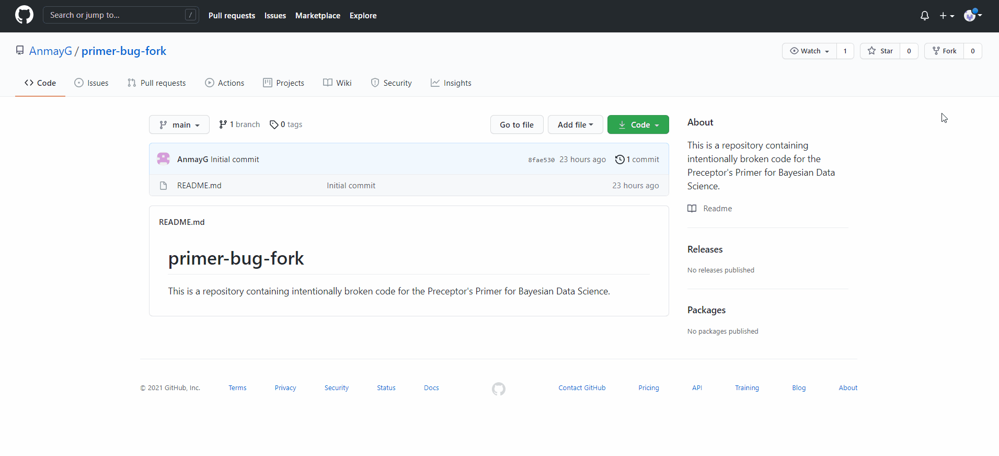
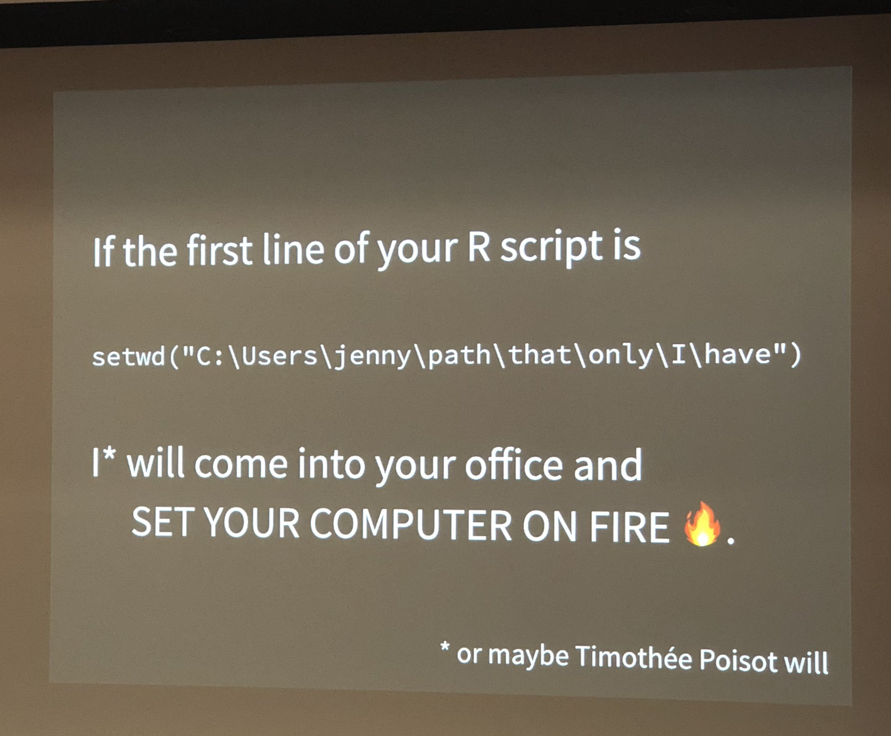

```{r setup, include = FALSE}
library(learnr)
library(primer.tutorials)
library(tidyverse)
library(primer.data)
library(knitr)
knitr::opts_chunk$set(echo = FALSE)
options(tutorial.exercise.timelimit = 60, 
        tutorial.storage = "local") 
```

```{r copy-code-chunk, child = "../../child_documents/copy_button.Rmd"}
```

```{r info-section, child = "../../child_documents/info_section.Rmd"}
```

<!-- All current features:

We could do "projects," which would cover more ground in terms of putting together projects with lots of files. 

Cover the **here** package. And maybe other topics from https://rstats.wtf/.  

Should certainly cover the .Rprofile file. 

Have examples of changing it, adding a print statement, restarting R, seeing the print statement (and copy/pasting what you see as proof). 

Always using the **usethis** commands.

Perhaps also discuss the .Renviron file. 

Maybe some (fake?) examples of issues associated with (not) using :: to identify the package from which you want the function to come. 

Perhaps we save gists for this tutorial. Don't want RStudio and friends to be too long. 

Maybe also discuss base R versus tidyverse so that students are not confused when they see base R. 

Have a tutorial for this. 

Maybe there is a week 4 tutorial which covers all the random R topics we failed to cover before.

What to do with PDF and tinytex? This all seemed to work very easily. Maybe just install and then issue packageVersion("tinytex")? 

Another topic: The Style Guide, and key components thereof. Not sure how to teach that here ... 

This link is hilarious and great for default R: https://www.tidyverse.org/blog/2017/12/workflow-vs-script/ 

https://speakerdeck.com/jennybc/zen-and-the-art-of-workflow-maintenance?slide=62

Knowledge to drop?
R sets Renviron vars first, then runs RProfile.site for the OS, then .Rprofile for the user. Finally, it loads the .RData (blankslate removed this), then loads the default packages in .First(), loads the history, and finally everything else.
So the end, it's Env vars -> OS Rprofile -> User RProfile -> Load .RData -> Load default packages -> Load History -> Your Scripts.

Workflows should be structured like this:
Import data -> Tidy data -> Transform data -> Visualize -> Model -> Communicate
                                    ^-----------------------|

RTools install and stuff: https://cran.r-project.org/bin/windows/Rtools/

Maybe information about debugging? This might be too advanced: https://www.atorusresearch.com/when-browser-dont-cut-it/. 
https://rstats.wtf/debugging-r-code.html

This is nice: https://themockup.blog/posts/2021-07-28-reminder-to-test-with-a-reprex/ -->

## Introduction

<!-- Plan for this tutorial: 

Have them fork a buggy repo. 
 - AG: I kind of want to show them pull requests because it's an integral part of Git and contributing to other people's projects. Just having them edit the README file with their name/initials would be enough, and it would be kind of cool to see all the people who've done it in the past.

Clean up

Debug the R Script using browser() and breakpoints.

Properly style and format the R Markdown file following the style guide.

They then create a gist and integrate that into their R Markdown file using the HTML link or some similar method. 

And finally, they publish the R Markdown to a PDF using LaTeX and tinytex. -->

In this tutorial, we'll be going through structuring our R projects and cleaning them up so that your projects are functional, understandable, and professional.

We'll do this by cleaning up some nonfunctional code and then publish it as a PDF file.

## Forking

<!-- AG: I haven't actually put any useful code in the forked repo yet. That's why I'll consider this an MVP -->

First, we need to pull in the code. We'll do this by **forking** a GitHub repo.

### Exercise 1

A fork is a copy of a GitHub repository that allows you to freely experiment with changes without affecting the original product. 

### 

Visit [https://github.com/AnmayG/primer-bug-fork]() and press the "Fork" button in the upper right corner to create your fork. Then clone the forked repository and copy the URL onto your clipboard.

```{r out.width = "875px"}

```

### 

Paste the fork's URL into the space below.

```{r forking-1}
question_text(NULL,
	message = "answer here",
	answer(NULL,
	correct = TRUE),
	allow_retry = FALSE,
	incorrect = NULL,
	rows = 1)
```

### 

This creates a fork of the "primer-bug-fork" repository for your personal account.

### 

You can learn more about forks and how to use them [here](https://docs.github.com/en/get-started/quickstart/fork-a-repo).

### Exercise 2

Now that we have a fork located on GitHub, let's pull it into RStudio.

### 

Create a new R Project using the URL that you just copied just like how you would with a normal repository.

### 

Run `list.files()` in the Console, then copy-paste the command and the result below.

```{r forking-2}
question_text(NULL,
	message = "answer here",
	answer(NULL,
	correct = TRUE),
	allow_retry = FALSE,
	incorrect = NULL,
	rows = 6)
```

### 

You should see 4 files: `README.md`, `everything.R`, `index.Rmd`, and the `.Rproj` file.

Remember that a fork is *your personal copy* of a repository. Technically, you don't need to interact with the original repository anymore and can just continue using your own copy.

### Exercise 3

<!-- AG: Teaching them how to set the upstream so that when we make any changes we can easily have them pull in the changes without any issues. Plus I think it's important to know how to set the upstream repo when you're contributing to another project since it's often used in professional Git repositories. -->

However, it's often necessary to sync your changes with the original repository. That way, whenever the original repository is edited, you can have the same edits.

### 

We'll do this by setting the original repository as the *upstream* repository. Think of it like a river that begins at the original repository. By setting the original repo as the upstream, you're putting your fork on the river and allowing the information to flow down into it.

### 

In the Terminal, run `git remote add upstream https://github.com/AnmayG/primer-bug-fork.git`. This will set the original repository as the upstream repo.

### 

Run `git remote -v` in the Terminal, then copy-paste the command and the result below. It should show that you have an upstream repo configured.

```{r forking-3}
question_text(NULL,
	message = "answer here",
	answer(NULL,
	correct = TRUE),
	allow_retry = FALSE,
	incorrect = NULL,
	rows = 6)
```

### 

If you want to pull changes from the original repo, run `git pull upstream master` in the Terminal. This will pull all of the changes from the upstream repository into your fork.

However, if you want to push changes into the original repo, you need to [create a pull request](https://guides.github.com/activities/forking/#making-a-pull-request). This can be done either through the **usethis** package and `pr_init()` or through GitHub's native pull request feature.

## File Cleanup

Now that we have everything downloaded onto our computer, let's start cleaning up this code.

We'll start with getting the file names and file types up to scratch.

### Exercise 1

First off, let's deal with the file names. Currently, our file names themselves, regardless of their contents, have *spaces* in them, stupid capitalization, and numbers in the wrong place. 

Never mind how horrendous this is to look at, we'll have to do more work if we want to read these files by using forward slashes and junk. Let's make things easier on ourselves and fix that.

### 

Rename each file, replacing each space with an underscore (`_`), making all file names lowercase (except for the README), and moving numbers (like 01) to the beginning of the name. 

For example, the name `Report 01.Rmd` should become `01_report.Rmd`.

### 

Run `list.files()` in the Console, then copy-paste the command and the result below.

```{r file-cleanup-1}
question_text(NULL,
	message = "answer here",
	answer(NULL,
	correct = TRUE),
	allow_retry = FALSE,
	incorrect = NULL,
	rows = 6)
```

### 

For a clear guide as to file names, please see [this presentation by Jennifer Bryan](https://speakerdeck.com/jennybc/how-to-name-files). Keep in mind that this not only makes the file names more computer readable, it also makes it more human readable since all of the files are sorted correctly.

### Exercise 2

Now, there's a few more things that we have to deal with in our files rather than just our file names.

### 

<!-- This is kind of different from what we've been doing so far with our R Scripts and bunching them up, but this what seems to be the commonly accepted convention (at least for STAT 545) -->

<!-- Additionally, I'm creating a bunch of folders that contain all of our files. I'm not sure if this is actually the normal procedure, but it's definitely a lot nicer to look at. -->

We need to divide our `all_things.R` file into different files so that each file has a different purpose.

Your R files need to be divided like so: 

```{r out.width = "875px"}
include_graphics("images/file_workflow.PNG")
```

In this case we need to import our data, wrangle it, make our figures, and then communicate it in an R Markdown file.

### 

But first we need homes for all of our new files, rather than just keeping them out in the open.

Run `dir.create("R")` in the Console to create a new folder named `R`. Repeat this for the `data` and `plots` folders.

### 

Run `list.files()` in the Console, then copy-paste the command and the result here.

```{r file-cleanup-2}
question_text(NULL,
	message = "answer here",
	answer(NULL,
	correct = TRUE),
	allow_retry = FALSE,
	incorrect = NULL,
	rows = 6)
```

### 

You can also create these folders by using the `mkdir` command in the Terminal.

These folders will house our various files, making it easier to figure out which files do what and how they interact from the outset.

### Exercise 3

Now that we have folders to house our files, we should actually create files that live in them.

First, we need to import our data.

### 

Create a new R Script file named `import.R` in the `R` folder. 

Then copy-paste the first section of code in `all_things.R` into `import.R`.

### 

Run `readLines("R/import.R")` in the Console, then copy-paste the command and the result here.

```{r file-cleanup-3}
question_text(NULL,
	message = "answer here",
	answer(NULL,
	correct = TRUE),
	allow_retry = FALSE,
	incorrect = NULL,
	rows = 6)
```

### 

This is crucial for easy debugging, as a problem with the data imports or API calls can be easily found just by going into `import.R`.

### Exercise 4

Second, we need to wrangle and tidy that data so that we can use it in our figures.

### 

Create a new R Script file named `wrangle.R` in the `R` folder. 

Then copy-paste the second section of code in `all_things.R` into `wrangle.R`.

### 

Run `readLines("R/wrangle.R")` in the Console, then copy-paste the command and the result here.

```{r file-cleanup-4}
question_text(NULL,
	message = "answer here",
	answer(NULL,
	correct = TRUE),
	allow_retry = FALSE,
	incorrect = NULL,
	rows = 6)
```

### 

If you're having problems with creating a new file inside a folder, just run `touch R/wrangle.R` in the Terminal. 

Keep in mind that this won't work for R Markdown files as R Markdown files have things like YAML headers thataren't created if you create a file through the Terminal.

### Exercise 5

Third, we have to create our figures using that wrangled data.

### 

Create a new R Script file named `make_figs.R` in the `R` folder. 

Then copy-paste the third section of code in `all_things.R` into `make_figs.R`.

### 

Run `readLines("R/make_figs.R")` in the Console, then copy-paste the command and the result here.

```{r file-cleanup-5}
question_text(NULL,
	message = "answer here",
	answer(NULL,
	correct = TRUE),
	allow_retry = FALSE,
	incorrect = NULL,
	rows = 6)
```

### 

Remember to delete `all_things.R` as we've already split it into 3 and it doesn't have any use any more.

### Exercise 6

<!-- Change this for whatever the repo includes. -->

Since we're using an API in our file, we need to add our key to the file.

###

Request an API key from [this website]() and copy it to your clip board.

Run `usethis::edit_r_environ()` to open your `.Renviron` file, then add the line `NOAA_API_KEY = YOUR_KEY_HERE` into the file, substituting your API key for `YOUR_KEY_HERE`.

###

Run `cat $HOME/.Renviron` in the Terminal, then copy-paste the command and the result into the space below.

```{r file-cleanup-6}
question_text(NULL,
	message = "answer here",
	answer(NULL,
	correct = TRUE),
	allow_retry = FALSE,
	incorrect = NULL,
	rows = 6)
```

### 

Make sure to store API keys and important information into your `.Renviron` file as it keeps them safe without publishing them to GitHub.

### Exercise 7

Now let's configure our `.Rprofile` file. This is a file that runs at the beginning of your project and does all of the set up.

### 

While this isn't necessarily mandatory to edit, it's good to have something in there.

Add the line `print(list.files())` to your `.Rprofile` file by running `usethis::edit_r_profile()`.

### 

Run `cat .Rprofile` in the Terminal, then copy-paste the command and the result into the space below.

```{r file-cleanup-7}
question_text(NULL,
	message = "answer here",
	answer(NULL,
	correct = TRUE),
	allow_retry = FALSE,
	incorrect = NULL,
	rows = 6)
```

### 

R runs files in this order:  
 * Set environment variables (`.Renviron`)  
 * Run OS `RProfile.site` file (don't change this)
 * Run your `.Rprofile`  
 * Load the .RData file (not used with usethis::use_blank_slate)
 * Load default packages
 * Load .Rhistory file
 * Run your programs

## Debugging

Now, why did we do all of that? 

Splitting everything up into different files might seem like it's more annoying to deal with and dirtier than just having everything localized into one file.

But it makes debugging our code *extremely* easy.

Let's try to debug the buggy, nonfunctional code currently in our project.

### Exercise 1

The first option is to catch the errors before they actually happen. 

In this case, we just did a lot of reorganization to our files and created a data folder, so we obviously need to change the file paths.

### 

<!-- needs work -->

Open `import.R` and use the **here** package to change the file paths.

```{r debugging-1}
question_text(NULL,
	message = "answer here",
	answer(NULL,
	correct = TRUE),
	allow_retry = FALSE,
	incorrect = NULL,
	rows = 6)
```

### 

Now, using the **here** package may seem long-winded and annoying to deal with when you could just use a file path.

But as RStudio employee and professor Jennifer Bryan stated during an international R conference,

```{r out.width = "500px"}

```

Don't use file paths that are located solely on your computer. It makes things easier for the people contributing to and reading your code. Use **here**.

### Exercise 2

Use `reprex()` to create a small example and debug it that way.

```{r debugging-2}
question_text(NULL,
	message = "answer here",
	answer(NULL,
	correct = TRUE),
	allow_retry = FALSE,
	incorrect = NULL,
	rows = 6)
```

### 

Because a reprex can show you the output for every line of code in the function, it's a really clean debugging tool.

By making your reprex smaller and smaller, you can narrow down the cause of your error and finally find your information.

### Exercise 3

<!-- AG: I'm just using the Jennifer Bryan talk as a basis for this. -->

There are 3 stages to debugging: the death certificate, the autopsy, and the reanimation.

Each of these are a tool that allow you to get closer to the cause of the bug.

### 

First - the death certificate. This is just basic information about what functions and operations ran before the error happened, allowing you to find the actual cause of the error rather than just looking at the symptoms.

### 

Run the error-causing code, then run `traceback()` in the Console. Copy-paste both the command and the result into the space below.

```{r debugging-3}
question_text(NULL,
	message = "answer here",
	answer(NULL,
	correct = TRUE),
	allow_retry = FALSE,
	incorrect = NULL,
	rows = 6)
```

### 

The `traceback()` function shows you the **call stack**, which is basically a log of all the functions that happened before the last function call. That means that you can see what happened just before and look into the past.

You can actually enable this to automatically occur on error. Go to RStudio, then go to Debug -> On Error -> Error Inspector. This will automatically show your traceback whenever there's an error.

### Exercise 4

Now that we know what function caused the error, let's see what the value that caused it was.

### 

This is the autopsy. This is where we take a deeper dive into what happened during the error and look at each separate "frame".

### 

Add `options(error = recover)` to the top of the R Script file.

### 

Run `readLines("wrangle.R")` in the Console, then copy-paste the command and its results into the space below.

```{r debugging-4}
question_text(NULL,
	message = "answer here",
	answer(NULL,
	correct = TRUE),
	allow_retry = FALSE,
	incorrect = NULL,
	rows = 6)
```

### 

The `options(error = recover)` line allows you to save the environment, or frame, around each function call. We can then use this to debug our code.

### Exercise 5

Run all of the code in `wrangle.R` and deliberately cause the error.

### 

<!-- Need to change this to the actual error function -->

After the error shows up, a `Selection: ` prompt should show up in the Console. 

Answer `3`, then run `ls.str()` in the `Browse[1]>` prompt that shows up.

### 

Copy-paste the commands and their results into the space below.

```{r debugging-5}
question_text(NULL,
	message = "answer here",
	answer(NULL,
	correct = TRUE),
	allow_retry = FALSE,
	incorrect = NULL,
	rows = 6)
```

### 

By selecting the third frame (`3`), we can see the variable values that happened at that time by running `ls.str()` to show the actual Environment.

You can think about it like rewinding time to that function call, then looking through the Environment tab to see the values of the different variables.

### Exercise 6

But so far we've been examining the already triggered error with the traceback and frames. What if we wanted to look at the error *before* it happens?

### 

This is the reanimation. It's essentially the same thing as the autopsy, but in reverse. Rather than looking back at the past, we can just go through the code line by line.

### 

Add the `browser()` function at the top of the error-causing code, then run it.

This should look similar to the `options(error = recover)` output, but we're stuck at frame 1.

Copy-paste the commands and their result into the space below.

```{r debugging-6}
question_text(NULL,
	message = "answer here",
	answer(NULL,
	correct = TRUE),
	allow_retry = FALSE,
	incorrect = NULL,
	rows = 6)
```

### 

If you don't want to edit your code, you can use [editor breakpoints](https://rstats.wtf/debugging-r-code.html) to mark different lines of the script for review under the debugger.

### Exercise 7

Now, the utility of `browser()` is that you can *change the variables as you go along*. 

That means that you can fix the bug now rather than have to fix it after the fact.

### 

<!-- Need to change to actual function error -->

Keep on entering the letter `n` (for next line) into the prompt until it reads `Browse[3]>`.

Then set `data` to `something cool` to fix the error.

Finally, enter the letter `n` repeatedly until the end to check if your code works.

### 

Copy-paste the commands and their results into the space below.

```{r debugging-7}
question_text(NULL,
	message = "answer here",
	answer(NULL,
	correct = TRUE),
	allow_retry = FALSE,
	incorrect = NULL,
	rows = 6)
```

### 

If you want to exit the `browser()` early, just enter in the letter `Q` for "quit".

If you want to learn more about debugging in R, watch [Jennifer Bryan's lecture](https://www.rstudio.com/resources/rstudioconf-2020/object-of-type-closure-is-not-subsettable/) or just look at the [slides](https://speakerdeck.com/jennybc/object-of-type-closure-is-not-subsettable).

### Exercise 8

<!-- https://rmd4sci.njtierney.com/common-problems-with-rmarkdown-and-some-solutions.html -->

So now that we've debugged our R Script file, we've basically covered everywhere where we can get errors, right?

### 

Nope! R Markdown files can have errors as well as they knit.

If you try knitting `01_report.Rmd`, you can see how it doesn't knit because of an error in `unnamed chunk 1`.

Let's debug that.

### 

<!-- Change to actual error chunk. -->

Debugging in an R Markdown file looks a little bit different than debugging an R Script.

Add the line `trace(recover, sink)` to the setup chunk of `01_report.Rmd`.

### 

Run `readLines("01_report.Rmd") %>% head(15)`, then copy-paste both the command and the result into the space below.

```{r debugging-8}
question_text(NULL,
	message = "answer here",
	answer(NULL,
	correct = TRUE),
	allow_retry = FALSE,
	incorrect = NULL,
	rows = 6)
```

### 

This turns on the error traceback for our R Markdown file. However, we still need to tell R which code chunk we want to debug.

### Exercise 9

In the first code chunk, add the options `error = FALSE, R.options = list(error = recover)`. Then knit the file using the `rmarkdown::render()` command.

### 

Run `grep("R.options", readLines("01_report.Rmd"))` in the Console, then copy-paste the command and the result into the space below.

```{r debugging-9}
question_text(NULL,
	message = "answer here",
	answer(NULL,
	correct = TRUE),
	allow_retry = FALSE,
	incorrect = NULL,
	rows = 6)
```

### 

Note you cannot use the ‘Knit’ button in RStudio when trying to debug R Markdown documents in any case. The ‘Knit’ button opens a separate R process, so there is no way to use an interactive debugger in that case.

If you want to learn about common R Markdown file problems, visit [the R Markdown for Scientists book](https://rmd4sci.njtierney.com/common-problems-with-rmarkdown-and-some-solutions.html).

If you want to learn more about debugging in R Markdown, visit [rstats.wtf](https://rstats.wtf/debugging-r-code.html#debugging-in-r-markdown-documents).

## Styling

<!-- AG: I'm styling the R Script files only. I'm not really sure what the R Markdown guidelines are though so I'm not including them. -->

Now, code needs to be **readable**. Not just machine readable, but human readable as well. 

That lets contributors (and you) easily understand what the code does without needing to piece it apart bit by bit.

### Exercise 1

<!-- import.R is broken, wrangle.R is buggy, and make_figs.R is ugly. This actually lines up quite nicely. -->

The **number one** way to make your code readable is by using comments.  

On average, *you should have as many lines of comments as you have lines of code.*

### 

Add a comment to `make_figs.R` detailing how it creates each figure.

```{r styling-1}
question_text(NULL,
	message = "answer here",
	answer(NULL,
	correct = TRUE),
	allow_retry = FALSE,
	incorrect = NULL,
	rows = 6)
```

### 

Make your comments meaningful. They should not be a simple description of what your code does. The best comments are descriptions about why you did what you did and which other approaches you tried or considered. (The code already tells us what you did.) 

Good comments often have a “Dear Diary” quality: “I did this. Then I tried that. I finally chose this other thing because of reasons X, Y and Z. If I work on this again, I should look into this other approach.” Because of this, the structure is often a paragraph of comments followed by several lines of code.

### Exercise 2

Next, you should try to limit the length of your code lines. Specifically, your code should be limited to 80 characters per line so that it fits comfortably on a printed page.

### 

<!-- Changes based on the example -->
Remove the `from =` and `to =` in line 132 to shorten the line below 80 characters.

### 

Run `readLines("make_figs.Rmd")[132]` in the Console, then copy-paste the command and the result into the space below.

```{r styling-2}
question_text(NULL,
	message = "answer here",
	answer(NULL,
	correct = TRUE),
	allow_retry = FALSE,
	incorrect = NULL,
	rows = 6)
```

### 

If your comments are too long and exceed the 80 character limit, you can quickly format them by pressing Ctrl/Cmd + Shift + /. This will automatically wrap your comments.

### Exercise 3

However, you should still to make sure that you have white space in your code.

### 

The `%>%` should always have a space before it, and should usually be followed by a new line. After the first step in the pipe, each line should be indented by two spaces. 

```{r}
# Good

iris %>%
  group_by(Species) %>%
  summarize_if(is.numeric, mean) %>%
  ungroup() %>%
  gather(measure, value, -Species) %>%
  arrange(value)

# Bad

iris %>% group_by(Species) %>% summarize_all(mean) %>%
ungroup %>% gather(measure, value, -Species) %>%
arrange(value)
```

### 

This structure is also used for **ggplot2** code.

```{r}
# Good

diamonds %>% 
  ggplot(aes(x = depth)) +
    geom_histogram(bins = 100) +
    labs(title = "Distribution of Depth",
         x = "Depth",
         y = "Count")

# Bad

diamonds %>% 
ggplot(aes(x = depth)) +
geom_histogram(bins = 100) + labs(title = "Distribution of Depth",
         x = "Depth",
         y = "Count")
```

### 

Fix the third code chunk in `make_figs.R` according to this styling.

### 

Run `readLines("make_figs.Rmd")[132:200]` in the Console, then copy-paste the command and the result into the space below.

```{r styling-3}
question_text(NULL,
	message = "answer here",
	answer(NULL,
	correct = TRUE),
	allow_retry = FALSE,
	incorrect = NULL,
	rows = 6)
```

### 

This structure makes it easier to add new steps (or rearrange existing steps) and harder to overlook a step.

### Exercise 4

Another helpful feature is making your code follow English conventions, like commas and parentheses.

### 

Always put a space after a comma, never before, just like in regular English.

```{r}
# Good

x[, 1]

# Bad

x[,1]
x[ ,1]
x[ , 1]
```

### 

Do not put spaces inside or outside parentheses for regular function calls.

```{r}
# Good

mean(x, na.rm = TRUE)

# Bad

mean (x, na.rm = TRUE)
mean( x, na.rm = TRUE )
```

### 

<!-- Need to replace with actual example -->
Run `readLines("make_figs.Rmd")[132:200]` in the Console, then copy-paste the command and the result into the space below.

```{r styling-4}
question_text(NULL,
	message = "answer here",
	answer(NULL,
	correct = TRUE),
	allow_retry = FALSE,
	incorrect = NULL,
	rows = 6)
```

### 

By making your code look more similar to established English conventions, it becomes easier to read and doesn't feel as broken up.

### Exercise 5

Finally, we need to style our operators. This way we can make the more math-y parts of our code more understandable.

### 

Most infix operators (=, ==, +, -, <-, ~, et cetera) should be surrounded by one space.

```{r}
# Good

height <- (feet * 12) + inches
mean(x, na.rm = TRUE)
y ~ a + b


# Bad

height<-feet*12+inches
mean(x, na.rm=TRUE)
y~a + b
```

### 

Other operators — like ::, :::, $, @, [, [[, ^, and : — should never be surrounded by spaces.

```{r}
# Good

sqrt(x^2 + y^2)
df$z
x <- 1:10

# Bad

sqrt(x ^ 2 + y ^ 2)
df $ z
x <- 1 : 10
```

### 

<!-- Need to replace with actual example -->
Run `readLines("make_figs.Rmd")[132:200]` in the Console, then copy-paste the command and the result into the space below.

```{r styling-5}
question_text(NULL,
	message = "answer here",
	answer(NULL,
	correct = TRUE),
	allow_retry = FALSE,
	incorrect = NULL,
	rows = 6)
```

### 

You may add extra spaces if it improves alignment of = or <-.

```{r}
list(total = a + b + c,
     mean = (a + b + c) / n)
```

### 

You can find the full tidyverse style guide [here](https://style.tidyverse.org/index.html).

## Gists

### 

<!-- AG: Copied from RStudio and Friends. -->

Now, so far we've been working out of GitHub repos. And while these are extremely useful and extremely common, they're way too big if we just want to share some code with a friend or put a small code snippet on the Internet. That's where gists come in.

### 

Gists are essentially mini repos that don't have as many features but are very lightweight, letting you create gists very easily and very quickly. 

### 

Think of it like sending a text versus sending an email. It's not optimal to attach a lot of files (or really anything that's not an image) to a text, but that perfectly suits emailing. On the other hand, it's not very useful to send a 7 word email to somebody when you could have just texted them the same thing. 

### 

Gists are texts and repos are emails. You should know how to use both.

### Exercise 1

In order to create gists using R, we need to download the **gistr** package. This is what we're going to use in order to create gists using R. While you can create gists through GitHub, using **gistr** is a lot quicker and is more convenient.

### 

Run `install.packages("gistr")` in the Console. Then run `library(gistr)`.

### 

In the Console tab, run `search()` and copy-paste the output into the space below.

```{r gists-1}
question_text(NULL,
    answer(NULL, correct = TRUE),
    allow_retry = TRUE,
    try_again_button = "Edit Answer",
    incorrect = NULL,
    rows = 2)
```

### 

You should now see "package:gistr" somewhere in the output.

### Exercise 2

Let's try to publish our `FirstRScript.R` file as a Gist. We can do this by using the `gist_create()` function in the **gistr** package.

### 

Run `gist_create("make_figs.R")` in the Console. This should bring you to a GitHub page.

```{r out.width = "875px"}
include_graphics("images/gist_create.png")
```

### 

And that's it! This is the finished gist. Copy the URL of the gist into the box below.

```{r gists-2}
question_text(NULL,
    answer(NULL, correct = TRUE),
    allow_retry = TRUE,
    try_again_button = "Edit Answer",
    incorrect = NULL,
    rows = 3)
```

### 

This is how you can share R code between different people. Just send the link to the gist and they'll be able to use it like a normal repository but only for that one code file. It's quick and easy!

### Exercise 3

Now, a notable feature of gists is the fact that they can be used to display code. Websites like [Medium](https://medium.com/@alenanikulina0/embed-github-gists-in-medium-beginner-friendly-718ea8dce176) often use this as it allows the code to have the same highlights as it does normally.

<script src="https://gist.github.com/AnmayG/7bbbddbb38855e7c25fce5d5e8b1a461.js"></script>

### 

In the top right of the Gists webpage, you should see a box that allows you to copy something that looks like this:

```
<script src="https://gist.github.com/YourUserName/7bbbddbb38955e7c25fce5d5e8b1a461.js"></script>
```

This is how you would embed a Gist (like the one above) into an R Markdown File or something similar. You can just copy that code into your R Markdown file (you don't need to use a code chunk), and it would show the Gist like it does above.

### 

Copy and paste that stretch of code into `01_report.Rmd` and into the box below.

```{r gists-3}
question_text(NULL,
    answer(NULL, correct = TRUE),
    allow_retry = TRUE,
    try_again_button = "Edit Answer",
    incorrect = NULL,
    rows = 3)
```

### 

This make Gists very useful for displaying code in your website.

### Exercise 4

But what if you want to edit a gist and add new files to it? This is where gists really shine because they're the same thing as a normal repository, just a lot more lightweight. Let's try to add the image of our graph to our gist.

### 

We first need to pull the gist into R so that we can edit it. We can do this just like we would a normal repository: by copying the HTTPS link and pulling it into RStudio.

### 

Let's take the first step and copy the URL. In the top right corner, there is a dropdown menu labeled "Embed". Click that, then click "Clone via HTTPS". 

```{r out.width = "875px"}
include_graphics("images/gist_clone.gif")
```

### 

Copy and paste that URL into the box below.

```{r gists-4}
question_text(NULL,
    answer(NULL, correct = TRUE),
    allow_retry = TRUE,
    try_again_button = "Edit Answer",
    incorrect = NULL,
    rows = 3)
```

### 

This should be a URL similar to the one that we used to copy our GitHub repository, but for Gists instead.

### Exercise 5

Now just use that link to create a new RStudio Project like we did with the GitHub repositories. Rename the project to "First_Gist_Edit".

```{r out.width = "875px"}
include_graphics("images/gist_proj.gif")
```

### 

Run `list.files()` in the Console and copy-paste the output into the box below.

```{r gists-5}
question_text(NULL,
    answer(NULL, correct = TRUE),
    allow_retry = TRUE,
    try_again_button = "Edit Answer",
    incorrect = NULL,
    rows = 3)
```

### 

This should contain your R Script file and a .gitignore file, among others. Remember to update the `.gitignore` file to ignore the `.Rproj` file so that you don't upload it to your Gist.

### Exercise 6

Now let's add a picture of our graph to the Gist. We can do this by saving the graph produced by our R Script file as an image.

### 

First, run the R Script file so that the graph shows up in the Plots tab in the bottom right. You should then be able to click "Export" and follow the steps to save the graph as a PNG file. Name the file `graph.png`.

```{r out.width = "875px"}
include_graphics("images/png_save.gif")
```

### 

Run `list.files()` in the Console then copy-paste the command and the output into the box below.

```{r gists-6}
question_text(NULL,
    answer(NULL, correct = TRUE),
    allow_retry = TRUE,
    try_again_button = "Edit Answer",
    incorrect = NULL,
    rows = 3)
```

### 

This should contain the PNG file that you just saved.

### Exercise 7

Second, let's push our graph into the Gist. 

### 

Go to the Git tab, then commit the `graph.png` file by pressing the "Commit" button and checking the boxes. Set the message to "added graph.png".

### 

Run `gert::git_ahead_behind()$ahead` in the Console, then copy-paste the command and the output into the box below.

```{r gists-7}
question_text(NULL,
    answer(NULL, correct = TRUE),
    allow_retry = TRUE,
    try_again_button = "Edit Answer",
    incorrect = NULL,
    rows = 3)
```

### 

This should return `1` to signify that your computer is 1 commit ahead of the Gist. Let's fix that by pushing our changes.

### Exercise 8

As we went over earlier, pushing uploads the files on your computer to GitHub.

### 

Press the green "Push" arrow to push the files. Then go to your Gist tab and reload.

```{r out.width = "875px"}
include_graphics("images/gist_push.gif")
```

### 

Run `gert::git_ahead_behind()$ahead` in the Console, then copy-paste the command and the output into the box below.

```{r gists-8}
question_text(NULL,
    answer(NULL, correct = TRUE),
    allow_retry = TRUE,
    try_again_button = "Edit Answer",
    incorrect = NULL,
    rows = 3)
```

### 

This should return `0` to signify that your computer and GitHub have the same files. Congratulations on successfully creating and editing your Gist.

### 

When it comes to gists, there's one rule to follow:

> **Use a gist to display one or two files and use a repository to store your entire project.**

This is the basic guideline when it comes to storing your files on GitHub and sharing them with other people.

You can find a list of the uses of gists as well as a tutorial on how to create them through GitHub  [here](https://www.liquidweb.com/kb/little-known-ways-to-utilize-github-gists/).

## Publishing

Let's publish this document to a PDF now.

### Exercise 1

Download tinytex.

```{r publishing-1}
question_text(NULL,
	message = "answer here",
	answer(NULL,
	correct = TRUE),
	allow_retry = FALSE,
	incorrect = NULL,
	rows = 6)
```

### 

They're cool you know.

### Exercise 2

<!-- Not sure if you can show a gist in a pdf doc because gists are embedded through HTML. I'll test it out when I make the repo/ -->

Change `html_document` to `pdf_document`.

```{r publishing-2}
question_text(NULL,
	message = "answer here",
	answer(NULL,
	correct = TRUE),
	allow_retry = FALSE,
	incorrect = NULL,
	rows = 6)
```

### 

You should be good?

```{r download-answers, child = "../../child_documents/download_answers.Rmd"}
```
