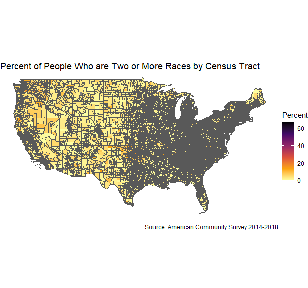

```{r setup, include = FALSE}
library(learnr)
library(primer.tutorials)
library(tidyverse)
library(primer.data)
library(tidycensus)
library(ggthemes)
library(knitr)
knitr::opts_chunk$set(echo = FALSE)
options(tutorial.exercise.timelimit = 60, 
        tutorial.storage = "local") 

# This is all of the data that the Census Key is needed for.

# rural <- get_decennial(geography = "state",
#                        variables = c("P001001", "P002005"),
#                        year = 2010,
#                        output = "wide",
#                        geometry = TRUE) 
# write_rds(rural, "data/05-mapping-rural.rds")

rural <- read_rds("data/05-mapping-rural.rds")

# rural_shifted <- get_decennial(geography = "state",
#                                variables = c("P001001", "P002005"),
#                                year = 2010,
#                                output = "wide",
#                                geometry = TRUE)
# rural_shifted <- tigris::shift_geometry(rural_shifted)
# write_rds(rural_shifted, "data/05-mapping-rural-shifted.rds")

rural_shifted <- read_rds("data/05-mapping-rural-shifted.rds")

# racevars <- c(White = "B02001_002", 
#               Black = "B02001_003", 
#               Asian = "B02001_005",
#               Hispanic = "B03003_003")
# county_data <- get_acs(geography = "tract",
#                        variables = racevars, 
#                        year = 2018,
#                        state = "TX",
#                        county = "Harris County",
#                        geometry = TRUE,
#                        summary_var = "B02001_001")
# write_rds(county_data, "data/05-mapping-county-data.rds")

county_data <- read_rds("data/05-mapping-county-data.rds")

# AG: The file needed for the big data section is understandably large (so large
# I can't put it on GitHub using the normal methods), so I'm saving the graph
# rather than the data.

# Also, the Primer has an old graph right now, it may be a good idea to rebuild
# the maps chapter sometime in the future.
# 
# continental <- state.name[! state.name %in% c("Alaska", "Hawaii")]
# 
# races_data <- get_acs(geography = "tract",
#                  state = continental,
#                  variables = "B02001_008",
#                  year = 2018,
#                  summary_var = "B02001_001",
#                  geometry = TRUE)
# 
# races_graph <- races_data  %>%
#                  mutate(Percent = 100 * (estimate / summary_est)) %>%
#                  ggplot(aes(fill = Percent)) +
#                  geom_sf(size = 0.003) +
#                  scale_fill_viridis_c(direction = -1, option = "inferno") +
#                  labs(title = "Percent of People Who are Two or More Races by Census Tract",
#                       caption = "Source: American Community Survey 2014-2018") +
#                  theme_void()
#
# write_rds(races_graph, "data/05-mapping-races-map.rds")
#
# I then exported this as a png because I'm not going to have them download and
# open a 175 MB file.

# AG: Only showing the map as this also has way too much data to save normally.
# 
# nw_states <- c("OR", "WA", "ID")
# 
# nw_pums <- get_pums(variables = c("PUMA", "AGEP"),
#                       state = nw_states,
#                       recode = TRUE,
#                       survey = "acs1",
#                       year = 2018)
# 
# nw_Senior <- nw_pums %>%
#     group_by(ST, PUMA) %>%
#     summarize(total_pop = sum(PWGTP),
#               pct_Senior = sum(PWGTP[AGEP > 64]) / total_pop,
#               .groups = "drop")
# 
# nw_pumas <- map(nw_states,
#                 tigris::pumas,
#                 class = "sf",
#                 cb = TRUE) %>%
#             reduce(rbind)
# 
# nw_final <- nw_pumas %>%
#     left_join(nw_Senior, by = c("STATEFP10" = "ST", "PUMACE10" = "PUMA"))
# 
# pums_map <- nw_final %>%
#               ggplot(aes(fill = pct_Senior)) +
#                 geom_sf() +
#                 scale_fill_viridis_b(name = NULL,
#                     option = "magma",
#                     labels = scales::label_percent(1)) +
#                 labs(title = "Percentage of population that are Seniors",
#                      caption = "Source: American Community Survey 2014-2018") +
#                 theme_void()
# 
# write_rds(pums_map, "data/05-mapping-pums-map.rds")

pums_map <- read_rds("data/05-mapping-pums-map.rds")
```

```{r copy-code-chunk, child = "../../child_documents/copy_button.Rmd"}
```

```{r info-section, child = "../../child_documents/info_section.Rmd"}
```

<!-- Create setup_script.R which creates all the objects which the tutorial loads. -->

<!-- AG: General note, I do not do a good job of describing when they should add new code chunks. This should be refined after all the steps have been created. --> 


<!-- Perhaps of interest: https://milospopovic.net/how-to-make-choropleth-map-in-r/ -->

<!-- Also: https://github.com/r-spatial/mapview -->

## Setup project
###

In this tutorial, we're going to be creating maps based off of US Census Bureau data. 

We'll be utilizing commands from the "Downloading Census Data" tutorial in order to do this, so please complete that tutorial before starting this one.

### Exercise 1

Let's start a new R project so that we can create and eventually publish our maps.

###

<!-- AG: Don't know what the syntax is for repo naming in the Primer, I think this is it (lowercase with dashes). -->

Create a new GitHub repo titled `mapping-in-r` and link it to an RStudio project like you've done so far. Remember to update the `.gitignore` file to ignore the `.Rproj` file.

###

Run `list.files()` in the Console to list all of the files. Copy and paste the output into the space below.

```{r setup-project-1}
question_text(NULL,
    answer(NULL, correct = TRUE),
    allow_retry = TRUE,
    try_again_button = "Edit Answer",
    incorrect = NULL,
    options = list(nrows = 2))
```

###

We'll be working in this project for the rest of this tutorial.

### Exercise 2

Create a new R Markdown file titled `index.Rmd` and delete all of the text except for the setup chunk and the YAML header.

###

Run `list.files()` in the Console to list all of the files within your project. Copy and paste the output into the space below.

```{r setup-project-2}
question_text(NULL,
    answer(NULL, correct = TRUE),
    allow_retry = TRUE,
    try_again_button = "Edit Answer",
    incorrect = NULL,
    options = list(nrows = 2))
```

###

This should include the R Markdown file you created.

### Exercise 3

In this tutorial, we'll be using the **tidyverse**, **tidycensus**, **ggthemes**, and **tigris** packages. Load these packages in the setup chunk of your R Markdown file.

###

Run `readLines("index.Rmd") %>% tail(15)` in the Console to list the last 15 lines in `index.Rmd`. Copy and paste the output into the space below.

```{r setup-project-4}
question_text(NULL,
	message = "answer here",
	answer(NULL,
	correct = TRUE),
	allow_retry = FALSE,
	incorrect = NULL,
	options = list(nrows = 6))
```

###

You may have to install some of these packages if you don't already have them loaded onto your computer.

## Mapping basics
###

<!-- AG: Going to move this section when I create a cloropleth map using this information: https://milospopovic.net/how-to-make-choropleth-map-in-r/ as that's when we're actually dealing with shape files and things like that. Keeping it here for now while I work on that. -->

You've likely heard of longitude and latitude, the global coordinate system that lets us pinpoint 2D locations on a 3D surface. This is also known as a **c**oordinate **r**eference **s**ystem, or **CRS**. CRSs use a 3D model of the Earth to define locations on the surface of a grid, with longitude determining the east/west distance and the latitude determining the north/south distance. 

CRS are used to define spatial data that we can then map. 

###

Spatial data with a defined CRS can either be vector or raster data. Vector data is based on points that can be connected to form lines and polygons. It is located within a coordinate reference system and is similar to what a roadmap would look like.

###

Raster data, however, are values within a grid system, such as satellite imagery. In this Primer, we will only be dealing with vector data, which is the format in which we get data from the **tidycensus** package.

###

In order to parse this information, we will be using the **sf** package to process vector data. The **sf** package stores data in data frames, allowing us to use the **dbplyr** methods that we're familiar with.

###

Let's try to recreate the following map:

```{r, message = FALSE, results = 'hide'}
# This is included in the tutorial rather than the setup chunk because the
# students aren't supposed to be able to access it.

basics_map <- rural %>%
                filter(! NAME %in% c("Alaska", "Hawaii", "Puerto Rico")) %>%
                ggplot(aes(fill = 100 * P002005 / P001001)) +
                  geom_sf() + 
                  scale_fill_viridis_c(option = "plasma",
                                       direction = -1) +
                  labs(title = "Rural geography of the United States",
                       caption = "Source: Census 2010",
                       fill = "Percent Rural") +
                  theme_void()
basics_map
```

### Exercise 1

While R can handle a large amount of file formats for spatial data, we'll be focusing on shape files. While we refer to them as a "shapefile", they're actually composed of 3 basic files: `.shp` files for the shape and vertices, `.shx` files for indexes and offsets, and `.dbf` files to connect the geometry and the data. Luckily, this is already dealt with by **tidycensus** when it imports the Census shapefile.

###

In order to start mapping in R, we need to get a little more data from the **tidycensus** package. In particular, we need to set geometry = TRUE.

###

<!-- AG: Should we walk them through finding the variables again? I will, but that's a final cleanup draft and not necessary as of right now. -->

Add a new code chunk into your R Markdown file and add the `get_decennial()` function into it. Set the argument `geography` to `"state"`, `variables` to `"P001001"` and `"P002005"`, `year` to `2010`, `output` to `"wide"`, and `geometry` to `TRUE`.

###

Run `readLines("index.Rmd") %>% tail(15)` in the Console to list the last 15 lines in `index.Rmd`. Copy and paste the output into the space below.

```{r mapping-basics-1}
question_text(NULL,
    answer(NULL, correct = TRUE),
    allow_retry = TRUE,
    try_again_button = "Edit Answer",
    incorrect = NULL,
    options = list(nrows = 2))
```

###

The `get_decennial()` command pulls data from the US Census Bureau's Decennial Census by using **variables**. These variables refer to information in the Census Bureau. In this case, P001001 refers to the total population in a state while P002005 refers to the percentage of that population that lives in rural areas.

### Exercise 2

<!-- AG: I'm just condensing the Primer info here and putting it in the tutorial. -->

If you run the code described in Exercise 1, you can see how there are a series of 5 columns: `GEOID`, `NAME`, `P001001`, `P002005`, and `geometry`.

This is different from the tibbles that we created before because there is now a strange "multipolygon" column called `geometry` and it's actually no longer a tibble. The "multipolygon" column contains the information needed to create maps and such, but this data prevents it from being a tibble.

In fact, if you run `class(rural)`, we can see that it's an `sf`, a special type of tibble that has plotting information. **Never use `as_tibble()` on an `sf` object unless you want to lose all of the plotting information.**

###

Let's create a map based on this `rural` data. This is similar to what we did before with `ggplot()`, but this time we use the function `geom_sf()`. Create a pipe using `rural` that contains `ggplot()` and `geom_sf()` like the previous plots.

###

Run `readLines("index.Rmd") %>% tail(15)` in the Console to list the last 15 lines in `index.Rmd`. Copy and paste the output into the space below.

```{r mapping-basics-2}
question_text(NULL,
	message = "answer here",
	answer(NULL,
	correct = TRUE),
	allow_retry = FALSE,
	incorrect = NULL,
	options = list(nrows = 6))
```

###

<!-- AG: Should I include examples for methods like this where we're trying to walk through what changes when we change the different arguments? For example, should I show a map for each step of this tutorial or just leave it blank? -->

You may notice that the plot is very stretched out with Alaska, Hawaii, and Puerto Rico causing the map to be zoomed out. Let's try to fix that.

### Exercise 3

Let's first try taking the nuclear option: removing Alaska, Hawaii, and Puerto Rico. By focusing on the continental US, we can zoom in on the states and focus on the areas that we actually have data for.

###

Create a new map with the same code as last time, but this time add a `filter()` layer before the `ggplot()`. Within the filter, you should check if `"Alaska"`, `"Hawaii"`, `"Puerto Rico"` are in NAME and then filter them out.

###

Run `readLines("index.Rmd") %>% tail(15)` in the Console to list the last 15 lines in `index.Rmd`. Copy and paste the output into the space below.

```{r mapping-basics-3}
question_text(NULL,
	message = "answer here",
	answer(NULL,
	correct = TRUE),
	allow_retry = FALSE,
	incorrect = NULL,
	options = list(nrows = 6))
```

###

You should now only see the continental United States, but there's still no data actually contained in the map.

### Exercise 4

Let's add the ratio of the different populations into the map.

###

Within the `ggplot()`, map the `fill` argument to the ratio of `P002005` and `P001001`. 

###

Run `readLines("index.Rmd") %>% tail(15)` in the Console to list the last 15 lines in `index.Rmd`. Copy and paste the output into the space below.

```{r mapping-basics-4}
question_text(NULL,
	message = "answer here",
	answer(NULL,
	correct = TRUE),
	allow_retry = FALSE,
	incorrect = NULL,
	options = list(nrows = 6))
```

###

When you run this code, you should see how the different states have different shadings, with more urban states having a darker color.

### Exercise 5

This graph is passable, but it has a few problems:  
- The fill colors are hard to distinguish  
- The darker colors map to a lower amount, which doesn't make sense  
- The background is grey  
- The legend and labels still don't exist.  

###

Let's address these problems one at a time, starting with differentiating between the fill colors.

###

We can do this by changing the ratios into percents, creating a wider difference between the two ends of the scale (1 - 100 is a bigger range than 0.01 - 1).  

Multiply the previous ratio by 100 in order to make this change.

###

Run `readLines("index.Rmd") %>% tail(15)` in the Console to list the last 15 lines in `index.Rmd`. Copy and paste the output into the space below.

```{r mapping-basics-5}
question_text(NULL,
	message = "answer here",
	answer(NULL,
	correct = TRUE),
	allow_retry = FALSE,
	incorrect = NULL,
	options = list(nrows = 6))
```

###

This makes the colors a lot easier to distinguish, but they're still flipped.

### Exercise 6

We can kill 2 birds with 1 stone by using the `scale_fill_viridis_c()` function to change the fill color scheme and invert the colors.

###

Add `scale_fill_viridis_c()` to the plot, setting `options` to `"plasma"` and `direction` to `-1`.

###

Run `readLines("index.Rmd") %>% tail(15)` in the Console to list the last 15 lines in `index.Rmd`. Copy and paste the output into the space below.

```{r mapping-basics-6}
question_text(NULL,
	message = "answer here",
	answer(NULL,
	correct = TRUE),
	allow_retry = FALSE,
	incorrect = NULL,
	options = list(nrows = 6))
```

###

The `scale_fill_viridis_c()` function is extremely versatile for when you want to provide map fill colors because it can create new color palettes and color schemes. You can also reverse the default order of the colors with the direction = -1 option. 

This function is for continuous variables such as prop_rural; if you have a discrete variable, you can use the analogous scale_fill_viridis_d().

### Exercise 7

It's time to finalize this map and add the labels.

Remember that we're trying to recreate this map:

```{r}
basics_map
```

###

Set the labels as seen in the graph above and set the theme to `theme_void()`.

###

Run `readLines("index.Rmd") %>% tail(15)` in the Console to list the last 15 lines in `index.Rmd`. Copy and paste the output into the space below.

```{r mapping-basics-7}
question_text(NULL,
	message = "answer here",
	answer(NULL,
	correct = TRUE),
	allow_retry = FALSE,
	incorrect = NULL,
	options = list(nrows = 6))
```

###

That finishes the first part of the map, but there are some pretty important states that we forgot.

### Exercise 8

Let's add Alaska and Hawaii back into the map.

###

<!-- AG: Rough explanation, needs refining in final draft -->

Start a new R code chunk and copy the previous code, including the part where we defined `rural`. Continue the pipe where we defined `rural` and add the function `shift_geometry()`.

###

Run `readLines("index.Rmd") %>% tail(15)` in the Console to list the last 15 lines in `index.Rmd`. Copy and paste the output into the space below.

```{r mapping-basics-8}
question_text(NULL,
	message = "answer here",
	answer(NULL,
	correct = TRUE),
	allow_retry = FALSE,
	incorrect = NULL,
	options = list(nrows = 6))
```

###

This shifts Alaska, Hawaii, and Puerto Rico's locations to the corner of the map, allowing you to display the entire country with all 50 states.

### Exercise 9

Finally, change the map to use `rural_shifted` instead of `rural` and remove the `filter()` command we used to remove the states earlier. The final map should look like this:

```{r, message = FALSE, results='hide'}
rural_shifted %>%
  ggplot(aes(fill = 100 * P002005 / P001001)) +
    geom_sf() + 
    scale_fill_viridis_c(option = "plasma",
                         direction = -1) +
    labs(title = "Rural geography of the United States",
         caption = "Source: Census 2010",
         fill = "Percent Rural") +
    theme_void()
```

###

Run `readLines("index.Rmd") %>% tail(15)` in the Console to list the last 15 lines in `index.Rmd`. Copy and paste the output into the space below.

```{r mapping-basics-9}
question_text(NULL,
	message = "answer here",
	answer(NULL,
	correct = TRUE),
	allow_retry = FALSE,
	incorrect = NULL,
	options = list(nrows = 6))
```

###

The **tigris** library is a key part in map making because it allows you to modify locations and such to fit on shape files that you can then map.

## Faceting maps

A powerful tool in ggplot2 to use with maps is faceting because it allows us to easily compare data from different maps.

Let's try to recreate this map:

```{r, message = FALSE, results = 'hide'}
county_map <- county_data %>%
                mutate(Percent = 100 * (estimate / summary_est)) %>%
                ggplot(aes(fill = Percent, color = Percent)) +
                facet_wrap(~ variable) +
                geom_sf() +
                scale_fill_viridis_c(direction = -1) +
                scale_color_viridis_c(direction = -1) +
                labs(title = "Racial geography of Harris County, Texas",
                     caption = "Source: American Community Survey 2014-2018") +
                theme_void()

county_map
```

### Exercise 1

This map is based off of the American Community Survey from 2014-2018, so we should use Census data from the ACS5 survey.

The first step is to look at the Census variables so that we know what variables we need to pull our data from.

###

Create a new code chunk and run `load_variables(2018, "acs5") %>% filter(concept == "RACE")` in order to load most of the variables relating to race. Save the name of the variables relating to whites, African Americans, and Asians in a vector called `racevars`.

###

Run `readLines("index.Rmd") %>% tail(15)` in the Console to list the last 15 lines in `index.Rmd`. Copy and paste the output into the space below.

```{r faceting-maps-1}
question_text(NULL,
	message = "answer here",
	answer(NULL,
	correct = TRUE),
	allow_retry = FALSE,
	incorrect = NULL,
	options = list(nrows = 6))
```

###

While you can't see this under the RACE category, the variable name for Hispanic populations is stored under `B03003_003`. You should also add this to your `racevars` vector.

### Exercise 2

Let's access the Census Data by using the `get_acs()` function.

###

Use the `get_acs()` function in a new R code chunk, setting the `geography` arguments to `"tract"`, the `variables` argument to the vector you created in the last exercise, the `year` to `2018`, the `state` to `"TX"`, the `county` to `"Harris County"`, the `geometry` to TRUE, and `summary_var` to `"B02001_001"`, the total population of the county. Save this output to the `county_data` variable.

###

Run `readLines("index.Rmd") %>% tail(15)` in the Console to list the last 15 lines in `index.Rmd`. Copy and paste the output into the space below.

```{r faceting-maps-2}
question_text(NULL,
	message = "answer here",
	answer(NULL,
	correct = TRUE),
	allow_retry = FALSE,
	incorrect = NULL,
	options = list(nrows = 6))
```

###

Some new features worth pointing out in this code:

- The `year` for `get_acs()` is the last year of a five year sample.  Thus, our data will be from 2014--2018.  You can choose `year`s from 2009--2018.
- Since our geography is "tract", we are further specifying the `state` and `county`. 
- We are obtaining the data in a long format, which makes faceting easier.
- We added a `summary_var`, "B02001_001", which is the total population.  As we'll see, this appears as a separate column, which is helpful to us.  (As an exercise, try going back to the code that created `rural` and see how you would do that in a long format with `summary_var`.)

### Exercise 3

Now let's create the map of the data that we just accessed.

###

First of all, let's add a `Percent` column to the data that gets the ratio of `estimate` and `summary_est`, then multiplies it by 100 to get the percentage of the population that is part of that race.

###

Run `readLines("index.Rmd") %>% tail(15)` in the Console to list the last 15 lines in `index.Rmd`. Copy and paste the output into the space below.

```{r faceting-maps-3}
question_text(NULL,
	message = "answer here",
	answer(NULL,
	correct = TRUE),
	allow_retry = FALSE,
	incorrect = NULL,
	options = list(nrows = 6))
```

###

When you run this, you should see how each Census tract has a percentage for what the population actually is.

### Exercise 4

Use the `ggplot()` and `geom_sf()` functions to create a map. Map the `fill` and `color` arguments within `ggplot()` to the `Percent` column that we created earlier.

###

Run `readLines("index.Rmd") %>% tail(15)` in the Console to list the last 15 lines in `index.Rmd`. Copy and paste the output into the space below.

```{r faceting-maps-4}
question_text(NULL,
	message = "answer here",
	answer(NULL,
	correct = TRUE),
	allow_retry = FALSE,
	incorrect = NULL,
	options = list(nrows = 6))
```

###

While this does show all of the information, it doesn't really tell us anything. It's a lot of different colored rectangles in the shape of a county.

### Exercise 5

Earlier, we loaded all of the different variables but didn't actually differentiate between them in our map. That means that everything is overlaid on top of one another, which doesn't make for a good graph. We can fix this by using the `facet_wrap()` function.

###

Facet wrap the map created in the last exercise on the `variable` column. This will separate the different columns based on their variable.

###

Run `readLines("index.Rmd") %>% tail(15)` in the Console to list the last 15 lines in `index.Rmd`. Copy and paste the output into the space below.

```{r faceting-maps-5}
question_text(NULL,
	message = "answer here",
	answer(NULL,
	correct = TRUE),
	allow_retry = FALSE,
	incorrect = NULL,
	options = list(nrows = 6))
```

###

If you wanted to differentiate by even more variables like the percentage who are American Indian, just add another variable to the `racevars` vector and run the command again. This will create a new map for each variable used.

### Exercise 6

But our graph is still blue, and that's pretty annoying for colorblind people and anyone trying to conduct specific analysis since all of the colors blend together.

###

We can fix this by using the `scale_fill_viridis_c()` function to change the fill color to something more vibrant.

Add the layer `scale_fill_viridis_c()` and set the `direction` argument to `-1`.

###

Run `readLines("index.Rmd") %>% tail(15)` in the Console to list the last 15 lines in `index.Rmd`. Copy and paste the output into the space below.

```{r faceting-maps-6}
question_text(NULL,
	message = "answer here",
	answer(NULL,
	correct = TRUE),
	allow_retry = FALSE,
	incorrect = NULL,
	options = list(nrows = 6))
```

###

The reason we set `direction` to `-1` is so that the areas with a higher value are recorded as darker. This makes it easier to see which parts have a higher value since they clearly stand out from the rest of the map.

### Exercise 7

But our graph still doesn't look that good. The border lines can hide data to the point where we can't even see the center of the county and what the data is like there. There's also a second legend for the border lines, which we don't want.

###

In order to fix this problem, we can use the `scale_color_viridis_c()` function. This is similar to `scale_fill_viridis_c()` but it instead sets the border color.

Add the layer `scale_color_viridis_c()` and set the `direction` argument to `-1`.

###

Run `readLines("index.Rmd") %>% tail(15)` in the Console to list the last 15 lines in `index.Rmd`. Copy and paste the output into the space below.


```{r faceting-maps-7}
question_text(NULL,
	message = "answer here",
	answer(NULL,
	correct = TRUE),
	allow_retry = FALSE,
	incorrect = NULL,
	options = list(nrows = 6))
```

###

In general, the color refers to the border color of a shape while the fill refers to the fill. This is the common standard used among most functions and packages.

### Exercise 8

Finally, let's pretty up our map.

Remember that our final map is supposed to look like this:

```{r}
county_map
```

###

Set the labels to what's seen in the graph above and set the theme to `theme_void()`.

###

Run `readLines("index.Rmd") %>% tail(15)` in the Console to list the last 15 lines in `index.Rmd`. Copy and paste the output into the space below.

```{r faceting-maps-8}
question_text(NULL,
	message = "answer here",
	answer(NULL,
	correct = TRUE),
	allow_retry = FALSE,
	incorrect = NULL,
	options = list(nrows = 6))
```

###

## Dealing with big data

Instead of a census tract map for just one city, let’s do a “big data” project involving every census track in the country, plotting the percentage of people who are two or more races.

Let's try to recreate this map:

```{r}

```

### Exercise 1

Let's start by finding the correct variable in the American Community Survey.

###

Run `load_variables(2018, "acs5") %>% filter(concept == "RACE")` in the Console in order to load most of the variables relating to race.

###

Type the names of the variables that refers to the total population and the variable that refers to the population that has a heritage of 2 or more races into the box below.

```{r dealing-with-big-dat-1}
question_text(NULL,
	message = "answer here",
	answer(NULL,
	correct = TRUE),
	allow_retry = FALSE,
	incorrect = NULL,
	options = list(nrows = 6))
```

###

You can determine what the variable refers to by looking at the `label` column. 

For example, the variable `B02001_008` has a label of `Estimate!!Total!!Two or more races`, which means that it's looking at the number of people who are made up of 2 or more races out of the total estimated population. 

By contrast, the variable `B02001_001` has a label of `Estimate!!Total`, showing how it represents the total estimated population.

### Exercise 2

For this map, we want to focus on the mainland US in order to simplify things. In order to do this, we can just filter the states that aren't part of it. This is similar to the nuclear option we did earlier, but this time we're manipulating the data instead of the graph.

###

Create a new code chunk to contain the code necessary for this function.

Then, create a new variable called `continental` that contains the value `state.name[! state.name %in% c("Alaska", "Hawaii")]`.

###

Run `readLines("index.Rmd") %>% tail(15)` in the Console to list the last 15 lines in `index.Rmd`. Copy and paste the output into the space below.

```{r dealing-with-big-dat-2}
question_text(NULL,
	message = "answer here",
	answer(NULL,
	correct = TRUE),
	allow_retry = FALSE,
	incorrect = NULL,
	options = list(nrows = 6))
```

###

The `state.name` variable is automatically installed in R, and it includes the name of every US state. In this case, we're filtering out Alaska and Hawaii so that they aren't included in our search. 

### Exercise 3

Now that we've filtered the data, let's try to download it from the Census onto our computers.

Make sure to do any filters **before** you download any data so that you aren't pulling too much data onto your computer and taking too much time. 

This is especially important when you're working with highly detailed data like this, where one state could have hundreds of rows.

###

In the "Faceting Maps" section, we created a `get_acs()` command that used multiple variables to create a facet for one county. 

Create another `get_acs()` command with similar characteristics, but this time use the `continental` vector we created earlier as the `state` and the Census variable that described 2 races as the `variables` argument. Additionally, since we're looking at the entire country, remove the `county` argument. Save this to a variable named `races`.

###

Run `readLines("index.Rmd") %>% tail(15)` in the Console to list the last 15 lines in `index.Rmd`. Copy and paste the output into the space below.

```{r dealing-with-big-dat-3}
question_text(NULL,
	message = "answer here",
	answer(NULL,
	correct = TRUE),
	allow_retry = FALSE,
	incorrect = NULL,
	options = list(nrows = 6))
```

###

And here we encounter one of the main problems in dealing with big data: **it takes a massive amount of time**. Unless you're directly plugged into a cell tower, you probably took at least a couple of seconds to download all 87.3 MB of data onto your computer. 

This is why summary statistics are important. Rather than downloading all of the data for every census tract and then totaling it, it's much better to download the data for every state if that's what you need to do. In general, try to look for summary data first rather than finding very specific data about very specific cases.

### Exercise 4

Let's create a graph. If we don't change the information beforehand, we're going to run into the same problems that we did in the "Mapping Basics" section with the color and label problems. Let's implement the same fixes that we did before.

###

Create a pipe off of `races` and create a `Percent` column that is 100 times the ratio between the `estimate` and `summary_est` columns.

###

Run `readLines("index.Rmd") %>% tail(15)` in the Console to list the last 15 lines in `index.Rmd`. Copy and paste the output into the space below.

```{r dealing-with-big-dat-4}
question_text(NULL,
	message = "answer here",
	answer(NULL,
	correct = TRUE),
	allow_retry = FALSE,
	incorrect = NULL,
	options = list(nrows = 6))
```

###

Much like before, this changes the data into a percentage that lets us clearly distinguish between the different data points.

### Exercise 5

Continue the pipe and create a map using the `ggplot()` and `geom_sf()` functions. Map the `fill` argument to the `Percent` column that we created before.

###

Run `readLines("index.Rmd") %>% tail(15)` in the Console to list the last 15 lines in `index.Rmd`. Copy and paste the output into the space below.

```{r dealing-with-big-dat-5}
question_text(NULL,
	message = "answer here",
	answer(NULL,
	correct = TRUE),
	allow_retry = FALSE,
	incorrect = NULL,
	options = list(nrows = 6))
```

###

Now we can clearly distinguish between the areas, but it's very hard to distinguish between the different census tracts.

### Exercise 6

Within the `geom_sf()` function, set the `size` argument to `0.003`.

###

Run `readLines("index.Rmd") %>% tail(15)` in the Console to list the last 15 lines in `index.Rmd`. Copy and paste the output into the space below.

```{r dealing-with-big-dat-6}
question_text(NULL,
	message = "answer here",
	answer(NULL,
	correct = TRUE),
	allow_retry = FALSE,
	incorrect = NULL,
	options = list(nrows = 6))
```

###

By setting size to 0.003, we can create thin outlines around our census tracts. Any larger and these outlines would make it hard to see our tracts.

### Exercise 7

Now, continue the pipe and add the `scale_fill_viridis_c()` function. Invert the colors using the `direction` argument and set the `option` to `"inferno"`.

###

Run `readLines("index.Rmd") %>% tail(15)` in the Console to list the last 15 lines in `index.Rmd`. Copy and paste the output into the space below.

```{r dealing-with-big-dat-7}
question_text(NULL,
	message = "answer here",
	answer(NULL,
	correct = TRUE),
	allow_retry = FALSE,
	incorrect = NULL,
	options = list(nrows = 6))
```

###

The `inferno` option sets the color palette to have smaller percentages be lighter while higher percentages are darker. This makes it easy for anyone to understand your graph, even if they're colorblind.

### Exercise 8

Finally, we need to clean up our map and make it understandable.

Remember that our final map is supposed to look like this:

```{r}

```

###

Set the labels to what's seen in the graph above and set the theme to `theme_void()`.

###

Run `readLines("index.Rmd") %>% tail(15)` in the Console to list the last 15 lines in `index.Rmd`. Copy and paste the output into the space below.

```{r dealing-with-big-dat-8}
question_text(NULL,
	message = "answer here",
	answer(NULL,
	correct = TRUE),
	allow_retry = FALSE,
	incorrect = NULL,
	options = list(nrows = 6))
```

###

## PUMS data

The Census also collects **P**ublic **U**se **M**icrodata **S**amples, or **PUMS** data. 

This contains advanced census data on individual people. While it only contains data for about 1% of the US, it's extremely deep and lets you do a lot of cool things.

Let's try to recreate the following map:

```{r}
pums_map
```

### Exercise 1

Accessing PUMS data works just like accessing any Census data. However, there are a few key differences.

###

Create a new code chunk and run the `glimpse()` function on the dataset `pums_variables`. This will show all of the variables that PUMS collects as well as the various values contained within them.

###

Run `readLines("index.Rmd") %>% tail(15)` in the Console to list the last 15 lines in `index.Rmd`. Copy and paste the output into the space below.

```{r pums-data-1}
question_text(NULL,
	message = "answer here",
	answer(NULL,
	correct = TRUE),
	allow_retry = FALSE,
	incorrect = NULL,
	options = list(nrows = 6))
```

###

As you can see, there's a lot of information here ranging from where the person lives to whether they have a fridge or not. We're not going to be using all of it, but we can filter it by the variable code.

One problem with using PUMS is that you only get the state and PUMA (**p**ublic **u**se **m**icrodata **a**rea) of each individual in the row. PUMAs are Census geographies that are entirely within a single state and are completely independent of other areas, so they don't line up with other boundaries. For example, New York City has PUMAs in its community districts but other places have it in their census tracts. As such, you can't use PUMS data for other small areas.

### Exercise 2

Mapping PUMS data is very different from normal mapping because we need to first map the PUMAS then attach our PUMS data to that map. This is because we can't get the shape files and `geometry` column for PUMAS like we did for the previous examples and as such have to get them from the **tigris** package.

###

First, let's define what states we need to use. 

###

Create a new vector containing `"OR"`, `"WA"`, and `"ID"` that's named `nw_states`.

###

Run `readLines("index.Rmd") %>% tail(15)` in the Console to list the last 15 lines in `index.Rmd`. Copy and paste the output into the space below.

```{r pums-data-2}
question_text(NULL,
	message = "answer here",
	answer(NULL,
	correct = TRUE),
	allow_retry = FALSE,
	incorrect = NULL,
	options = list(nrows = 6))
```

###

These are the northwestern states shown in the map (Oregon, Washington, and Idaho). While we're using their acronyms here, you can also use their full names for the steps below.

### Exercise 3

Let's use the `get_pums()` function to choose a few select variables such as the age and PUMA that the individual lives in.

###

In this case, we'll be using the `AGEP` and `PUMA` variables.

###

If you want to see all of the variables that PUMS collects and what they represent, just run `view(pums_variables)` in the Console to open a table. Keep in mind that this table is *massive*, with over 31,759 variables collected.

###

We can do this by using the `get_pums()` function. 

Add the `get_pums()` function to the code chunk and set the `variables` argument to the ones described above, `state` to `nw_states`, `recode` to `TRUE`, `survey` to `"acs1"`, and `year` to `2018`. Save the output to a variable called `nw_pums`.

###

Run `readLines("index.Rmd") %>% tail(15)` in the Console to list the last 15 lines in `index.Rmd`. Copy and paste the output into the space below.

```{r pums-data-3}
question_text(NULL,
	message = "answer here",
	answer(NULL,
	correct = TRUE),
	allow_retry = FALSE,
	incorrect = NULL,
	options = list(nrows = 6))
```

###

One interesting aspect of `get_pums()` is that it will always contain the `SERIALNO`, `SPORDER`, `WGTP`, `PWGTP`, and `ST` columns. `SERIALNO` and `SPORDER` are the variables that uniquely identify observations, `WGTP` and `PWGTP` are the housing and person weights, and `ST` is the state code. 

### Exercise 4

This is good data, but it's really dirty and it doesn't have the information that we need. It's time to wrangle it into place.

###

Use the `group_by()` and `summarize()` functions to make a modified version of `nw_pums` called `nw_Senior`.

Group the data by `ST` and `PUMA`, then summarize it to add a `total_pop` column containing the sum of all `PWGTP` and a `pct_Senior` column containing the ratio of the sum of all `PWGTP` with an `AGEP` over 64 and `total_pop`. Make sure to drop the groups after the `summarize()`.

###

Run `readLines("index.Rmd") %>% tail(15)` in the Console to list the last 15 lines in `index.Rmd`. Copy and paste the output into the space below.

```{r pums-data-4}
question_text(NULL,
	message = "answer here",
	answer(NULL,
	correct = TRUE),
	allow_retry = FALSE,
	incorrect = NULL,
	options = list(nrows = 6))
```

###

The `PWGTP` column is the number of people contained within that sample, so if you total all of the `PWGTP` column then you can get the total population within the study. This is why we can use it to not only find the total population but also the percent of the population that are over 64.

### Exercise 5

Now let's create the geometries for our PUMAs since we weren't able to load them from the `get_pums()` function.

###

Add `nw_pumas <- map(nw_states, tigris::pumas, class="sf", cb=TRUE) %>% reduce(rbind)` to your code chunk. This will create the necessary geometries and shape files for each PUMA in the state, allowing us to map them later.

###

Run `readLines("index.Rmd") %>% tail(15)` in the Console to list the last 15 lines in `index.Rmd`. Copy and paste the output into the space below.

```{r pums-data-5}
question_text(NULL,
	message = "answer here",
	answer(NULL,
	correct = TRUE),
	allow_retry = FALSE,
	incorrect = NULL,
	options = list(nrows = 6))
```

###

Keep in mind that the `map()` function **does not generate a map**. It just applies a function to every element inside a list. In this case, the function is `tigris::pumas()`, which creates the shape files of the PUMAs contained within an inputted state.

### Exercise 6

It's time to combine our shape files with our data. We can do this by using `left_join()`.

###

Join the `nw_pumas` and `nw_Senior` datasets together using the `left_join()` function, mapping `"STATEFP10"` to `"ST"` and `"PUMACE10"` to `"PUMA"`. Save this output to a variable called `nw_final`.

###

Run `readLines("index.Rmd") %>% tail(15)` in the Console to list the last 15 lines in `index.Rmd`. Copy and paste the output into the space below.

```{r pums-data-6}
question_text(NULL,
	message = "answer here",
	answer(NULL,
	correct = TRUE),
	allow_retry = FALSE,
	incorrect = NULL,
	options = list(nrows = 6))
```

###

Now we have a completed dataset containing both the mapping information and the data that needs to be mapped, allowing us to map the data like we did in the previous sections.

### Exercise 7

Start a pipe with `nw_final` and map it using the `ggplot()` and `geom_sf()` functions. Map the `fill` argument to `pct_Senior` in `ggplot()`.

###

Run `readLines("index.Rmd") %>% tail(15)` in the Console to list the last 15 lines in `index.Rmd`. Copy and paste the output into the space below.

```{r pums-data-7}
question_text(NULL,
	message = "answer here",
	answer(NULL,
	correct = TRUE),
	allow_retry = FALSE,
	incorrect = NULL,
	options = list(nrows = 6))
```

###

One interesting thing about PUMAs is that each PUMA covers 100,000 people, which is why areas like Seattle (in western Washington) have a lot of PUMAs while Idaho and Oregon have extremely large PUMAs, as you can see on the map you just created.

### Exercise 8

We now need to adequately color our data so that it's not all blue.

###

This time, we need to use the `scale_fill_viridis_b()` function in order to "bin" our data.

Add this function as a layer, setting the `name` argument to `NULL`, `option` to `"magma"`, and `labels` to `scales::label_percent(1)`.

```{r pums-data-8}
question_text(NULL,
	message = "answer here",
	answer(NULL,
	correct = TRUE),
	allow_retry = FALSE,
	incorrect = NULL,
	options = list(nrows = 6))
```

###

We're using `scale_fill_viridis_b()` here in order to bin the data, or group it together so that there are set groups rather than a continuous legend. This makes it easier to see the large differences between groups rather than focusing on the percentage points.

### Exercise 9

Finally, we need to clean up our map and add our captions.

Remember that our final map is supposed to look like this:

```{r}
pums_map
```

###

Set the labels to what's seen in the graph above and set the theme to `theme_void()`.

###

Run `readLines("index.Rmd") %>% tail(15)` in the Console to list the last 15 lines in `index.Rmd`. Copy and paste the output into the space below.

```{r pums-data-9}
question_text(NULL,
	message = "answer here",
	answer(NULL,
	correct = TRUE),
	allow_retry = FALSE,
	incorrect = NULL,
	options = list(nrows = 6))
```

###

<!-- AG: I'm contemplating putting a section about mapping coordinates onto a map. It's really useful for when you want to map stations or points that aren't Census data since you aren't always going to have a shape file for everything (stuff like weather stations). -->

## Rpubs Publishing

<!-- AG: Add publishing to RPubs section here. This is just short and sweet since they should already know how to publish to RPubs. -->

We're going to publish this file to RPubs in order to best show off your changes.

### Exercise 1

Clean up your R Markdown file and format it as you wish. 

Make sure to clearly separate the different functions and different graphs so that you know what they do later.

### Exercise 2

Publish your R Markdown file to RPubs by knitting the file and clicking the "Publish" button in the top right corner. 

###

Copy-paste your RPubs URL into the space below.

```{r rpubs-publishing-2}
question_text(NULL,
	message = "answer here",
	answer(NULL,
	correct = TRUE),
	allow_retry = FALSE,
	incorrect = NULL,
	options = list(nrows = 6))
```

###

Congratulations on completing the tutorial.

If you want to explore further:

- Take a look at the [**tidycensus** website](https://walkerke.github.io/tidycensus/).
- If you have shapefiles from a place other than **tidycensus**, you can read them in using `st_read()` in the **sf** package, join them with other data using **dplyr** functions, and then map them with `geom_sf()` as we have shown above.
    - You may have to look into using [`coord_sf()`](https://ggplot2.tidyverse.org/reference/ggsf.html) if you have trouble displaying your data.
- Want to add interactivity to your maps?  Check out the **leaflet** package.  [Here's](https://juliasilge.com/blog/using-tidycensus/) a good introduction to using **leaflet** with **tidycensus**.
- Practice your skills with [Andrew Tran's case study slides](https://andrewbtran.github.io/NICAR/2019/mapping/02_case_study_slides.html), where you can replicate a graphic from the Washington Post. Note: this involves some packages we haven't shown you in this book, but if you follow along step by step you will be able to see how they are used.

Downloading feature geometry from the Census website. To cache shapefiles for use in future sessions, set `options(tigris_use_cache = TRUE)`.

###

```{r download-answers, child = "../../child_documents/download_answers.Rmd"}
```
