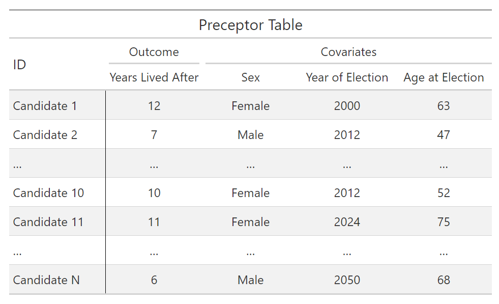

```{r setup, include = FALSE}
library(learnr)
library(tutorial.helpers)
library(tidyverse)
library(brms)
library(tidybayes)
library(gtsummary)
library(primer.data)

knitr::opts_chunk$set(echo = FALSE)
options(tutorial.exercise.timelimit = 600, 
        tutorial.storage = "local") 

df1 <- governors |> 
  select(last_name, year, state, sex, lived_after, election_age)

# fit_sex <- brm(
#                data = df1,
#                formula = lived_after ~ sex,
#                silent = 2,
#                refresh = 0,
#                seed = 76
#                )
# 
# write_rds(fit_sex, "data/fit_sex.rds")

fit_sex <- read_rds("data/fit_sex.rds")

# fit_all <- brm(data = df1,
#                formula = lived_after ~ sex*election_age,
#                silent = 2,
#                refresh = 0,
#                seed = 13)
# 
# write_rds(fit_all, "data/fit_all.rds")

fit_all <- read_rds("data/fit_all.rds")

newobs = tibble(sex = c("Male", "Female"), 
                election_age = 50)
```

```{r copy-code-chunk, child = system.file("child_documents/copy_button.Rmd", package = "tutorial.helpers")}
```

```{r info-section, child = system.file("child_documents/info_section.Rmd", package = "tutorial.helpers")}
```

<!-- DK: Key problems with current version: We need (?) to flesh out the Courage and Temperance sections. Key skills to practice each time including writing math formulas in Quarto and creating nice looking tables of regression results. -->

<!-- DK: Make sure to uncomment the tests once they are ready to work. -->

<!-- DK: First pass, don't hesitate to skip knowledge drops for which you don't have something to say. -->


## Introduction
### 

This tutorial covers [Chapter 9: Five Parameters](https://ppbds.github.io/primer/XX.html) of [*Preceptor’s Primer for Bayesian Data Science: Using the Cardinal Virtues for Inference*](https://ppbds.github.io/primer/) by [David Kane](https://davidkane.info/). 

--

<!-- SD: The following is the old description, copied straight from the Primer. It is very long, and at some point would have to be remastered/replaced but I left it here just in case -->
<!-- Old Description: Let’s learn about interactions. The effect of a treatment relative to a control is almost never uniform. The effect might be bigger in women than in men, smaller in the rich relative to the poor. The technical term for such effects is “heterogeneous,” which is just Ph.D.’ese for “different.” With enough data, all effects are heterogeneous. Causal effects, at least in the social science, always vary across units. To model this reality, we rely on interactions, on allowing the effect size to differ. The same applies for predictive models. The relationship between our outcome variable and a predictor variable is rarely constant. The relationship varies based on the values of other variables. To take account of interactions, we need models with at least 5 parameters. -->

<!-- Follow the Cardinal Virtues and tackle each problem step by step. Remember the process: first we use Wisdom, next Justice, next Courage, and finally Temperance. Each Cardinal Virtue plays role in answering the question that we have at hand. -->

## Wisdom
### 

*The only true wisdom is in knowing you know nothing.* - Socrates

### 

Consider the following question:

*How long do political candidates live after the election?*

### Exercise 1

In your own words, describe the key components of Wisdom for working on a data science problem. (hint: read the quote!)

```{r wisdom-1}
question_text(NULL,
	message = "Wisdom requires the creation of a Preceptor Table, an examination of our data, and a determination, using the concept of validity, as to whether or not we can (reasonably!) assume that the two come from the same population.",
	answer(NULL, correct = TRUE),
	allow_retry = FALSE,
	incorrect = NULL,
	rows = 6)
```

### 

### Exercise 2

Define a Preceptor Table.

```{r wisdom-2}
question_text(NULL,
	message = "A Preceptor Table is the smallest possible table of data with rows and columns such that, if there is no missing data, it is easy to calculate the quantities of interest.",
	answer(NULL, correct = TRUE),
	allow_retry = FALSE,
	incorrect = NULL,
	rows = 6)
```

### 

### Exercise 3

Describe the key components of Preceptor Tables in general, without worrying about this specific problem.

<!-- DK: Get rid of this. Use standard answer. - DONE -->

```{r wisdom-3}
question_text(NULL,
	message = "The rows of the Preceptor Table are the units. The outcome is at least one of the columns. If the problem is causal, there will be at least two (potential) outcome columns. The other columns are covariates. If the problem is causal, at least one of the covariates will be a treatment.",
	answer(NULL, correct = TRUE),
	allow_retry = FALSE,
	incorrect = NULL,
	rows = 6)
```

Here's our Preceptor Table:

With the Preceptor Table, we can calculate anything related to longevity because we know how many years each candidate lived after an election. But, in reality, many of these candidates are still alive, so we don’t know how long they will live.

### 

### Exercise 4

What are the units for this problem?

```{r wisdom-4}
question_text(NULL,
	message = "Our units for this scenario would be candidates because the questions are about the life expectancy of unique candidates.",
	answer(NULL, correct = TRUE),
	allow_retry = FALSE,
	incorrect = NULL,
	rows = 6)
```

### 

### Exercise 5

What is/are the outcome/outcomes for this problem?

```{r wisdom-5}
question_text(NULL,
	message = "The number of years a candidate lives after the election.",
	answer(NULL, correct = TRUE),
	allow_retry = FALSE,
	incorrect = NULL,
	rows = 6)
```

### 

### Exercise 6

What are the covariates for this problem?

```{r wisdom-6}
question_text(NULL,
	message = "Our covariates in this scenario would be 'Year of Election' and 'Age at Election'.",
	answer(NULL, correct = TRUE),
	allow_retry = FALSE,
	incorrect = NULL,
	rows = 6)
```

### 

### Exercise 7

What are the treatments, if any, for this problem?

```{r wisdom-7}
question_text(NULL,
	message = "Since this is a predictive model there is no treatment per se. Any variable which one might consider a treatment is just another covariate in this context.",
	answer(NULL, correct = TRUE),
	allow_retry = FALSE,
	incorrect = NULL,
	rows = 6)
```

### 

### Exercise 8

What moment in time does the Preceptor Table refer to?

```{r wisdom-8}
question_text(NULL,
	message = "Moment in Time: It is unclear to what moment in time the question refers. 

	Is it interested in all candidates who are running in next election? All those running in the future? Any candidate who has or will run between 2000 and 2050?",
	answer(NULL, correct = TRUE),
	allow_retry = FALSE,
	incorrect = NULL,
	rows = 6)
```

### 

### Exercise 9

<!-- DK: It is a feature that this question almost forces students to go to the chapter and read about the data. -->

Write one sentence describing the data you have to answer your question.

```{r wisdom-9}
question_text(NULL,
	message = "How many years would we expect political candidates in election years after 2000 to live?",
	answer(NULL, correct = TRUE),
	allow_retry = FALSE,
	incorrect = NULL,
	rows = 6)
```

### 

### Exercise 10

Load the **tidyverse** package, as well as the **primer.data** package, which includes the `governors` dataset. On the third line, use `head()` on `governors`.

```{r wisdom-10, exercise = TRUE}

```

```{r wisdom-10-hint-1, eval = FALSE}
library(...)
library(...)
head(...)
```

```{r wisdom-10-test, include = FALSE}
library(tidyverse)
library(primer.data)
head(governors)
```

The reason we used `head()` was to display only the first couple lines of `governors`, as we only need it to find the variables. If we plainly printed `governor`, we would be wasting rendering resources.

### 

### Exercise 11

Write down 3 things you observed from the data:

```{r wisdom-11}
question_text(NULL,
	message = "A few things I noticed about this data:
1) The data is sorted Alphabetically by State & by Year
2) The first & last names are in separate columns
3) A lot of the data is in the past century",
	answer(NULL, correct = TRUE),
	allow_retry = FALSE,
	incorrect = NULL,
	rows = 6)
```

### 

<!-- XX: Insert comments about the data. -->
<!-- SD: I made this a question instead -->

<!-- DK: Consider adding more questions about EDA with this data. In particular, add at least one question about the dependent variable in the model along with one or more questions about covariates. If there is a treatment variable, we must include a question about it. -->

<!-- Variable questions come in two types. First there are questions which require the student to run, say, summary() on the variable. Then, knowledge about the variable can be dropped. Second, there are questions which ask for a one sentence summary about the variable, something which could be used in our summary of the project. -->

### Exercise 12

In your own words, define "validity" as we use the term.

```{r wisdom-12}
question_text(NULL,
	message = "Validity is the consistency, or lack thereof, in the columns of the data set and the corresponding columns in the Preceptor Table.",
	answer(NULL, correct = TRUE),
	allow_retry = FALSE,
	incorrect = NULL,
	rows = 6)
```

### 

Is the meaning of the columns consistent, i.e., can we assume validity? That is the heart of validity. To put it simply, does the `lived_after` column in our Preceptor Table equate to same column in our data set?

### Exercise 13

What can't we do if the assumption of validity is not true?

```{r wisdom-13}
question_text(NULL,
	message = "We can't combine the Preceptor Table and the data in order to construct the Population Table.",
	answer(NULL, correct = TRUE),
	allow_retry = FALSE,
	incorrect = NULL,
	rows = 6)
```

### 

### Exercise 14

Provide one reason why the assumption of validity might hold for this problem.

```{r wisdom-14}
question_text(NULL,
	message = "The assumption of validity seems reasonable. Our data and The Preceptor Table can “stack” on top of each other. We will assume that both are drawn from the same population.",
	answer(NULL, correct = TRUE),
	allow_retry = FALSE,
	incorrect = NULL,
	rows = 6)
```

### 

### Exercise 15

Summarize the state of your work so far in one or two sentences. Make reference to the data you have and to the question you are trying to answer. 


```{r wisdom-15}
question_text(NULL,
	message = "Using data from all deceased gubernatorial candidates in the United States between 1945 and 2012, we seek to forecast candidate longevity post-election.",
	answer(NULL, correct = TRUE),
	allow_retry = FALSE,
	incorrect = NULL,
	rows = 6)
```

### 

## Justice
### 

*It is in justice that the ordering of society is centered.* - Aristotle


### Exercise 1

In your own words, name the four key components of Justice for working on a data science problem. Stuck? It's literally in the Primer if you would check.

```{r justice-1}
question_text(NULL,
	message = "Justice concerns four topics: the Population Table, stability, representativeness, and unconfoundedness.",
	answer(NULL, correct = TRUE),
	allow_retry = FALSE,
	incorrect = NULL,
	rows = 6)
```

### 

### Exercise 2

In your own words, define a Population Table.

```{r justice-2}
question_text(NULL,
	message = "The Population Table includes a row for each unit/time combination in the underlying population from which both the Preceptor Table and the data are drawn.",
	answer(NULL, correct = TRUE),
	allow_retry = FALSE,
	incorrect = NULL,
	rows = 6)
```

### 

### Exercise 3

In your own words, define the assumption of "stability" when employed in the context of data science.

```{r justice-3}
question_text(NULL,
	message = "Stability means that the relationship between the columns in the Population Table is the same for three categories of rows: the data, the Preceptor Table, and the larger population from which both are drawn.",
	answer(NULL, correct = TRUE),
	allow_retry = FALSE,
	incorrect = NULL,
	rows = 6)
```

### 

*The longer the time period covered by the Preceptor Table (and the data), the more suspect the assumption of stability becomes.*

### Exercise 4

Provide one reason why the assumption of stability might not be true in this case.

<!-- SD: This might not be the best answer. We should probably change it later but for the time being it's good enough. -->

```{r justice-4}
question_text(NULL,
	message = "Lifespan changes over time. In fact, between 1960 and 2015, life expectancy for the total population in the United States increased by almost 10 years. Therefore, our estimates for the future may need some adjustment — that is, to add years to our predicted life expectancy to account for a global change in lifespan over time.",
	answer(NULL, correct = TRUE),
	allow_retry = FALSE,
	incorrect = NULL,
	rows = 6)
```

### 

### Exercise 5

In your own words, define the assumption of "representativeness" when employed in the context of data science.

```{r justice-5}
question_text(NULL,
	message = "Representativeness, or the lack thereof, concerns two relationship, among the rows in the Population Table. The first is between the Preceptor Table and the other rows. The second is between our data and the other rows.",
	answer(NULL, correct = TRUE),
	allow_retry = FALSE,
	incorrect = NULL,
	rows = 6)
```

### 

*The more expansive your Preceptor Table, the more important the assumption of representativeness becomes.*

### Exercise 6

Provide one reason why the assumption of representativeness might not be true in this case.

```{r justice-6}
question_text(NULL,
	message = "Only the two candidates with the most votes are included in the data set. This is unfortunate, as we would ideally look at all gubernatorial candidates (regardless of votes).",
	answer(NULL, correct = TRUE),
	allow_retry = FALSE,
	incorrect = NULL,
	rows = 6)
```

### 

### Exercise 7

In your own words, define the assumption of "unconfoundedness" when employed in the context of data science.

```{r justice-7}
question_text(NULL,
	message = "Unconfoundedness means that the treatment assignment is independent of the potential outcomes, when we condition on pre-treatment covariates.",
	answer(NULL, correct = TRUE),
	allow_retry = FALSE,
	incorrect = NULL,
	rows = 6)
```

### 

This assumption is only relevant for causal models. We describe a model as "confounded" if this is not true.


### Exercise 8

Summarize the state of your work so far in two or three sentences. Make reference to the data you have and to the question you are trying to answer. Feel free to copy from your answer at the end of the Wisdom Section. Mention at least one specific problem which casts doubt on your approach. 


```{r justice-8}
question_text(NULL,
	message = "Using data from all deceased gubernatorial candidates in the United States from elections held between 1945 and 2012, we seek to forecast candidate longevity in state-wide US races post-election. There is concern that longevity for gubernatorial candidates will differ significantly from that for candidates in Senate and other state-wide elections.",
	answer(NULL, correct = TRUE),
	allow_retry = FALSE,
	incorrect = NULL,
	rows = 6)
```

### 

Note: Your paragraph doesn't necessarily have to be as long as mine is :)


## Courage
### 

*Courage is going from failure to failure without losing enthusiasm.* - Winston Churchill


<!-- Questions about models, tests, and the DGM. -->


### Exercise 1

<!-- DK: Not sure I like this answer. -->
<!-- SD: How about this?: Justice verifies the Population Table. Courage creates a mathematical model which connects the outcome variable to the covariates, if any. Then, using code, we create a fitted model, including posterior probability distributions for all the unknown parameters. -->

In your own words, name the key goal of Courage and the process we use to get there.

```{r courage-1}
question_text(NULL,
	message = "Courage selects the data generating mechanism. We first specify the mathematical formula which connects the outcome variable we are interested in with the other data that we have. We explore different models. We need to decide which variables to include and to estimate the values of unknown parameters. We check our models for consistency with the data we have. We avoid hypothesis tests. We select one model.",
	answer(NULL, correct = TRUE),
	allow_retry = FALSE,
	incorrect = NULL,
	rows = 6)
```

### 

### Exercise 2

Load the **brms** package. Load this into the console as well, as we will be using it later in the console.

```{r courage-2, exercise = TRUE}

```

```{r courage-2-hint-1, eval = FALSE}
library(...)
```

```{r courage-2-test, include = FALSE}
library(brms)
```

### 

Without going too deep into specifics, the `brms` package helps in creating wide range of complex Bayesian models.

### Exercise 3

Load the **tidybayes** package.

```{r courage-3, exercise = TRUE}

```

```{r courage-3-hint-1, eval = FALSE}
library(...)
```

```{r courage-3-test, include = FALSE}
library(tidybayes)
```

### 

<!-- SD: Did we introduce the concept of Bayesian Models in an earlier chapter? If we didn't it would be nice to introduce what Bayesian Models are. -->

This package also helps with the creation of Bayesian Models.


<!-- XX: Some comments about this problem. -->

<!-- XX: Might need an exercise which gets/creates/cleans the data you need for fitting the model. - DONE -->


### Exercise 4

From the Console, execute `?brm`. Copy/paste the Description for the `brm()` function.

Note: If this returns an error, enter `library(brms)` into the console (you were supposed to do this in exercise 1).

```{r courage-4}
question_text(NULL,
	answer(NULL, correct = TRUE),
	allow_retry = TRUE,
	try_again_button = "Edit Answer",
	incorrect = NULL,
	rows = 3)
```

### 

### Exercise 5

*Does sex help us to forecast longevity?*

We will be creating a model using `brm()` from the **brms** package, but first, we need to set our data. Begin by setting a new variable called `df1`, and assign it to the `governors` dataset (we skimmed this earlier). Now, pipe this to `select()` with the following arguments: `last_name, year, state, sex, lived_after, election_age`.


```{r courage-5, exercise = TRUE}

```

<button onclick = "transfer_code(this)">Copy previous code</button>

```{r courage-5-hint-1, eval = FALSE}

```

```{r courage-5-test, include = FALSE}
df1 <- governors |> 
  select(last_name, year, state, sex, lived_after, election_age)
```

### 

### Exercise 6

We will now be creating the model using `brm()` from the **brms** package. Begin with `brm()`, and then add the following arguments: `data = df1, formula = lived_after ~ sex, silent = 2, refresh = 0, seed = 76`. 

Assign the result to an object called `fit_sex`.

<!-- Don't forget to create this model yourself in the setup chunk. Do this once, save the object, comment out that code and then just read_rds to create the object for his tutorial. - DONE but commented -> need assistance from Preceptor -->

<!-- Depending on code speed, you can run this function multiple times, without assigning the return value, looking at the printout, and seeing how things change. -->

```{r courage-6, exercise = TRUE}

```

```{r courage-6-hint-1, eval = FALSE}
fit_sex <- brm(
               data = ...,
               formula = ...,
               silent = ...,
               refresh = ...,
               seed = ...
               )
```

```{r courage-6-test, include = FALSE}
fit_sex <- brm(
               data = df1,
               formula = lived_after ~ sex,
               silent = 2,
               refresh = 0,
               seed = 76
               )
```

### 

### Exercise 7

Type `fit_sex` and hit "Run Code." This generates the same results as using `print(fit_sex)`.


```{r courage-7, exercise = TRUE}

```

```{r courage-7-hint-1, eval = FALSE}
...
```

```{r courage-7-test, include = FALSE}
print(fit_sex)
```

### 

<!-- XX Same some general words about the object. Note that we are about to go through the top 4 rows. - DONE -->
This suggests that, for female candidates (for whom sexMale equal 0), life expectancy after the election is about 16 years. However, there is a great deal of uncertainty associated with that estimate. The 95% confidence interval ranges from 10 to 22 years.

### Exercise 8

Run `family()` on `fit_sex`. `family()` provides information about the "family" of the error term and the link between it and the dependent variable. 

```{r courage-8, exercise = TRUE}

```

```{r courage-8-hint-1, eval = FALSE}
family(...)
```

```{r courage-8-test, include = FALSE}
family(fit_sex)
```

### 

<!-- DK: This is a great location for explanations which get much more detailed in later chapters. -->

<!-- SD: This answer needs to be fixed later, but it gets the job done for the time being -->
In this case, the `family()` function pointed out that the Gaussian family had some kind of blank value in their entry.

### Exercise 9

Run `formula()` on `fit_sex`. `formula()` returns the statistical equation which relates the dependent variable to the independent variable(s). 

```{r courage-9, exercise = TRUE}

```

```{r courage-9-hint-1, eval = FALSE}
formula(...)
```

```{r courage-9-test, include = FALSE}
formula(fit_sex)
```

### 

This directly prints out the formula that we set earlier when creating the model, which is the link between the person's sex vs. how long they lived after their term.

### Exercise 10

Run `nobs()` on `fit_sex`. The `nobs()` function returns the **n**umber of **obs**ervations.

```{r courage-10, exercise = TRUE}

```

```{r courage-10-hint-1, eval = FALSE}
nobs(...)
```

```{r courage-10-test, include = FALSE}
nobs(fit_sex)
```

### 

`nobs()` is an extremely useful command that tells us the number of useful, non-error observations that we have in the data. In our case, it should have returned "1092" as its answer.


### Exercise 11

Run `posterior_interval()` on `fit_sex`. The `posterior_interval()` function returns 95% intervals for all the parameters in our model.

```{r courage-11, exercise = TRUE}

```

```{r courage-11-hint-1, eval = FALSE}
posterior_interval(...)
```

```{r courage-11-test, include = FALSE}
posterior_interval(fit_sex)
```

### 

<!-- SD: The following was taken from Chapter 6 by Khang, and eventually we need to come up with something to write here across the board -->
A confidence interval, and its associated confidence level, tells us how likely the truth is to lie within a specific range.


### Exercise 12

Run `fixef()` on `fit_sex`. The `fixef()` returns information about the **fix**ed **ef**fects in the model.

```{r courage-12, exercise = TRUE}

```

```{r courage-12-hint-1, eval = FALSE}
fixef(...)
```

```{r courage-12-test, include = FALSE}
fixef(fit_sex)
```

### 

<!-- SD: Don't know if this is completely right -->

With this command, we see that the predicted lifespan for females is higher than males (~16 vs ~12.5 years after term). Additionally, the female estimate has a lower estimated error rate, at ~2.91% vs ~2.93% for males.

<!-- DK: Consider adding questions about conditional_effects(), ranef() and other commands, if relevant. -->

### Exercise 13

Run `pp_check()` on `fit_sex`. The `pp_check()` runs a **p**osterior **p**redictive check.

```{r courage-13, exercise = TRUE}

```

```{r courage-13-hint-1, eval = FALSE}
pp_check(...)
```

```{r courage-13-test, include = FALSE}
pp_check(fit_sex)
```

### 

<!-- SD: This was copied directly from the Primer -->

Our graph in the darker blue represents our actual data. As we can see with the lighter blue graph, our fitted model is able to generate a distribution that is similar when compared to the actual data.

<!-- SD: The following was in the Template. It serves as a great addition to the above -->

If the fake data had looked very different from the real data, we have had a problem. But, for the most part, we conclude that, although not perfect, pp_check() shows that the fake outcomes generated by our model are like the actual outcome data.


### Exercise 14

Use `library()` to load the [**gtsummary**](https://www.danieldsjoberg.com/gtsummary) package.

```{r courage-14, exercise = TRUE}

```

```{r courage-14-hint-1, eval = FALSE}
library(gtsummary)
```

```{r courage-14-test, include = FALSE}
library(gtsummary)
```

### 

Essentially, the `gtsummary` package is used to make more advanced tables and assist with their creation far beyond the capability of what is built-in to R.

### Exercise 15

<!-- DK: This can be just one question or several, especially if you want to teach some more gtsummary or gt tricks. Note that you need to adjust the test to make sure it works. -->

Run `tbl_regression()` on `fit_sex`. 


```{r courage-15, exercise = TRUE}

```

```{r courage-15-hint-1, eval = FALSE}
tbl_regression(...)
```

```{r courage-15-test, include = FALSE}
tbl_regression(fit_sex)
```

### 

<!-- DK: Give something like the same sentence which you want the students to use at the end of the next question. -->


### Exercise 16

Write a few sentences which summarize your work so far. The first few sentences are the same as what you had at the end of the Justice Section. Add at least one sentence which describes the modelling approach which you are using, specifying at least the functional form and the dependent variable. Add at least one sentence which describes the *direction* (not the magnitude) of the relationship between one of your independent variables and your dependent variable.

```{r courage-16}
question_text(NULL,
	message = "You cannot edit this answer",
	answer(NULL, correct = TRUE),
	allow_retry = FALSE,
	incorrect = NULL,
	rows = 6)
```

### 

## Temperance
### 

*Temperance is simply a disposition of the mind which binds the passion.* - Thomas Aquinas


### Exercise 1

In your own words, describe the use of Temperance in finishing your data science project.

```{r temperance-1}
question_text(NULL,
	message = "Temperance guides us in the use of the data generating mechanism --- or the 'model' ---  we have created to answer the questions with which we began. We create posteriors for the quantities of interest.",
	answer(NULL, correct = TRUE),
	allow_retry = FALSE,
	incorrect = NULL,
	rows = 6)
```

### 

### Exercise 2

Recall the question with which we began:

*How many years would we expect two gubernatorial candidates — one male and one female, both 10 years older than the average candidate — to live after the election?*

To answer this question, we will start a new pipe with a data module called 'fit_all'. Let's assign this to `brm()` with the following arguments: `data = df1`, `formula = lived_after ~ sex*election_age`, `silent = 2`, `refresh = 0`,  `seed = 13`. 

```{r temperance-2, exercise = TRUE}

```

```{r temperance-2-hint-1, eval = FALSE}
fit_all <- ...(data = df1,
               formula = ... ~ ...*election_age,
               silent = ...,
               refresh = ...,
               seed = ...)
```

```{r temperance-2-test, include = FALSE}
fit_all <- brm(data = df1,
               formula = lived_after ~ sex*election_age,
               silent = 2,
               refresh = 0,
               seed = 13)
```

### 

### Exercise 3

Now we need to create a scenario for our model. To do this, we will first create an object that we will assign in the next step. Let's call it `newobs`, and let's set it equal to `tibble()`. Inside `tibble()`, set the arguments `sex = c("Male", "Female")` and `election_age = 50`.

```{r temperance-3, exercise = TRUE}

```

```{r temperance-3-hint-1, eval = FALSE}
newobs = tibble(... = c("...", "Female"), 
                election_age = ...)
```

```{r temperance-3-test, include = FALSE}
newobs = tibble(sex = c("Male", "Female"), 
                election_age = 50)
```

### 

### Exercise 4

Now to tie it all together, we will pipe `fit_all` to `add_epred_draws()`. Inside this, we will add the argument `newdata = newobs`.

```{r temperance-4, exercise = TRUE}

```

```{r temperance-4-hint-1, eval = FALSE}
fit_... |> 
  add_epred_draws(newdata = ...)
```

```{r temperance-4-test, include = FALSE}
fit_all |> 
  add_epred_draws(newdata = newobs)
```

### 

Running this, you should get a list of people who entered office at the age of 50.

### Exercise 5

Now, where's the fun without a graph? In a couple steps, we will be producing this beautiful graph:

```{r}
fit_all |> 
  add_epred_draws(newdata = newobs) |> 
  ggplot(aes(.epred, fill = sex)) +
    geom_histogram(aes(y = after_stat(count/sum(count))),
                   alpha = 0.5, 
                   bins = 100, 
                   position = "identity") +
    labs(title = "Posterior for Expected Years Lived Post-Election",
         subtitle = "Male candidates live longer",
         x = "Years",
         y = "Probability") + 
    scale_x_continuous(labels = 
                         scales::number_format(accuracy = 1)) +
    scale_y_continuous(labels = 
                         scales::percent_format(accuracy = 1))
```

<!-- SD: I put it all in one exercise b/c I didn't want to waste the students' time, and also wanted to test how well they are able to follow directions. -->

After copying the previous code, continue the pipe into `ggplot()`, setting aesthetics to `.epred, fill = sex`. Now add `geom_histogram()`, and inside this, add `aes(y = after_stat(count/sum(count)))`, `alpha = 0.5`, `bins = 100`, and `position = "identity"`. Now add `scale_x_continuous(labels = scales::number_format(accuracy = 1))` and `scale_y_continuous(labels = scales::percent_format(accuracy = 1))`, and end it off with `labs()`.

```{r temperance-5, exercise = TRUE}

```

<button onclick = "transfer_code(this)">Copy previous code</button>

```{r temperance-5-hint-1, eval = FALSE}
... |> 
  ggplot(...(.epred, fill = ...)) +
    geom_histogram(...(y = after_stat(count/...(count))),
                   alpha = ...elt(), 
                   ... = 100, 
                   position = "...") +
    labs(...) + 
    scale_x_continuous(... = 
                         ...::number_format(... = 1)) +
    scale_y_continuous(labels = 
                         scales::..._format(accuracy = ...))
```

```{r temperance-5-test, include = FALSE}
fit_all |> 
  add_epred_draws(newdata = newobs) |> 
  ggplot(aes(.epred, fill = sex)) +
    geom_histogram(aes(y = after_stat(count/sum(count))),
                   alpha = 0.5, 
                   bins = 100, 
                   position = "identity") +
    labs(title = "Posterior for Expected Years Lived Post-Election",
         subtitle = "Male candidates live longer",
         x = "Years",
         y = "Probability") + 
    scale_x_continuous(labels = 
                         scales::number_format(accuracy = 1)) +
    scale_y_continuous(labels = 
                         scales::percent_format(accuracy = 1))
```

### 

If all goes well, we have successfully recreated the graph! If you get stuck, be sure to check the hint.

### Exercise 6

Write a paragraph which summarizes the project in your own words. The first few sentences are the same as what you had at the end of the Courage Section. But, since your question may have evolved, you should feel free to change those sentences. Add at least one sentence which describes at least one quantity of interest (QoI) --- presumably one that answers your question -- and which provides a measure of uncertainty about that QoI. 

```{r temperance-6}
question_text(NULL,
	message = "You cannot edit this answer",
	answer(NULL, correct = TRUE),
	allow_retry = FALSE,
	incorrect = NULL,
	rows = 6)
```

### 

### Exercise 7

Write a few sentences which explain why the estimates for the quantities of interest, and the uncertainty thereof, might be wrong. Suggest an alternative estimate and confidence interval.

```{r temperance-7}
question_text(NULL,
	message = "You cannot edit this answer",
	answer(NULL, correct = TRUE),
	allow_retry = FALSE,
	incorrect = NULL,
	rows = 6)
```

### 

## Summary
### 

This tutorial covered [Chapter 9: Five Parameters](https://ppbds.github.io/primer/XX.html) of [*Preceptor’s Primer for Bayesian Data Science: Using the Cardinal Virtues for Inference*](https://ppbds.github.io/primer/) by [David Kane](https://davidkane.info/). This tutorial was created by Sanaka Dash and David Kane.


```{r download-answers, child = system.file("child_documents/download_answers.Rmd", package = "tutorial.helpers")}
```
