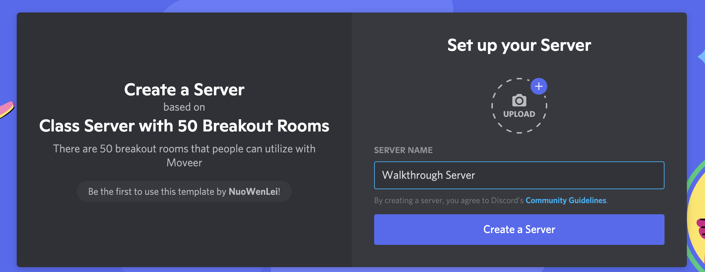
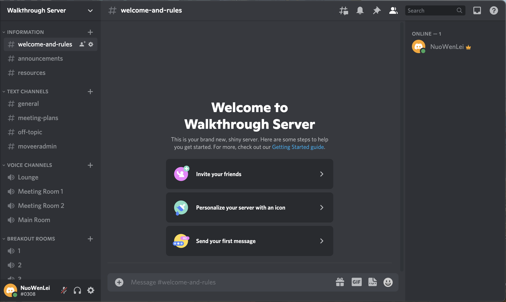
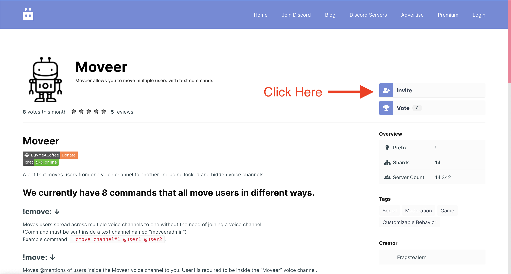
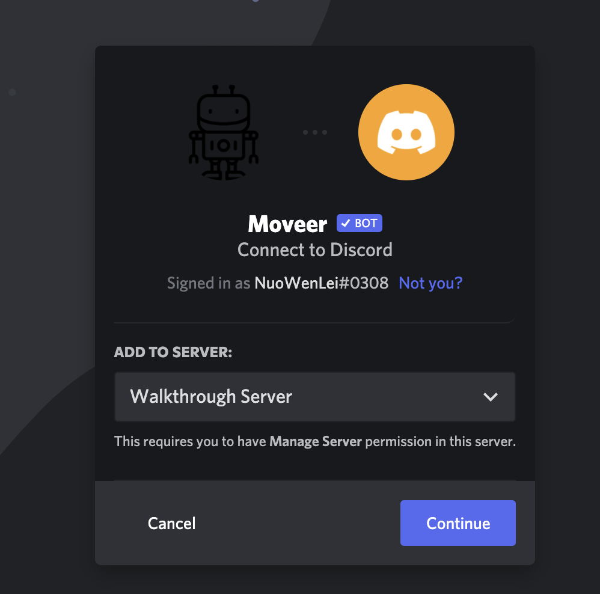
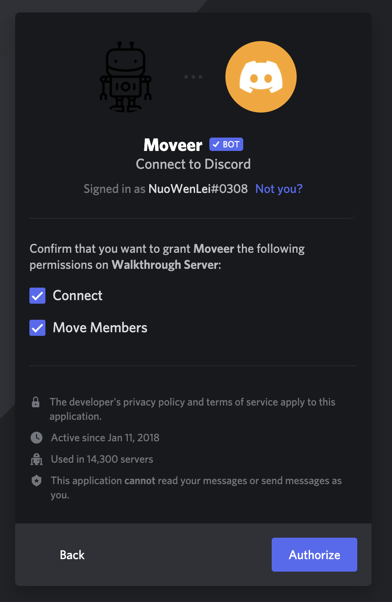
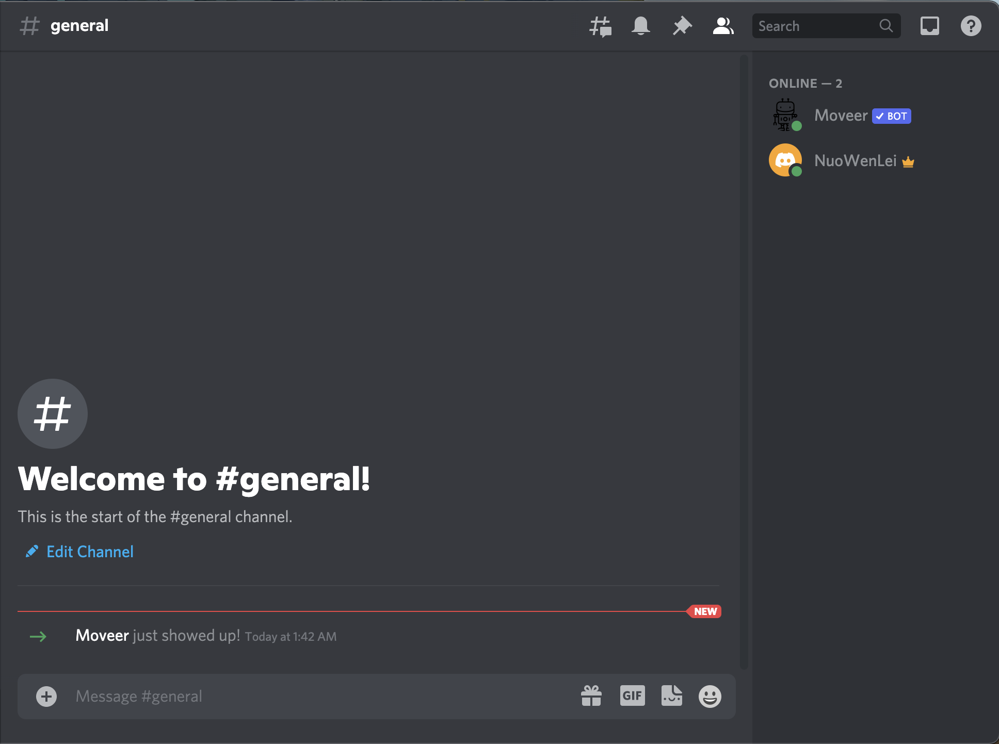
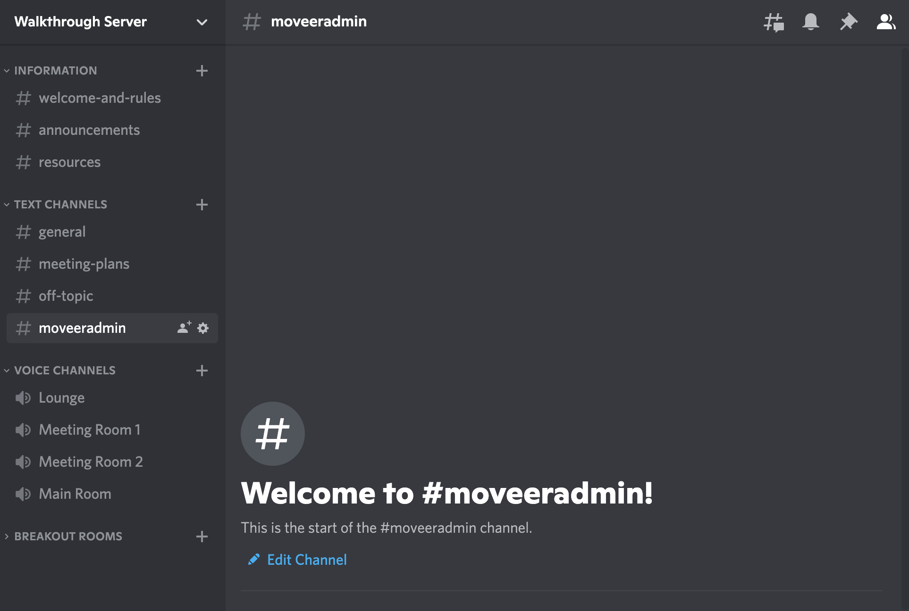
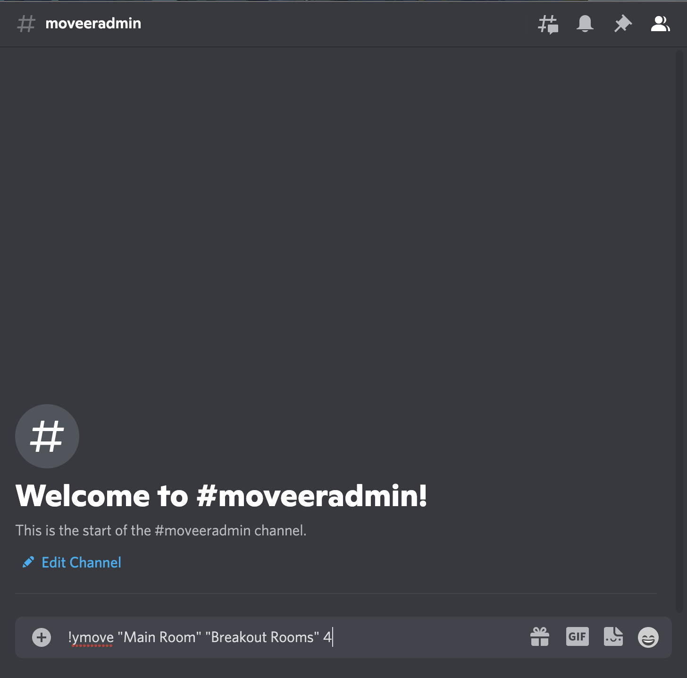
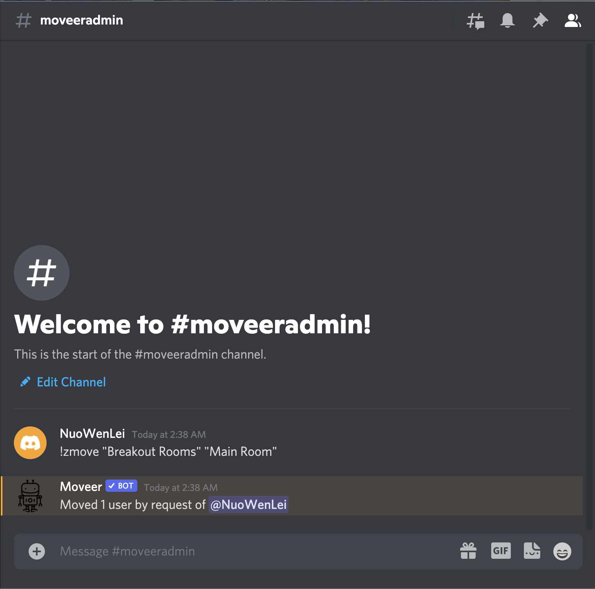

```{r not-setup, include=FALSE}
library(knitr)
```

## Steps to Set Up Discord Server with Breakout Rooms

[Discord](https://discord.com/) is a communication software designed for gaming. Because of the targeted audience, Discord includes a [wide range of features](https://support.discord.com/hc/en-us/sections/201110577-Features), including voice channels, automated bots, member roles, and servers just to name a few. 

With such a versatile app, there really isn't a reason not to use Discord instead of Zoom or other communication apps. In fact, the only feature that makes Zoom unique is the fact that Discord doesn't have a feature like breakout rooms by default. However, with some setup, even breakout rooms can be implemented in Discord.

So this page will walk you through the setup of a Discord server with breakout rooms, which you can use for a multitude of activities!

Overview:

- create Discord server
- invite Moveer
- using Moveer

### Create Discord Server

The discord server is like a zoom meeting but constantly active, is also a chat room, and has a ton more features. It will function not only as a way of communication between students and teachers but also as the software used to host live classes.

<br><br>

Step 1

Click [this link](https://discord.new/tT3G4kESvqKm) to create a discord server based on my template.

If you have Discord open, it will direct you to the application. If not, you will set it up on the browser. Either is fine.

Name your server and click **Create a Server**.

Browser version:

```{r, echo = FALSE, out.width = "50%"}

```

<br>

Step 2

This should bring you to a discord server with many pre-set voice and text channels!

```{r, echo = FALSE, out.width = "50%"}

```

Note: Discord does not provide the function of creating breakout rooms on the fly like Zoom, therefore breakout rooms will have to be pre-set. There are 50 breakout rooms already added under the "Breakout Rooms" category, but you can add up to 500 if you want.

### Invite Moveer

Moveer is a discord bot that allows you to move bulks of people in voice channels in various ways with text commands. This will be the way we will manage students during class and breakout rooms.

<br><br>

Step 1

Visit [this link](https://top.gg/bot/400724460203802624) and click **Invite** on the right sidebar of the website.

Note that there are detailed descriptions of the commands and setup on the website, which is worthwhile familiarizing with.

```{r, echo = FALSE, out.width = "50%"}

```

<br>

Step 2

Follow the invite link to a discord invite page, select the server to invite the bot to, and click **Continue**

```{r, echo = FALSE, out.width = "50%"}

```

<br>

Step 3

Allow the permissions shown for the Moveer bot to move people, then click **Authorize**.

```{r, echo = FALSE, out.width = "50%"}

```

<br>

Step 4

A captcha test may show up, complete that and you should receive a message that the Moveer bot joined your server!

```{r, echo = FALSE, out.width = "50%"}

```


### Using Moveer

The details of how you can use each command is documented on [this website](https://top.gg/bot/400724460203802624). This section will only go through the basics and the 2 commands related to breakout rooms.

<br><br>

Step 1

Navigate to the text channel "moveeradmin", which will be where you enter text commands for Moveer.

```{r, echo = FALSE, out.width = "50%"}

```

<br>

Step 2

!ymove is the command that will be used to distribute all students into random breakout rooms. The syntax is `!ymove "name of target voice channel" "name of voice channel category" number_of_users_per_room`.

Since the server template already has a "Main Room" voice channel and a "Breakout Rooms" category, you can use

`!ymove "Main Room" "Breakout Rooms" 4`

to move all users in the "Main Room" voice channel into breakout rooms with 4 users in each breakout room.

After sending the message, Moveer will send an automated reply about what it did.

```{r, echo = FALSE, out.width = "50%"}

```

<br>

Step 3

!zmove is the command that will be used to bring all students back into a single voice channel. The syntax is `!zmove "name of voice channel category" "name of destination voice channel"`.

If you have the template and has distributed students into the "Breakout Room" category, you can use

`!zmove "Breakout Rooms" "Main Room"`

to move all students back to the "Main Room" voice channel.

```{r, echo = FALSE, out.width = "50%"}

```

**Awesome! Now you have the basic tools to manage a class on Discord with breakout rooms!**
