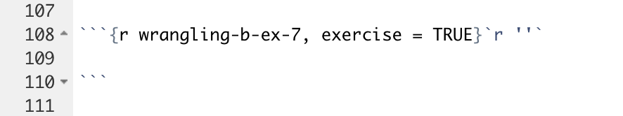
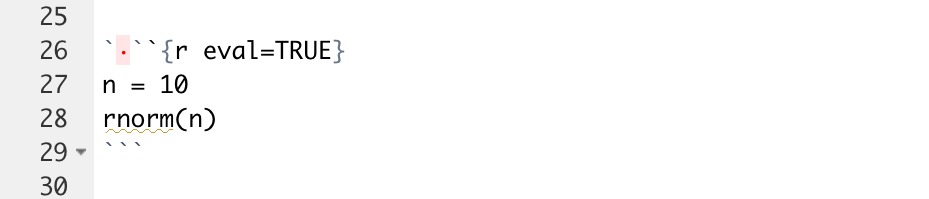

```{r not-setup, include=FALSE}
library(tidyverse)
```

This document reviews some of the technical details behind the special modifications we have made to the basic tutorial technology. It is only of interest to those thinking of modifying the current approach. It also includes some items worth investigating and/or fixing.

## Showing R code chunks

Sometimes in tutorials, you might want to show the entire r code chunk. An example is in the "Rstudio and Friends" tutorial.

Before, we had a trick of adding an empty r string after a code chunk definition to display the chunk as a whole. The way to display chunks that way is discussed [here](https://bookdown.org/yihui/rmarkdown-cookbook/verbatim-code-chunks.html) in more detail.

Below is an example of using the empty r string.

```{r, echo = FALSE, out.width = "50%"}

```

It is strongly discouraged for tutorial makers to use \`r''\` in tutorials to show code chunks. Instead, as of now, we encourage just including photos.

This is because **parsermd** --- which is used in `primer.tutorials::submission_server()` and `primer.tutorials::format_tutorial()` to read and parse tutorial Rmd documents --- fails if \`r''\` appears.

[An issue is raised on github](https://github.com/rundel/parsermd/issues/27) for the **parsermd** package creator, Colin Rundel, to fix this. It is, however, not top priority. He instead offered a workaround other than using an image.

The workaround uses a zero-width space to stop the knitr from knitting that code chunk. The example Professor Rundel pointed to is [an Rmd document written by Yihui](https://github.com/yihui/knitr-examples/blob/master/065-rmd-chunk.Rmd). The example includes more details about how zero-width space works and how to implement the space When it's used in RStudio, the editor does highlight the existence of zero-width spaces with a red dot.

```{r, echo = FALSE, out.width = "50%"}

```

With that being said, we still encourage including images of the code chunks with `knitr::include_graphics()` like below:

```{r, out.width = "100%"}
knitr::include_graphics("images/rmd_chunk_1.png")
```


## Package locations

Keep in mind that there are (at least) two versions of **primer.tutorials** installed on your machine. In my case, we have

```{bash, eval = FALSE}
> /Library/Frameworks/R.framework/Versions/4.1/Resources/library
```

and

```{bash, eval = FALSE}
> /Users/davidkane/Desktop/projects/primer.tutorials/renv/library/R-4.1/x86_64-apple-darwin17.0/primer.tutorials
```

The first is the default location for packages. This is where things go unless you do something special. The second is installed in the `renv` directory which you created within your `primer.tutorials` project. When you are working in your `primer.tutorials` project, as you generally will, the `renv` version of the **primer.tutorials** library is what you will be using.

## YAML and setup code chunk

The top of your file should look like the text below.

````markdown
---
title: "Data API"
tutorial:
  id: "data-api"
output:
  learnr::tutorial:
      progressive: true
      allow_skip: true
runtime: shiny_prerendered
description: "Working with APIs (application programming interfaces) to download data."
---

```{r setup, include = FALSE}`r ''`
library(learnr)
library(primer.tutorials)
library(tidyverse)
knitr::opts_chunk$set(echo = FALSE)
options(tutorial.exercise.timelimit = 60, 
        tutorial.storage = "local") 
```

```{js change-code, echo = FALSE}`r ''`

function transfer_code(elem){
  Shiny.setInputValue("js_to_server", elem.previousElementSibling.dataset.label);
  
}

Shiny.addCustomMessageHandler('set-exercise-code', function(x) {
  var el = $(`.tutorial-exercise[data-label="${x.label}"] .tutorial-exercise-code-editor`)
  var exerciseInput = Shiny.inputBindings.bindingNames["tutorial.exerciseInput"].binding
  exerciseInput.setValue(el, {code: x.code});
  Shiny.setInputValue("js_to_server", null);
})
```

```{r observe-transfers, context = "server"}`r ''`

observeEvent(input$js_to_server, {
  ex_next = input$js_to_server
  str_num = parse_integer(gsub("[^0-9]", "", ex_next)) - 1
  str_head = gsub("[0-9]", "", ex_next)
  ex_prev = paste0(str_head, str_num)
  code <- learnr:::get_exercise_submission(session, ex_prev)$data$code %>% trimws()
  session$sendCustomMessage("set-exercise-code", list(label = ex_next, code = code))
})
```
````

Every tutorial must load the **learnr** package in order to function. `library(primer.tutorials)` is always included because it contains the file, `submissions_functions.R`, which enables answer downloading. All our tutorials need the **tidyverse**. You may need to add other packages which are used in your tutorial. Any such packages also need to be included in the DESCRIPTION file.

`echo = FALSE` is a handy default because, most of the time, we don't show users the code. Setting the `tutorial.exercise.timelimit` to 60 seconds is safe, but probably not necessary. `tutorial.storage` must be set to `local` to ensure that user work is saved between sessions.


For the setup code chunks, the first chunk is written in javascript and the second is written in R.

The pipeline works as such:

1. When a button to transfer code is clicked, it triggers the `"onclick"` event, which calls the function `transfer_code()`, passing the button element itself as an argument.

2. `transfer_code()` is a javascript function defined in the first code chunk that retrieves the current exercise label from an html element after it is compiled. This works by selecting the desired html element relative to the button element passed from the `"onclick"` event. The function then sets a Shiny server input variable called `js_to_server` to the current exercise label.

3. The action of setting `js_to_server` to a new variable triggers a Shiny server event defined in the second code chunk. This event gets the previous exercise's submission and sends that code as well as the current exercise label back to javascript through a custom Shiny message called `"set-exercise-code"`.

4. The message is received in javascript in the first code chunk. Javascript then finds the current code chunk and then **overwrites** the text in the current code chunk with the text from the previous code chunk.

**Process to Current Stage:**
This function was suggested by Preceptor for simpler user experience in long tutorials that require pipe-building across multiple exercises. There were 2 main options in achieving this.

First was to have the code of the current exercise automatically copied to user clipboards when clicking the `"Run Code"` button.

Second was to have the code of the current exercise automatically copied and pasted to the next exercise chunk after some simplified action.

After a swift response from user grrrck on this [RStudio Community Thread](https://community.rstudio.com/t/learnr-clipboard-extension/107812), a clearer direction was laid out. I implemented the answer suggested but Preceptor pointed out that a lot of copy/pasting from the tutorial-maker's side was required. The problem then was how to minimize the amount of code needed to be repeatedly copied/pasted. Since the answer suggested used actionButtons from Shiny which had little room for customization, we thought there wasn't a way to know which exercise was locally close to the button.

Therefore, I created a second version that was a bit "brute-force" by having arguments for the code chunks that had the actionButtons, then reading the file itself to find those arguments and extract the labels of the exercise. But that was still a lot of code to copy/paste and God forbid someone wants to insert a new exercise at the beginning because you'll have to manually change so many exercise names that come after.

Here I realized that I don't have to use Shiny's actionButtons and can just use normal html buttons with trigger events that call a javascript function, which can directly communicate with the Shiny server, thus finally reaching the current version. Now no more exercise-specific information needs to be specified, only the exact same button for each exercise.

**Possible Improvements:**
Personally, I think the current solution is very close to the ideal solution. The only downsides being that 1) tutorial makers still have to include something in the exercises and 2) the button would look much better on the toolbar section of the exercise, next to `"Start Over"` and where the "hint" would be.

However, the possibility of automatically copying code to clipboard when clicking the `"Run Code"` button has yet been explored and could offer a better solution.

### RStudio setting questions

In many settings, it is natural for a set up question to have three parts. First, run a line of code that reports on the value of something. Example:


```{r, eval = FALSE}
rstudioapi::readRStudioPreference(name = "load_workspace", default = "Code failed.")
```

This will return TRUE, which is the default value. 

Second, change the setting. This generally won't return anything.


```{r, eval = FALSE}
rstudioapi::writeRStudioPreference(name = "load_workspace", value = FALSE)
```


See how the first was "read" and the second was "write"? Then, the third and final step is to confirm that the change worked by re-running the first code again.

```{r, eval = FALSE}
rstudioapi::readRStudioPreference(name = "load_workspace", default = "Code failed.")
```

And finish with a sentence that tells the student to notice that the value has changed and that it is now correct. (Of course, we "monitor" that by making them copy/paste this last command and its return from the Console into the tutorial.)

### Other topics

* We can use this trick to add hints to those questions: simply add a `<div>` tag with an id attribute that marks it as hint for your exercise. Like this:

````markdown
`r ''`<div id="filter-hint">
**Hint:** You may want to use the dplyr `filter` function.
</div>
````


### Comments on .Rbuildignore

For some reason, it is impossible to include comments in the .Rbuildignore, at least by using the "#" symbol. I think the key issue is that using `*` (or maybe a parenthesis) in a line which begins with `#` causes trouble. Regardless, here are some thoughts on the current version.

We would like to ensure that all the junk files which end up in the `tutorials/*` directories are not included in the build. Such files are often large. They also run the risk of messing things up in that they might cause certain tests to pass for us but which would fail for anyone who downloads from Github. (The .gitignore file does a reasonable ensuring that such files do not end up on Github.)

The key line is:

````
tutorials/[^/]*/(?!(data|images|.*Rmd))
````

This excludes everything in any subdirectory of the tutorials directory except an `images` directory (a file named images would also be included) or a `data` directory or a file suffixed with ".Rmd". 

This entire document is in Perl-like Regex. The only significant difference from Perl in this document is that "/" do not need to be escaped with a "\". The regex below, in plain English, matches (and so excludes) a path which begins with the characters "tutorials/"", and after those has any number (*) of characters except a "/" ([^/]), and after those has a "/", and after those does not have (?!...) either the characters "images" or (|) any number (*) of any character (.) followed by the characters "Rmd". If we used .* instead of defining the character class in [^/]*, the regex would evaluate the negative lookahead after the last "/" in the path. The files within the images directory would then be excluded, because they do neither the characters "images" or a string ending in "Rmd" after their last "/".

### Adding more libraries

If you are using a new library, there are several things you need to check. First, most obviously, you should install the package within the `primer.tutorials` directory. Second, you must use library(X) in the setup chunk within the tutorial.Rmd itself. Third, you need to run `renv::status()`. This should report that there is a new package which is not part of renv.lock. Then, you will need to run `renv::snapshot()` so that the renv.lock file is updated. Fourth, you need to add the package to the DESCRIPTION file, in the Imports: section. (And don't forget the comma when you do so.) If you don't do this, then R CMD check might work on your computer, where library X is already installed, but won't work in Github actions since R relies on the DESCRIPTION file to know which packages to install.

### Revisit use of functions from **learnr**

Unexported objects imported by ':::' calls:
  ‘learnr:::get_all_state_objects’ ‘learnr:::read_request’
  ‘learnr:::submissions_from_state_objects’

Because learnr will not export the three functions which we use in submission_functions.R, we have no choice but to use ::: in order to access them. Doing do produces a NOTE when we run R CMD check. I find that annoying. I tried just providing my own copies in submission_functions.R, but that did not work. (Perhaps the problem is that they themselves use other learnr functions which I don't have access to?)

## Tour of the Package Functions

### Submission Functions

**submission_ui** is an HTML structure defined through shiny, which is inserted to the end of every tutorial. It creates buttons to download submission reports in the forms of RDS and HTML.

**submission_server()** is a function that communicates with the shiny server during a tutorial. It provides the download functions, **downloadHtml** and **downloadRds**, for the user interface to call when downloading submission reports.

### Submission Helper Functions

**build_html** is a function that creates and downloads a tibble report of tutorial submissions in HTML.

**build_rds** is a function that creates and downloads an tibble report of tutorial submissions in RDS.

**create_tibble_from_submissions** is a function that takes in tutorial submissions and creates a formatted tibble with the columns: id, submission type, and answer. The submissions are arranged by the order these questions appear in the tutorial

**get_label_list** is a function that gets the appearance order of questions in a tutorial.

**get_submissions_from_learnr_session** is a function that gets submissions of the current tutorial session through learnr functions, specifically `learnr:::get_all_state_objects()` and `learnr::submissions_from_state_objects()`. It returns a list of submission objects, each containing details about the question and answer.

### Submission Processing Functions

**gmail_access** is a function that establish a connection with the submission gmail account and downloads submission attachments based on a provided filter.

### Add-in Functions

**format_tutorial** is a function that takes a tutorial path and formats the code chunk labels into a standardized format.

**check_current_tutorial** is an add-in function that runs `format_tutorial()` on the current opened tutorial. It is a handy add-in for tutorial makers who want to make sure their chunk labels are correct.

**make_new_exercise** is an add-in function that creates a code exercise with correctly formatted labels and general structure.

**make_new_q_no_answer** is an add-in function that creates a question exercise that does not have an answer to display with correctly formatted labels and general structure.

**make_new_q_with_answer** is an add-in function that creates a question exercise that does have an answer to display with correctly formatted labels and general structure.

### Miscellaneous Functions

**install_only_binary_packages** is a function that updates the user's .Rprofile file to only download the binary version of packages. The reason of this function is that students are often prompted to download from the source of the packages, which we do not want to happen. Therefore, by changing the .Rprofile to only downloading binary packages, students can only download from CRAN.


