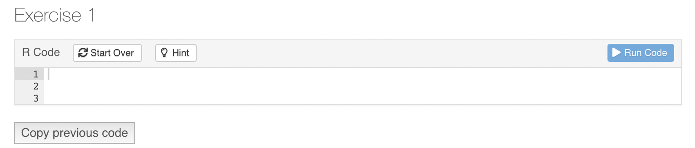
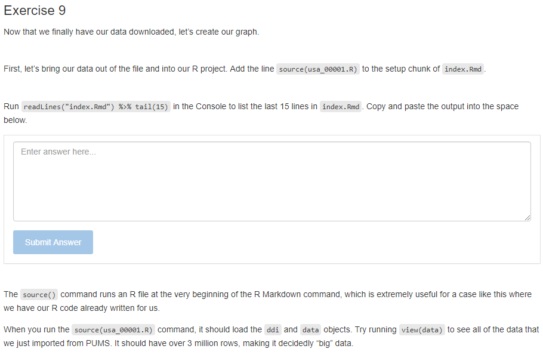

```{r not-setup, include=FALSE}
library(tidyverse)
```

This document reviews some of the technical details behind the special modifications we have made to the basic tutorial technology. It is only of interest to those thinking of modifying the current approach. It also includes some items worth investigating and/or fixing.


## Package locations

Keep in mind that there are (at least) two versions of **primer.tutorials** installed on your machine. In my case, we have

```{bash, eval = FALSE}
> /Library/Frameworks/R.framework/Versions/4.1/Resources/library
```

and

```{bash, eval = FALSE}
> /Users/dkane/Library/Caches/org.R-project.R/R/renv/library/primer.tutorials-07f29d85/R-4.2/aarch64-apple-darwin20"
```

The first is the default location for packages. This is where things go unless you do something special. The second is installed by `renv`, which was used within the `primer.tutorials` project. When you are working in your `primer.tutorials` project, as you generally will, the `renv` version of the **primer.tutorials** library is what you will be using. You can check this by running `.libPaths()`.

```{r, eval=FALSE}
> .libPaths()
[1] "/Users/dkane/Library/Caches/org.R-project.R/R/renv/library/primer.tutorials-07f29d85/R-4.2/aarch64-apple-darwin20"
[2] "/Library/Frameworks/R.framework/Versions/4.2-arm64/Resources/library" 
```

Whenever you `library()` a package, R looks through, in order, the values returned by `.libPaths()`. **renv** sets things up so that the first item is its collection of packages. Note that these are placed in a weird location, including a temp directory name `primer.tutorials-07f29d85`. I am not sure how **renv** decided to create a new one of these. It does not delete the old ones. In the case of major breakdowns, deleting these directories by hand can fix things.


## YAML and setup code chunk

The top of your file should look like the text below.

```{r, echo = FALSE}
knitr::include_graphics("images/tutorial-rmd-beginning.png")
```

Every tutorial must load the **learnr** package in order to function. `library(primer.tutorials)` is always included because it contains the file, `submissions_functions.R`, which enables answer downloading. All our tutorials need the **tidyverse**. You may need to add other packages which are used in your tutorial. Any such packages also need to be included in the DESCRIPTION file.

`echo = FALSE` is a handy default because, most of the time, we don't show users the code. Setting the `tutorial.exercise.timelimit` to 60 seconds is safe, but probably not necessary. `tutorial.storage` must be set to `local` to ensure that user work is saved between sessions.

The other 2 code chunks load in the code for the "Copy Code" button and the Information section. **Do not remove these code chunks**. The information section and the copy code button are crucial infrastructure for the tutorial and these code chunks allow us to implement them easily without taking too much space.

## Copy Code Trickery

### Current Process

This function was suggested by Preceptor for simpler user experience in long tutorials that require pipe-building across multiple exercises. There were 2 main options in achieving this.

First was to have the code of the current exercise automatically copied to user clipboards when clicking the `"Run Code"` button.

Second was to have the code of the current exercise automatically copied and pasted to the next exercise chunk after some simplified action.

After a swift response from user grrrck on this [RStudio Community Thread](https://community.rstudio.com/t/learnr-clipboard-extension/107812), a clearer direction was laid out. I implemented the answer suggested but Preceptor pointed out that a lot of copy/pasting from the tutorial-maker's side was required. The problem then was how to minimize the amount of code needed to be repeatedly copied/pasted. Since the answer suggested used actionButtons from Shiny which had little room for customization, we thought there wasn't a way to know which exercise was locally close to the button.

Therefore, I created a second version that was a bit "brute-force" by having arguments for the code chunks that had the actionButtons, then reading the file itself to find those arguments and extract the labels of the exercise. But that was still a lot of code to copy/paste and God forbid someone wants to insert a new exercise at the beginning because you'll have to manually change so many exercise names that come after.

Here I realized that I don't have to use Shiny's actionButtons and can just use normal html buttons with trigger events that call a javascript function, which can directly communicate with the Shiny server, thus finally reaching the current version. Now no more exercise-specific information needs to be specified, only the exact same button for each exercise.

That means that in order to implement copy-pasting for an exercise, you need to add the line `<button onclick = "transfer_code(this)">Copy previous code</button>` either before or after the exercise that you want to copy-paste to. This will add a button that looks like this:

```{r, echo = FALSE}
knitr::include_graphics("images/copy-button.png")
```

The user just needs to click the button in order to copy the code from the previous exercise into the current one.

### Possible Improvements

Personally, I think the current solution is very close to the ideal solution. The only downsides being that 1) tutorial makers still have to include something in the exercises and 2) the button would look much better on the toolbar section of the exercise, next to `"Start Over"` and where the "hint" would be.

However, the possibility of automatically copying code to clipboard when clicking the `"Run Code"` button has yet been explored and could offer a better solution.

## RStudio setting questions

In many settings, it is natural for a set up question to have three parts. First, run a line of code that reports on the value of something. Example:

```{r, eval = FALSE}
rstudioapi::readRStudioPreference(name = "load_workspace", default = "Code failed.")
```

This will return TRUE, which is the default value. 

Second, change the setting. This generally won't return anything.


```{r, eval = FALSE}
rstudioapi::writeRStudioPreference(name = "load_workspace", value = FALSE)
```


See how the first was "read" and the second was "write"? Then, the third and final step is to confirm that the change worked by re-running the first code again.

```{r, eval = FALSE}
rstudioapi::readRStudioPreference(name = "load_workspace", default = "Code failed.")
```

And finish with a sentence that tells the student to notice that the value has changed and that it is now correct. (Of course, we "monitor" that by making them copy/paste this last command and its return from the Console into the tutorial.)

### Addins

The **primer.tutorials** package has a set of add ins, or functions that can be run through the RStudio IDE.

At the time of writing, there are 4 add ins: the Tutorial Code Exercise, the Tutorial Written Exercise (with answer), the Tutorial Written Exercise (no answer), and the Format Tutorial Chunk Labels add in. Each of these will reformat your file to accomplish a task.

You can run an addin either through a keyboard shortcut (Tools -> Modify Keyboard Shortcuts) or you can go to the Addins menu and run the addin from there.

The Tutorial Code Exercise addin creates a new code exercise by adding to following code at your cursor location:

````markdown
### Exercise 1


`r ''````{r rstudio-setting-ques-1, exercise = TRUE}

```

<button onclick = "transfer_code(this)">Copy previous code</button>

`r ''````{r rstudio-setting-ques-1-hint, eval = FALSE}

```

###


````

<!-- DK: Generate these (and other) images automatically? -->

This exercise will look like this once it's knitted:

```{r, out.width = "75%", echo = FALSE}

```

The Tutorial Written Exercise addins work the same way. The only difference is that they create written prompt boxes rather than code input boxes.

The Tutorial Written Exercise (with answer) addin adds this code to your R Markdown file and creates a prompt box with 6 rows. You can change the number of rows by changing the `rows` argument. Note that students are not allowed to retry since, if they could do so after seeing ou answer, the urge to just cheat would be tough to resist.

````markdown
### Exercise 2


`r ''````{r rstudio-setting-ques-2}
question_text(NULL,
	message = "Place correct answer here.",
	answer(NULL, correct = TRUE),
	allow_retry = FALSE,
	incorrect = NULL,
	rows = 6)
```

###


````

The Tutorial Written Exercise (no answer) is the similar, but it just doesn't have an `answer` field. It also allows for retry's since there is no answer for a student to steal from.

````markdown
### Exercise 3


`r ''````{r rstudio-setting-ques-3}
question_text(NULL,
	answer(NULL, correct = TRUE),
	allow_retry = TRUE,
	try_again_button = "Edit Answer",
	incorrect = NULL,
	rows = 3)
```

###


````

They look the similar once they're knitted.

```{r, out.width = "75%", echo = FALSE}

```

Finally, the "Format Tutorial Chunk Labels" addin formats the tutorial so that it automatically has the correct numbering. That means that you can add in a new exercise at the beginning of the tutorial and reformat it without having to manually change every single chunk label or exercise header. 

## Comments on .Rbuildignore

For some reason, it is impossible to include comments in the .Rbuildignore, at least by using the "#" symbol. I think the key issue is that using `*` (or maybe a parenthesis) in a line which begins with `#` causes trouble. Regardless, here are some thoughts on the current version.

We would like to ensure that all the junk files which end up in the `tutorials/*` directories are not included in the build. Such files are often large. They also run the risk of messing things up in that they might cause certain tests to pass for us but which would fail for anyone who downloads from Github. (The .gitignore file does a reasonable ensuring that such files do not end up on Github.)

The key line is:

````
tutorials/[^/]*/(?!(data|images|.*Rmd))
````

This excludes everything in any subdirectory of the tutorials directory except an `images` directory (a file named images would also be included) or a `data` directory or a file suffixed with ".Rmd". 

This entire document is in Perl-like Regex. The only significant difference from Perl in this document is that "/" do not need to be escaped with a "\". The regex below, in plain English, matches (and so excludes) a path which begins with the characters "tutorials/"", and after those has any number (*) of characters except a "/" ([^/]), and after those has a "/", and after those does not have (?!...) either the characters "images" or (|) any number (*) of any character (.) followed by the characters "Rmd". If we used .* instead of defining the character class in [^/]*, the regex would evaluate the negative lookahead after the last "/" in the path. The files within the images directory would then be excluded, because they do neither the characters "images" or a string ending in "Rmd" after their last "/".

## Adding more libraries

If you are using a new library, there are several things you need to check. First, most obviously, you should install the package within the `primer.tutorials` directory. Second, you must use library(X) in the setup chunk within the tutorial.Rmd itself. Third, you need to run `renv::status()`. This should report that there is a new package which is not part of renv.lock. Then, you will need to run `renv::snapshot()` so that the renv.lock file is updated. Fourth, you need to add the package to the DESCRIPTION file, in the Imports: section. (And don't forget the comma when you do so.) If you don't do this, then R CMD check might work on your computer, where library X is already installed, but won't work in Github actions since R relies on the DESCRIPTION file to know which packages to install.

We have seen weird situations in which even doing all of the above did not work. The required hack was to install the new package in your main (default) library. Now, it seems weird that this would help since, with **renv**, we should never be using that location. I suspect that there is a bug involved in the interaction between R CMD check and **renv**.

## Revisit use of functions from **learnr**

Unexported objects imported by ':::' calls:
  ‘learnr:::get_all_state_objects’ ‘learnr:::read_request’
  ‘learnr:::submissions_from_state_objects’

Because learnr will not export the three functions which we use in submission_functions.R, we have no choice but to use ::: in order to access them. Doing do produces a NOTE when we run R CMD check. I find that annoying. I tried just providing my own copies in submission_functions.R, but that did not work. (Perhaps the problem is that they themselves use other learnr functions which I don't have access to?)

NWL Update August 14th: In the last few days, learnr has exported the functions, learnr::get_tutorial_state() and learnr::get_tutorial_info(), which eliminates the need for all functions with ':::'. All uses of ':::' has been replaced in this package.

## Tour of the Package Functions

### Submission Functions

**submission_ui** is an HTML structure defined through shiny, which is inserted to the end of every tutorial. It creates buttons to download submission reports in the forms of RDS and HTML.

**submission_server()** is a function that communicates with the shiny server during a tutorial. It provides the download functions, **downloadHtml** and **downloadRds**, for the user interface to call when downloading submission reports.

### Submission Helper Functions

**build_html** is a function that creates and downloads a tibble report of tutorial submissions in HTML.

**build_rds** is a function that creates and downloads an tibble report of tutorial submissions in RDS.

**create_tibble_from_submissions** is a function that takes in tutorial submissions and creates a formatted tibble with the columns: id, submission type, and answer. The submissions are arranged by the order these questions appear in the tutorial

**get_label_list** is a function that gets the appearance order of questions in a tutorial.

**get_submissions_from_learnr_session** is a function that gets submissions of the current tutorial session through learnr functions, specifically `learnr:::get_all_state_objects()` and `learnr::submissions_from_state_objects()`. It returns a list of submission objects, each containing details about the question and answer.

### Submission Processing Functions

**gmail_access** is a function that establish a connection with the submission gmail account and downloads submission attachments based on a provided filter.

**gdrive_access** is a function that establish a connection with the submission google drive account and creates a new folder to store submissions and submission info in.

**create_submission_aggregation** is a function that processes downloaded rds submissions and creates a tibble with data about the tutorial user's name, email, time spent on the tutorial, questions answered, and link to submission rds.

**google_submission_collection** is the main function that's called by the user to collect, organize, and save all submissions.

### Add-in Functions

**format_tutorial** is a function that takes a tutorial path and formats the code chunk labels into a standardized format.

**check_current_tutorial** is an add-in function that runs `format_tutorial()` on the current opened tutorial. It is a handy add-in for tutorial makers who want to make sure their chunk labels are correct.

**make_new_exercise** is an add-in function that creates a code exercise with correctly formatted labels and general structure.

**make_new_q_no_answer** is an add-in function that creates a question exercise that does not have an answer to display with correctly formatted labels and general structure.

**make_new_q_with_answer** is an add-in function that creates a question exercise that does have an answer to display with correctly formatted labels and general structure.

## Discussion of Tutorials

Let's discuss the six broad categories of tutorials which we might add, especially to chapters 5 through 11.

First, we can just do more examples. Use different data with a different question, but all the same steps as in the chapter itself. Such examples will generally, like 082, do two analyses: one with all the data (to show the truth) and one in which representativeness fails in a way which we define, thereby showing how we can be led astray. Last step is to compare the answers from these two approaches, thus emphasizing the importance of humility.

Second, stand-alone tutorials on useful topics, like text modeling or networks or rtweet or whatever. These could go in any chapter and would not be restricted to having X number of parameters.

Third, we could cover many other model families, again perhaps not worrying too much about whether or not they have the "right" number of parameters. Simplest here would be other stan_glm families. That is, show a weird data set in which the outcome variable is something that should be fit with poisson or something, and then use family = poisson. Goal would be to emphasize that there are many possible models.

Fourth, expanding on the above, we might have some machine learning examples. After all, a machine-learning model is just a different kind of black box, not different conceptually than a linear or logistic model. We could fit a machine learning model on chapter 8 scenarios. Even though there are way more than three parameters in such models, they still can (I think!) be made to work in cases with just one input variable.

Fifth, real world data science examples which do not hide the messy complexity of the world. I guess that these would be a lot like the overview tutorials, but with 30 minutes of data cleaning first. These might also explicitly assume that you have done all the other tutorials in the chapter and that, therefore, we do not need to walk you through how to estimate a `stan_glm()` with five baby questions. Instead, the questions would be, not really harder, but messier.

Sixth, tutorials about interpreting parameters. We could have one of these in every chapter from 6 onward. These could be short! They would only cover parameter interpretation, perhaps only using the models which were used in the chapter.

Obviously, we could also combine these in various ways. Upon reflection, we should save the machine learning examples for later chapters in which we have several righthand side variables. Indeed, we could have three machine learning tutorials in chapter 11.

### Later tutorials in later chapters 

The first tutorial for each of the later chapters is easy. Just do more or less exactly what the chapter does. Recall that, one day, we expect to incorporate those questions directly into the chapter itself. So, the more that it just forces students to type in the same commands as in the chapter, the better. But, for the most part, the chapters are not that long! There is only about one tutorial worth of material.

What do we do for the other 5 or so tutorials for each chapter? Good question! Honestly, I am not sure. Here are some ideas:

* The second tutorial could be very similar to the first -- and, therefore, to the chapter. Just use a different variable(s) and/or a different tibble, but answer the same sorts of questions in the same way.

* Don't be repetitive in the written questions. It is fine, in the first tutorial for each chapter, to ask students to write a definition of the Preceptor Table. Indeed, we should always have that question in each first tutorial. But, we don't want that question in each of the 5 tutorials for a single chapter.

* Use written questions which do require different answers depending in the data/variable used. We can't resuse "Define a Preceptor Table" because that question has the same answer every time. Consider a different question:

> Write a paragraph which explores reasons why we should **not** consider the Preceptor Table and our data set as being drawn from the same population?

That is a good question, not least because it needs a different answer for each data science problem we confront. Another good example:

> Write a paragraph explaining why, even though the data is not a random sample, we may still consider it to be "respsentative" enough to move forward?

Again, this requires a different answer for each new tibble.

* We don't usually (ever?) ask questions about the four Cardinal Virtues directly. They are simply a pedagogical device we use to help students organize their work. But we do ask written questions about the key concepts (population, representativeness, validity) in each and every tutorial. These are difficult concepts with no "right" answers. We need to wrestle with them every week.

* A tutorial after the first might do a very similar exercise but with three differences. First, it can go faster, given that students have already seen the basics fairly slowly in the first tutorial. Second, it can add some complexity, make the modeling problem just a little more difficult than the basic case. Third, it can add some new magic. Perhaps it grabs data using a new package instead of just using another boring data set from **primer.data**. Perhaps it creates a nicer plot with some geoms we have not used before. 

* I will distribute the problem sets we used last semester. Turning them into tutorials might work well. But always remember that tutorials are easy, while problem sets are hard. So, we need to split up a big problem set question into 15 exercises and then walk the students slowly (and with hints) through those 10 exercises.

* Maybe there are easy ways, in tutorial 2 or 3, to take the problem we solved in tutorial 1 and have it loosen the assumption that the data we have is representative of the population. This is a nice assumption to loosen since it is never true. I am not sure how one would do this . . .

* If the main example is the chapter is one which uses a linear model, then tutorial 2 could use a logistic model and then tutorial 3 could use the third kind of model (which we have not chosen yet). Similarly, if the chapter (and first tutorial) does a predictive mode, then tutorial 3 should do a causal model.

* The last tutorial might, in some sense, try to set the stage for the next chapter, provide a teaser for what we are learning next.

* Another type of tutorial is one which uses fake data which has been manipulated to violate the assumptions which students are making. Show them Preceptor's Posterior and compare it to their own.


## Miscellaneous topics

**install_only_binary_packages** is a function that updates the user's .Rprofile file to only download the binary version of packages. The reason of this function is that students are often prompted to download from the source of the packages, which we do not want to happen. Therefore, by changing the .Rprofile to only downloading binary packages, students can only download from CRAN.

The `copy-code-chunk`, `info-section`, and `download-answers` are [imported](https://community.rstudio.com/t/include-custom-code-chunks-from-separate-files/109216) into each tutorial. The actual Rmd of these sections are saved in the `inst/child_documents` folder. Note that the `setup` code chunk must come before all of them.

## Permanent objects

Permanent objects should be avoided, if possible. The problem is that each Exercise code chunk is its own "world." It knows nothing of any actions taken in previous code chunks, except for three exceptions:

1) Any objects created in the global "setup" code chunk are available in all Exercise code chunks. The annoying thing about this option is that we would, ideally like to have the obects created near --- in the Rmd --- to the Exercises which use them. This also means that we can only use names like "fit_1" or "pp" once in each tutorial.

2) Objects created in a setup chunk for just one exercise. 

3) Objects created in a code chunk which is then referenced by using the exercise.setup code chunk option in any Exercise which needs access to these objects. This is probably the best approach.

But what about regular code chunks which are neither Exercise code chunks nor setup chunks. Do objects created there persist? Maybe! Sometimes!? My *sense* is that such objects are available when the tutorial is knitted. This is why we can show a plot at the end of a Section after creating it at the start. But such objects are not available at run time, which is why they are not seen in Exercises.

No aspect of the tutorials has given us more trouble than permanent objects. In particular, it sometimes seems like things will work with Run Document but not with Run Tutorial. Since students always do the latter, we need to test that way as well.

## Verbatim Code Chunks

See [here](https://support.rstudio.com/hc/en-us/articles/360018181633-Including-verbatim-R-code-chunks-inside-R-Markdown) for advice about how to use verbatim R code chunks within an R Markdown document, as we do in this document. 


