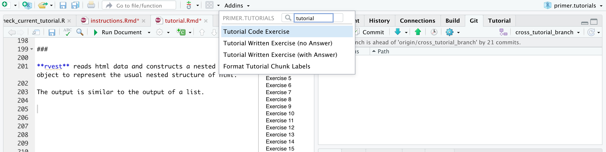
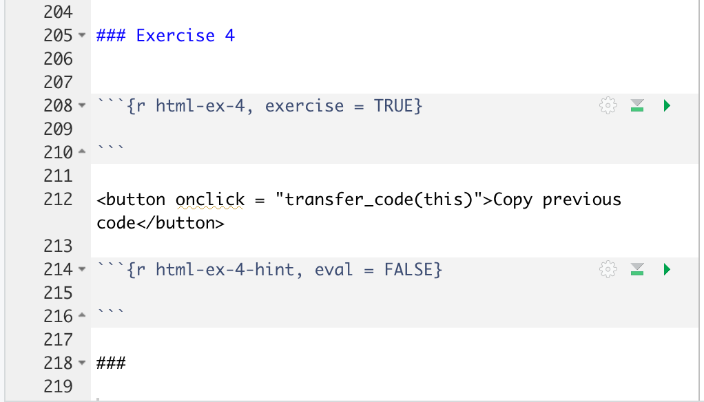
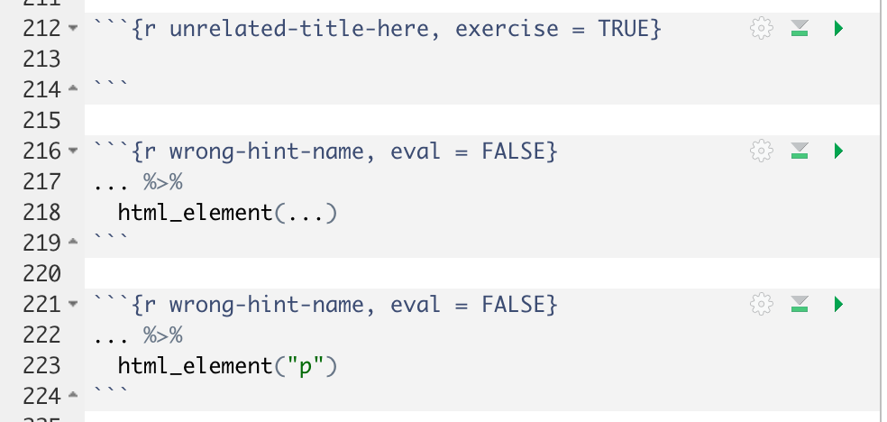
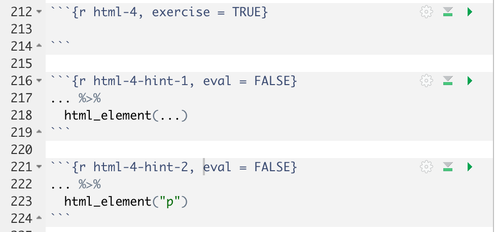

```{r not-setup, include=FALSE}
library(tidyverse)
library(knitr)
```

*There are no questions here. There are only instructions!*

*Tutorials are not challenging. They are confidence-building.*

## Introduction

Imagine the *shallowest* possible learning curve. Almost every student should be able to answer almost every Exercise, albeit perhaps with the help of the Hint. There are no hard questions. In fact, there really aren't *questions* at all. Instead, there are *instructions*: Do this. Do that. Next do this other thing.

Assume that you are giving the student a private lesson. You ask them a question. They give you an answer. What would you say next to them? What do you want to teach them, given that context?

There are 1,000,000 bits of R knowledge which we might provide to students: tips, tricks, cool packages, fun websites, et cetera. We don't have time to mention all of them! The art of teaching is to, first, decide which 10,000 of the bits are most important to mention and, second, figure out the best time to mention them. Tutorials are a key location for doing that mentioning. Which bits do we mention and where do we mention them?

We can only demonstrate a tiny percentage of all the packages in the world, but we can certainly at least mention the existence of dozens more. Within the packages we use, we can only demonstrate some of the functions, but we can mention many more. Among the functions we use, we can only use some of the arguments, but we can discuss others.

The most important parts of the "knowledge drops" which we pepper these tutorials with are, first, the packages/functions/arguments which we mention without demonstrating and, second, the links to high quality resources.

We are building a "pit of success." Generally, students don't do the assigned reading, at least in a large class. But, they will complete required work. They will do the tutorials. *Our promise: If you complete the tutorials, you will become a data scientist. There is simply no way not to.*

There will often be several tutorials for a given the chapter. The first few will be matched very closely to the structure of the chapter. Someday, we will [put those exercises directly](https://github.com/tinystats/teacups-giraffes-and-statistics) into the *Primer* itself, so keeping the two in sync makes sense. Extra tutorials have more freedom. They are designed to give more practice, reinforcing the material in the chapter, but with a bit of freedom for adding complications.

A tutorial should take about 1 to 2 hours. Depending on the topic difficulty, that might be around 100 to 200 or so questions. Some tutorials might be only 30 minutes, especially if the topic is not that important.

## Set Up

To make additions to **primer.tutorials**, follow the [set up guide](https://ppbds.github.io/primer/set-up-for-working-on-the-primer.html) to fork/download a copy of [PPBDS/primer.tutorials](https://github.com/PPBDS/primer.tutorials). Press "Install and Restart" from the "Build" tab to ensure that you have the latest copy installed. (You should not do `remotes::install_github("PPBDS/primer.tutorials")` since that gets the version from Github. You want the version from your computer so that you get any changes you make.) 

Tutorials themselves live in `inst/tutorials`. Each directory name is a combination of a prefix number (which indicate the week/chapter which a tutorial is associated with and the order in which to do it) and a name, which corresponds to the `id'` of the tutorial. Within each directory is a `tutorial.Rmd` file and, sometimes, other material like an `images` and `data` directory. The prefix number determines the order in which tutorials appear in the Tutorial pane. For example, the number `052` indicates the tutorial is from week 5 and is the second tutorial to be completed that week, after `051`.

To create a new tutorial, use File -> New File -> R Markdown. Choose the "From Template" option and then select "Primer Tutorial." The "[Technical Details](details.html)" vignette provides an overview of the default material in the template. Change the `title`, `id`, and `description` parts of the YAML header. The title may include spaces. The `id` should be exactly the same as the `title`, but all in lower case and with spaces and other special characters replaced with dashes. One sentence is enough for the description.

The `id` value is important. It should be the same as the directory in which the tutorial is located, but with the leading numbers removed. It is used for the name of the answer file which students save at the end of the tutorial. 

## Structure

The beginning of every tutorial are the *Code copying* and the *Information* code chunks. The tutorial is then divided into different *Sections* that appear as side panels. The first section is the "Introduction" and the last is the "Summary." 

Within the sections after Introduction and before Summary, there are a series of *Exercises* which can include writing code or writing text. At the end of the tutorial, there is a *Download answers* code chunk which provides students with instructions on how to download a copy of their answers in either html or rds format.

The Introduction section is two to four sentence about the main topics covered in the tutorial. Why are we here? What will students get out of giving you 90 minutes of their lives? How does this tutorial connect to previous tutorials?

The Summary section is two to four sentences which bring the lessons of the tutorial together for the student. What do they know now that they did not know before? How does this tutorial connect to future tutorials? OK if this is very similar to the Introduction. You made a promise as to what they would learn. You (I hope!) kept that promise.

If there are one or two other key resources about the topic of the tutorial, then these resources should be linked in both the Introduction and the Summary.

## Sections

Tutorials are divided into *Sections* that appear on the side panel. To create these sections, we include a double hash (##) before the text for it to show up as a side panel. This is also called the *Section Title*.  Use [sentence case](https://apastyle.apa.org/style-grammar-guidelines/capitalization/sentence-case). On the line after the Section Title, put three hashes. This ensures that students will see the introductory text before they see the first Exercise.

Each Section begins with a sentence or two about what this group of Exercises is trying to accomplish. Example:

````markdown
## Interacting with sites with `GET()`
###

In order to get data from an API, we use the **httr** package. The package is designed to 
imitate standard HTTP in R. Read more about HTTP [here](https://www.jmarshall.com/easy/http/).

### Exercise 1
````

The link will be formatted correctly once the tutorial is knitted. Section introductions will often have two parts: first, the introductory text as above and, second, a plot which will be replicated. Those two parts are generally separated by a triple hash.

After the last Exercise in a Section, you should put a triple hash and then give a two sentence summary about what this Exercise accomplished. A Section is a 20 minute transfer of knowledge from you to the student. At the beginning, you mentioned its purpose. Conclude by tying things back to that original purpose. Often, these "purposes" will be fairly trivial: You promised to go through an example of a scatter plot and, in fact, you did. And that is OK! We are not writing poetry. Not every Section leads to salvation.

One or two high quality links, specifically relevant to this Section, should be mentioned at either the beginning or end of a Section, unless the Section is very short.


## Exercises

Each Section is composed of a series of numbered Exercises. 

### Flow

Each Exercise should have a *flow* which requires that students hit the "Continue" button at least twice. 

* Begin with an *Start* which is a sentence or two of knowledge and/or the question itself. If the length of the Start text is longer than one or two lines, then do not place the question code chunk in the same part. Instead, the Start includes a triple hash, thereby creating the Continue button. If the length of the text is short enough that students are willing to read it (at most two sentences), you can include the answer code chunk in the same part.

* Most of the time there is no need for a triple hash before the code chunk. The main exception is Exercise 1, which will often include a plot to be reproduced.

* Then comes the answer code chunk and hint(s). See below for more discussion. This grouping is always followed by the triple hash. We want students to pause after they have submit their answers so that they are more likely to consider the results of their submission before moving on.

* The last part of the Exercise is the *End*, another knowledge drop. Again, this can't be more than a sentence or two. But it should be more substantive than a simple "Good job."  Recall the 10,000 items which we want to mention; you should decide which one belongs here because it connects to the question/answer which students have just completed.


### Question types

To create the exercise headers, you use three hashes. Make sure you number your exercises -- `### Exercise 1`, `### Exercise 2` and so on. 

There are two main types of questions. First, we have normal *coding* questions. Students write code and press the Run Code button. Second, we have *text* questions which require students to either write prose or to copy/paste the results of running specific commands. Prose is needed for questions like "Explain the meaning of potential outcomes." Copy/paste situations arise when students are instructed to do something like connect to Github or edit an Rmd. We confirm that the students have completed these questions by having them issue a command like `list.files()` and then copy/pasting the result. 

#### Code questions

Here is a standard code question:

````markdown
### Exercise 7

Teach them something. Ask a question

```{r wrangling-b-ex-7, exercise = TRUE}`r ''`

```

<button onclick = "transfer_code(this)">Copy previous code</button>

```{r wrangling-b-ex-7-hint-1, eval = FALSE}`r ''`

```

###

Comments on the results they should have seen. Drop some more knowledge.

````

First, the Start of the Exercise sets the stage. It sometimes teaches something new, connects to a previous question, provides a useful link, whatever. If it is long enough, it is followed by a triple hash. If not, the text continues to the instruction.

Second, the instruction requires that students write some code. Good instructions generate results when the student presses Run Code. 

Third, any Exercise which requires the copying of code from the prior Exercise should place the *Copy previous code* button below the Exercise code chunk.

````markdown
<button onclick = "transfer_code(this)">Copy previous code</button>
````

Fourth, tutorials should be so easy that 95% of the students can answer 95% of the questions easily. One way to ensure that is to add a *Hint* to almost every coding question.

Fifth, you must include at least one empty line in the code chunk, otherwise you will get a hard-to-diagnose error.

Hints must always have the same code chunk name as the exercise chunk for which they are the hint, with a "-hint-n" added at the end. So, if an exercise code chunk is named "ex-1", then the hint associated with that exercise is named "ex-1-hint-1". A second hint for that same question would be named "ex-1-hint-2", and so on. 

When you create a hint, always use `eval = FALSE` within the parentheses in the code chunk. This is because hints will often include "..." and other symbols which do not run as correct R code. So, we need to tell R not to run it or an error will occur during R CMD check. Example:

````markdown
```{r ex-1-hint-good, eval = FALSE}`r ''`
This is an example hint. Normally sentences like these 
would cause an error in R because it is not proper code. 
However, since we include eval = FALSE in the r-chunk, 
R ignores all potential errors!
```
````

You need to wrap the text in a long hint by hand, inserting the carriage returns yourself. R will not wrap the text automatically.

Often, hints look like this

````markdown
```{r ex-1-hint, eval = FALSE}`r ''`
... %>% 
  filter(year = ...) %>% 
  ...(flights)
```
````

The ... indicate places where the student needs to insert some code, a value or a function name. The code in hints should be formatted correctly.

In the current version of **learnr**, students can not see the first hint after clicking through to the next hint. So, make sure the last hint is the one you most want them to have access to, i.e., the one which provides the key information. If students can see the last hint, they should have no reason to consult any earlier hints. 

Hints are [only allowed](https://community.rstudio.com/t/hints-in-written-questions/108184) for coding questions, not for text questions. 

Fifth, we separate the code chunks from the End by using `###` again.

For simple questions which result in a display of some data, one approach is to write "You should see that the value of height in row 1 is 23." This allows the students know that they are on the right track. Never hard-code a number. Use R to inline calculate it, even though this can be a bother.

#### Text questions

There are two types of text questions: 1) those that provide the students with the correct answer, after they have submitted their own answer, and, 2) those that do not provide an answer.  Examples:

````markdown
### Exercise 6

Explain potential outcomes in about two sentences.

```{r definitions-ex-6}`r ''`
question_text(NULL,
    message = "This is where we place the correct answer. It will appear only after 
    students have submitted their own answers. Note that we do not need to wrap the 
    text by hand.",          
    answer(NULL, 
           correct = TRUE),
    allow_retry = FALSE,
    incorrect = NULL,
    rows = 6)
```
````

For the `message` argument, you should provide an excellent answer. We want to allow students to check for themselves that they got, more or less, the correct answer. Note how we set `allow_retry` to FALSE. This means that, after they see our answer, students can't modify their answer. The `rows` argument decides how many rows the empty text input will have.

Always specify (approximately) how much you want students to write. Reasonable units are: one sentence, two sentences and a paragraph. Pick one of these three unless you have a good reason not to.

However, for many written questions, we don't provide an answer, so we don't mind if students resubmit. In that case, we use 

````markdown
```{r definitions-ex-6}`r ''`
  question_text(NULL,
    answer(NULL, correct = TRUE),
    allow_retry = TRUE,
    try_again_button = "Edit Answer",
    incorrect = NULL,
    rows = 3)
```
````

This format is most commonly used for "process" questions in which we have told students to do something and then confirm that they have done it by copying/pasting the result from a command like `list.files()`.

### Tips

Each coding exercise should always spit out something. Interactivity is good! Students should always look at what their code is spitting out. There are some situations in which students need to make assignments and which, because of this, will result in no output when the Run Code button is pressed. But:

* Do this as little as possible. Why not just make a pipe?

* When you do this, you will need to create the permanent object yourself because student work in an Exercise chunk has no lasting effects. Doing so is annoying and error prone.

* You can have the student not only do the assignment but also, as part of this same exercise, print out the object. This works well.


Follow our coding [Style Guide](https://ppbds.github.io/primer/tools.html#style-guide), especially spaces around operators like " = ". Use only one command per line in pipes and graphics, with proper indentation. Indent plotting commands after the call to `ggplot()`.

Do not create an object in one question and then assume that it will be available in subsequent questions. It won't be! Each question is independent of every other question. They live in separate R instances. The only exception (which we make use of) is that objects created in the initial `setup` chunk for the entire tutorial are available in all later questions, just the way that `library()` commands executed there do not need to be executed again. 

Code chunks for Exercises must be named. 

Tutorials are knitted/run from the directory in which they are located. So, if you want to read in a file from a `data/` directory, you write:


```{r, eval = FALSE}
x <- read_csv("data/myfile.csv")
```


in an R code chunk, presumably in the global `setup` chunk. But, if you try to execute that line of code with CMD-Return, it woll fail because, by default, you are located in the `primer.tutorials` directory when you start working on the tutorials. Using `setwd()` will solve thsi problem.

````
> getwd()
[1] "/Users/davidkane/Desktop/projects/primer.tutorials"
> setwd("inst/tutorials/031-data-files/")
> getwd()
[1] "/Users/davidkane/Desktop/projects/primer.tutorials/inst/tutorials/031-data-files"
> 
````

CMD-Return will now work because your R session is "located" in the same location as which the tutorial will be run from when it is knitted.


#### Pipes

The most common type of code questions involve the step-by-step process of building a pipe, the final output of which is a nice looking graphic.

You want to first show the graphic that you will create by the end. You show it once at the start of the group and once before the last exercise, as a reminder of what the graphic should look like so users do not need to scroll all the way back up. 

You should put the code for the graph in the code chunk at the start of the section. Save the code to an object. The name of the object should have a _p suffix, where the "p" stands for "plot." This way, you only have to put the object name in the code chunk at the end of the section rather than copying the code.

You then build up the graphic, line by line, over the series of exercises, providing hints along the way. 

#### Addins

We have provided four additions to the Addins menu: "Tutorial Code Exercise", "Tutorial Written Exercise (with Answer)", "Tutorial Written Exercise (no Answer)" and "Format Tutorial Chunk Labels." Give them a try! The first three each insert the skeleton for the next Exercise, featuring all the key component parts. It even takes a guess at the correct Exercise number.  Highly recommended.

You can find the addins in the "Addins" tab on the top toolbar of RStudio. Please make sure that your cursor is at where you want to insert it in the document. You may need to "Install and Restart" the *primer.tutorials* package for the Addins to appear.

```{r, echo = FALSE, out.width = "75%", out.height = "75%"}

```

##### Tutorial Code Exercise

It creates a new code exercise skeleton with auto-generated chunk id and exercise title.

```{r, echo = FALSE, out.width = "75%", out.height = "75%"}

```

##### Tutorial Written Exercise (with and without answers)

Both create similar exercise structures with auto-generated chunk id and exercise title. The difference is that the `question_text()` options are filled in differently.

Written Exercise with Answer:

```{r, echo = FALSE, out.width = "75%", out.height = "75%"}
knitr::include_graphics("images/question-w-answer.png")
```

Written Exercise without Answer:

```{r, echo = FALSE, out.width = "75%", out.height = "75%"}
knitr::include_graphics("images/question-no-answer.png")
```

##### Format Tutorial Chunk Labels

An addin that formats all the code chunk labels in the current Rmd.

It formats the labels of the code and written exercise code chunks as well as the hints.

Limitations:

- It doesn't work well with the \`r''\` that shows the entire code chunk

- The code chunk labels (derived from your section titles) have a hard cutoff at 20 characters. So please make sure that your Section Titles are different somewhere in the first 20 characters (including spaces).

Before:

```{r, echo = FALSE, out.width = "75%", out.height = "75%"}

```

After:

```{r, echo = FALSE, out.width = "75%", out.height = "75%"}

```

## Inputs

### Tibbles

There are two main sources for tibble for use in the tutorials. First, use built-in data sets. Run `library(primer.data)` or `library(tidyverse)` or any other package. Then, run `data()`. This will pull up a list of available data sets. Note that some of these will be data frames rather than tibbles. Second, you can store data --- either as csv or rds files --- in the `data` directory as discussed below.

### Using images

To add images to a tutorial, first make a directory called `images` in the folder that contains the `tutorial.Rmd`. Store all images for that tutorial there. You can work with those files in all the usual ways.

Use `include_graphics()` to add the image into the document. Include this code in its own chunk, in the place where you want the image to appear in the tutorial. 

````markdown
```{r}`r ''`
include_graphics("images/example.png")
```
````

`include_graphics()` is part of the `knitr` package, so you need `library(knitr)` in the setup code chunk. Note that you do not need to name these code chunks.

### Using files

Files --- most commonly text files or rds files --- are handled in a similar fashion to images. Create a directory called `data` in the same directory as the Rmd, just as we do with images. Any file in `data` will be available at run time. (Note that the directory must be named `data`. Something like `my_data` will not work.) 

There are two main uses for files in `data`. First, they can be used at "compile time" (when the rmd is knit to html) for making plots or doing anything else. Second, they are available to students in the exercise code blocks during "run time" (when students are doing the tutorial).


### Permanent objects

If you need for an R object to be accessible in an Exercise code chunk, create it in the initial global `setup` code chunk at the top of the tutorial.

<!-- DK: More details? -->


## Check tutorial functionality 

### Simple test

The simplest way to test the Rmd which you are working on is with:

```{r, eval = FALSE}
rmarkdown::render("inst/tutorials/02-terminal/tutorial.Rmd")
```

This assumes that you are located in the main directory of **primer.tutorials**, as you normally would be. I am not sure if this will catch all potential errors, but it will catch many issues, and it is very quick. Replace `02-terminal` with the appropriate directory.

### Test before submitting a PR

Once you are done writing your tutorial, you need to make sure it works before you submit a pull request.

1. Click "Install and Restart" from the Build tab. Then, hit "Start Tutorial" in the Tutorial tab. This mimics the experience that users will have. This will catch some common errors, like having two code chunks with the same name. (I am not sure if this does more or less than the simple test above.)

2. Do a full test, which means running R CMD check. Go to the top right window of RStudio. Click the Build pane and hit the "Check" button (with the green check mark). You will then see a bunch of code and tests running. Make sure it says "OK" next to “testthat”. You should always run this before submitting a pull request.

### What to do if R CMD check fails

1. Read the error message at the bottom of the Build pane. You want to see "R CMD check succeeded." If not, there is a problem. The error message will often provide a clue as to where in your code the error occurred.

2. If that error message is not detailed enough, go to the `primer.tutorials.rcheck` folder, which should be located in the same directory as `primer.tutorials`. This is a folder created by the R CMD check process, and it will be automatically deleted if the check process succeeds. If the process fails, the `primer.tutorials.rcheck` folder stays around so that you can examine it. The key file in there is `testthat.Rout.fail`, which should be in the `tests` directory. It has more details.

The most common source of errors is something wrong with the hint code chunks, which are not evaluated when you just Run Document. Make sure the `eval = FALSE` is set in the code chunk for all hints. Check also to see if you included the Information and Submission lines. 

### Difficult bugs

* Note that R CMD check does not seem to catch cases in which you library() a package in a tutorial but that package is not in DESCRIPTION. But such a discrepancy will cause an error on Github Actions because, there, you only have access to packages that have been installed as part of that test.

* Be careful of the way that Github is sloppy in how it deals with capitalization changes, especially when you change the name of a file. For example, you might first commit a file named `Rproj.png`. Later, you decide to change all file names for images to all lower case. So, you change the name of the file to `rproj.png`. Commit and push. Everything is great, right? No! Even if Github shows you the new file name it might still have that file as `Rproj.png` internally. This will cause errors when your run your checks on Github: 

```{bash, eval = FALSE}
Error: Cannot find the file(s): "images/rproj.png"
```

But the file is there! You can see it! The tests work on your local machine. The easiest solution is to delete the file (and commit that change). And then change the name of the file to something else and use it.


* R CMD check will test that all tutorials have the default sections exactly as they are in the Primer Tutorial template. So, use the template. If either the "Introduction" or "Download answers" sections are missing, R CMD check will return something like "From test-components.R. Submission (or Information) lines missing from file".

* Be wary about the .Rbuildignore file. It is important, but dangerous. In particular, it ensures that only specified files are copied over to the R package. Specifically, within the `/inst/tutorials/` directories, only *Rmd files and all the files in `images` and `data` are installed. Might want to revisit this to, instead, specify files which are not copied over.


